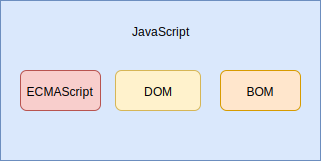

# 01-JavaScript 简介

## 一 JavaScript 概述

### 1.1 JavaScript 的历史

JavaScript 诞生于 1995 年，由网景公司的 Brendan Eich 在十天内开发完成，诞生之初用于代替 Perl 语言来处理一些输入验证。

虽然该语言名字中带有 Java，但是其与另一个流行语言 Java 并没有多大关系，JavaScript 原名为 LiveScript，为了迎合 Java 的热潮而改名。

由于浏览器的兴起，JavaScript 成为了 Web 前端领域不可替代的核心语言，没有之一！然而浏览器厂商众多，不同浏览器之间始终存在规范差异，如早期微软 IE 的 JScript 等。为了应对该问题，推出了 ECAMS-262，也即 ECMAScript，这是欧洲计算机制造商协会制定的该脚本语言的语法规范，也被采纳入了 ISO 规范中。此后，各浏览器厂商都要以此标准在自家浏览器中实现 JavaScript。

如果不涉及浏览器的话， ECMA-262 仅仅描述了这门语言的如下部分：

- 语法
- 类型
- 语句
- 关键字
- 保留字
- 操作符
- 全局对象

ECMAScript 现在的流行版本是：ES5、ES6，其主要版本有：

- ECMAScript3：1999 年标准规范，火狐的 js1.5 和 1.8 都是基于 3 规范
- ECMAScript4：为了适应互联网发展出来的激进版本，由于存在大量分歧，该版本被放弃！
- ECMAScript5：2009 年发布，包含了 ES4 中的一些常见功能，其本质是 ES3.1，是当前的主流版本
- ECMAScript6：诞生于 2015 年，也称为 ES2015，是 js 划时代意义的版本。添加了开发大型项目所需要的功能，JS 终于不再是一门`玩具语言`。
- ES2016：诞生于 2016 年，即 ES7，后续版本均以年为名称，如 ES2017、ES2018。ES2016 最出色的地方是引入了`async await`异步解决方案。

### 1.2 JavaScript 的 API 组成

ECMAScript 是 JavaScript 的语法核心，但是仅仅有语法，没有一些具体的 API 帮助，JS 也只是一个玩具。在浏览器环境中，浏览器为 JavaScript 提供了两大对象 DOM、BOM，让 JavaScript 能够游刃有余的操作浏览器相关特性。

如图所示：



所以 JavaScript 包含三个方面：

- ECMAScript：JavaScript 语法标准，如：类型、关键字、基本对象等，有 ES5、ES6(即 ES2015)、ES7(即 ES2016)，后续皆以年代为规范的名称
- DOM：`Document Object Model`，JavaScript 操作网页元素的 API
- BOM：`Browser Object Model`，JavaScript 操作浏览器部分功能的 API

> API：Application Programming Interface，即应用程序编程接口，是包装好后提供给开发人员使用的工具

### 1.3 JavaScript 的引擎

JavaScript 是一种解释性编程语言，依赖于解释引擎，常见的引擎有：

- v8 引擎：js 最著名的引擎，以高性能著称，被应用于 Chrome 浏览器与 Node.js
- SpiderMonkey：火狐浏览器中的 js 引擎

编程语言有解释型和编译型两种：

> 解释型：源代码无需经过编译，一行一行地直接解析执行，比如 javascript、python
> 编译型：源码先编译为可执行文件，再运行该可执行文件，比如 C、C++
> 贴士：这里只是初步的总结，编译型也并不是说不能按照解释的方式执行：C 语言的解释型引擎：cling

在语言引擎基础上，第三方会为编程语言开发一些独立的库，对编程语言进行功能上的包装，这些最终包装出来的编程环境，我们称之为运行时！常见的 JavaScript 运行时有：

| 运行时名称     | 内置 JS 引擎        | 内置排版引擎     | 内置 API              |
| -------------- | ------------------- | ---------------- | --------------------- |
| Chrome 浏览器  | V8                  | Webkit->Blink    | DOM、BOM 等 HTML API  |
| FireFox 浏览器 | Monkey 系列         | Gecko            | DOM、BOM 等 HTML API  |
| IE 浏览器      | Jscript->Chakra(9+) | Trident          | DOM、BOM 等 HTML API  |
| Safari 浏览器  | Nitro               | Webkit           | DOM、BOM 等 HTML API  |
| Edg 浏览器     | Chakra              | EdgeHTML->Webkit | DOM、BOM 等 HTML API  |
| Node.js        | V8                  | 无               | 网络、文件等 系统 API |

## 二 Hello World

### 2.1 程序说明

`Hello World`程序是 1974 年`Brian Kernighan`撰写的`《Programming in C: A Tutorial》`中首次面向大众介绍 C 语言时使用的最简单程序示例，后来该习惯相继被大量编程语言书籍沿用。

本笔记中的 JavaScript 代码大多都依赖于 Chrome 运行时，故而我们需要使用 Chrome 浏览器来运行 HTML。

### 2.2 Hello World 代码

新建 helloworld.html 文件，代码如下：

```html
<!DOCTYPE html>
<html lang="en">
  <head>
    <meta charset="UTF-8" />
    <title>Title</title>
  </head>
  <body>
    <script>
      // 这里开始书写 js 代码
      console.log('Hello World!')
    </script>
  </body>
</html>
```

用浏览器打开该网页，按 F12 打开控制台，控制台将会输出：`Hello World!`。

## 三 JavaScript 的基本书写规范

### 3.1 大小写

JavaScript 语言区分大小写！

### 3.2 注释

js 中的注释：

```js
//  单行注释

/*
 *   多行注释
 *   多行注释
 *   多行注释
 */
```

贴士：多行注释中每行开头都有一个星号是推荐的写法，每行开头的星号是可以省略的，但是不推荐！

### 3.3 分号

js 语句末尾的分号可以写也可以不写，不写的时候要保证每行代码都具备完整的语义！

**笔者推荐：书写代码时，尽量保证每行代码都有自己的独立意义，不能在一行代码中添加多个功能！**
