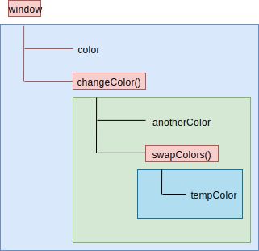

# 08.1-作用域-作用域链

## 一 理解作用域

### 1.1 执行上下文

每个 JS 代码文件在运行时，都有其上下文（Context），并通过一个 **变量对象**（variable object）来表示该上下文。我们常用的变量、函数都位于其上下文中。上下文决定了其内部的变量、函数的生命周期，即上下文会在其所有代码都执行完毕后会被销毁。

上下文有：：

- 全局上下文：浏览器中即 window 对象，Node 中为 Global 对象。通过 var、function 声明后会成为 window 的属性、方法。let/const 的顶级声明并不位于全局上下文中，但是其在作用域链的解析效果上是一样的。
- 函数上下文：每个函数内部拥有自己独立的上下文。代码运行到函数时，函数的上下文被推到一个上下文执行栈中，函数执行完毕后，上下文栈会弹出该函数上下文，将控制权返还给之前的执行上下文。
- eval 上下文：暂不讨论。

### 1.2 作用域

变量在上下文内的可活动的边界区域也可以称呼为作用域（Scope）。

根据变量的作用域，可以将变量分类：

- 全局变量：在哪里都可访问到，如进入脚本后立即定义的变量、没有用 let 定义的变量
- 局部变量：函数内部的变量，只有函数内部可以访问到。

以下示例中的局部变量在函数外部被访问时报错：

```js
function test() {
  var msg = 'hi' // 局部变量
}
test()
console.log(msg) // 报错
```

### 1.3 块级作用域与词法作用域

编程语言中，常见作用域有两种：

- 块级作用域：代码块级别的作用域，用大括号包裹的一段代码。简单来说：代码块之外是无法访问到其代码块内部数据的。
- 词法作用域：在代码写好的那一刻，变量的作用域已经确定。

ES6 之前，JavaScript 没有块级作用域，只支持词法作用域，示例：

```js
var num = 10
function show() {
  console.log(num)
  if (true) {
    var num = 11
  }
}

show() // undefined
```

在词法作用域中，执行函数，直接进入函数内部查找变量，找不到，去全局查找，示例中：`show()` 内找到了变量 num，提升时值为 undefined。

### 1.4 JS 的块级作用域支持

没有块级作用域，会引发很多问题，如 1.3 中的示例由于代码被提升覆盖打印了 undefined，以及下面的示例：

```js
// 本该在 for 结束后销毁的 i 未被销毁
for (var i = 0; i < 7; i++) {}
console.log(i)
```

JS 在 ES6 支持了块级作用域（使用 let、const）：

```js
let num = 10
function show() {
  console.log(num)
  if (true) {
    let num = 11
  }
}

show() // 打印 10
```

for 循环中使用 let：

```js
for (let i = 0; i < 7; i++) {}
console.log(i) // 报错
```

### 1.5 作用域链

上下文的代码执行时，会创建上下文变量对象的**作用域链**（scope chain）。作用域链决定了各级上下文中的代码在访问变量、函数时的顺序。

当前正在执行的上下文变量对象始终位于作用域链的最前端！代码的执行依赖于标识符的解析，从最前端开始，沿着作用域链开始逐级往后，直到找到标识符，如果未找到标识符，则报错！

上下文之间的连接是线性的、有序的。每个上下文都可以到上一级上下文中去搜索变量和函数，但任何上下文都不能到下一级上下文中去搜索。

示例：

```js
var color = 'blue'

function changeColor() {
  var anotherColor = 'red'

  function swapColors() {
    // 这里可以访问 color、anotherColor、tempColor
    var tempColor = anotherColor
    anotherColor = color
    color = tempColor
  }

  // 这里可以访问 color、anotherColor
  swapColors()
}

// 这里只能访问 color
changeColor()
```

如图所示：



注意：由于词法作用域的限制，this 在作用域中并不一定是开发者想要的：

```js
var obj = {
  name: 'test',
  showThis: function () {
    console.log('this1=', this) // 这里是 obj
    function bar() {
      console.log('this2=', this) // 这里是 window
    }
    bar()
  },
}
obj.showThis()
```

使用小技巧解决：

```js
var obj = {
  name: 'test',
  showThis: function () {
    console.log('this1=', this) // 这里是 obj
    var that = this
    function bar() {
      console.log('this2=', that) // 这里是 obj
    }
    bar()
  },
}
obj.showThis()
```

ES6 可以使用箭头函数来改变这个问题：

```js
let obj = {
  name: 'test',
  showThis: function () {
    console.log('this1=', this) // 这里是 obj
    let bar = () => {
      console.log('this2=', this) // 这里是 obj
    }
    bar()
  },
}
obj.showThis()
```

### 1.6 作用域链增强

除了上述叙述的全局上下文、函数上下文等，作用域链可以通过在其前端临时添加一个上下文来增强作用域链，这个新增的上下文会在代码执行后删除。这种情况位于：catch 语句、with 语句。

这两种情况下，都会在作用域链前端添加一个变量对象。对 with 语句来说，会向作用域链前端添加指定的对象；对 catch 语句而言，则会创建一个新的变量对象，这个变量对象会包含要抛出的错误对象的声明。

```js
function buildUrl() {
  let qs = '?debug=true'
  with (location) {
    let url = href + qs
  }
  return url
}
```

这里， with 语句将 location 对象作为上下文，因此 location 会被添加到作用域链前端。buildUrl()函数中定义了一个变量 qs。当 with 语句中的代码引用变量 href 时，实际上引用的是 location.href，也就是自己变量对象的属性。在引用 qs 时，引用的则是定义在 buildUrl()中的那个变量，它定义在函数上下文的变量对象上。而在 with 语句中使用 var 声明的变量 url 会成为函数上下文的一部分，可以作为函数的值被返回；但像这里使用 let 声明的变量 url，因为被限制在块级作用域（稍后介绍），所以在 with 块之外没有定义。
