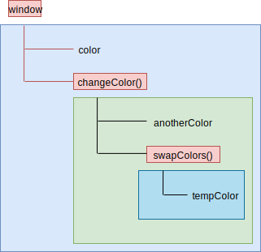

# 09-函数-3-作用域

## 一 理解作用域

### 1.1 执行上下文

每个 JS 代码文件在运行时，都有其上下文（Context），并且可以使用一个与之关联的 **变量对象**（variable object）来表示该上下文。文件中的变量、函数都位于该上下文中。

上下文在其所有代码都执行完毕后会被销毁，包括：变量、函数。即上下文决定了变量、函数的生命周期。

上下文有：：

- 全局上下文：浏览器中即 window 对象，Node 中为 Global 对象。通过 var、function 声明后会成为 window 的属性、方法。
- 函数上下文：每个函数内部拥有自己独立的上下文。代码运行到函数时，函数的上下文被推到一个上下文执行栈中，函数执行完毕后，上下文栈会弹出该函数上下文，将控制权返还给之前的执行上下文。
- eval 上下文：暂不讨论。

### 1.2 作用域

变量在上下文内的可活动的边界区域也可以称呼为作用域（Scope）。由于存在不同的上下文，那么能够访问到的数据也就不同，即产生了不同的作用域。

编程语言中，常见作用域有两种：

- 块级作用域：代码块级别的作用域，用大括号包裹的一段代码。简单来说：代码块之外是无法访问到其代码块内部数据的。
- 词法作用域：在代码写好的那一刻，变量的作用域已经确定。

### 1.3 块级作用域

C 语言支持块级作用域，示例：

```c++
#include <stdio.h>

int num = 10;
void show(){
    printf("%d\n", num);
    if(1){
        int num = 11;
    }
}

int main(){
    show();     // 打印10
    return 0;
}
```

### 1.4 词法作用域

ES6 之前，JavaScript 没有块级作用域，只支持词法作用域，示例：

```js
var num = 10
function show() {
  console.log(num)
  if (true) {
    var num = 11
  }
}

// 词法作用域：执行函数，直接进入函数内部查找变量，找不到，去全局查找
// 示例中：show()内找到了变量 num，提升时值为 undefined
show() // 打印 undefined
```

JavaScript 的源代码在运行的时候，会经过两个阶段：编译和执行。编译流程如下所示：

- 词法解析：先把字符组成的字符串解析成一个个有意义的代码块，这些代码块也被称为词法单元。如 var a = 1; 会被解析成： var 、a、=、1、; ，空格是否会被解析成词法单元，就要看空格在这个语言中有意义。
- 语法解析：把词法解析生成的词法单元流解析成有元素逐级嵌套所组成的程序语法树，AST
- 代码生成：将语法解析阶段生成的 AST 转译成可执行的代码

### 1.7 JS 的块级作用域支持

没有块级作用域，会引发很多问题，如：

```js
// 代码被提升覆盖
var num = 10
function show() {
  console.log(num)
  if (true) {
    var num = 11
  }
}
show()

// 本该在for结束后销毁的 i 未被销毁
for (var i = 0; i < 7; i++) {}
console.log(i)
```

JS 在 ES6 支持了块级作用域（使用 let、const）：

```js
let num = 10
function show() {
  console.log(num)
  if (true) {
    let num = 11
  }
}

show() // 打印10
```

### 1.8 全局变量与局部变量

根据变量的作用域，可以将变量分类：

- 全局变量：在哪里都可访问到，如进入脚本后立即定义的变量、没有用 let 定义的变量
- 局部变量：函数内部的变量，只有函数内部可以访问到。

### 1.9 作用域链

上下文的代码执行时，会创建上下文变量对象的**作用域链**（scope chain）。作用域链决定了各级上下文中的代码在访问变量、函数时的顺序。

当前正在执行的上下文变量对象始终位于作用域链的最前端！代码的执行依赖于标识符的解析，从最前端开始，沿着作用域链开始逐级往后，直到找到标识符，如果未找到标识符，则报错！

上下文之间的连接是线性的、有序的。每个上下文都可以到上一级上下文中去搜索变量和函数，但任何上下文都不能到下一级上下文中去搜索。

示例：

```js
var color = 'blue'

function changeColor() {
  var anotherColor = 'red'

  function swapColors() {
    // 这里可以访问 color、 anotherColor、tempColor
    var tempColor = anotherColor
    anotherColor = color
    color = tempColor
  }

  // 这里可以访问 color、anotherColor
  swapColors()
}

// 这里只能访问 color
changeColor()
```

如图所示：



注意：由于词法作用域的限制，this 在作用域中并不一定是开发者想要的：

```js
var obj = {
  name: 'test',
  showThis: function () {
    console.log('this1=', this) // 这里是 obj
    function bar() {
      console.log('this2=', this) // 这里是window
    }
    bar()
  },
}
obj.showThis()
```

使用小技巧解决：

```js
var obj = {
  name: 'test',
  showThis: function () {
    console.log('this1=', this) // 这里是 obj
    var that = this
    function bar() {
      console.log('this2=', that) // 这里是 obj
    }
    bar()
  },
}
obj.showThis()
```

ES6 可以使用箭头函数来改变这个问题：

```js
let obj = {
  name: 'test',
  showThis: function () {
    console.log('this1=', this) // 这里是 obj
    let bar = () => {
      console.log('this2=', this) // 这里是 obj
    }
    bar()
  },
}
obj.showThis()
```

## 二 变量提升机制

### 2.1 变量提升概念

var、function 声明的变量会被拿到当前最近作用域的顶部，这个现象叫做**提升**（hoisting）：

```js
console.log(name) // 能够输出空字符串，并不会报错，表明其已经声明了
var name = 'Jake'
console.log(name) // 能够输出 Jake
```

上述代码其实等价于：

```js
var name // 声明
console.log('name=', name)
name = 'Jake' // 赋值
console.log('name=', name)
```

同理函数的提升如下所示，函数 sayHi 被提升了，所以即使提前有一个函数 `sayHi()` 在执行，也不会因为未定义而报错：

```js
console.log(sayHi) // 输出该函数：会将声明、定义一起提升
sayHi()
function sayHi() {
  console.log('Hi!')
}
```

### 2.2 变量提升机制 LHS、RHS

LHS 查询（赋值操作的左端）：

```txt
在编译的过程中，先将标识符和函数声明给提升到其对应的作用域的顶端。
标识符解析的时候，会进行 LHS 查询：
如果标识符一直找不到声明的位置，那么最终就会在全局环境生成一个全局变量。
```

示例：

```js
console.log(a) // undefined
var a = 3
```

RHS 查询（赋值操作的源头）：

```txt
RHS 查询的时候，如果找不到对应的标识符，就会抛出一个异常：ReferenceError。
```

示例：

```js
console.log(fn) // ReferenceError
```

## 三 变量提升细节

### 3.1 函数表达式与变量提升

如果使用函数表达式声明函数，那么就需要与其他表达式一样必须先赋值，以下示例代码就会出现错误：

```js
console.log(sayHi) // undefined
sayHi() // 报错，函数不存在
var sayHi = function () {
  console.log('Hi!')
}
```

在实际开发中，更推荐使用函数表达式：

```js
// 正确代码示例
var sayHi
if (condition) {
  sayHi = function () {
    console.log('Hi')
  }
} else {
  sayHi = function () {
    console.log('Yo')
  }
}

// 错误代码示例：下列代码在JS中无效，因为两次声明都被提升，由于重名，第二个函数的函数体代码覆盖了上面的
// 大多浏览器会直接返回第二个函数声明，但是有些浏览器会尝试修复错误，所以仍然推荐使用表达式
if (condition) {
  function sayHi() {
    console.log('Hi')
  }
} else {
  function sayHi() {
    console.log('Yo')
  }
}
```

从上面的错误示例也能看出，在预解析时，如果出现同名，会进行替换，如下所示：

```js
// 原始代码，期望 func1在执行2次时，分别输出不同的值
func1()
function func1() {
  console.log('第一个func1被执行了')
}
func1()
function func1() {
  console.log('第二个func1被执行了')
}

// 但是经过预解析后，实际演变为了下列的代码：第一个func1被顶替了，输出的结果全部是：第二个func1被执行了
function func1() {
  console.log('第一个func1被执行了')
}
function func1() {
  console.log('第二个func1被执行了')
}
func1()
func1()
```

### 3.2 同名变量提升

如果变量名重复，不会重新声明，但是会按照顺序重新定义：

```js
console.log(a) // 输出函数，因为函数被提升了
var a = 3 // 相当于给已经提升的函数 a 重新赋值了 3
console.log(a) // 输出 3
function a() {
  console.log('fn')
}

console.log(a) // 3
```

### 3.3 类的提升

类的提升：

```js
// 直接定义
console.log(ClassDeclaration) // ReferenceError: ClassDeclaration is not defined
class ClassDeclaration {}
console.log(ClassDeclaration) // class ClassDeclaration {}

// 表达式方式
console.log(ClassExpression) // undefined
var ClassExpression = class {}
console.log(ClassExpression) // class {}
```

### 3.4 没有 var 的声明

如果变量未经声明就被初始化，则其会被添加到全局上下文，很容易引起一些很难发现的 Bug，在开发中是需要严禁这样做：

```js
function(){
  num = 13
}

// 本该存在于函数内部的变量，由于未使用 var 声明，进入了全局上下文
console.log(num)  // 13
```

容易产生 BUG 是因为没有被声明标识修饰（function、var、let、class 等）的标识符实质挂载了当前上下文上：

```js
a = 10 // 其本质是写了：window.a = 10，是没有变量提升的
```

bug 示例：

```js
console.log(a, b) // undefined undefined

var a = 12
var b = 12

function fn() {
  // 此时 a b 在内部提升，但是 b 没有var 提升到上一级作用域
  console.log(a, b) // undefined 12
  var a = (b = 13)
  console.log(a, b) // 13 13
}

fn()
// 外部数据被影响了
console.log(a, b) // 12 13
```

### 3.5 大括号中声明的提升

ES6 环境中（高版 Chrome 中），大括号可以被视为块级作用域，那么他内部声明的数据与变量提升类似：

```js
console.log(fn1) // 输出函数体
function fn1() {
  console.log('fn1')
}

console.log(fn2) // undefined
if (true) {
  function fn2() {
    console.log('fn2')
  }
}

console.log(fn3) // undefined
for (let i = 0; i < 0; i++) {
  function fn3() {
    console.log('fn3')
  }
}
```

## 四 ES6 中作用域

### 4.1 块级作用域

var 的声明是函数作用域，而 let、const 最大的作用是带来了**块级作用域**，即 let、const 的作用域仅限于其声明区域。而且 let/const 切断了全局变量与 window 属性的绑定映射机制！！

块级作用域示例：let 声明的变量仅仅限于 大括号内，大括号即代码块！

```js
for (var i = 0; i < 1; i++) {}
console.log(i) //打印1

for (let j = 0; j < 1; j++) {}
console.log(j) //报错：j is not defined
```

### 4.2 顶级对象绑定

在浏览器环境中。var 声明的变量会被绑定在 window 顶级对象中，如果定义的变量是一些 dom 中的常用名，则会引起错误：

```js
var screenLeft = 100
console.log(window.screenLeft) // 100

let num = 10
console.log(window.num) // undefined
```

### 4.3 重复声明

同一个作用域内不能重复声明：

```js
var num = 10
var num = 100 // 不会报错，而let/const这里报错
```

### 4.4 变量提升与暂时性死区

let、const 没有变量提升现象，如下所示：

```js
console.log(age) //报错
let age = 6
```

这是因为在解析代码时，let 声明之前的执行区域是`暂时性死区(temporal dead zone)`，死区内引用死区后声明的变量都会抛出 ReferenceError。

let 和 const 之所以具备块级作用域，是因为其代码在运行时被重新编译，如下所示原版代码：

```js
// 书写的JS代码
{
  let a = 20
}
console.log(a) // 由于块级作用域的限制，这里会报错
```

编译后的代码：

```js
{
  var _a = 20
}
console.log(a) // 没有a这个变量，自然就是 未定义
```
