# 09.4-面向对象-原型与原型链

## 一 理解原型

### 1.1 原型对象

创建的函数都会拥有一个 prototype 属性，该属性即是原型对象的引用，这样做可以让多个实例间通用方法使用同一个引用，减少空间占用！

而原型对象默认会获得两个属性：

- `constructor`：指向与原型对象关联的构造函数
- `__proto__`：指向其构造函数的原型，默认是 Object。该属性不是标准属性，但是已经被各大浏览器接受并实现。

其对应关系如图：



```js
function Person() {}
console.log(Person.prototype) // { constructor: f Person(), __proto__: Object}
console.log(Person.prototype.constructor === Person) // true

console.log(Person.prototype.__proto__.constructor === Object) // true

// 正常的原型链都会终止于 Object 的原型对象
console.log(Person.prototype.__proto__ === Object.prototype) // true
console.log(Person.prototype.__proto__.__proto__ === null) // true

// 实例与构造函数没有直接联系，与原型对象有直接联系
let p = new Person()
console.log(p.prototype) // undefined，因为是手动 new 出来的实例，我们没有添加该属性
console.log(p.__proto__ == Person.prototype) // true
conosle.log(p.__proto__.constructor === Person) // true
```

### 1.2 原型的动态性

由于从原型上搜索值的过程是动态的，即使实例在修改原型之前已经存在，任何时候对原型对象所做的修改也会在实例上反映出来。

```js
function Person() {}

// 先创建实例
let friend = new Person()

// 后修改原型
Person.prototype.sayHi = function () {
  console.log('hi')
}

// 后添加的方法能够被调用
friend.sayHi() // "hi"，没问题！
```

注意：如果是对原型的重写，则不会出现上述现象，如下所示：

```js
function Person() {}

// 先创建对象
let friend = new Person()

// 后重写原型
Person.prototype = {
  constructor: Person,
  name: 'Nicholas',
  age: 29,
  job: 'Software Engineer',
  sayName() {
    console.log(this.name)
  },
}

// 调用错误：friend.sayName is not a function
friend.sayName()
```

这是因为实例的 [[Prototype]] 指针是在调用构造函数时自动赋值的，这个指针即使把原型修改为不同的对象也不会变。重写整个原型会切断最初原型与构造函数的联系，但实例引用的仍然是最初的原型。记住，实例只有指向原型的指针，没有指向构造函数的指针。

## 二 原型链

### 2.1 原型链介绍

在 JS 中，几乎所有对象都可以是原型对象，也可以是实例对象，还可以是构造函数。当一个对象身兼多职时，就可以看做一个节点。每个节点都可以通过一些属性来访问到另外一个节点，多个节点会形成一个链式结构，在这个链式结构上，原型对象是每个节点之间进行关联的核心，这个链式结构可以看做原型链。

如图所示：



比如一个 Person 构造函数，一个实例对象 p：

```js
Person.prototype.constructor = Person
p.constructor = Person
p._proto_ = Person.prototype
p._proto_.constructor = Person
p._proto_.constructor = Person.prototype.constructor
```

### 2.2 属性搜索原则

与普通构造函数一样， 类可以使用 instanceof 操作符检查构造函数原型是否存在于实例的原型链中：

```js
class Person {}
let p = new Person()
console.log(p instanceof Person) // true
```

在通过对象访问属性时，会按照这个属性的名称开始搜索，属性的搜索过程：

```txt
1、先在自身实例查找
2、再去当前对象的原型中查找
3、再找原型的原型对象...依次向上查找
4、最后查找 Objct.prototype
5、找不到报错
```

使用 delete 操作符可以完全删除实例上的这个属性，从而让标识符解析过程能够继续搜索原型对象：

```js
function Person() {}
Person.prototype.name = 'Nicholas'
Person.prototype.age = 29
Person.prototype.job = 'Software Engineer'
Person.prototype.sayName = function () {
  console.log(this.name)
}

let person1 = new Person()
let person2 = new Person()
person1.name = 'Greg'
console.log(person1.name) // "Greg"，来自实例
console.log(person2.name) // "Nicholas"，来自原型
delete person1.name
console.log(person1.name) // "Nicholas"，来自原型
```

### 2.3 Object 的原型

首先看构造函数：

```js
let obj = new Object()
let obj1 = {}

console.log(obj.constructor === obj1.constructor) // true
console.log(obj.constructor === Object) // true
```

现在看 Object 的原型：

```js
console.log(Object.prototype) // 一系列 Object 上的函数
console.log(Object.prototype.prototype) // undefined
```

### 2.4 没有原型的对象

没有原型的对象是存在的：

```js
// 此时 obj 没有父亲！
let obj = Object.create(null, {})
```
