# 09.4-面向对象-原型与原型链

## 一 理解原型

### 1.1 构造函数的原型对象

一个对象往往包含下列 2 个属性：

- `prototype`：函数原型对象，也称之为 **显式原型对象**。
- `__proto__`：向上指向生成该函数的构造函数，为了区分，也称之为 **隐式原型对象**。该属性不是标准属性，但是已经被各大浏览器接受并实现。

所有的函数（`当然也含构造函数`）都拥有自己的原型对象，即 `prototype` 属性：

```js
class Person {
  constructor(name, age) {
    this.name = name
    this.age = age
  }
  run() {
    console.log(this.name, ' is running!')
  }
}

// 包含 constructor、run 方法
console.log('Person.prototype = ', Person.prototype) //  {constructor、run }
// __proto__ 指向 Person 对象这个函数作为实例时，new出他的构造方法
console.log('Person.__proto__ = ', Person.__proto__) //  ƒ () { [native code] }

console.log(Person.prototype.constructor === Person) // true
```

从该函数往子级看：当构造函数 Person 执行 `new` 操作生成实例 p 时，除了会手动创建类似 `this.age = 18` 的 age 属性外，默认还会创建`__proto__`属性 指向这个构造函数的**显式原型对象**：

```js
let p = new Person('张三', 30)

// 实例上没有prototype属性，而是 __proto__
console.log('p.prototype = ', p.prototype) // undefined，new 出来的没有添加该属性
// __proto__ 指向 Person 对象这个函数作为实例时的构造方法
console.log('p.__proto__ = ', p.__proto__) // {contructor, run}

console.log(p.__proto__ === Person.prototype) // true
console.log(p.constructor === Person) // true
```

其关系如图：


贴士：将实例的方法存储在 `__proto__` 中可以让多个**实例对象**间的通用方法来自同一个`__proto__`，减少空间占用，如下所示：

```js
let p1 = new Person('张三', 30)
let p2 = new Person('李四', 20)
console.log(p1.__proto__ === p2.__proto__) // true
```

### 1.2 原型对象的产生

从构造函数往其父级看：`Person.property` 对象的 `__proto__` 属性默认指向一个 Object 构造函数的实例对象，这个对象内部有两个 2 默认携带的属性（方法）：`__proto__`、`constructor`。

```js
// 正常的原型链都会终止于 Object 的原型对象
console.log(Person.prototype.__proto__)
console.log(Person.prototype.__proto__ === Object.prototype) // true
console.log(Person.prototype.__proto__.__proto__ === null) // true

console.log(Person.prototype.__proto__.constructor === Object) // true
```

其对应关系如图：



### 1.3 原型的动态性

由于从原型上搜索值的过程是动态的，即使实例在修改原型之前已经存在，任何时候对原型对象所做的修改也会在实例上反映出来。

```js
class Person {}

// 先创建实例
let friend = new Person()

// 后修改原型
Person.prototype.sayHi = function () {
  console.log('hi')
}

// 后添加的方法能够被调用
friend.sayHi() // "hi"，没问题！
```

注意：如果是对原型的重写，则不会出现上述现象，如下所示：

```js
class Person {}

// 先创建对象
let friend = new Person()

// 后重写原型
Person.prototype = {
  constructor: Person,
  name: 'Nicholas',
  age: 29,
  job: 'Software Engineer',
  sayName() {
    console.log(this.name)
  },
}

// 调用错误：friend.sayName is not a function
friend.sayName()
```

这是因为实例的 `[[Prototype]]` 指针是在调用构造函数时自动赋值的，这个指针即使把原型修改为不同的对象也不会变。重写整个原型会切断最初原型与构造函数的联系，但实例引用的仍然是最初的原型。记住，实例只有指向原型的指针，没有指向构造函数的指针。

## 二 原型链

### 2.1 原型链介绍

在 JS 中，几乎所有对象都可以是原型对象，也可以是实例对象，还可以是构造函数。当一个对象身兼多职时，就可以看做一个节点。每个节点都可以通过一些属性来访问到另外一个节点，多个节点会形成一个链式结构，在这个链式结构上，原型对象是每个节点之间进行关联的核心，这个链式结构可以看做原型链。

如图所示：



原型链的本质：**原型链的实现依赖于实例指向原型的指针 `[[Prototype]]`**，图中紫色部分都可以通过 `__proto__` 属性进行链接，加粗部分原型链即为实例指向原型的指针！**正是因为该指针的存在，才能进行成员的向上搜索！**。

比如一个 Person 构造函数，一个实例对象 p：

```js
Person.prototype.constructor = Person
p.constructor = Person
p._proto_ = Person.prototype
p._proto_.constructor = Person
p._proto_.constructor = Person.prototype.constructor
```

### 2.2 Function

当然构造函数本身其实也是一个对象的实例，即 Function 对象，那么他们的关系如下所示：


### 2.3 属性搜索原则

与普通构造函数一样， 类可以使用 instanceof 操作符检查构造函数原型是否存在于实例的原型链中：

```js
class Person {}
let p = new Person()
console.log(p instanceof Person) // true
```

在通过对象访问属性时，会按照这个属性的名称开始搜索，属性的搜索过程：

```txt
1、先在自身实例查找
2、再去当前对象的原型中查找
3、再找原型的原型对象...依次向上查找
4、最后查找 Objct.prototype
5、找不到报错
```

使用 delete 操作符可以完全删除实例上的这个属性，从而让标识符解析过程能够继续搜索原型对象：

```js
class Person {}
Person.prototype.name = 'Nicholas'
Person.prototype.age = 29
Person.prototype.job = 'Software Engineer'
Person.prototype.sayName = function () {
  console.log(this.name)
}

let person1 = new Person()
let person2 = new Person()
person1.name = 'Greg'
console.log(person1.name) // "Greg"，来自实例
console.log(person2.name) // "Nicholas"，来自原型
delete person1.name
console.log(person1.name) // "Nicholas"，来自原型
```

### 2.4 Object 的原型

首先看构造函数：

```js
let obj = new Object()
let obj1 = {}

console.log(obj.constructor === obj1.constructor) // true
console.log(obj.constructor === Object) // true
```

现在看 Object 的原型：

```js
console.log(Object.prototype) // 一系列 Object 上的函数
console.log(Object.prototype.prototype) // undefined
```

### 2.5 没有原型的对象

没有原型的对象是存在的：

```js
// 此时 obj 没有父亲！
let obj = Object.create(null, {})
```
