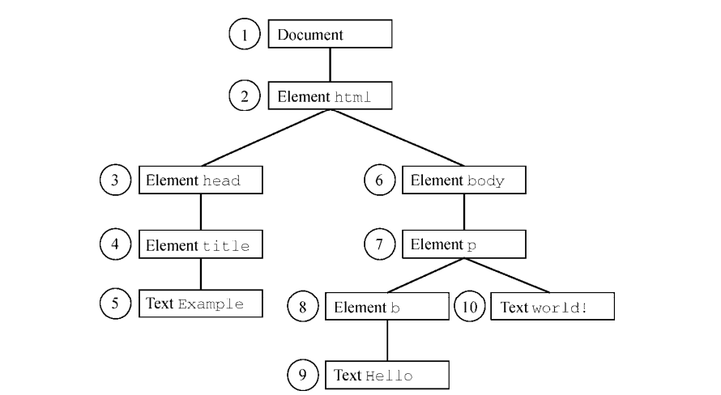

# 05-DOM-1-DOM 节点

## 一 节点概念

### 1.1 节点类型

在 HTML 当中一切都是节点，整个文档是一个`文档节点`，每一个 HMTL 标签都是一个`元素节点`，标签中的文字则是`文字节点`，标签的属性是`属性节点`。

一般节点至少拥有三个基本属性：

- nodeType：节点类型，是个整数值，为 1 是元素节点，为 2 是属性节点，为 3 是文本节点（文字、空格、换行等）
- nodeName：节点名称
- nodeValue：节点值

```html
<div id="div">111</div>
<script>
  let div = document.getElementById('div')
  console.log(div.nodeType) // 1
  console.log(div.nodeName) // DIV，元素标签名
  console.log(div.nodeValue) // null，始终为 null
</script>
```

Node 类型是 DOM 中所有节点的父接口，所有节点均继承自 Node 类型，所以所有节点也都拥有 Node 中的基本属性、方法。每个节点都有一个 nodeType 属性，用于表明节点的类型，通常有 12 个节点类型，由 1-12 整数表示：

```js
Node.ELEMENT_NODE(1)；                      // 元素节点
Node.ATTRIBUTE_NODE(2)；                    // 属性节点
Node.TEXT_NODE(3)；                         // 文本节点
Node.CDATA_SECTION_NODE(4)；
Node.ENTITY_REFERENCE_NODE(5)；
Node.ENTITY_NODE(6)；
Node.PROCESSING_INSTRUCTION_NODE(7)；
Node.COMMENT_NODE(8)；
Node.DOCUMENT_NODE(9)；
Node.DOCUMENT_TYPE_NODE(10)；
Node.DOCUMENT_FRAGMENT_NODE(11)；
Node.NOTATION_NODE(12)
```

开发中推荐使用数字，因为名称在 IE 中往往不兼容：

```js
if (someNode.nodeType == Node.ELEMENT_NODE) {
  //在 IE 中无效
  alert('Node is an element.')
}

// 推荐写法
if (someNode.nodeType == 1) {
  //适用于所有浏览器
  alert('Node is an element.')
}
```

实际开发中，主要操作的节点类型是：元素节点！

### 1.2 节点关系

文档中的所有节点都与其他节点有关系，整个 HTML 文档形成了类似树一样的关系结构。这些节点列表使用一个名为 NodeList 的类数组对象表示。

每个节点都有一个 **childNodes** 的属性，其中包含一个 NodeList 的实例：

```js
// 中括号或使用 item() 方法可以访问 NodeList 中的元素：
let firstChild = someNode.childNodes[0]
let secondChild = someNode.childNodes.item(1)
let count = someNode.childNodes.length
```

可以把 NodeList 整个类数组对象转换为数组之后使用

```js
let arrayOfNodes = Array.prototype.slice.call(someNode.childNodes, 0)
// 推荐使用 ES6 方式
let arrayOfNodes = Array.from(someNode.childNodes)
```

每个节点都有一个 parentNode 属性，指向其 DOM 树中的父元素。childNodes 中的所有节点都有同一个父元素，因此它们的 parentNode 属性都指向同一个节点。childNodes 列表中的每个节点都是同一列表中其他节点的同胞节点。而 previousSibling 和 nextSibling 可以在这个列表的节点间导航。这个列表中第一个节点的 previousSibling 属性是 null，最后一个节点的
nextSibling 属性也是 null，如下所示：

```js
if (someNode.nextSibling === null) {
  alert("Last node in the parent's childNodes list.")
} else if (someNode.previousSibling === null) {
  alert("First node in the parent's childNodes list.")
}
```

注意：如果 childNodes 中只有一个节点，则它的 previousSibling 和 nextSibling 属性都是 null。

父节点和它的第一个及最后一个子节点也有专门属性：firstChild 和 lastChild 分别指向 childNodes 中的第一个和最后一个子节点。

## 二 常见节点类型

### 2.1 Document 类型

Document 是 HTML 页面对象 HTMLDocument 的实例，挂载在 window 对象上，作为一个全局对象，其 nodeType 为 9，nodeName 为`"#document"`，该对象的第一个子节点便是 html 标签！

`document.doctype`可以访问`<!DOCTYPE>`标签，但是该节点在不同浏览器中表现不同：

- IE8：会将该子节点错误的解释为一个注释并把它当作 Comment 节点，document.doctype 的值始终为 null。
- IE9+/Firefox：被作为文档的第一个子节点
- Chrome/Safari：不会被作为文档的子节点

### 2.2 Element 类型

元素类型即 HTML 中的元素，在下一章介绍。

### 2.3 Text 类型

文本节点由 Text 类型表示，包含的是可以照字面解释的纯文本内容。纯文本中可以包含转义后的
HTML 字符，但不能包含 HTML 代码。

文本节点的创建：

```js
let textNode = document.createTextNode('<strong>Hello</strong> world!')
```

## 2.4 Attr 类型

Attr 节点的类型数值为 2，nodeName 为其特性名称，nodeValue 为其特性值。

注意：特性不被认为是 DOM 文档树的一部分。开发人员最常使用的是 getAttribute()、setAttribute() 和 remveAttribute() 方法，很少直接引用特性节点。

## 2.5 DocumentFragment 类型

该类型指文档片段，是一种轻量级文档，可包含和控制节点，但不会像完整的文档那样占用额外资源。

## 三 节点基础操作

### 3.1 节点选择

需要先获取节点，然后才能依据需求对网页进行操作。获取的方式有：

```js
// 通用的 元素节点选择 API
document.getElementById('demo') //通过 id 找到 HTML 元素
document.getElementsByTagName('div')[0] //通过标签名找到 HTML 元素获得的是标签伪数组
document.getElementsByClassName('a') //通过类名找到 HTML 元素，在部分 IE 中无效

// HTML5 中新增的节点选择 API
document.querySelector() // 可以传入 CSS 选择符，返回与该模式匹配的第一个元素
document.querySelectorAll() // 可以传入 CSS 选择符，返回的是一个 NodeList 的实例

// 该方法浏览器支持率较低
document.matchesSelector() // 可以传入 CSS 选择符，返回是否匹配的布尔
```

### 3.2 节点层次关系

节点由于嵌套存在的原因，存在父子关系：

```js
// 获取父节点：一个节点只有一个父节点
element.parentNode

// 获取子元素节点
// 下列 API 不支持 IE8，IE8 使用 firstChid，firstChild 在标准中获取的是第一个子节点，同理 lastChid
fatherElement.firstElementChild //获取第一个子元素节点
fatherElement.lastElementChild //获取最后一个子元素节点

// 获取前后同级元素节点
// 下列 API 不支持 IE8，IE8 使用 previousSibling，previousSibling 在标准中获取的是前一个节点，同理 nextSibling
element.previousElementSibling //获取前一个节点
element.nextElementSibling //获取下一个节点

// 获取所有子元素节点
fatherElement.children // 非标准属性，但是得到了所有支持（在 IE8 中包含注释节点）

// 获取所有子节点
fatherElement.childNodes //标准属性，用来获取所有子节点数组，包括：文本、换行
```

### 3.3 节点的增、删、改、复制

```js
// 创建节点
document.write("节点与内容");     // 会抹掉整个页面已加载的元素，基本不使用，一般使用 innerHTML() 方法，这样不会造成整个额页面的重绘
document.createElement("节点与内容");

// 插入节点
fatherElement.appendChild(新节点);         // 父节点的最后插入一个新节点
fatherElement.insertBefore(新节点,参考节点); // 在参考节点前插入

// 删除节点
fatherElement.removeChild（子节点);      // 必须指定要删除的子节点

// 修改节点内容
element.innerHTML = "HTML 内容";  // 内容修改为新的 HTML 文档
element.innerText = "文本内容";    // 内容修改为纯文本

// 复制节点
newElement=element.cloneNode(参数); //参数可选复制节点
```

### 3.4 获取、修改元素节点的属性

修改元素节点属性的示例：

```js
imgElement.src = 'images/new.jpg' // 修改图片元素的路径
inputElement.value = '123' // 修改表单数据
inputElement.disabled = true // 禁用表单可点击
```

上述示例中通过点语法即可获得元素的属性，还可以通过下列方式：

```js
element.getAttribute('id') // 获取 id 属性值
element.getAttribute('backgroundColor') // 获取背景色
```

点语法只能获得元素自身的固有属性，`getAttribute()` 还能获得自定义属性：

```html
<div index="a" id="box">111</div>
<script>
  let box = document.querySelector('#box')
  console.log(box.getAttribute('index')) // a
  box.setAttribute('index', 'b')
  console.log(box.getAttribute('index')) // b
</script>
```

但是上述写法是不规范的，在 H5 中，约定自定义属性用 data- 开头，而且可以直接通过 dataset 属性获取：

```html
<div data-index="a" id="box">111</div>
<script>
  let box = document.querySelector('#box')
  // dataset 只能获取 data- 开头的自定义属性，所以 getAttribute 的兼容性更好
  console.log(box.dataset.index) // 输出 a。也可以使用  dataset["index"]
</script>
```

### 3.5 修改元素节点的样式

```js
// 直接以行内样式方式修改：属性名一般是驼峰命名法
element.style.backgroundColor = 'red'
element.style.border = '1px solid black'

// 修改类名
element.className = '新的类名'

// 重写元素所有属性
element.style.cssText = 'width: 25px; height: 100px; background-color: green'

// 移除某个属性的样式，采用默认样式
element.style.removeProperty('border')
```

### 3.6 节点比较

isSameNode() 和 isEqualNode():

```js
let div1 = document.createElement('div')
div1.setAttribute('class', 'box')

let div2 = document.createElement('div')
div2.setAttribute('class', 'box')

console.log(div1.isSameNode(div1)) // true
console.log(div1.isSameNode(div2)) // false

console.log(div1.isEqualNode(div2)) // true
```

## 四 节点遍历

### 4.0 深度优先遍历

DOM2 Traversal and Range 模块定义了两个类型用于辅助顺序遍历 DOM 结构。这两个类型——NodeIterator 和 TreeWalker——从某个起点开始执行对 DOM 结构的深度优先遍历。

假设有以下 html 结构：

```html
<!DOCTYPE html>
<html>
  <head>
    <title>Example</title>
  </head>
  <body>
    <p>
      <b>Hello</b>
      world!
    </p>
  </body>
</html>
```

如果以 document 为根节点进行遍历：



### 4.1 NodeIterator

对下面文档中的 body 内的元素进行遍历示例：

```html
<html>
  <body>
    <div id="div">
      <p>
        <b>Hello</b>
        world!
      </p>
      <ul>
        <li>List item 1</li>
        <li>List item 2</li>
        <li>List item 3</li>
      </ul>
    </div>

    <script>
      let div = document.getElementById('div')

      let iterator = document.createNodeIterator(
        div, // 从哪个节点开始遍历
        NodeFilter.SHOW_ELEMENT, // whatToShow 参数：应该访问哪些节点
        null, // filter 参数：是否接收或跳过特定节点
        false // 是否扩展实体引用，在 HTML 中无效！
      )

      let node = iterator.nextNode()
      while (node !== null) {
        console.log(node.tagName) // 输出标签名
        node = iterator.nextNode()
      }
    </script>
  </body>
</html>
```

注意：nextNode() 和 previousNode() 方法共同维护 NodeIterator 对 DOM 结构的内部指针，因此修改 DOM 结构也会体现在遍历中。

第二个参数 whatToShow 是一个位掩码，通过应用一个或多个过滤器来指定访问哪些节点，常见定义有：

```txt
NodeFilter.SHOW_ALL，所有节点。
NodeFilter.SHOW_ELEMENT，元素节点。
NodeFilter.SHOW_ATTRIBUTE，属性节点。由于 DOM 的结构，因此实际上用不上。
NodeFilter.SHOW_TEXT，文本节点。
NodeFilter.SHOW_COMMENT，注释节点。
NodeFilter.SHOW_DOCUMENT，文档节点。
NodeFilter.SHOW_DOCUMENT_TYPE，文档类型节点。
```

whatToShow 值可以组合使用：

```js
let whatToShow = NodeFilter.SHOW_ELEMENT | NodeFilter.SHOW_TEXT
```

创建迭代器示例：

```js
// 创建过滤器方式一
let filter1 = {
  acceptNode(node) {
    return node.tagName.toLowerCase() == 'p'
      ? NodeFilter.FILTER_ACCEPT
      : NodeFilter.FILTER_SKIP
  },
}

// 创建过滤器方式二
let filter2 = function (node) {
  return node.tagName.toLowerCase() == 'p'
    ? NodeFilter.FILTER_ACCEPT
    : NodeFilter.FILTER_SKIP
}

// 创建迭代器
let iterator1 = document.createNodeIterator(
  root,
  NodeFilter.SHOW_ELEMENT,
  filter,
  false
)

// 创建一个简单的遍历所有节点的迭代器
let iterator2 = document.createNodeIterator(
  document,
  NodeFilter.SHOW_ALL,
  null,
  false
)
```

### 4.2 TreeWalker

TreeWalker 是 NodeIterator 的高级版，额外添加了遍历的方向，示例：

```js
let div = document.getElementById('div1')

let filter = function (node) {
  return node.tagName.toLowerCase() == 'li'
    ? NodeFilter.FILTER_ACCEPT
    : NodeFilter.FILTER_SKIP
}

let walker = document.createTreeWalker(
  div,
  NodeFilter.SHOW_ELEMENT,
  filter,
  false
)
let node = iterator.nextNode()
while (node !== null) {
  console.log(node.tagName) // 输出标签名
  node = iterator.nextNode()
}
```

方向示例：

```txt
parentNode()，遍历到当前节点的父节点。
firstChild()，遍历到当前节点的第一个子节点。
lastChild()，遍历到当前节点的最后一个子节点。
nextSibling()，遍历到当前节点的下一个同胞节点。
previousSibling()，遍历到当前节点的上一个同胞节点。
```

节点过滤器（filter）除了可以返回 NodeFilter.FILTER_ACCEPT 和 NodeFilter.FILTER_SKIP，还可以返回 NodeFilter.FILTER_REJECT。在使用 NodeIterator 时，NodeFilter.FILTER_SKIP 和 NodeFilter.FILTER_REJECT 是一样的。但在使用 TreeWalker 时，NodeFilter.FILTER_SKIP 表示跳过节点，访问子树中的下一个节点，而 NodeFilter.FILTER_REJECT 则表示跳过该节点以及该节点的整个子树。例如，如果把前面示例中的过滤器函数改为返回 NodeFilter.FILTER_REJECT（而不是 NodeFilter.FILTER_SKIP），则会导致遍历立即返回，不会访问任何节点。这是因为第一个返回的元素是`<div>`，其中标签名不是"li"，因此过滤函数返回 NodeFilter.FILTER_REJECT，表示要跳过整个子树。因为`<div>`本身就是遍历的根节点，所以遍历会就此结束。

### 4.3 TreeWalker 节点跳跃

TreeWalker 真正的威力是可以在 DOM 结构中四处游走。如果不使用过滤器，单纯使用 TreeWalker 的漫游能力同样可以在 DOM 树中访问`<li>`元素：

```js
let div = document.getElementById('div1')
let walker = document.createTreeWalker(
  div,
  NodeFilter.SHOW_ELEMENT,
  null,
  false
)
walker.firstChild() // 前往<p>
walker.nextSibling() // 前往<ul>
let node = walker.firstChild() // 前往第一个<li>
while (node !== null) {
  console.log(node.tagName)
  node = walker.nextSibling()
}
```

TreeWalker 类型也有一个名为 currentNode 的属性，表示遍历过程中上一次返回的节点（无论使用的是哪个遍历方法）。可以通过修改这个属性来影响接下来遍历的起点：

```js
let node = walker.nextNode()
console.log(node === walker.currentNode) // true
walker.currentNode = document.body // 修改起点
```
