# 05.3-迭代器于生成器-Generator 原理

## 一 生成器基础运行原理

如下所示一个生成器函数：

```js
function* getData() {
  yield 'zs'
  yield 'ls'
  yield 'ww'
}

for (let d of getData()) {
  console.log(d) // 依次输出 zs ls ww
}
```

生成器函数没有使用 return，但是依然得到了值，其原理是其内部被包装成了迭代器（实现了 Iterator 接口），利用 next() 的方式调用：

```js
function* getData() {
  yield 'zs'
  yield 'ls'
  yield 'ww'
}

// 调用生成器后， 就会创建一个迭代器（iterator）
const iter = getData()

// 迭代器控制生成器的执行：调用next后，生成器开始执行代码，当代码直行道yield时，生成中间结果，返回一个新对象（包装了结果和是否完成）
const res1 = iter.next()
console.log('res1 = ', res1) //  { value: 'zs', done: false }

const res2 = iter.next()
console.log('res2 = ', res2) //  { value: 'ls', done: false }

const res3 = iter.next()
console.log('res3 = ', res3) //  { value: 'ww', done: false }

const res4 = iter.next()
console.log('res4 = ', res4) //  { value: undefined, done: true }
```

每当生成一个当前值后， 生成器就会非阻塞地挂起执行， 随后耐心等待下一次值请求的到达。

yield 也能将执行权交给另外一个生成器：

```js
function* getData() {
  yield 'zs'
  yield* getData2()
  yield 'ww'
}

function* getData2() {
  yield 'zs2'
  yield 'ls2'
}

for (let d of getData()) {
  console.log(d) // zs zs2 ls2 ww
}
```

在迭代器上使用 `yield*` 操作符， 程序会跳转到另外一个生成器上执行。 本例中， 程序从 getData 跳转到一个新的 getData2 生成器上， 每次调用 getData 返回迭代器的 next 方法， 都会使执行重新寻址到了 getData2 上。 该生成器会一直持有执行权直到无工作可做。for-of 循环不会关心 getData 委托到另一个生成器上， 它只关心在 done 状态到来之前都一直调用 next 方法。

## 二 生成器内部构成

调用一个生成器不会实际执行它，而是会创建一个新的迭代器，最终通过该迭代器中拿到结果。在生成器生成（让渡）了一个值后，生成器会挂起执行并等待下一个请求的到来。 在某种方面来说， 生成器的工作更像是一个小程序， 一个在状态中运动的状态机。

- 1、挂起开始：创建生成器时的状态。创建了一个生成器，但不执行任何代码，以这种挂起状态开始。
- 2、执行：生成器中的代码执行时的状态。从第一次执行开始，或者从上次挂起的时候继续，生成器对应的迭代器调用了 next 方法，并且当前存在可执行的代码时，生成器都会转移到这个状态。
- 3、挂起让渡：暂停并等待继续执行。当生成器在执行过程中遇到了一个 yield 表达式，它会创建一个包含着返回值的新对象，随后再挂起执行。
- 4、完成：执行完毕状态。在生成器执行期间，如果代码执行到 return 语句或者全部代码执行完毕， 生成器就进入该状态。

```js
function* Demo1() {
  yield 'zs'
  yield 'ls'
}
```



## 三 生成器执行上下文与标准函数区别

生成器执行环境的上下文其实就是用于跟踪函数的执行的 JavaScript 内部机制。本质上，生成器仍然是一种函数。

```js
function* Demo2(action) {
  yield 'zs' + '-' + action
  return 'ls' + '-' + action
}

const iterDemo = Demo2('test')
const r1 = iterDemo.next()
const r2 = iterDemo.next()
```

如图显示了应用执行过程中两个位置上的执行上下文栈。第一个快照显示了应用在调用 Demo2 函数之前的应用执行状态。由于正在执行的是全局代码，故执行上下文栈仅仅包含全局执行上下文，该上下文引用了当前标识符所在的全局环境。而 Demo2 则仅仅引用了一个函数，此时其他标识符的值都是 undefined。



控制流则进入了生成器，如进入任何其他函数一样， 当前将会创建一个新的函数环境上下文 Demo2，并将该上下文入栈。而生成器比较特殊，它不会执行任何函数代
码。 取而代之则生成一个新的迭代器再从中返回， 通过在代码中用 iter 可以来引用这个迭代器。 由于迭代器是用来控制生成器的执行的， 故而迭代器中保存着一个在它创建位置处的执行上下文。

一般情况下， 当程序从一个标准函数返回后（即当程序从生成器中执行完毕后）， 对应的执行环境上下文会从栈中弹出， 并被完整地销毁。 但在生成器中不是这样：类似闭包，相对应的 Demo2 会从栈中弹出， 但由于 iter 还保存着对它的引用， 所以它不会被销毁。这是因为生成器必须要支持恢复执行，所以这里保持了一个对当前执行环境的引用， 保证只要迭代器还需要它的时候它都存在，而 next()函数会重新恢复对应的执行上下文，直到执行时遇到 retur 语句才会最终结束执行。这是其与标准函数最大的不同！

总结：生成器的执行环境上下文一直是保存的， 而不是像标准函数一样退出后销毁。
