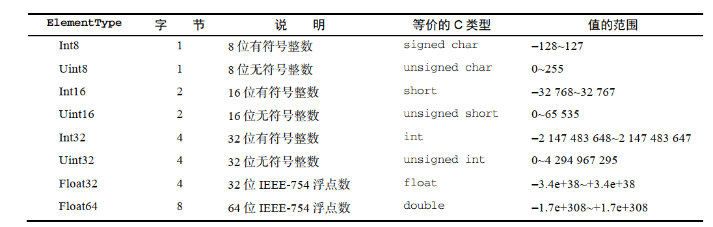

# 08.3-二进制操作-DataView

## 一 DataView 类

### 1.1 DataView 的基本使用

如果一段数据包括多种数据类型（如 HTTP 数据），除了使用复合的定型数组外，还可以通过 DataView 操作。

视图 DataView 是专门为 I/O 设计的读写 ArrayBuffer 的类，而且支持设置字节序：

```js
const buf = new ArrayBuffer(16)

// 视图默认使用整个 ArrayBuffer：
const dv = new DataView(buf)
console.log(dv.byteLength) // 16
console.log(dv.byteOffset) // 0
console.log(dv.buffer === buf) // true

// 构造函数通过参数字节偏移量和字节长度，使用部分 ArrayBuffer：
const dv1 = new DataView(buf, 0, 8) // 参数二 byteOffset 表示缓冲起点；参数三 byteLength 限制视图为前 8 个字节
console.log(dv1.buffer === buf) // true
console.log(dv1.byteLength) // 8
console.log(dv1.byteOffset) // 0

// 若 byteLength 未指定，视图默认使用剩余缓冲，则视图使用剩余缓冲
const dv2 = new DataView(buf, 8) // byteOffset=8 表示视图从缓冲的第 9 个字节开始
console.log(dv2.byteLength) // 8
console.log(dv2.byteOffset) // 8
console.log(dv2.buffer === buf) // true
```

视图没有预设数据类型，也不能迭代！

### 1.2 DataView 读取内存

由于 DataView 没有预设数据类型，不能直接实现对 ArrayBuffer 数据的读写，要通过 DataView 读取缓冲，还需要几个：

- 首先是要读或写的字节偏移量。可以看成 DataView 中的某种“地址”。
- DataView 应该使用数据元素类型来实现 JavaScript 的 Number 类型到缓冲内二进制格式的转换。
- 最后是内存中值的字节序。默认为大端字节序。

ES6 支持 8 中 数据元素：



DataView 为上表中的每种类型都暴露了 get 和 set 方法，这些方法使用 byteOffset（字节偏移量）定位要读取或写入值的位置，类型也是可以互换使用的：

- getInt8：读取 1 个字节，返回 一个 8 位整数
- getUint8：读取 1 个字节，返回一个无符号的 8 位整数
- getInt16： 读取 2 个字节，返回一个 16 位整数
- getUint16： 读取 2 个字节，返回一个无符号 的 16 位整数
- getint32： 读取 4 个字节，返回一个 32 位整数
- getUint32： 读取 4 个字节，返回一个无符号的 32 位整数
- getFloat32： 读取 4 个字节，返回一个 32 位浮点数
- getFloat64：读取 8 个字节，返回一个 64 位浮点数

示例：

```js
// 在内存中分配两个字节并声明一个 DataView
const buf = new ArrayBuffer(2)
const view = new DataView(buf)

// 查询缓冲中所有二进制位的值，默认都是0
console.log(view.getInt8(0)) // 检查第一个字符：0
console.log(view.getInt8(1)) // 检查第二个字符：0
console.log(view.getInt16(0)) // 检查整个缓冲：0

// 将整个缓冲都设置为 1
view.setUint8(0, 255) // 255 的二进制表示是 11111111（2^8 - 1）

// DataView 会自动将数据转换为特定的 ElementType
view.setUint8(1, 0xff) // 255 的十六进制表示是 0xFF

// 缓冲现在都是 1，如果当成二补数的有符号整数，则应该是 -1
console.log(view.getInt16(0)) // -1
```

JavaScript 的运行时所在的操作系统会决定如何读取、写入字节，但是 DataView 会遵循开发者指定的字节序，默认是大端字节序，但接收一个可选的布尔值参数，设置为 true 即可启用小端字节序。

DataView 视图提供 8 个方法写入内存。

- setInt8 ：写入 1 个字节的 8 位整数 。
- setUint8 ： 写入 1 个字节的 8 位无符号整数 。
- setIntl6 ：写入 2 个字节的 16 位整数 。
- setUintl6 ： 写入 2 个字节的 16 位无符号整数 。
- setInt32 ：写入 4 个字节的 32 位整数 。
- setUint32 ： 写入 4 个字节的 32 位无符号整数 。
- setFloat32 ：写入 4 个字节的 32 位浮点数 。
- setFloat64 ： 写入 8 个字节的 64 位浮点数 。

```js
// 在内存中分配两个字节并声明一个 DataView
const buf = new ArrayBuffer(2)
const view = new DataView(buf)

// 填充缓冲，让第一位和最后一位都是 1
view.setUint8(0, 0x80) // 设置最左边的位等于 1
view.setUint8(1, 0x01) // 设置最右边的位等于 1

// 缓冲内容（为方便阅读，人为加了空格）
// 0x8 0x0 0x0 0x1
// 1000 0000 0000 0001

// 按大端字节序读取 Uint16
// 0x80 是高字节，0x01 是低字节
// 0x8001 = 2^15 + 2^0 = 32768 + 1 = 32769
console.log(view.getUint16(0)) // 32769

// 按小端字节序读取 Uint16
// 0x01 是高字节，0x80 是低字节
// 0x0180 = 2^8 + 2^7 = 256 + 128 = 384
console.log(view.getUint16(0, true)) // 384

// 按大端字节序写入 Uint16
view.setUint16(0, 0x0004)

// 缓冲内容（为方便阅读，人为加了空格）
// 0x0 0x0 0x0 0x4
// 0000 0000 0000 0100
console.log(view.getUint8(0)) // 0
console.log(view.getUint8(1)) // 4

// 按小端字节序写入 Uint16
view.setUint16(0, 0x0002, true)

// 缓冲内容（为方便阅读，人为加了空格）
// 0x0 0x2 0x0 0x0
// 0000 0010 0000 0000
console.log(view.getUint8(0)) // 2
console.log(view.getUint8(1)) // 0
```

### 1.3 边界

DataView 完成读、写操作的前提是必须有充足的缓冲区，否则就会抛出 RangeError：

```js
const buf = new ArrayBuffer(6)
const view = new DataView(buf)

// 尝试读取部分超出缓冲范围的值
view.getInt32(4)

// 尝试读取超出缓冲范围的值
view.getInt32(8) // RangeError

// 尝试读取超出缓冲范围的值
view.getInt32(-1) // RangeError

// 尝试写入超出缓冲范围的值
view.setInt32(4, 123) // RangeError
```

DataView 在写入缓冲里会尽最大努力把一个值转换为适当的类型，后备为 0。如果无法转换，则抛出错误：

```js
const buf = new ArrayBuffer(1)
const view = new DataView(buf)

view.setInt8(0, 1.5)
console.log(view.getInt8(0)) // 1

view.setInt8(0, [4])
console.log(view.getInt8(0)) // 4

view.setInt8(0, 'f')
console.log(view.getInt8(0)) // 0

view.setInt8(0, Symbol()) // TypeError
// TypeError
```

## 二 字节序

字节序指数值在内存中的表示方式，一般有两种：

- 大端字节序：最高有效位保存在第一个字节，最低有效位保存在最后一个字节，也称为网络字节序
- 小端字节序：最低有效位保存在第一个字节，最高有效位保存在最后一个字节

```js
const buf = new ArrayBuffer(16) // 生成一个16字节的缓冲对象

const int32View = new Int32Array(buf) // 在缓冲区上建立一个32位定型数组
// 每个32位整数占据4个字节，所以可以写入4个整数
for (let i = 0; i < int32View.length; i++) {
  int32View[i] = i * 2 // 0 2 4 6
}

const int16View = new Int16Array(buf) // 在缓冲区上建立一个16位定型数组
// 每个16位整数占据2个字节，所以可以写入8个整数
for (let i = 0; i < int16View.length; i++) {
  // 默认小端字节序，重要字节排在后面的内存地址，不重要的字节排在前面的内存地址
  console.log(int16View[i]) // 0 0 2 0 4 0 6 0
}
```

一个占据 4 个字节的十六进制数 `Ox12345678` ， 决定其大小的最重要的字节是 `12` 最不重要的是 `8`。 小端字节序将最不重要的字节排在前面，储存顺序就是 `78563412` ；大端字节序则完全相反，将最重要的字节排在前面，储存顺序就是 12345678 。
