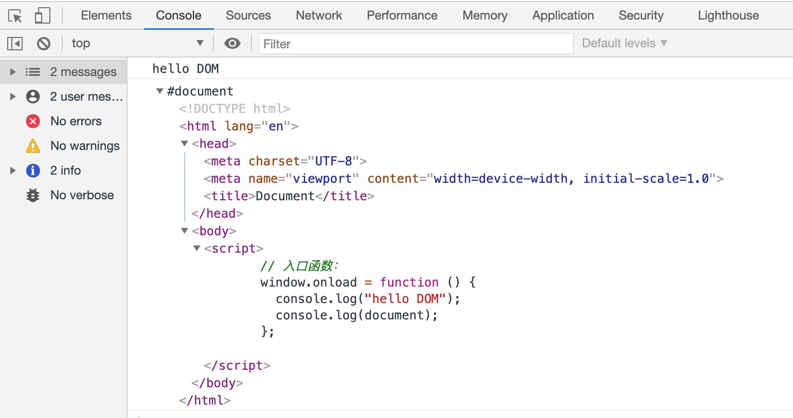

# 02.1-DOM 与 BOM 概述

## 一 理解浏览器内的 JavaScript

ECMAScript 是 JavaScript 的语法核心，但是仅仅有语法，没有一些运行时平台的接口帮助，JS 也只是一个语言玩具。作为 JavaScript 最主要的运行时，浏览器为 JavaScript 提供了两大对象 DOM、BOM，让 JavaScript 能够游刃有余地操作浏览器相关特性。如图所示：


从图中看出，JavaScript 包含三个方面：

- ECMAScript：JavaScript 语法标准，如：类型、关键字、基本对象等，有 ES5、ES6(即 ES2015)、ES7(即 ES2016)，后续皆以年代为规范的名称
- DOM：文档对象模型（Document Object Model），JavaScript 操作网页内容的 API
- BOM：浏览器对象模型（Browser Object Model），JavaScript 操作浏览器的 API

但由于浏览器厂商、版本的不同，DOM 和 BOM 对象的一些 API 往往使用方式不同，或者不兼容，不过好在现在 DOM 和 BOM 已经被纳入 HTML5 规范，相信未来会逐渐统一。

> HTML5：HTML5 并不仅仅是 HTML4 的升级改进，而是设定了专门针对 Web 平台 API 的一系列规范，包括：视频、音频、图像、动画以及与设备的交互，将 Web 带入了一个成熟的应用平台。

## 二 DOM 与 BOM

### 2.1 DOM 概念

HTML 加载完毕后，渲染引擎会在内存中把 HTML 文档，生成一个 DOM 树，即文档对象模型（DOM，Document Object Model）。DOM 是针对 HTML、XML 的 API 接口，描绘了一个层次化的树，允许开发人员对其进行增删改查。

书写示例：

```html
<body>
  <!-- script 的位置推荐位于 body 标签的最后位置 -->
  <script>
    // 入口函数：页面的结构、样式、节点等加载完毕后才去执行函数体。
    window.onload = function () {
      console.log('hello DOM')
      console.log(document) // 查看 document 文档对象
    }
  </script>
</body>
```

上述示例中输出的 document 对象，其实就是整个 HTML 文档，如图所示：



注意：DOM 中所有的 API 都挂载在了 `window` 这个对象上，为了方便，window 可以忽略不写。

DOM 的标准从 DOM1 已经到了 DOM4，不过 W3C 也不再按照 Level 来维护 DOM 了，而是作为 DOM Living Strandard 来维护，主要维护的子集有：

- DOM Core：在 DOM1 核心部分的基础上，为节点增加方法和属性。
- DOM Views：定义基于样式信息的不同视图。
- DOM Events：定义通过事件实现 DOM 文档交互。
- DOM Style：定义以编程方式访问和修改 CSS 样式的接口。
- DOM Traversal and Range：新增遍历 DOM 文档及选择文档内容的接口。
- DOM HTML：在 DOM1 HTML 部分的基础上，增加属性、方法和新接口。
- DOM Mutation Observers：DOM4 级模块，定义基于 DOM 变化触发回调的接口。

当然，除了 DOMCore 和 DOM HTML 接口，一些语言也发布的独立的 DOM 标准，如：SVG、SMIL 等。

## 2.2 BOM 概念

BOM 是浏览器为开发者提供的 JavaScript 浏览器对象模型（Browser Object Modle），BOM 与网页无关，主要针对浏览器窗口、子窗口（frame）。

BOM 提供的一些常见操作有：

- 弹出新浏览器窗口
- 移动、缩放、关闭浏览器窗口
- navigator 对象：提供浏览器本身的信息
- location 对象：提供加载页面的信息
- screen 对象：提供关于用户屏幕分辨率的信息
- performance 对象：提供浏览器内存占用、时间统计等信息
- 支持 cookie
- 支持其他自定义对象，如：XMLHttpRequest 等
