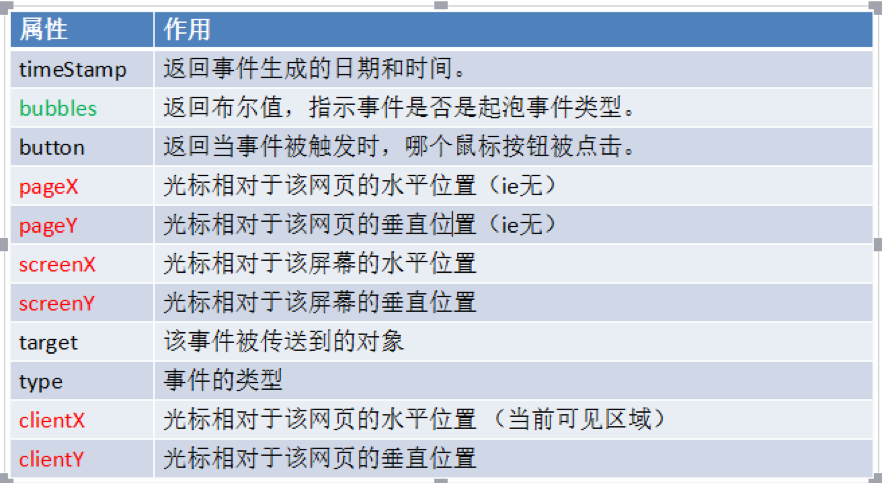

# 05.3-DOM-DOM 事件

## 一 事件的基本概念

浏览器中的 JS 是以事件驱动为核心的一门语言，事件即是可以被 JavaScript 侦测到的行为，是一种触发-响应机制。

网页中的每个元素都可以通过行为触发相应的事件，如：点击按钮-->产生事件--->执行操作。

事件的三要素是：事件源、事件、事件处理程序，如下所示：

```js
let btn = document.querySelector('#btn')

// btn 为事件源、click 为事件，绑定的函数为事件处理程序
btn.onclick = function () {
  console.log('btn 被点击了')
}
```

事件的触发一般对应 on 前缀开头，常见事件有：

```txt
click       鼠标单击
dbclick     鼠标双击
mouseover   鼠标悬停
mouseout    鼠标移除
change      文本内容或下拉菜单中的选项发生改变
keyup       按下并释放键盘上的一个健
focus       获得焦点
blur        失去焦点
load        网页文档加载事件
unload      关闭网页时
submit      表单提交事件
reset       重置表单时

贴士：
mouseover/mouseout：会触发多次，每遇到一个子元素就会触发一次。
mouseenter/mouseleave：只会触发一次。
```

事件函数中的 this 代表调用者本身：

```js
btn.onclick = function () {
  // btn.disabled = true;
  this.disabled = true // 作用同上
}
```

## 二 事件绑定与取消

### 2.1 DOM0 和 DOM2 级事件绑定与取消

有两种事件绑定方式：

```js
// DOM0 级事件绑定方式：多次绑定会覆盖前一次事件执行函数
obj.onclick = function () {} // 绑定事件
obj.onclick = function () {} // 再次绑定会覆盖前者
obj.onclick = null // 取消绑定

// DOM2 级事件绑定方式（监听）：多次绑定多不会覆盖前一次事件执行函数，多个函数会依次触发
obj.addEventListener('click', function () {}, false) // 绑定事件
obj.removeEventListener('click', function () {}, false) // 取消绑定
```

### 2.2 IE8 中的事件绑定与取消

现在的主流浏览器都已经支持 DOM2 级事件，但是 IE8 不支持，而是实现了类似的两个方法：`attachEvent()/detachEvent()`

```js
// 只有两个参数：参数一为事件，带 on；参数二为事件处理函数，但是该函数在全局作用域运行！！！，即其 this 为 window
// 多次绑定会按照相反的顺序执行！！！
// 这 2 个事件只支持事件冒泡！！！
obj.attachEvent('onclick', function () {
  console.log(this === window) // true
})
```

### 2.3 兼容工具

下面的工具类可以做到兼容：

```js
let EventUtil = {
  addHandler: function (element, type, handler) {
    if (element.addEventListener) {
      element.addEventListener(type, handler, false)
      return
    }

    if (element.attachEvent) {
      element.attachEvent('on' + type, handler)
      return
    }

    element['on' + type] = handler
  },
  removeHandler: function (element, type, handler) {
    if (element.removeEventListener) {
      element.addEventListener(type, handler, false)
      return
    }

    if (element.detacheEvent) {
      element.detacheEvent('on' + type, handler)
      handler.call(element)
      return
    }

    element['on' + type] = null
  },
}
```

## 三 事件对象

当一个事件发生时，事件的详细信息（属性、方法）都会保存到一个对象中，这个事件对象即 event 对象。

```html
<div id="div"></div>
<script>
  let div = document.querySelector('#div')
  div.onclick = function (e) {
    console.log(e)
  }
</script>
```

只有在事件处理程序执行期间，event 对象才会存在；一旦事件处理程序执行完成，event 对象就会被销毁。

事件对象仍然有兼容问题，IE8 中，事件对象直接位于 window 中！兼容的写法如下：

```js
// 事件处理函数
function(e){
  e = e || window.event
}
```



兼容事件对象：

```js
const EventUtil = {
  addHandler: function (element, type, handler) {
    // 为节省版面，删除了之前的代码
  },
  getEvent: function (event) {
    return event ? event : window.event
  },
  getTarget: function (event) {
    return event.target || event.srcElement
  },
  preventDefault: function (event) {
    if (event.preventDefault) {
      event.preventDefault()
    } else {
      event.returnValue = false
    }
  },
  removeHandler: function (element, type, handler) {
    // 为节省版面，删除了之前的代码
  },
  stopPropagation: function (event) {
    if (event.stopPropagation) {
      event.stopPropagation()
    } else {
      event.cancelBubble = true
    }
  },
}
```

## 四 事件调用者

在事件处理程序内部，this 其实是绑定事件的对象，即 `e.currentTarget`，而 `e.target` 则是触发事件的真实对象。

```html
<div id="div">
  <div id="div1"></div>
  <div id="div2"></div>
</div>
<script>
  let div = document.querySelector('#div1')
  div.onclick = function (e) {
    e = e || window.event
    // 本处示例点击 div1
    console.log(e.target === document.querySelector('#div1')) // true
    console.log(e.currentTarget === this) // true
    console.log(e.target === this) // false
  }
</script>
```

## 五 阻止事件的默认行为

当一个事件发生时，浏览器会默认做一些事情，比如点击链接就会发生跳转，这些默认行为也是可以阻止的：

- 方式一：适用于 on 方式绑定的事件函数，在事件处理函数中使用 `return false`
- 方式二：如果事件是以 addEventListner 绑定，那么在事件处理函数中添加：`event.preventDefault();`

注意：只有事件的 cancelable 属性为 true，才能使用 `preventDefault()` 方法取消默认行为。

## 六 事件模拟

### 6.1 DOM 事件模拟

使用 document.createEvent() 可以自己创建事件，模拟鼠标事件示例：

```js
let btn = document.getElementById('myBtn')
// 创建 event 对象
let event = document.createEvent('MouseEvents')
// 初始化 event 对象
event.initMouseEvent(
  'click',
  true,
  true,
  document.defaultView,
  0,
  0,
  0,
  0,
  0,
  false,
  false,
  false,
  false,
  0,
  null
)
// 触发事件
btn.dispatchEvent(event)
```

参数列表：

```txt
type（字符串）：要触发的事件类型，如"click"。
bubbles（布尔值）：表示事件是否冒泡。为精确模拟鼠标事件，应该设置为 true
cancelable（布尔值）：表示事件是否可以取消。为精确模拟鼠标事件，应该设置为 true。
view（AbstractView）：与事件关联的视图。基本上始终是 document.defaultView。
detail（整数）：关于事件的额外信息。只被事件处理程序使用，通常为 0。
screenX（整数）：事件相对于屏幕的 x 坐标。
screenY（整数）：事件相对于屏幕的 y 坐标。
clientX（整数）：事件相对于视口的 x 坐标。
clientY（整数）：事件相对于视口的 y 坐标。
ctrlkey（布尔值）：表示是否按下了 Ctrl 键。默认为 false。
altkey（布尔值）：表示是否按下了 Alt 键。默认为 false。
shiftkey（布尔值）：表示是否按下了 Shift 键。默认为 false。
metakey（布尔值）：表示是否按下了 Meta 键。默认为 false。
button（整数）：表示按下了哪个按钮。默认为 0。
relatedTarget（对象）：与事件相关的对象。只在模拟 mouseover 和 mouseout 时使用。
```

贴士，DOM2 未定义键盘事件，直到 DOM3 才定义，但是 DOM3 的键盘事件与 DOM2 的规范出入很大，具体如下：

```js
let textbox = document.getElementById('myTextbox'),
  event
// 按照 DOM3 的方式创建 event 对象
if (document.implementation.hasFeature('KeyboardEvents', '3.0')) {
  event = document.createEvent('KeyboardEvent')
  // 初始化 event 对象
  event.initKeyboardEvent(
    'keydown',
    true,
    true,
    document.defaultView,
    'a',
    0,
    'Shift',
    0
  )
}
// 触发事件
textbox.dispatchEvent(event)
```

但是火狐与上述方式也略有区别，这里就不介绍了，直接给出事件通用的模拟方式：

```js
let textbox = document.getElementById('myTextbox')
// 创建 event 对象
let event = document.createEvent('Events')
// 初始化 event 对象
event.initEvent(type, bubbles, cancelable)
event.view = document.defaultView
event.altKey = false
event.ctrlKey = false
event.shiftKey = false
event.metaKey = false
event.keyCode = 65
event.charCode = 65
// 触发事件
textbox.dispatchEvent(event)
```

### 6.2 自定义 DOM 事件

DOM3 增加了自定义事件的类型。自定义事件不会触发原生 DOM 事件，但可以让开发者定义自己的事件。

创建一个名为"myevent"的冒泡事件示例：

```js
let div = document.getElementById('myDiv'),
  event

div.addEventListener('myevent', (event) => {
  console.log('DIV: ' + event.detail)
})

document.addEventListener('myevent', (event) => {
  console.log('DOCUMENT: ' + event.detail)
})

if (document.implementation.hasFeature('CustomEvents', '3.0')) {
  event = document.createEvent('CustomEvent')
  event.initCustomEvent('myevent', true, false, 'Hello world!')
  div.dispatchEvent(event)
}
```

### 6.3 IE8 中的事件模拟

```js
var btn = document.getElementById('myBtn')
// 创建 event 对象
var event = document.createEventObject()
/// 初始化 event 对象
event.screenX = 100
event.screenY = 0
event.clientX = 0
event.clientY = 0
event.ctrlKey = false
event.altKey = false
event.shiftKey = false
event.button = 0
// 触发事件
btn.fireEvent('onclick', event)
```
