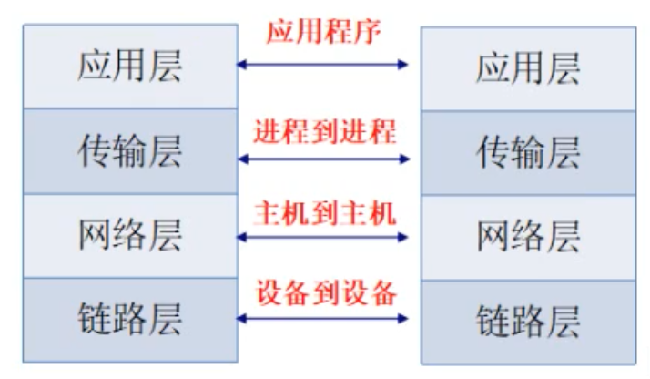
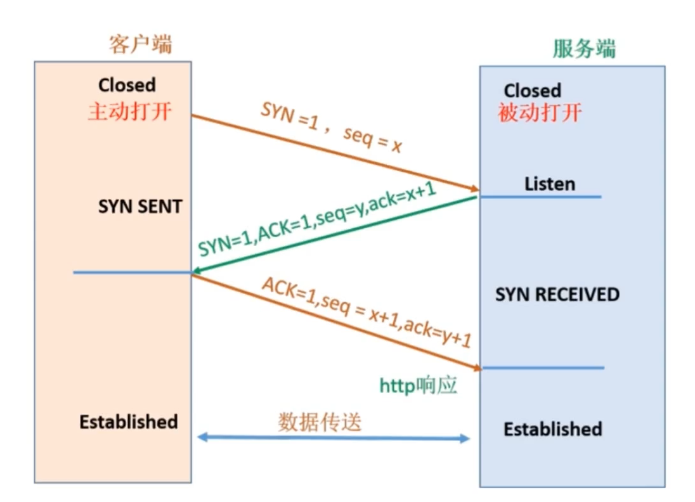

# 01-计算机网络简介

## 一 计算机网络发展史

### 1.1 电路交换

在早起的广域网中，通信双方之间，是通过电路交换建立电路连接的网路，如图所示：

当左侧的任意一台电话与右侧的电话建立连接后，线路就被占用了，即电路交换有以下特点：

- 连接过程是：建立连接->使用连接->释放连接
- 物理链路会被通信双方独占

电路交换的传输效率极低，所以不适合传输计算机数据。

### 1.2 分组交换

分组交换的意思是：使用标有地址的分组进行路由选择传输数据，通信双方仅在传输期间占用通信通道。

每个分组都由首部和数据段组成，因为用户一般会一直在接收多段数据，那么就需要首部等存储的信息来确认。

如图所示：

分组是分组交换的传输单位，节点在收到分组后，会先暂时存储下来，检查其首部，按照首部中的目的地址，找到合适的下一个节点转发出去。

## 二 网络协议

### 2.1 网络分层

为了能够更好的屏蔽不同计算机之间软硬件不同，实现不同类型计算机、操作系统之间进行通信，出现了网络分层体系。

网络在理论上划分为了 OSI 七层结构，但是这只是理论模型，现代计算机网络都采用的是 TCP/IP 四层模型：

TCP/IP 协议簇是一系列网络相关协议的总称，其典型特征是分为四层结构：

- 应用层：面向开发者使用，提供应用程序之间沟通协议。

- HTTP：超文本传输协议，用于 web 服务中从服务器传输超文本到本地浏览器
- FTP：文件传输协议

- 传输层：传输层通过系统调用向应用层提供两台计算机之间输出传输能力

- TCP 协议：传输层面向连接的协议，传输数据前需要建立连接，会对包进行排序、查错，损坏的包也可以重传。常用于 web 应用。
- UDP 协议：传输层无连接的报文协议，传输数据前无需建立连接，不会对包进行排序、查错，损坏的包不可以重传。常用于 DNS 解析、音视频通话等。

- 网络层：提供数据封包传输功能，以尽力让每个数据包都能到达目的主机。

- IP 协议：为数据从源地址到目的地址传输提供帮助的协议。是不可靠的，不保证传输结果是否成功，也是无连接，即不维护后续数据包的状态。ip 地址是主机的唯一标识。

- 链路层：也称为网络接口层，负责最终打包好的数据帧在硬件上的发送与接收。

- ARP 协议：根据 IP 地址获取 Mac 地址
- RARP 协议：根据 Mac 地址获取 IP 地址

通信的职责：

### 2.2 数据封包、解包

数据的传输过程：

数据在网络传输时，是需要经过封包、解包的过程的。数据在经过应用程序发送时，封包的过程如下所示：

在封包时候，数据沿着协议栈，不断的在各个层加上头部信息，链路层还会额外加入尾部信息。最终数据到达互联网后，就具备了所有需识别的信息。

解包即是数据从下层传输到上层时，会逐层把下层的头部信息删除：

### 2.3 各层封装格式

链路层封装：

贴士：图中的 IEEE802.2/802.3 常用于无线网络，以太网用于有线网络。封装时，目的 Mac 地址、源 Mac 地址、协议类型已经占据了 14 个字节，CRC 占据了 4 个字节，也就是说即使发送了一个空的数据，也有 18 个字节。

网络层、传输层封装：

贴士：以上每行为 4 个字节，所以 IP 协议占据了 20 个字节，

## 三 TCP 协议

### 3.1 TCP 概念

TCP 协议是面向连接的，可靠的传输层协议，用于实现不同主机之间的进程间通信。TCP 协议会对包进行排序、查错，损坏的包也可以重传。

### 3.2 三次握手

TCP 所谓的可靠性是指在数据传输前，发送端、接收端先互相进行验证对方的收发功能是否正常！TCP 中的验证方式是三次握手、四次挥手。

三次握手过程：

- 第一次握手：客户端发送请求报文段，内部包含 SYN 标志，发送后进入 SYN_SEND 状态，等待服务端确认
- 第二次握手：服务端接收到客户端 SYN 报文后，发送 ACK 信息对这个 SYN 报文段进行确认，同时额外发送自己的 SYN 请求信息，发送后进入 SYN_RECV 状态
- 第三次握手：客户端接收到服务端的 SYN+ACK 报文后，会向服务端发送 ACK 确认报文段，发送完毕后，客户端和服务端都会进入 ESTABLISHED 状态，三次握手完成，开始进行真实数据传输！

三次握手详图如下：

### 3.3 四次挥手

四次挥手过程是连接断开时做的操作，客户端在主动关闭时，发送的请求报文段包括 FIN 标志（假设值为 M），服务端接收到该报文后，同样返回 ACK 信息（值为 M+1）。此时服务端也执行 close 操作，并发送一个新的 FIN （假设值为 N）给客户端，客户端接收到该数据，将返回值为 ACK 信息（值为 N+1）。

如上所示，四次挥手其实是将三次握手中的第二步分 2 部处理。

注意：以上客户端和服务端只是是可以互换身份进行关闭的，即服务端也可以主动关闭，其关闭过程与客户端主动关闭一致。
