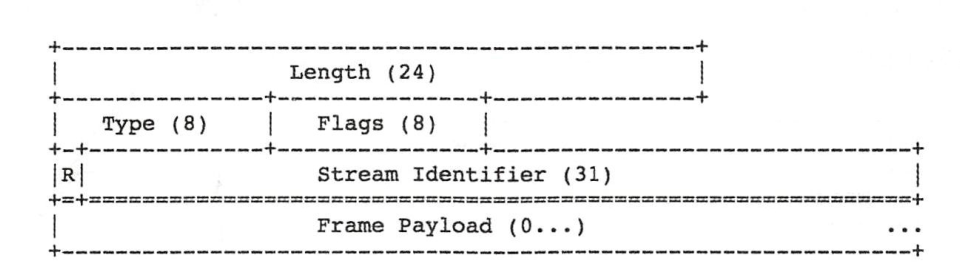
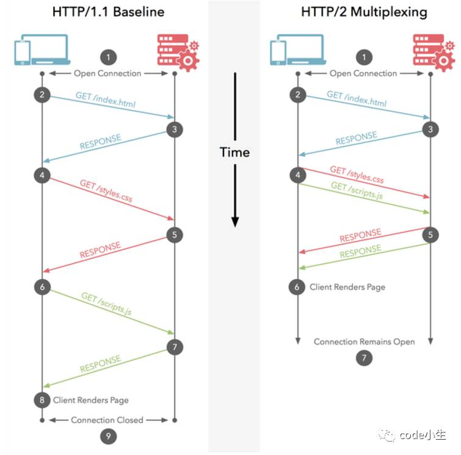

# 02-Http 协议

## 一 HTTP 协议

### 1.1 HTTP 协议简介

HTTP 协议是 TCP/IP 协议的一个子集，是超文本传输协议，在该协议规范下，允许将超文本标记语言 HTML 文档从 web 服务器传送到客户端（浏览器）。

客户端与服务端之间需要在 HTTP 协议基础上进行通信，双方通过网络传递的数据称为`报文`。

### 1.2 报文

HTTP 协议中有两类报文，请求报文、响应报文。HTTP 是面向文本的，所以报文中的每一个字段都是一些 ASCII 码串，因而各个字段的长度都是不确定的。HTTP 请求报文和响应报文都是由三个部分组成。这两种报文格式的区别就是开始行不同。

```txt
开始行：用于区分是请求报文还是响应报文。在请求报文中的开始行叫做请求行，而在响应报文中的开始行叫做状态行。
首部行：用来说明浏览器、服务器或报文主体的一些信息。首部可以有好几行，但也可以不使用。
实体主体：在请求报文中一般都不用这个字段，而在响应报文中也可能没有这个字段
```

报文示例：

```txt
GET/sample.jspHTTP/1.1
Accept:image/gif.image/jpeg,/
Accept-Language:zh-cn
Connection:Keep-Alive
Host:localhost
User-Agent:Mozila/4.0(compatible;MSIE5.01;Window NT5.0)
Accept-Encoding:gzip,deflate
```

### 1.3 请求方法

请求方法：客户端和服务器之间交互会使用不同的方法。常见的请求方法有：

```txt
GET：     默认的方法，用来请求已经被 URI 识别的资源
POST：    用于提交数据
PUT：     与 POST 类似，但 PUT 是幂等的（多次重复造作结果一致），所以一般用于更新数据
HEAD：    只用于获取报头，所以可以用来测试链接的有效性
DELETE：  用于删除资源，与 PUT 相反或者说对应
OPTIOON： 用来查询针对请求 URI 的资源的方法是否支持，比如常见的跨域问题
TRAC：    回显服务器收到的请求，用于测试、诊断
CONNECT： 用于代理服务器，开启客户端与服务端资源之间的通道
```

具有幂等性的方法：

```txt
GET
HEAD
PUT
DELETE
OPTIONS
TRACE
```

### 1.4 响应状态码

HTTP 请求的结果用状态码来表示请求的结果：

- 1xx：表示消息，代表请求被接受，需要继续处理，是一种临时响应
- 2xx：表示成功。
- 200：OK，请求成功，处理成功
- 202：Accepted，请求已接受，但是处理未完成
- 206：Partial Content，部分请求被处理完成。断点续传中会用到。
- 3xx：表示重定向，代表客户端采取进一步操作才能完成请求，后续的请求地址（重定向目标）在本次响应的 Location 域中指明
- 301：Moved Permanently，永久重定向，请求的资源被永久移动到了新 URI
- 302：Found，临时移动，客户端后续请求应该继续使用原有 URI
- 4xx：表示请求错误。
- 400：Bad Request，客户端请求语法错误，服务器无法理解
- 401：Unauthorized，请求要求用户的身份认证
- 403：Forbidden，服务器理解了客户端的请求，但是拒绝执行，
- 404：Not Found，服务器未找到对应资源
- 5xx：表示服务器错误。
- 500：Internal Server Error，服务器内部错误，请求无法完成
- 502：Bad Gateway，网关或者代理服务器收到了无效请求

## 二 内容协商机制

内容协商机制：客户端和服务端就响应的资源内容进行交涉，以提供最适合当前客户端需求的资源。比如给英语地区的客户端显示英语界面，给汉语地区的客户端显示汉语界面。

内容协商一般以响应资源的语言、字符集、编码等方式作为判断基准。

协商方式有：

- 客户端驱动：客户端发送请求，服务端返回可选列表，客户端做出选择后发送二次请求
- 服务端驱动：客户端发送请求，服务端 根据请求头部集，直接判断选择哪个版本的页面。该方式使用较为广泛。
- 常用判断头部：Accept，Accept-Language、Accpet-Charset、Accept-Encoding
- 常用判断头部：Content-Type，Content-Language
- 透明协商：某个中间设备（通常是缓存代理）代表客户端进行协商

## 三 HTTPS

Http 在网络中是以明文形式传输的，其安全性极差，HTTPS 就是为了解决 HTTP 安全性问题而诞生的。

HTTPS 其本质仍然是基于 http 协议，在此基础上增加了 TLS 传输层加密协议（前身是 SSL 协议），所以 HTTPS 可以简单理解为：

```txt
HTTPS = HTTP + TLS
```

## 四 http2

### 4.1 http1.1 逐渐被取代

HTTP 协议已经很古老，目前广泛使用的 HTTP 协议版本为 http1.1，该版本支持缓存处理、长连接、请求流水线处理等，但是仍然不符合当前 4G、5G 的发展。

http2.0 在性能上有了大幅提升，特点如下：

- 二进制传输
- 支持多路复用
- header 压缩
- 支持服务端推送

### 4.2 二进制传输

http1.1 是基于文本传输的，http2 则基于二进制格式传输，能有效压缩传输数据大小。

在 http2 中，基本的协议单位是帧。帧的内容包括：

```txt
Length              长度
Type                类型
Flags               标记
R                   保留字段
Steam Identifier    流标识符
Frame Payload       帧主题
```

帧的布局：


http2 发送的数据是由一个或者多个帧组合成的消息。

### 4.3 多路复用

在 http1.0 中，如果需要并发多个请求，则必须创建多个 TCP 连接，一般最高只有 6 个，这些连接无法被复用。

为了解决连接无法复用问题，HTTP/1.1 引入了 Pipeling 解决方案，但是在该方案中：若干个请求排队串行化单线程处理，后面的请求等待前面请求的返回才能获得执行机会（FIFO），一旦有某请求超时等，后续请求只能被阻塞，毫无办法，也就是人们常说的线头阻塞；

HTTP/2 则允许多个请求同时在一个连接上并行执行，某个请求任务耗时严重，也不会影响到其它连接的正常执行；



至此，在 HTTP/2 中，连接是共享的，每一个 request 都是用作连接共享机制的，一个 req 对应一个 id，接收方根据 id 归属到不同的服务端请求里。

同时 HTTP/2 中还可以设置每个流的优先级，高优先级的流会被服务端优先处理并返回给客户端。

### 4.4 首部压缩

http1.1 则每次请求都附带大量的 header 信息，在 HTTP/2 中，通讯双方各自缓存一份 header fields 表，避免 header 的重复传输，减小传输文件大小。

### 4.5 服务端推送

服务端推送即支持从服务端主动推送信息给客户端。
