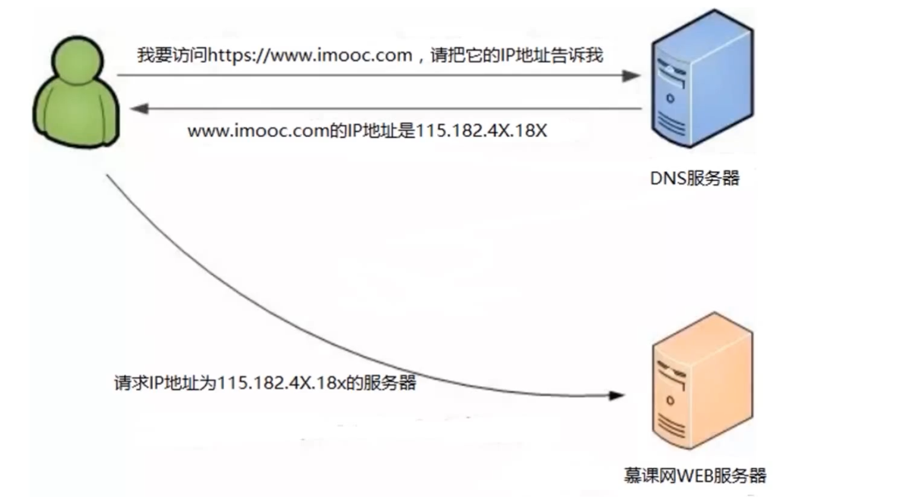
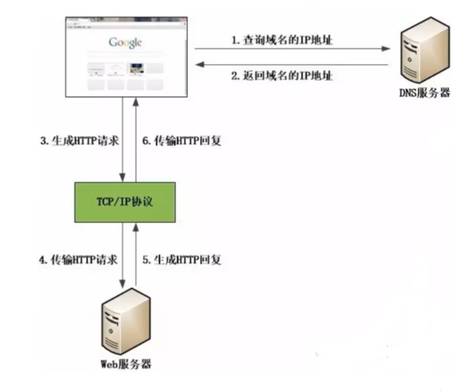
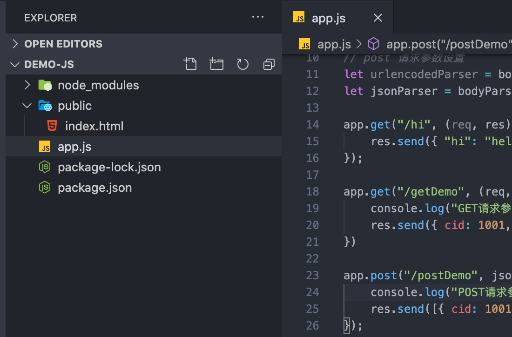

# 03- Web 开发介绍

## 一 Web 开发的本质

### 1.1 请求响应模型

客户端与服务端之间的链接是基于一种请求应答的模式。即：客户端和服务端建立一个链接，客户端提交一个请求，服务端收到该请求后返回一个响应，然后二者就会断开连接。


Web 开发，其本质其实是：

-   1. 请求：客户端发起请求
-   2. 处理：服务端处理请求
-   3. 响应：服务端返回处理结果给客户端

常见服务器有：Nginx、Tomcat、Apache 等。

### 1.2 C/S 与 B/S 架构

基于请求 - 响应模型，目前的开发方式主要有两种，他们各有优劣：

-   C/S 架构（Client/Server）：客户端与服务端完全分离，如：QQ、迅雷、精灵宝可梦等软件。能够合理利用操作系统 API,具有较高的性能与操作体验，但新版发布会带来更新的不便
-   B/S 架构（Browser/Server）：基于浏览器作为客户端的开发方式，如：招商银行官网、页游。能够快速发布新版不影响用户使用，但会受限于浏览器本身的能力

## 二 网页的访问

### 2.1 DNS

服务器地址都是以 IP 的形式进行标识的，那么在浏览器中却无需直接输入 IP 地址，而是输入网址就可以访问对方服务器，这是因为有 DNS 的帮助。

DNS 服务就是用来提供域名到 IP 地址之间的转换解析服务的！



为了提升效率，DNS 服务是有缓存的，依照就近原则，来进行网址与 IP 的解析，当访问一个网址时：

-   优先从本地 host 文件中查找 ip 地址
-   然后查找本地的 DNS 缓存服务
-   去 DNS 服务商中查找

所以一个请求的真实访问过程如下所示：



### 2.1 输入 url 到网页展示的过程

假设我们点击了某网页上的一个链接，指向一个新浪体育上一个詹姆斯扣球新闻，一般网页地址为：`http://www.sina.com/sport/nba/20200203-zms.html`。

这个访问过程大致如下：

-   第一步：查找 DNS 服务
-   第二步：根据 DNS 服务查找该网页所在服务器 IP
-   第三步：浏览器与网页所在服务器建立连接
-   第四步：浏览器发出获取文件请求，服务端响应请求返回文件内容
-   第五步：浏览器与服务端双方断开连接
-   第六步：浏览器将获取到的数据通过解析引擎展示给用户

### 2.2 关于网址

URI：是一个紧凑的字符串，用来表示抽象、物理资源，可以分为 URL、URN，类似 URN 作用类似一个人的名字（身份），URL 类似一个人的地址（位置 ）。

URL 是 URI 的一种，但不是所有的 URI 都是 URL，访问机制决定了他们的不同，有访问机制的 URI 才是 URL，示例如下：

-   URL：`ftp://ftp.down/1.txt`
-   URI：`tel:+1-010-11-1311`

## 三 通信实现

### 2.0 常见通信方式

实现网页客户端与服务端通信的方式有两种：

-   表单：利用表单提交给服务端
-   Ajax：Asynchronous JavaScript+XML，利用浏览器提供的原生 Ajax 对象提交数据给服务端，有两种实现：
-   XHR 对象：即 XMLHttpRequest 对象，比较难用，适合较老的浏览器
-   fetch()：新的标准，支持 promise 、服务线程等，很强大

Ajax 优点：在 Ajax 诞生之前，如果网速很慢，页面加载时间很长，就会导致用户一直在等待，而无法进行别的操作。在带表单的网页中，表单提交后，如果出现内容不合法，则会重新渲染页面，之前填写的内容就会消失。这些都是用户体验极差的现象，虽然可以通过一些手段避免，但是实现起来较为复杂。**Ajax 可以实现页面无刷新更新数据，极大提高了用户体验！**

### 2.1 表单提交示例

表单提交数据方式演示：

```html
<form action="/upload" enctype="multipart/form-data" method="post">
    Username:
    <input type="text" name="username" />
    Password:
    <input type="password" name="password" />
    File:
    <input type="file" name="file" />
    <input type="submit" />
</form>
```

### 2.2 服务端环境准备

Ajax 是客户端（浏览器）与服务端通信的方式，自然少不了服务端的参与。这里我们可以按照如下方式启动一个 Node 服务器。

首先需要下载并安装 NodeJS，进入网址<https://nodejs.org>，点击 LTS（长久支持）标识的安装包，下载后，一直下一步即可。

创建一个 NodeJS 项目，如下所示：



package.json 内容如下：

```json
{
    "name": "demo-ajax",
    "version": "1.0.0",
    "description": "",
    "main": "app.js",
    "scripts": {
        "dev": "node app.js"
    },
    "dependencies": {
        "body-parser": "^1.19.0",
        "express": "^4.17.1",
        "formidable": "^1.2.2"
    }
}
```

app.js 是 NodeJS 项目的核心文件（入口文件），代码如下：

```js
const express = require('express') // 引入web框架 express
const path = require('path') // 引入 路径处理模块 path
const bodyParser = require('body-parser') // post 请求解析模块
const formidable = require('formidable') // 解析 FormData 的模块

const app = express() // 创建web服务器

// 静态资源目录
app.use(express.static(path.join(__dirname, 'public')))

// post 请求参数设置
let urlencodedParser = bodyParser.urlencoded({ extended: false })
let jsonParser = bodyParser.json()

app.get('/hi', (req, res) => {
    res.send({ hi: 'hello get' })
})

app.post('/hi', (req, res) => {
    res.send({ hi: 'hello post' })
})

app.get('/getDemo', (req, res) => {
    console.log('GET请求参数:', req.query)
    res.send({ cid: 1001, title: '新闻一', content: '内容一一一...' })
})

app.post('/postDemo', jsonParser, (req, res) => {
    console.log('POST请求参数:', req.body)
    res.send([{ cid: 1001, title: '新闻二', content: '内容二一一...' }])
})

app.post('/formDataDemo', (req, res) => {
    const form = new formidable.IncomingForm()
    form.parse(req, (err, fileds, files) => {
        if (err) {
            res.send({ error: err })
            return
        }
        // fileds 保存了普通键值对，files保存了上传的文件
        console.log('FormData参数:', fileds)
        res.send([{ cid: 1001, title: '新闻三', content: '内容三一一...' }])
    })
})

app.post('/uploadDemo', () => {
    const form = new formidable.IncomingForm()
    form.uploadDir = path.joind(__dirname, 'uploads')
    form.parse(req, (err, fileds, files) => {
        if (err) {
            res.send({ error: err })
            return
        }
        res.send([{ cid: 1001, title: '新闻三', content: '内容三一一...' }])
    })
})

app.get('/crosDemo', (req, res) => {
    res.send("let user = {'uid':'1001'}")
})

app.get('/crosDemo2', (req, res) => {
    // 获取回调函数名称
    let callback = req.query.callback

    // 定义要返回的数据
    let data = JSON.stringify({ uid: '1001' })

    // 返回数据
    res.send(`${callback}(${data});`)
})

app.listen(3000, () => {
    console.log('服务器启动成功')
})
```

在学习 Ajax 时，只需要在 public 文件夹下的 `index.html` 内书写示例即可。

运行：

```txt
# 进入项目根目录

# 安装依赖
npm i

# 运行项目
npm run dev
```
