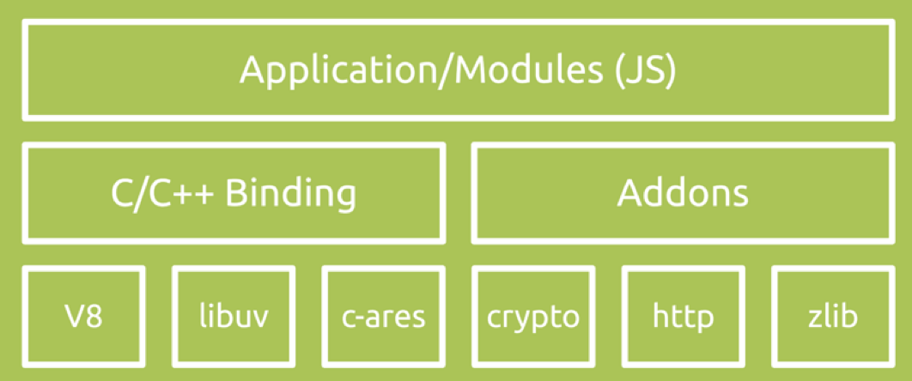
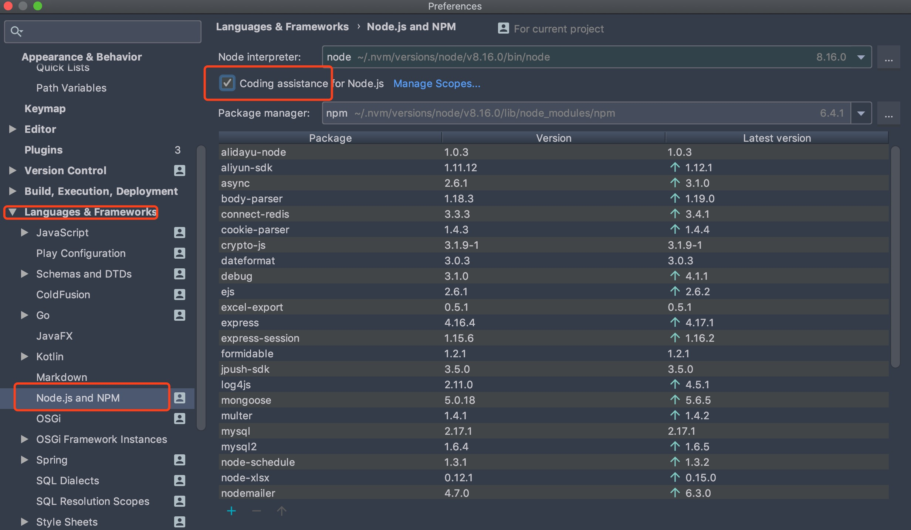

# 01-Node 简介

## 一 Node 初识

### 1.1 Node 简介

Node.js 由 Ryan Dahl 于 2009 年发布，其最初的目的是为了基于 V8 引擎开发一个高性能的异步 Web 服务器。由于 Node 补充了 JavaScript 在 Web 服务端的空白，其自带的网络、文件能力也让 Node 在前端工程化工具领域大放异彩，Node 收获了意想不到的繁荣。

现在可以先厘清一下 ECMAScript 与 V8 的关系：

- ECMAScript：JavaScript、JScript 等语言的语法标准
- V8：解析 JavaScript 语言的引擎

有了 ECMAScript 语法、V8 对语法的解析，一个语言就能书写、运行了。但是我们在学习时，经常使用 Chrome 浏览器来运行 JavaScript，因为 Chrome 浏览器内部也内置了 V8，而且在 ECMAScript 的基础上，浏览器给开发者额外提供了 DOM、BOM 的 API。
同理，Node 与 Chrome 浏览器道理一样，因为 Node 内部集成了 V8，其也能运行 JavaScript，但是 Node 没有浏览器额外提供的 DOM、BOM 等 API，而是拥有自己独立的文件、网络操作 API。

JavaScript 现在的运行平台可以总结如下：

- Chrome 浏览器：使用 V8 作为 JS 解析引擎，额外封装了 DOM、BOM 等页面渲染相关的 API。Chrome 浏览器还拥有 Webkit 排版引擎。
- NodeJS：使用 V8 作为 JS 解析引擎，封装了文件、网络的 API。NodeJS 还拥有一个名为 libuv 事件处理库。

下图是 Chrome 浏览器与 Node.js 的内核区别：



综上所述，Node 的官网对 Node 的概述非常准确：

> Node.js® is a JavaScript runtime built on Chrome's V8 JavaScript engine.
> Node.js 是一个基于 Chrome 的 0i·1 V8 JavaScript 引擎 构建的 JavaScript 运行时。

贴士：

- 运行平台：为某个语言提供了该平台专属的 API，如浏览器平台，为 JS 提供了 DOM、BOM 操作 API；Node 平台为 JS 提供了文件、网络操作 API
- 运行时（runtime）：为某个语言提供解析引擎，如 Chrome 的 V8，Firefox 的 SpiderMonkey。运行时的作用是解析编程语言，所以其最核心的特点是要执行编程语言标准，如 ECMAScript，所以其于浏览器、Node，以及各自的事件循环都没有关系，这些平台可以选择任一款 JS 的运行时。

当然，Node 的周边生态已经相当繁荣，类似 Java 平台，我们也可以将 Node 理解为一个开发平台：

```txt
开发平台：    Node            Java
编程语言：    JavaScript      Java
runtime：    V8              JVM
包管理器：    NPM             Maven
```

### 1.2 Node 核心

Node 的核心部分有两部分：

- V8 引擎：由 C++ 语言开发的编译器，提供解析 JavaScript 语言的能力。该引擎由 Google 公司推出，是 Chrome 浏览器内置的 JavaScript 引擎
- libuv：由 C++ 语言开发的异步 I/O 库，在该库基础上，Node 提供了网络、文件等操作系统 API。该库由 Ryan Dahl 自己为了让 Node 拥有异步 I/O 能力亲自开发。



Node 内部维护着一个核心线程专门用于处理各种网络请求，对请求对应的事件进行异步分发。binging 一层是 JS 与底层 C++沟通的关键，前者通过 bindings 调用后者，相互交换数据，libuv 为 Node 提供了跨平台、线程池、事件池、异步 IO 能力。

### 1.3 Node 特点-单线程（非严格意义）

在传统编程语言中，大多使用多线程来应对并发请求，如 Java、Python。在多线程模型中，每有一个客户端接入服务器，服务端都会创建一个新的线程用来处理该连接，每个线程需要耗费大约 2MB 内存，理论上一台 8G 内存服务器同时只能有 4000 个客户端连接。

Node 本身也是多线程的，但是他与开发平台最大的不同是：在核心业务处理上，只有一个线程，且只用于监听事件的流动。即：负责客户端连接处理的线程只有一个，该线程并不会真正处理连接业务，而是利用事件循环机制，通过非阻塞 I/O 直接将连接处理交给操作系统处理，自己继续接收下一个连接请求。

这样做的意义是：

- 在单线程上处理业务代码，避免了传统语言反复切换线程上下文带来的损耗
- 在事件循环机制支持下的，非阻塞 I/O 同样能够应对并发问题

### 1.4 Node 特点-非阻塞 I/O

Node 天生提供了大量的异步 API，为开发者提供了友好的 非阻塞 I/O 编程环境。

I/O 操作是 Web 领域最有代表性的性能瓶颈之地。在传统开发平台中，发起一个 I/O 操作后，线程会暂停下来，等待 I/O 结束后才能继续执行后续代码，即：I/O 阻塞了代码的执行，这会极大地降低程序的执行效率。

Node 本身就是以异步 API 为基础，如在运行到读取文件代码时，会立即转而执行后续代码，将读取文件的结果放入回调函数中，从而提高了程序的执行效率，如下所示：

```js
const fs = require('fs')

fs.readFile('/path', function (err, file) {
  console.log('befroe...')
})

console.log('after....')
```

输出结果如下：

```txt
after...
before...
```

### 1.4 Node 的问题与解决方案

虽然单线程非阻塞 I/O 的设计给 Node 应用程序开发提供了极大的性能支持，但是也造成了 2 个极端情况：

- 异步编程体验极度糟糕：由于异步操作的后续结果依赖回调函数，会造成`回调地狱`
- 单线程带来的阻塞问题：Node 的核心线程一直在循环处理各种事件，该线程一旦要去处理一个耗时操作，就会造成整个 Node 服务暂停。如计算一个效率不高的位运算，那么整个事件循环会因为该运算而停止。

但是上述问题在 EcmaScript 的发展下，都得到了很好的解决：

- 回调地狱解决：Node7.6 之后引入了 async/await 编程语法糖，是回调地狱问题的终极解决方案。
- 单线程阻塞解决：Node10 之后引入 work thread（工作线程），耗时操作可以交给新开启的工作线程处理。

### 1.5 Node 应用领域

根据 Node 的特点，可以看出 Node 适合 I/O 密集型场景，不适合 CPU 密集型场景，当然 Node10 版本后（worker_threads）该问题也得到了缓解。

Node 目前的主要应用领域：

- **Web 开发**：与 JavaWeb、PyhtonWeb 相同，可以应用于 Web 开发，因为 Web 是最常见的网络 I/O 场景
- **命令行工具**：目前市面上已经拥有大量的替代 shell 的 Node 开发的命令行工具，最出名的是前端开发领域的构建工具 Webpack
- **客户端开发**：使用基于 Node 的框架 Electron 可以快速开发跨平台客户端

## 二 Node 的安装

### 2.0 安装简介

Node 只需要在官网下载对应安装包下一步下一步安装即可，**默认会配置环境变量**。下载界面有两个版本：长期支持版(LTS)、Current(最新版)，建议使用 LTS 版本，当然 Node 的版本号中偶数位版本一般为稳定版，奇数位版本一般为非稳定版。

但是由于 Node 迭代速度很快，在企业开发中，经常要在多个 Node 版本中切换，使用 Node 的版本管理工具 nvm 来安装 Node，这样可以方便我们控制 Node 的版本。

> 贴士：nvm 安装也可以有效避免直接安装可能会出现的权限问题，笔者极力推荐使用 nvm 安装 Node。

### 2.1 NVM 安装方式

**第一步：安装 nvm**：

**Win 安装 nvm**：Win 上是没有 nvm 的，但是有开发者提供了类似 nvm 的工具，下载地址为：<https://github.com/coreybutler/nvm-windows/releases>

```txt
# 安装方式：下载 nvm-setup.zip 直接下一步下一步安装即可

# 安装完毕后查看是否安装成功
nvm version
```

Linux 与 Mac 安装：下载地址为 <https://github.com/creationix/nvm>

```txt
# 安装方式
curl -o- https://raw.githubusercontent.com/nvm-sh/nvm/v0.34.0/install.sh | bash

# 配置环境变量
vim ~/.bash_profile
export NVM_DIR="${XDG_CONFIG_HOME/:-$HOME/.}nvm"
[ -s "$NVM_DIR/nvm.sh" ] && \. "$NVM_DIR/nvm.sh" # This loads nvm
source ~/.bash_profile

# 安装后查看：
nvm version
```

注意：新版 Mac 系统默认使用 zsh 作为命令行工具，需要进行调整：

```txt
vim ~/.zshrc
setopt no_nomatch
export NVM_DIR="${XDG_CONFIG_HOME/:-$HOME/.}nvm"
[ -s "$NVM_DIR/nvm.sh" ] && \. "$NVM_DIR/nvm.sh" # This loads nvm
source ~/.zshrc

# 安装后查看：
nvm version
```

**第二步：使用 nvm 安装 node**：

```txt
# 可以先配置镜像地址
nvm node_mirror https://npm.taobao.org/mirrors/node/    # node镜像地址
nvm npm_mirror https://npm.taobao.org/mirrors/npm/      # node包镜像地址

# 安装最新版
nvm install latest
# 安装指定版本
nvm install 8.11.3
# 切换版本
nvm use 8.11.3
# 指定默认版本
nvm alias default 8.5.0

# 查看是否安装成功
node -v
```

### 2.2 开发工具配置

笔者推荐的 NodeJS 开发工具是 VScode/WebStorm。

如果是使用 VSCode 开发，推荐安装插件：

```txt
Code Runner：           用于快速右键运行 node 代码
Search node_modules：   用于 node 包快速提示
```

如果使用 WebStorme（或者 IDEA+Node 插件），则可能需要配置下 node 环境：

打开 WebStorme，在设置中界面中选择：`File-setting-Languages&Frameworks-Node`，对比下图进行勾选：



## 三 Node 的使用

### 3.1 REPL 环境

Node 默认提供了一个命令环境用来基础使用，类似 Chrome 浏览器中的 Console 模块：

```txt
# 打开命令行窗口，输入 node 命令，即可进入 REPL 环境
node

# 输入
1+1

# 回车后界面将会显示
2
```

### 3.2 Node 执行 JS 文件

REPL 环境过于简单，Node 是可以直接运行 JS 文件的，创建一个 `app.js` 文件，内容如下:

```js
console.log(1 + 1)
```

在学习 Node 之前，该 JS 文件只能嵌入在 HTML 文档中，由浏览器来运行，现在 Node 命令可以直接运行：

```txt
node app.js                 # 可以省略 .js 后缀

# 输出2
```
