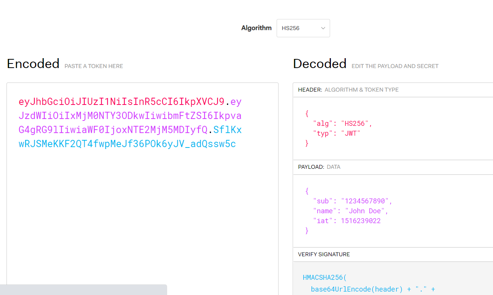

# 08-鉴权-3-JWT

## 一 JWT 简介

JWT (Json Web Token) 是目前非常流行的鉴权方案。官网地址为：<https://jwt.io/>

相对于 session 方案， JWT 会生成一个 token 而不是 session_id，token 中保存了一定的用户信息，一般是用户的 id、权限等，服务端接收到 token 后进行解密即可知道用户信息。

与 session 方案不同的是：由于 token 中已经存储了用户真实信息，所以后端无需存储 token，只需要每次请求解析 toke 那几科。 JWT 的理念是直接将状态放在前端，至于说在前端用 cookie 保存还是 localStorage 保存还是其它的手段保存都不重要。

在官网中，可以看到 JWT 加密解密的结果如下所示：



解析上图：

- Token：即左侧区域内容，是按照指定的算法（图中是 hash256）生成的字符串。字符串的颜色分别对应右侧解密后的部分。
- Header：放置 JWT 的一些基本信息，如是哪个算法生成的
- Payload：称为载荷，也即数据，是真实的状态信息，一般用来存储用户 id、权限等
- Verify Signature：签名。根据 header、payload、加密算法、秘钥生成的签名。作用是让 token 无法被伪造，即使有心者可以修改 payload 中的 uid 为其自己的，但是 signature 无法修改，该部分生成的秘钥位于后端，前端是无法拿到的。

## 二 JWT 的使用

### 2.0 JWT 鉴权的流程

```txt
1、用户登录，发送用户信息给服务端，服务端据此制作Token并返回该Token给前端
2、前端接收到 Token 后，保存该 Token（存储于Cookie、localStorage均可）
3、后续每次请求，携带该 Token （请求头、Cookie中均可携带）
4、服务端每次收到请求，解密 Token，验证 Token 是否合法，合法则通过请求发返回资源。
```

JWT 的鉴权方式，非常适用于 无状态请求、第三方登录等场景。

### 2.1 Token 使用示例代码

第一次登陆时，根据前端发送的信息生成 token：

```js
const jwt = require('jsonwebtoken')
const secret = '&*&*(&(&(*^HKJG1'

app.post('/user/login', async (ctx, body) => {
  // 假设使用手机+验证码登录
  let uid = '' // 校验手机与验证码后获取到用户uid
  let username = 'Li' // 获取权限等级
  const token = jsonwebtoken.sign({ uid, username }, secret, {
    expiresIn: 60 * 60 * 24, // 授权时效24小时
  })
  ctx.body = { token }
})
```

后续前端发送的信息中携带 Token，这里 token 携带与 header 字段中：

```js
fetch('api/user/1', {
  headers: {
    Authorization: token,
  },
})
```

后续服务端对接口进行 token 校验：

```js
// 校验中间件
const checkToken = async (ctx, next) => {
  const { token = '' } = ctx.request.header
  try {
    const user = jsonwebtoken.verify(token, secret)
    ctx.state.user = user
  } catch (e) {
    ctx.throw(401, '没有权限')
  }
  await next()
}

// 路由使用
router.get('/news/list', checkToken, listNews)
```
