# 02-并发模型-3-非阻塞 IO

## 一 Unix 内核中的 I/O 模型

### 1.0 I/O 模型概述

在操作系统中，内核对于 I/O 只有**两**种操作方式：

- **阻塞调用**：在调用阻塞 I/O 时，应用程序需要等待 I/O 完成后才返回结果
- **非阻塞调用**：在调用非阻塞 I/O 时，应用程序无需等待 I/O 完成，可以立即返回，可以明显提升性能。

非阻塞 I/O 立即返回后，CPU 的时间片就用可以用来处理其他事务，性能提升明显，但是也带来了新的问题：立即返回的结果并不是业务期望的数据。为了获得完整的数据，应用程序需要不断的通过重复调用 I/O 操作来确认是否完成（轮询），最终拿到期望数据。

所以阻塞调用和非阻塞调用多有其不完美的地方，前者浪费了 CPU 资源，后者的轮询也造成了 CPU 的损耗。

**千万注意**：异步 I/O 与非阻塞 I/O 并不是完全相等的概念。

### 1.1 阻塞 I/O

阻塞 I/O 是最传统的一种 IO 模型，即在读写数据过程中会发生阻塞现象，其特点是调用之后一定要等到系统内核层面完成所有操作，调用才结束。

当用户线程发出 IO 请求之后，内核会去查看数据是否就绪，如果没有就绪就会等待数据就绪，而用户线程就会处于阻塞状态，用户线程交出 CPU。当数据就绪之后，内核会将数据拷贝到用户线程，并返回结果给用户线程，用户线程才解除 block 状态。

典型的阻塞 IO 模型的例子为：

```c
    data = socket.read();
```

如果数据没有就绪，就会一直阻塞在 read()方法。

### 1.2 非阻塞 I/O

当用户线程发起一个 read 操作后，并不需要等待，而是马上就得到了一个结果。如果结果是一个 error 时，它就知道数据还没有准备好，于是它可以再次发送 read 操作。一旦内核中的数据准备好了，并且又再次收到了用户线程的请求，那么它马上就将数据拷贝到了用户线程，然后返回。

所以事实上，在非阻塞 IO 模型中，用户线程需要不断地询问内核数据是否就绪，也就说非阻塞 IO 不会交出 CPU，而会一直占用 CPU，典型的非阻塞 IO 模型一般如下：

```c
    while(true){ 
        data = socket.read(); 
        if(data!= error){ 
            // 处理数据 
            break; 
        } 
    } 
```

但是对于非阻塞 IO 就有一个非常严重的问题，在 while 循环中需要不断地去询问内核数据是否就绪，这样会导致 CPU 占用率非常高，因此一般情况下很少使用 while 循环这种方式来读取数据。

## 二 非阻塞 I/O 中轮询技术的发展

### 2.1 read

read 是最原始、性能最低的轮询方式。通过重复调用检查 I/O 的状态来完成数据的完整读取，在完整读取前，CPU 一直耗用在等待上，如图所示：



### 2.2 select 多路复用

select 是在 read 基础上的改进方案，通过对文件描述符上的事件状态来进行判断，即 select 采用了一个 1024 长度的数组来存储状态，如图所示：



贴士：由于 select 数组的限制，也导致 select 最多只能同时检查 1024 个文件描述符。

多路复用 IO 模型是目前使用得比较多的模型，如 Java 的 NIO。在多路复用 IO 模型中，会有一个线程不断去轮询多个 socket 的状态，只有当 socket 真正有读写事件时，才真正调用实际的 IO 读写操作。因为在多路复用 IO 模型中，只需要使用一个线程就可以管理多个 socket，系统不需要建立新的进程或者线程，也不必维护这些线程和进程，并且只有在真正有 socket 读写事件进行时，才会使用 IO 资源，所以它大大减少了资源占用。

在 Java NIO 中，是通过 selector.select()去查询每个通道是否有到达事件，如果没有事件，则一直阻塞在那里，因此这种方式会导致用户线程的阻塞。

采用 多线程+ 阻塞 IO 也能达到类似的效果，但是此时每个 socket 对应一个线程，这样会造成很大的资源占用，并且尤其是对于长连接来说，线程的资源一直不会释放，如果后面陆续有很多连接的话，就会造成性能上的瓶颈。而多路复用 IO 模式，通过一个线程就可以管理多个 socket，只有当 socket 真正有读写事件发生才会占用资源来进行实际的读写操作。因此，多路复用 IO 比较适合连接数比较多的情况。

另外多路复用 IO 为何比非阻塞 IO 模型的效率高是因为在非阻塞 IO 中，不断地询问 socket 状态是通过用户线程去进行的，而在多路复用 IO 中，轮询每个 socket 状态是内核在进行的，这个效率要比用户线程要高的多。

不过要注意的是，多路复用 IO 模型是通过轮询的方式来检测是否有事件到达，并且对到达的事件逐一进行响应。因此对于多路复用 IO 模型来说，一旦事件响应体很大，那么就会导致后续的事件迟迟得不到处理，并且会影响新的事件轮询。

### 2.3 poll

poll 是 select 技术的改进，采用链表的方式避免数组长度限制。不过 poll 也能避免不需要的检查。如图所示：


poll 性能有所改善，但是在文件描述符较多时，poll 的性能仍然十分低下。

### 2.4 epoll

epoll 是 Linux 下效率最高的 I/O 事件通知机制，在进入轮询时，如果没有检查到 I/O 事件，将会进行休眠，直到事件发生将它唤醒。epoll 真正利用了事件通知机制、执行回调方式，而不是遍历查询，所以不会浪费 CPU，执行效率很高。如图所示：


### 2.5 kqueue

kequeue 与 epoll 原理差不多，但是是 FreeBSD 系统上的实现。

### 2.6 总结

轮询技术满足了非阻塞 I/O 确保数据完整的需求，但是对于应用程序而言，仍然是一种同步，因为应用程序仍然在浪费时间等待 I/O 完全返回。在这等待期间，CPU 要么用于遍历文件描述符的状态，要么用于休眠等待时间发生，这都是不够友好的做法。

## 三 异步 I/O

### 3.0 异步 I/O 概念

异步 IO 模型是最理想的 IO 模型：当用户线程发起 read 操作之后，立刻就可以开始去做其它的事。而另一方面，从内核的角度，当它收到一个 asynchronous read 之后，它会立刻返回，说明 read 请求已经成功发起了，因此不会对用户线程产生任何 block。然后，内核会等待数据准备完成，接着将数据拷贝到用户线程，当这一切都完成之后，内核会给用户线程发送一个信号，告诉它 read 操作完成了。在此过程中用户线程完全不需要知道实际的整个 IO 操作是如何进行的，只需要先发起一个请求，当接收内核返回的成功信号时表示 IO 操作已经完成，可以直接去使用数据了。

在异步 IO 模型中，IO 操作的两个阶段都不会阻塞用户线程，这两个阶段都是由内核自动完成，然后发送一个信号告知用户线程操作已完成。用户线程中不需要再次调用 IO 函数进行具体的读写。这点是和信号驱动模型有所不同的，在信号驱动模型中，当用户线程接收到信号表示数据已经就绪，然后需要用户线程调用 IO 函数进行实际的读写操作；而在异步 IO 模型中，收到信号表示 IO 操作已经完成，不需要再在用户线程中调用 iO 函数进行实际的读写操作。

异步 IO 是需要操作系统的底层支持，在 Java 7 中，提供了 Asynchronous IO。也只有异步 IO 才真正的异步 IO，其他的 IO 模型都是同步 IO，因为无论是多路复用 IO 还是信号驱动模型，IO 操作的第 2 个阶段都会引起用户线程阻塞，也就是内核进行数据拷贝的过程都会让用户线程阻塞。

### 3.1 理想状态下

epoll 有效减少了轮询操作的消耗，但是休眠期间 CPU 几乎是闲置的，对当前线程来说，利用率明显不够。

理想状态下，异步 I/O 应该是：应用程序发起非阻塞调用，无需事件唤醒，直接就可以处理下一个任务。当 I/O 完成后，通过信号、回调函数将数据传递给应用程序即可。

如图所示：



该理想方式在 Linux 中已经实现，即 AIO，通过信号、回调传递回来数据，但是该方式仍然有缺陷：AIO 仅支持内核 I/O 中的 O_DIRECT 方式读取，无法利用系统缓存。

### 3.2 实际场景中的异步 I/O

可以通过线程池的方式来模拟，让部分线程进行阻塞 I/O 或者非阻塞 I/O 加轮询技术完成数据获取，让一个线程进行计算处理，通过线程之间的通信将 I/O 的带的数据进行传递，这样就可以模拟出异步 I/O。



现有的实现：

- glibc 的 AIO：使用典型线程池模拟异步 I/O
- libeio：lubev 作者实现的异步 I/O 库，依然使用线程池与阻塞 I/O 模拟异步 I/O
- IOCP：Windows 中的异步方案，无需轮询，I/O 完成后会进行通知，执行回调，也是使用线程池实现，但是线程池由内核管理。

## 四 杰出代表 Node.js

Node.js 是在 v8 引擎基础上开发的 javascript 运行时，为 javascript 提供了模块化、文件 IO、Socket 编程等支持。其架构如图所示：


他们分别是：

- Node.js 标准库，这部分是由 Javascript 编写的，即我们使用过程中直接能调用的 API。在源码中的 lib 目录下可以看到。
- Node bindings，这一层是 Javascript 与底层 C/C++ 能够沟通的关键，前者通过 bindings 调用后者，相互交换数据。实现在 node.cc
- 这一层是支撑 Node.js 运行的关键，由 C/C++ 实现。
  - V8：Google 推出的 Javascript VM，也是 Node.js 为什么使用的是 Javascript 的关键，它为 Javascript 提供了在非浏览器端运行的环境，它的高效是 Node.js 之所以高效的原因之一。
  - Libuv：它为 Node.js 提供了跨平台，线程池，事件池，异步 I/O 等能力，是 Node.js 如此强大的关键。
  - C-ares：提供了异步处理 DNS 相关的能力。
  - http_parser、OpenSSL、zlib 等：提供包括 http 解析、SSL、数据压缩等其他的能力。

一个基础的 node http web server：

```js
const http = require('http')

http
  .createServer((req, res) => {
    res.writeHeader(200, { 'Content-Type': 'text/plain' })
    res.write('Hello world!')
    res.end()
  })
  .listen(9000)
```

Node.js 的 http 模型：  


Node 中的事件驱动：Event Loop is a programming construct that waits for and dispatches events or messages in a program

- 1、每个 Node.js 进程只有一个主线程在执行程序代码，形成一个执行栈（execution context stack)。
- 2、主线程之外，还维护了一个"事件队列"（Event queue）。当用户的网络请求或者其它的异步操作到来时，node 都会把它放到 Event Queue 之中，此时并不会立即执行它，代码也不会被阻塞，继续往下走，直到主线程代码执行完毕。
- 3、主线程代码执行完毕完成后，然后通过 Event Loop，也就是事件循环机制，开始到 Event Queue 的开头取出第一个事件，从线程池中分配一个线程去执行这个事件，接下来继续取出第二个事件，再从线程池中分配一个线程去执行，然后第三个，第四个。主线程不断的检查事件队列中是否有未执行的事件，直到事件队列中所有事件都执行完了，此后每当有新的事件加入到事件队列中，都会通知主线程按顺序取出交 EventLoop 处理。当有事件执行完毕后，会通知主线程，主线程执行回调，线程归还给线程池。
- 4、主线程不断重复上面的第三步。

## 五 深入理解进程阻塞

进程间的通信时通过 send() 和 receive() 两种基本操作完成的。具体如何实现这两种基础操作，存在着不同的设计：

> 消息的传递有可能是**阻塞的**或**非阻塞的**，也被称为**同步**或**异步**的。----《操作系统概论》

- 阻塞式发送：blocking send，发送方进程会被一直阻塞，直到消息被接受方进程收到
- 非阻塞式发送：nonblocking send），发送方进程调用 send() 后，立即就可以其他操作
- 阻塞式接收：blocking receive，接收方调用 receive() 后一直阻塞，直到消息到达可用
- 非阻塞式接受：nonblocking receive，接收方调用 receive() 函数后，要么得到一个有效的结果，要么得到一个空值，即不会被阻塞。

上述不同类型的发送方式和不同类型的接收方式，可以自由组合，即从进程级通信的维度讨论时， 阻塞和同步（非阻塞和异步）就是一对同义词， 且需要针对发送方和接收方作区分对待。

概念解释：

- 中断（interrupt）：CPU 微处理器有一个中断信号位， 在每个 CPU 时钟周期的末尾, CPU 会去检测那个中断信号位是否有中断信号到达， 如果有，则会根据中断优先级决定是否要暂停当前执行的指令， 转而去执行处理中断的指令。 （其实就是 CPU 层级的 while 轮询）
- 时钟中断( Clock Interrupt )：一个硬件时钟会每隔一段（很短）的时间就产生一个中断信号发送给 CPU，CPU 在响应这个中断时， 就会去执行操作系统内核的指令， 继而将 CPU 的控制权转移给了操作系统内核， 可以由操作系统内核决定下一个要被执行的指令。
- 系统调用（system call）：system call 是操作系统提供给应用程序的接口。 用户通过调用 systemcall 来完成那些需要操作系统内核进行的操作， 例如硬盘， 网络接口设备的读写等。

进程在从用户空间切换到内核空间，需要以下步骤：

- 1.当一个程序正在执行的过程中， 中断（interrupt） 或 系统调用（system call） 发生可以使得 CPU 的控制权会从当前进程转移到操作系统内核。
- 2.操作系统内核负责保存进程 i 在 CPU 中的上下文（程序计数器，寄存器）到 PCB$_i$（操作系统分配给进程的一个内存块）中
- 3.从 PCB$_j$取出进程 j 的 CPU 上下文， 将 CPU 控制权转移给进程 j ， 开始执行进程 j 的指令。

操作系统在进行进切换时，需要进行一系列的内存读写操作， 这带来了一定的开销：对于一个运行着 UNIX 系统的现代 PC 来说， 进程切换至少需要花费 300 us 的时间。我们所说的 “阻塞”是指进程在发起了一个系统调用（System Call） 后，由于该系统调用的操作不能立即完成，需要等待一段时间，于是内核将进程挂起为**等待 （waiting）**状态， 以确保它不会被调度执行， 占用 CPU 资源。

综上所述，**阻塞和非阻塞描述的是进程的一个操作是否会使得进程转变为“等待”的状态**，又因为阻塞这个词是与系统调用 System Call 紧紧联系在一起的， 因为要让一个进程进入 等待（waiting） 的状态，要么是它主动调用 wait() 或 sleep() 等挂起自己的操作，要么是它调用 System Call， 而 System Call 因为涉及到了 I/O 操作，不能立即完成，于是内核就会先将该进程置为等待状态，调度其他进程的运行，等到它所请求的 I/O 操作完成了以后，再将其状态更改回 ready 。

操作系统内核在执行 System Call 时， CPU 需要与 IO 设备完成一系列物理通信上的交互， 其实再一次会涉及到阻塞和非阻塞的问题， 例如， 操作系统发起了一个读硬盘的请求后， 其实是向硬盘设备通过总线发出了一个请求，它即可以阻塞式地等待 IO 设备的返回结果，也可以非阻塞式的继续其他的操作。 在现代计算机中，这些物理通信操作基本都是异步完成的， 即发出请求后， 等待 I/O 设备的中断信号后， 再来读取相应的设备缓冲区。 但是，大部分操作系统默认为用户级应用程序提供的都是阻塞式的系统调用 （blocking systemcall）接口， 因为阻塞式的调用，使得应用级代码的编写更容易（代码的执!行顺序和编写顺序是一致的）。

但同样，现在的大部分操作系统也会提供非阻塞 I/O 系统调用接口（Nonblocking I/O system call）。 一个非阻塞调用不会挂起调用程序， 而是会立即返回一个值，表示有多少 bytes 的数据被成功读取（或写入）。

非阻塞 I/O 系统调用( nonblocking system call )的另一个替代品是 异步 I/O 系统调用 （asychronous system call）。 与非阻塞 I/O 系统调用类似，asychronous system call 也是会立即返回， 不会等待 I/O 操作的完成， 应用程序可以继续执行其他的操作， 等到 I/O 操作完成了以后，操作系统会通知调用进程（设置一个用户空间特殊的变量值 或者 触发一个 signal 或者 产生一个软中断 或者 调用应用程序的回调函数）。

非阻塞 I/O 系统调用( nonblocking system call ) 和 **异步 I/O 系统调用 （asychronous system call）**的区别是：

- 一个非阻塞 I/O 系统调用 read() 操作立即返回的是任何可以立即拿到的数据， 可以是完整的结果， 也可以是不完整的结果， 还可以是一个空值。
- 异步 I/O 系统调用 read（）结果必须是完整的，但是这个操作完成的通知可以延迟到将来的一个时间点。

总结：

- 阻塞/非阻塞， 同步/异步的概念要注意讨论的上下文
  - 在进程通信层面， 阻塞/非阻塞， 同步/异步基本是同义词， 但是需要注意区分讨论的对象是发送方还是接收方，发送方阻塞/非阻塞（同步/异步）和接收方的阻塞/非阻塞（同步/异步） 是互不影响的。
  - 在 IO 系统调用层面（ IO system call ）层面， 非阻塞 IO 系统调用 和 异步 IO 系统调用存在着一定的差别， 它们都不会阻塞进程， 但是返回结果的方式和内容有所差别， 但是都属于非阻塞系统调用（ non-blocing system call ）
- 阻塞系统调用（non-blocking I/O system call 与 asynchronous I/O system call） 的存在可以用来实现线程级别的 I/O 并发， 与通过多进程实现的 I/O 并发相比可以减少内存消耗以及进程切换的开销。
