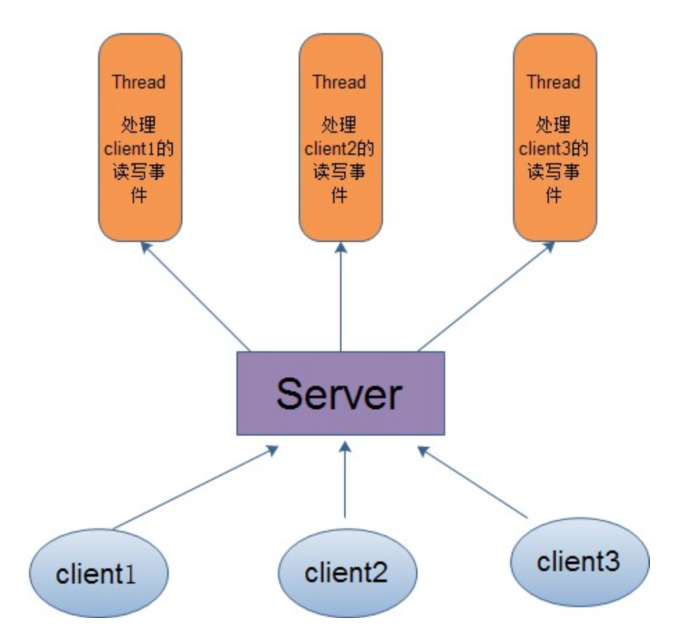

# 03-并发模型对比

## 一 高性能 I/O 设计模式

### 1.1 多进程

每到达一个请求， 们为这个请求新创建一个进程来处理。这样，一个进程在等待 IO 时，其他的进程可以被调度执行，更加充分地利用 CPU 等资源。但是每新创建一个进程都会消耗一定的内存空间，且进程切换也会有时间消耗，高并发时，大量进程来回切换的时间开销会变得明显起来。

### 1.2 多线程模式

在传统的网络服务设计模式中，有两种比较经典的模式：一种是 多线程，一种是线程池。

对于多线程模式，也就说来了 client，服务器就会新建一个线程来处理该 client 的读写事件，如下图所示：

这种模式虽然处理起来简单方便，但是由于服务器为每个 client 的连接都采用一个线程去处理，使得资源占用非常大。因此，当连接数量达到上限时，再有用户请求连接，直接会导致资源瓶颈，严重的可能会直接导致服务器崩溃。

### 1.3 线程池模式

为了解决这种一个线程对应一个客户端模式带来的问题，提出了采用线程池的方式，也就说创建一个固定大小的线程池，来一个客户端，就从线程池取一个空闲线程来处理，当客户端处理完读写操作之后，就交出对线程的占用。因此这样就避免为每一个客户端都要创建线程带来的资源浪费，使得线程可以重用。

### 1.4 Reactor 模式

在 Reactor 模式中，会先对每个 client 注册感兴趣的事件，然后有一个线程专门去轮询每个 client 是否有事件发生，当有事件发生时，便顺序处理每个事件，当所有事件处理完之后，便再转去继续轮询，如下图所示：

从这里可以看出，上面的五种 IO 模型中的多路复用 IO 就是采用 Reactor 模式。注意，上面的图中展示的 是顺序处理每个事件，当然为了提高事件处理速度，可以通过多线程或者线程池的方式来处理事件。

### 1.5 Proactor 模式

在 Proactor 模式中，当检测到有事件发生时，会新起一个异步操作，然后交由内核线程去处理，当内核线程完成 IO 操作之后，发送一个通知告知操作已完成，可以得知，异步 IO 模型采用的就是 Proactor 模式。

### 1.6 总结

交换数据方式：

- 多进程交换数据方式复杂（管道、消息队列、信号量、共享内存）
- 多线程之间交换数据很简单，但会产生竞态条件，需要解决同步问题

综合而言，多线程方式具备大量优势，但是在处理信号、同时运行多套不同程序以及包含多个需要超大内存支持的任务等，多进程方式更适合，而协程和非阻塞 IO 则更能充分的提升程序的运行效率。

## 二 线程不一定比进程轻量

理论上，线程之间共享内存，创建新线程的时候不需要创建真正的虚拟内存空间，也不需要 MMU（内存管理单元）上下文切换。此外，线程间通信比进程之间通信更加简单，主要是因为线程之间有共享内存，而进程通信往往需要利用各种模式的 IPC（进程间通信），如信号量，消息队列，管道等。

但是在多处理器操作系统中，线程并不一定比进程更高效：例如 Linux 就是不区分线程和进程的，两者在 Linux 都被称作任务（task）。每个任务在 cloned 的时候都有一个介于最小到最大之间的共享级别。

- 调用 fork() 创建任务时，创建的是一个没有共享文件描述符，PID 和内存空间的新任务。而调用 pthread_create() 创建任务时，创建的任务将包含上述所有共享资源。
- 线程之间保持共享内存与多核的 L1 缓存中的数据同步，与在隔离内存中运行不同的进程相比，需要付出更加大的代价。

## 三 线程的改进方向

线程变慢的主要三个原因：

- 线程自身有一个很大的堆（≥ 1MB）占用了大量内存，如果一下创建 1000 个线程意味着需要 1GB 的内存！！！！！
- 线程需要重复存储许多寄存器，其中一些包括 AVX（高级向量扩展），SSE（流式 SIMD 外设），浮点寄存器，程序计数器（PC），堆栈指针（SP），这会降低应用程序性能。
- 线程创建和消除需要调用操作系统以获取资源（例如内存），而这一操作相对是比较慢的。

## 四 goroutine

Goroutines 是在 Golang 中执行并发任务的方式，不过要切记：

> Goroutines 仅存在于 Go 运行时而不存在于 OS 中，因此需要 Go 调度器（GoRuntimeScheduler） 来管理它们的生命周期。

Go 运行时为此维护了三个 C 结构（<https://golang.org/src/runtime/runtime2.go>）：

- G 结构：表示单个 Goroutine，包含跟踪其堆栈和当前状态所需的对象。还包含自己负责的代码的引用。
- M 结构：表示 OS 线程。包含一些对象指针，例如全局可执行的 Goroutines 队列，当前运行的 Goroutine，它自己的缓存以及对 Go 调度器的引用。
- P 结构：也做 Sched 结构，它是一个单一的全局对象，用于跟踪 Goroutine 和 M 的不同队列以及调度程序运行时需要的其他一些信息，例如单一全局互斥锁（Global Sched Lock）。

G 结构主要存在于两种队列之中，一个是 M （线程）可以找到任务的可执行队列，另外一个是一个空闲的 Goroutine 列表。调度程序维护的 M（执行线程）只能每次关联其中一个队列。为了维护这两种队列并进行切换，就必须维持单一全局互斥锁（Global Sched Lock）。

因此，在启动时，go 运行空间会为 GC，调度程序和用户代码启动许多 Goroutine。并创建 OS 线程来处理这些 Goroutine。不过创建的线程数量最多可以等于 GOMAXPROCS（默认为 1，但为了获得最佳性能，通常设置为计算机上的处理器数量）。

## 五 协程对比线程的改进

为了使运行时的堆栈更小，go 在运行期间使用了大小可调整的有限堆栈，并且初始大小只有 2KB/goroutine。新的 Goroutine 通常会分配几 kb 的空间，这几乎总是足够的。如果不够的话，运行空间还能自动增长（或者缩小）内存来实现堆栈的管理，从而让大部分 Goroutine 存在于适量的内存中。每个函数调用的平均 CPU 开销大概是三个简单指令。因此在同一地址空间中创建数十万个 Goroutine 是切实可行的。但是如果 Goroutine 是线程的话，系统资源将很快被消耗完。

## 六 协程阻塞

当 Goroutine 进行阻塞调用时，例如通过调用阻塞的系统调用，这时调用的线程必须阻塞，go 的运行空间会操作自动将同一操作系统线程上的其他 Goroutine，将它们移动到从调度程序（Sched Struct）的线程队列中取出的另一个可运行的线程上，所以这些 Goroutine 不会被阻塞。因此，运行空间应至少创建一个线程，以继续执行不在阻塞调用中的其他 Goroutine。 而且关键的是程序员是看不到这一点的。结论是，我们称之为 Goroutines 的事物，可以是很低廉的：它们在堆栈的内存之外几乎没有开销，而内存中也只有几千字节。

Go 协程也可以很好地扩展。

但是，如果你使用只存在于 Go 的虚拟空间的 channels 进行通信（产生阻塞时），操作系统将不会阻塞该线程。 只是让该 Goroutine 进入等待状态，并安排另一个可运行的 Goroutine（来自 M 结构关联的可执行队列）它的位置。

## 七 Go Runtime Scheduler

Go Runtime Scheduler 跟踪记录每个 Goroutine，并安排它们依次地在进程的线程池中运行。

Go Runtime Scheduler 执行协作调度，这意味着只有在当前 Goroutine 阻塞或完成时才会调度另一个 Goroutine，这通过代码可以轻松完成。这里有些例子：

- 调用系统调用如文件或网络操作阻塞时
- 因为垃圾收集被停止后

这样比定时阻塞并调度新线程的抢占式调度要好得多，因为当线程数量增加，或者当高优先级任务将被调度运行时，有低优先级的任务已经在运行了（此时低优先级队列将被阻塞），定时抢占调度可能导致某些任务完成花费的时间大大超过实际所需时间。

另一个优点是，因为 Goroutine 在代码中隐式调用的，例如在睡眠或 channel 等待期间，编译只需要安全地恢复在这些时刻处存活的寄存器。在 Go 中，这意味着在上下文切换期间仅更新 3 个寄存器，即 PC，SP 和 DX（数据寄存器） 而不是所有寄存器（例如 AVX，浮点，MMX）。

## 八 goroutine 与 coroutine

C#、 Lua、 Python 语言都支持协程 coroutine（Java 也有一些第三方库支持）。

coroutine 与 goroutine 都可以将函数或者语句在独立的环境中运行，但是它们之间有两点不同：

- goroutine 可能发生并行执行，coroutine 始终顺序执行
- goroutine 使用 channel 通信，coroutine 使用 yield 和 resume

> coroutine 程序需要主动交出控制权，宿主才能获得控制权并将控制权交给其他 coroutine

coroutine 的运行机制属于协作式任务处理。在早期的操作系统中，应用程序在不需要使用 CPU 时，会主动交出 CPU 使用权。如果开发者故意让应用程序长时间占用 CPU，操作系统也无能为力。coroutine 始终发生在单线程。

> goroutine 可能发生在多线程环境下， goroutine 无法控制自己获取高优先度支持

goroutine 属于抢占式任务处理，和现有的多线程和多进程任务处理非常类似。应用程序对 CPU 的控制最终还需要由操作系统来管理，操作系统如果发现一个应用程序长时间大量地占用 CPU，那么用户有权终止这个任务。

## 九 Go 协程总结

Go 协程的特点：

- 有独立的栈空间
- 共享程序堆空间
- 调度由用户控制

注意：

- Go 程序在启动时，就会为 main 函数创建一个默认的 goroutine，也就是入口函数 main 本身也是一个协程
- 如果主线程退出了，则协程即使还没有执行完毕也退出

单纯的将函数并发执行是没有意义的，函数与函数之间必须能够交换数据才能体现并发执行函数的意义。为了实现数据的通信，有两种常见并发模型：

- 共享数据：一般使用共享内存方式来共享数据，Go 中的实现方式为互斥锁（sync 包）。
- 消息：消息机制认为每个并发单元都是独立个体，拥有自己的变量。不同的并发单元之间不共享各自的变量，只通过消息来进行数据输入输出，Go 中的实现方式为 channle。

在 Go 中对上述两种方式都进行了实现，但是 Go 不推荐共享数据方式，推荐 channel 的方式进行协程通信。因为多个 goroutine 为了争抢数据，容易发生竞态问题，会造成执行的低效率，使用队列的方式是最高效的， channel 就是一种队列一样的结构。

如图所示：

channel 特性：

- channel 的本质是一个数据结构-队列，先进先出
- channel 是线程安全的，多 goroutine 访问时，不需要加锁，因为在任何时候，同时只能有一个 goroutine 访问通道。
- channel 拥有类型，一个 string 的 channle 只能存放 string 类型数据

golang 奉行通过通信来共享内存，而不是通过共享内存来通信。
