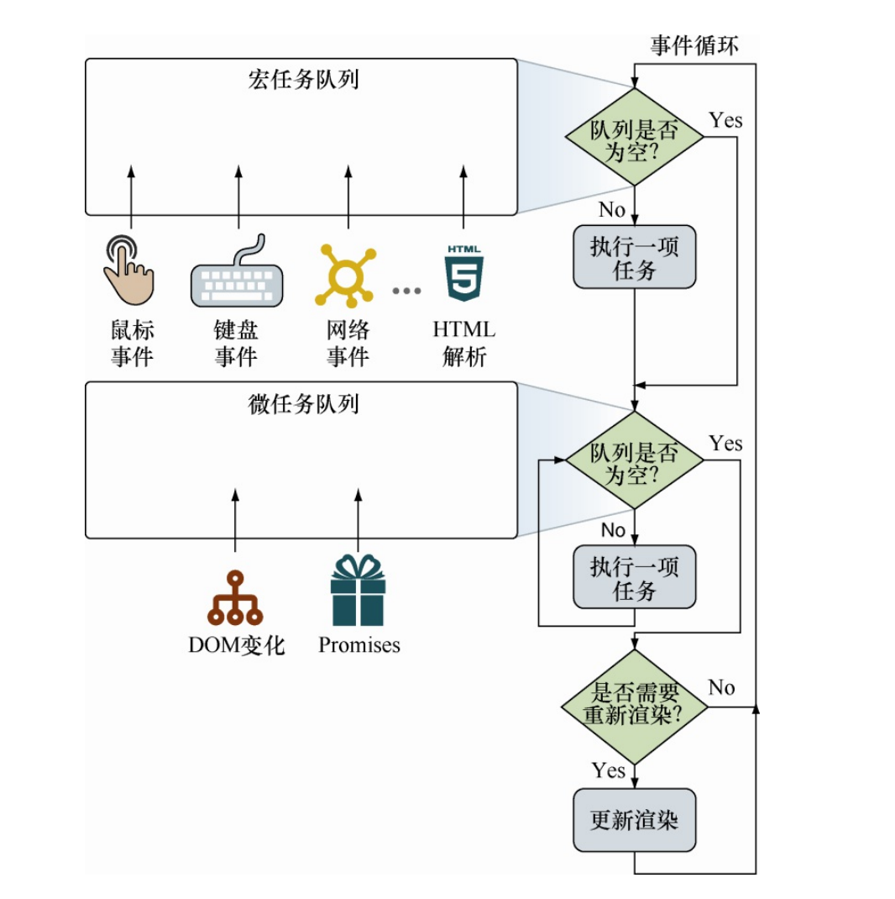
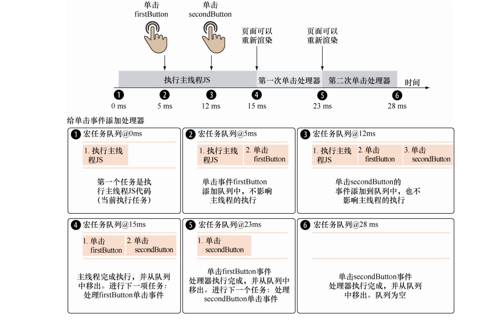
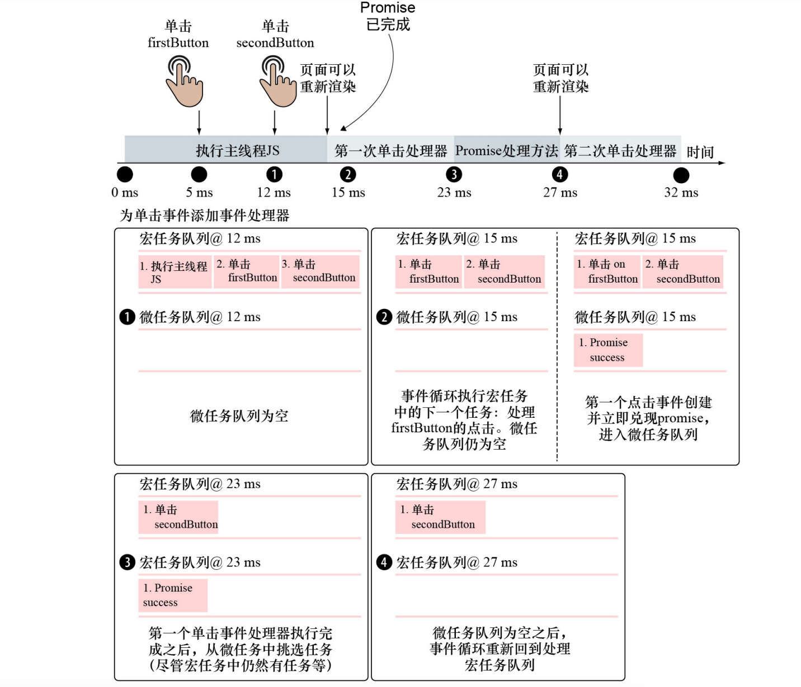

# 03.1-事件循环-浏览器事件循环

## 一 JavaScript 的运行时

### 1.1 运行时特点简介

在多线程开发中，创建线程、执行线程上下文切换会产生巨大开销。多线程编程也需要应对锁、同步等问题，开发时的心智负担较大。

JavaScript 在浏览器、Node 这两个运行时中都采用了单线程异步 I/O 模型，可以避免上述缺点的同时，也能实现较大并发。当然这也带来了缺点：无法利用多核 CPU。

不过要注意的是：浏览器和 Node 这两个运行时都不是单纯的单线程环境。

浏览器内部存在很多线程，最重要的线程是：JS 解析线程、UI 绘制线程，二者不能同时运行，因为二者如果操作同一个 DOM 则会出现渲染的异常。

同样，Node 在使用单线程运行 JS 时，其内部完成 I/O 任务则是依赖一个线程池（在 Linux 中，Node 的异步是靠着 libuv 库实现的，在 Windows 中，则依赖于 IOCP 实现）。

阻塞/非阻塞，同步异步简单理解：

```txt
阻塞与非阻塞：多用于调用方。
    客户端发起请求后，客户端可以等待（阻塞），也可以不等待（非阻塞）

同步与异步：多用于被调用方。
    客户端发起请求后，服务端可以使用同步的方式返回消息，也可以使用异步的方式返回消息。

所以：如果服务端采用异步方式返回消息，客户端既可以继续一直等待（阻塞），也可以选择执行其他任务（非阻塞）。
```

### 1.2 JavaScript 单线程模型原理

由于 JavaScript 的单线程模型设计，大量的任务如果都交给这一个线程处理，势必引起整个系统的卡顿。如：假设浏览器中的：DOM 解析、事件处理、UI 绘制、JS 脚本执行等任务都由一个线程负责，处理速度是难以想象的。

假设现在有三个任务：

```txt
任务 1：计算 1 + 1 的结果，假设耗时 1 秒
任务 2：控制台打印 hello world，假设耗时 2 秒
任务 3：向文件 demo.txt 内写入 hello world，假设耗时 5 秒
```

传统的思维中，单线程处理方式如下：


如果单线程只负责这些任务的调度，任务的具体执行交给其他具体的执行人，就会该线程拥有较大的自由度，如下所示，将任务 3 中的 I/O 交给磁盘自己处理：


从上图看出，任务三交给磁盘自己处理后，单线程的运行时间只需要 3 秒，极大缩短了线程的卡顿时间，但是这时候依然有问题需要处理：

- 磁盘处理完文件读写后，业务单线程如何知道读写结束？
- 线程全部任务处理完毕，运行结束，又来一个新的任务，这个线程又要重启一次（重启非常耗时）

我们可以让这个核心业务线程一直运行下去，并在任务调度时设计一个通知行为，让磁盘在完成 IO 后将结果通知给线程，这样就能完整的解决上述问题了，该调度系统我们可以简单的视为：事件循环，其解决机制如下：

- 使用死循环确保线程一直运行
- 将任务存储在队列中，线程从队列中取出进行调度
- 通过事件机制将被调度任务的处理结果通知给线程

如下所示：


线程从队列的队首中依次循环取出任务：

- 取出任务一，运算出结果
- 取出任务二，运算出结果
- 取出任务三，发现是耗时较长的 I/O，将该任务交给系统的 I/O 线程处理。

任务 3 处理如图：


总结：**事件循环的本质其实是：对 JS 脚本的调度方式。**

### 1.3 单线程模型问题

任务队列由于结构特性，必须先进先出（FIFO），可以保证任务的执行顺序不会发生变化。一般称任务队列中的任务为 **宏任务**，每完成一个任务才会从队列中取出下一个任务。

问题是：如果该宏任务比较耗时，队列也会被阻塞！我们当然想到让任务异步执行，通过事件通知方式回调即可解决这个问题，但是这样的后果是实时性变差，如果要实时监听界面中的 DOM 变化，这里就很难实现。为了权衡效率、实时性，新增了微任务。

每个宏任务中，都包含一个**微任务队列**。细粒度的任务可以加入微任务队列中，如果当前宏任务完成，引擎不会立即执行下一个宏任务，而是执行当前宏任务中的微任务。

## 二 浏览器中的事件循环

### 2.1 事件循环概念

异步事件对应的回调函数是在一个队列中完成执行的：

```js
console.log('aaa')

setTimeout(() => {
  console.log(111)
})

console.log('bbb')

setTimeout(() => {
  console.log(222)
})

console.log('ccc')

setTimeout(() => {
  console.log(333)
})

console.log('ddd')
```

其执行结果：

```txt
aaa
bbb
ccc
ddd
111
222
333
```

执行原理图：


注意：上述的定时器在栈中其实是直接执行了定时器本身，只有其回调函数才是等到**时间到了之后**进入回调队列！

浏览器由于其并发模型原因，也需要若干队列进行上述循环操作，如：事件队列、宏任务队列、微任务队列。

浏览器的事件循环（event loops）主要用来协调：事件（event，如 PostMessae、MutationObserver）、用户交互（user interaction）、脚本（script）、渲染（rendering）、网络（networking）。

### 2.2 宏任务与微任务

不同的任务会被分发到不同的队列中：宏任务、微任务。

> 宏任务（macro-task）：
> 宏任务代表一个个离散的、独立工作单元。运行完任务后，浏览器可以继续其他调度，如重新渲染页面的 UI 或执行垃圾回收。

宏任务主要包括：

- 定时器：setTimeout、setInterval、setImmediate（IE 浏览器 才拥有）
- 创建主文档对象、解析 HTML、执行主线（或全局）JavaScript 代码，
- 更改当前 URL 以及各种事件，如页面加载、 输入、网络事件

> 微任务（micro-task）：
> 微任务是更小的任务。用来更新应用程序的状态，但必须在浏览器任务（如：UI 重新渲染）继续执行其他任务之前执行，即优于宏任务

微任务主要包括：

- Promise
- DOM 变化
- MutationObserve、MessageChannel

微任务需要尽可能快地、通过异步方式执行，同时不能产生全新的微任务。微任务使得我们能够在重新渲染 UI 之前执行指定的行为，避免不必要的 UI 重
绘，UI 重绘会使应用程序的状态不连续。一般情况下微任务会优于宏任务执行，其具体执行规则是：先完全执行微任务队列，然后每执行一个宏任务，就会重新再去完全执行微任务队列：

```js
console.log('aaa')

// 宏任务
setTimeout(() => {
  console.log(111)
})

console.log('bbb')

// 微任务
Promise.resolve().then((data) => {
  console.log(222)
})

console.log('ccc')
```

执行结果：

```txt
aaa
bbb
ccc
222
111
```

其原理是：


那么如果二者进行了混合：

```js
console.log('aaa')

setTimeout(() => {
  console.log(222, '-t1')
  Promise.resolve().then((data) => {
    console.log(222, '-p1')
  })
})

console.log('bbb')

Promise.resolve().then((data) => {
  console.log(333, '-p2')
  setTimeout(() => {
    console.log(333, '-t2')
  })
})

console.log('ccc')
```

执行结果：

```txt
aaa
bbb
ccc
333 -p2
222 -t1
222 -p1
```

### 2.3 事件循环描述

事件循环即任务队列，其实现至少应该含有一个用于宏任务的队列和至少一个用于微任务的队列，这样可以保证事件循环能够根据任务类型进行优先处理。例如，优先考虑对性能敏感的任务，如用户输入在执行时，其顺序才真正决定了 JS 代码的输出结果顺序：

```txt
第一次循环：
    从 macro-task 中的 script 开始，全局上下文进入函数调用栈，此时如果遇到任务分发器，就会将任务放入对应队列
    调用栈清空只剩下全局上下文后，执行所有的 micro-task
    micro-task 全部执行结束后，第一次循环结束

第二次循环：
    再次从 macro-task 开始执行，
    此时 macro-task 中的 script 队列没有任务，但是可能会有其他的队列任务，而 micro-task 中暂时没有任务，
    此时会选择其中一个宏任务队列，如 setTimeout，将改对垒中所有任务全部执行完毕，再执行此过程中可能产生的微任务
    微任务执行完毕后，再回头执行其他宏任务队列中的任务
    依次类推，直到所有宏任务队列中的任务都被执行一遍，并清空了微任务，第二次循环结束

    如果在第二次循环中，产生了新的宏任务队列，或者之前的宏任务队列中的任务暂时没有满足执行条件，例如延迟时间不够或者事件没有触发，将会继续以同样的顺序重复循环。
```

事件循环基于两个基本原则：

- 一次处理一个任务。（
- 一个任务开始后直到运行完成，不会被其他任务中断。

即：两种队列在同一时刻都只执行一个任务!!

### 2.4 事件循环执行图



图中展示了在一次迭代中，事件循环将首先检查宏任务队列，如果宏任务等待，则立即开始执行宏任务。直到该任务运行完成（或者队列为空），事件循环将移动去处理微任务队列。如果有任务在该队列中等待，则事件循环将依次开始执行，完成一个后执行余下的微任务，直到队列中所有微任务执行完毕。注意处理宏任务和微任务队列之间的区别：单次循环迭代中，最多处理一个宏任务（其余的在队列中等待），而队列中的所有微任务都会被处理。

当微任务队列处理完成并清空时，事件循环会检查是否需要更新 UI 渲染，如果是，则会重新渲染 UI 视图。至此，当前事件循环结束，之后将回到最初第一个环节，再次检查宏任务队列，并开启新一轮的事件循环。

一些细节：

- 两类任务队列都是独立于事件循环的，这意味着任务队列的添加行为也发生在事件循环之外。如果不这样设计，则会导致在执行 JavaScript 代码时，发生的任何事件都将被忽略。正因为我们不希望看到这种情况，因此检测和添加任务的行为，是独立于事件循环完成的。
- 因为 JavaScript 基于单线程执行模型，所以这两类任务都是逐个执行的。当一个任务开始执行后，在完成前，中间不会被任何其他任务中断。除非浏览器决定中止执行该任务，例如，某个任务执行时间过长或内存占用过大。
- 所有微任务会在下一次渲染之前执行完成，因为它们的目标是在渲染前更新应用程序状态。
- 浏览器通常会尝试每秒渲染 60 次页面，以达到每秒 60 帧（60 fps）的速度。60fps 通常是检验体验是否平滑流畅的标准，比方在动画里——这意味着浏览器会尝试在 16ms 内渲染一帧。图中所示的“更新渲染”是如何发生在事件循环内的，因为在页面渲染时，任何任务都无法再进行修改。 这些设计和原则都意味着，如果想要实现平滑流畅的应用，我们是没有太多时间浪费在处理单个事件循环任务的。理想情况下，单个任务和该任务附属的所有微任务，都应在 16ms 内完成。

在浏览器完成页面渲染，进入下一轮事件循环迭代后，可能发生的 3 种情况：

- 在另一个 16ms 结束前，事件循环执行到“是否需要进行渲染”的决策环节。因为更新 UI 是一个复杂的操作，所以如果没有显式地指定需要页面渲染，浏览器可能不会选择在当前的循环中执行 UI 渲染操作。
- 在最后一次渲染完成后大约 16ms，事件循环执行到“是否需要进行渲染”的决策环节。在这种情况下，浏览器会进行 UI 更新，以便用户能够感受到顺畅的应用体验。
- 执行下一个任务（和相关的所有微任务）耗时超过 16ms。在这种情况下，浏览器将无法以目标帧率重新渲染页面，且 UI 无法被更新。如果任务代码的执行不耗费过多 的时间（不超过几百毫秒），这时的延迟甚至可能察觉不到，尤其当页面中没有太多的操作时。反之，如果耗时过多，或者页面上运行有动画时，用户可能会察觉到网页卡顿而不响应。在极端的情况下，如果任务的执行超过几秒，用户的浏览器将会提示“无响应脚本”的恼人信息。（复杂的任务分解需要为不阻塞事件循环的小任务）

## 三 宏任务、微任务示例

### 3.1 仅含宏任务的示例

JavaScript 单线程执行模型一种不可避免的结果是，同一时刻只能执行一个任务。这意味着所有任务都必须在队列中排队等待执行时机。

有如下代码：

```html
<button id="firstButton"></button>
<button id="secondButton"></button>

<script>
  const firstButton = document.getElementById('firstButton') const secondButton
  = document.getElementById('secondButton')
  firstButton.addEventListener('click', function firstHandler() {})
  secondButton.addEventListener('click', function secondHandler() {})
</script>
```

下图是只有宏任务的一个业务：界面中存在 2 个按钮并注册了对应点击事件，分别点击 2 个按钮，触发对应的按钮点击事件。粉色部分为宏任务队列内的任务：



程序从执行主线程 JavaScript 代码开始。立即从 DOM 获取 firstButton 和 secondButton 元素，并注册 firstHandler 和 secondHandler 事件处理器。主线程执行 15ms。在主线程执行过程中，用户在第 5ms 单击
firstButton，第 12ms 单击 secondButton。

由于 JavaScript 基于单线程执行模型，单击 firstButton 并不会立即执行对应的处理器。（记住，一个任务一旦开始执行，就不会被另一个任务中断）firstButton 的事件处理器则进入任务队列，等待执行。当单击
secondButton 时发生类似的情况：对应的事件处理器进入队列，等待执行。注意，事件监测和添加任务是独立于事件循环的，尽管主线程仍在执行，仍然可以向队列添加任务。

在任务队列第 12ms 的快照中，可以看到以下 3 个任务：

- 1．执行主线程 JavaScript 代码——当前执行任务。
- 2．单击 firstButton——当单击 firstButton 时，创建事件。
- 3．单击 secondButton——当单击 secondButton 时，创建事件。

在程序执行到第 12ms 时，任务队列中有 3 个任务：一个任务是执行主线程 JavaScript 代码，另外两个是按钮单击事件处理。接着在程序执行到 15ms 时，主线程 JavaScript 代码执行完成。任务执行完成后，事件循环转向处理微任务。本例中不存在微任务，则跳过此步骤直接更新 UI。

接着，firstButton 单击任务开始执行，执行 firstHandler，需要运行 8ms 且不被中断，secondButton 在队列中等待。

在第 23ms 时，firstButton 单击任务执行完成，对应的任务从任务队列中移除。浏览器又一次检查微任务队列，微任务仍为空，那
么，如果需要的话重新渲染页面。

最后，在第三次循环迭代中，secondButton 单击事件开始执行，secondHandler 需要执行 5ms，执行完成之后，在第 28ms 时，任务队列为空。

### 3.2 同时含有宏任务和微任务的示例

添加微任务队列。最简单的方式是在第一个按钮的单击处理器中加入 promise，添加 promise 兑现时的处理：

```js
firstButton.addEventListener('click', function firstHandler() {
  Promise.resolve().then(() => {
    /*Some promise handling code that runs for 4 ms*/
  })
})
```

假设发生以下行为：

- 第 5ms 单击 firstButton。
- 第 12ms 单击 secondButton。
- firstButton 的单击事件处理函数 firstHandler 需要执行 8ms。
- secondButton 的单击事件处理函数 secondHandler 需要执行 5ms。

与之前的示例唯一的区别是，在 firstHandler 代码中我们创建立即兑现的 promise，并需要运行 4ms 的传入回调函数。



如果微任务队列中含有微任务，不论队列中等待的其他任务，微任务都将获得优先执行权。在本例中，promise 微任务优先于 secondButton 单击任务开始执行

第 12ms 时程序运行快照，可以看到完全相同的任务队列：当主线程 JavaScript 代码正在处理中，单击 firstButton 和 secondButton 按钮这两个任务处于等待执行状态。但是，除了宏任务队列之外，本例重点关注微任务队列，在第 12ms 时微任务队列仍为空。

在第 15ms，此时主线程 JavaScript 代码运行结束。完成执行了一个任务时，事件循环会检查微任务队列，若微任务队列为空时，则按需进行渲染页面。为了简单起见，在时间轴中我们不显示渲染阶段。

在第 23ms 时重新查看程序执行的任务队列，此时 firstButton 单击处理器执行完成，并移出队列。在第一个按钮的单击处理器执行过程中，创建一个已兑现的 promise。在微任务队列中，出现一个在等待中的微任务，该微任务会尽可能快地被执行，但是不会中断当前正在运行中的任务

此时，事件循环必须选择接下来执行的任务。在程序执行的第 12ms 时，添加了一个宏任务处理 secondButton 单击事件；在程序执行的第 15ms 时，添加了一个微任务处理 promise 成功兑现。

如果按先后顺序，那么应该先执行 secondButton 单击事件才算公平，但是我们已经提到过，微任务是很小的任务，需要尽可能快地执行。微任务具有优先执行权，每当执行一个任务时，事件循环总是首先检查微任务队列，目的是在处理其他任务之前把所有的微任务执行完毕。正因如此，当 firstButton 单击事件执行完成之后，立即执行 promise 对象成功的回调函数，而更早在队列中等待的 secondButton 单击任务则继续等待。

注意：在宏任务开始执行后，事件循环立即执行微任务，而不需要等待页面渲染，直到微任务队列为空。在微任务处理完成之后，当且仅当微任务队列中没有正在等待中的
微任务，才可以重新渲染页面。

### 3.3 使用计时器处理耗时任务

在复杂应用开发中 JavaScript 单线程特性是最大的问题。当
JavaScript 忙于执行时，在浏览器上的用户交互会变得迟钝，甚至无响
应。由于当 JavaScript 执行时，重新渲染页面的更新都被暂停，浏览器将
会卡顿，看起来似乎处于假死状态。

减少所有需要几百毫秒的复杂操作，为了保持交互可用，有必要减
少到可控制的范围。若脚本执行超过 5s 仍未停止，大多数浏览器会弹出
警告对话框，提示用户脚本无响应，部分其他浏览器甚至会悄悄停止运
行超过 5s 的脚本。

这种情况下计时器非常有用。因为计时器能够有效地中止一段
JavaScript 的执行，直到一段时间之后，还可以把代码的各个部分分解成
片段，这些片段的执行消耗时间不足以导致浏览器挂起。考虑到这一
点，我们可以将循环和操作转化为非阻塞操作。

```js
const tbody = document.querySelector('tbody')
for (let i = 0; i < 20000; i++) {
  //  创建20 000行
  const tr = document.createElement('tr')
  for (let t = 0; t < 6; t++) {
    const td = document.createElement('td')
    td.appendChild(document.createTextNode(i + ',' + t))
    tr.appendChild(td)
  }
  tbody.appendChild(tr)
}
```

上述操作极度消耗性能，们可以引入定时器来进行切片：

```js
const rowCount = 20000 //初始化数据
const divideInto = 4
const chunkSize = rowCount / divideInto
let iteration = 0
const table = document.getElementsByTagName('tbody')[0]
setTimeout(function generateRows() {
  const base = chunkSize * iteration //计算上一次离开的地方
  for (let i = 0; i < chunkSize; i++) {
    const tr = document.createElement('tr')
    for (let t = 0; t < 6; t++) {
      const td = document.createElement('td')
      td.appendChild(
        document.createTextNode(i + base + ',' + t + ',' + iteration)
      )
      tr.appendChild(td)
    }
    table.appendChild(tr)
  }
  iteration++
  if (iteration < divideInto)
    //安排下一个阶段
    setTimeout(generateRows, 0)
}, 0) //将超时延迟设置为0来表示下一次迭代应该“尽快”执行，但仍然必须在UI更新之后执行
```

将冗长的操作分解成 4 个小操作，每个操作分别创建 DOM 节点。这些较小的操作不太可能打断浏览器的运行流，通过这种技术，从用户的角度可察觉的最显著的变化是，一个长时间的浏览器挂起，替代为 4 次（次数可修改）页面更新。尽管浏览器尝试尽可能快地执行代码片段，但仍然是依次执行 DOM 渲染。在这段代
码的初始版本中，页面更新需要等待很长时间。

大多数情况下，用户是察觉不到这种类型的更新的，可以极大改善用户体验。
