# 03.1-事件循环-浏览器事件循环

## 一 JavaScript 的运行时

### 1.1 运行时特点简介

在多线程开发中，创建线程、执行线程上下文切换会产生巨大开销。多线程编程也需要应对锁、同步等问题，开发时的心智负担较大。

JavaScript 在浏览器、Node 这两个运行时中都采用了单线程异步 I/O 模型，可以避免上述缺点的同时，也能实现较大并发。当然这也带来了缺点：无法利用多核 CPU。

不过要注意的是：浏览器和 Node 这两个运行时都不是单纯的单线程环境。

浏览器内部存在很多线程，最重要的线程是：JS 解析线程、UI 绘制线程，二者不能同时运行，因为二者如果操作同一个 DOM 则会出现渲染的异常。

同样，Node 在使用单线程运行 JS 时，其内部完成 I/O 任务则是依赖一个线程池（在 Linux 中，Node 的异步是靠着 libuv 库实现的，在 Windows 中，则依赖于 IOCP 实现）。

阻塞/非阻塞，同步异步简单理解：

```txt
阻塞与非阻塞：多用于调用方。
    客户端发起请求后，客户端可以等待（阻塞），也可以不等待（非阻塞）

同步与异步：多用于被调用方。
    客户端发起请求后，服务端可以使用同步的方式返回消息，也可以使用异步的方式返回消息。

所以：如果服务端采用异步方式返回消息，客户端既可以继续一直等待（阻塞），也可以选择执行其他任务（非阻塞）。
```

### 1.2 JavaScript 单线程模型原理

由于 JavaScript 的单线程模型设计，大量的任务如果都交给这一个线程处理，势必引起整个系统的卡顿。如：假设浏览器中的：DOM 解析、事件处理、UI 绘制、JS 脚本执行等任务都由一个线程负责，处理速度是难以想象的。

假设现在有三个任务：

```txt
任务 1：计算 1 + 1 的结果，假设耗时 1 秒
任务 2：控制台打印 hello world，假设耗时 2 秒
任务 3：向文件 demo.txt 内写入 hello world，假设耗时 5 秒
```

传统的思维中，单线程处理方式如下：



如果单线程只负责这些任务的调度，任务的具体执行交给其他具体的执行人，就会该线程拥有较大的自由度，如下所示，将任务 3 中的 I/O 交给磁盘自己处理：



从上图看出，任务三交给磁盘自己处理后，单线程的运行时间只需要 3 秒，极大缩短了线程的卡顿时间，但是这时候依然有问题需要处理：

- 磁盘处理完文件读写后，业务单线程如何知道读写结束？
- 线程全部任务处理完毕，运行结束，又来一个新的任务，这个线程又要重启一次（重启非常耗时）

我们可以让这个核心业务线程一直运行下去，并在任务调度时设计一个通知行为，让磁盘在完成 IO 后将结果通知给线程，这样就能完整的解决上述问题了，该调度系统我们可以简单的视为：事件循环，其解决机制如下：

- 使用死循环确保线程一直运行
- 将任务存储在队列中，线程从队列中取出进行调度
- 通过事件机制将被调度任务的处理结果通知给线程

如下所示：



线程从队列的队首中依次循环取出任务：

- 取出任务一，运算出结果
- 取出任务二，运算出结果
- 取出任务三，发现是耗时较长的 I/O，将该任务交给系统的 I/O 线程处理。

任务 3 处理如图：



总结：**事件循环的本质其实是：对 JS 脚本的调度方式。**

### 1.3 单线程模型问题

任务队列由于结构特性，必须先进先出（FIFO），可以保证任务的执行顺序不会发生变化。一般称任务队列中的任务为 **宏任务**，每完成一个任务才会从队列中取出下一个任务。

问题是：如果该宏任务比较耗时，队列也会被阻塞！我们当然想到让任务异步执行，通过事件通知方式回调即可解决这个问题，但是这样的后果是实时性变差，如果要实时监听界面中的 DOM 变化，这里就很难实现。为了权衡效率、实时性，新增了微任务。

每个宏任务中，都包含一个**微任务队列**。细粒度的任务可以加入微任务队列中，如果当前宏任务完成，引擎不会立即执行下一个宏任务，而是执行当前宏任务中的微任务。

## 二 浏览器中的事件循环

### 2.0 浏览器事件循环概念

浏览器的事件循环（event loops）主要用来协调：事件（event，如 PostMessae、MutationObserver）、用户交互（user interaction）、脚本（script）、渲染（rendering）、网络（networking）。

### 2.1 事件循环中的执行队列

异步事件对应的回调函数是在一个队列中完成执行的：

```js
console.log('aaa')

setTimeout(() => {
  console.log(111)
})

console.log('bbb')

setTimeout(() => {
  console.log(222)
})

console.log('ccc')

setTimeout(() => {
  console.log(333)
})

console.log('ddd')
```

其执行结果：

```txt
aaa
bbb
ccc
ddd
111
222
333
```

执行原理图：



注意：上述的定时器在栈中其实是直接执行了定时器本身，只有其回调函数才是等到**时间到了之后**进入回调队列！

### 2.2 宏任务与微任务

不同的任务会被分发到不同的队列中：

- 微任务（micro-task）：Promise、MutationObserve、MessageChannel
- 宏任务（macro-task）：setTimeout、setInterval、setImmediate（IE 浏览器 才拥有）、I/O

一般情况下微任务会优于宏任务执行，其具体执行规则是：先完全执行微任务队列，然后每执行一个宏任务，就会重新再去完全执行微任务队列：

```js
console.log('aaa')

// 宏任务
setTimeout(() => {
  console.log(111)
})

console.log('bbb')

// 微任务
Promise.resolve().then((data) => {
  console.log(222)
})

console.log('ccc')
```

执行结果：

```txt
aaa
bbb
ccc
222
111
```

其原理是：



那么如果二者进行了混合：

```js
console.log('aaa')

setTimeout(() => {
  console.log(222, '-t1')
  Promise.resolve().then((data) => {
    console.log(222, '-p1')
  })
})

console.log('bbb')

Promise.resolve().then((data) => {
  console.log(333, '-p2')
  setTimeout(() => {
    console.log(333, '-t2')
  })
})

console.log('ccc')
```

执行结果：

```txt
aaa
bbb
ccc
333 -p2
222 -t1
222 -p1
```

### 2.3 事件循环描述

事件循环即任务队列。在执行时，其顺序才真正决定了 JS 代码的输出结果顺序：

```txt
第一次循环：
    从 macro-task 中的 script 开始，全局上下文进入函数调用栈，此时如果遇到任务分发器，就会将任务放入对应队列
    调用栈清空只剩下全局上下文后，执行所有的 micro-task
    micro-task 全部执行结束后，第一次循环结束

第二次循环：
    再次从 macro-task 开始执行，
    此时 macro-task 中的 script 队列没有任务，但是可能会有其他的队列任务，而 micro-task 中暂时没有任务，
    此时会选择其中一个宏任务队列，如 setTimeout，将改对垒中所有任务全部执行完毕，再执行此过程中可能产生的微任务
    微任务执行完毕后，再回头执行其他宏任务队列中的任务
    依次类推，直到所有宏任务队列中的任务都被执行一遍，并清空了微任务，第二次循环结束

    如果在第二次循环中，产生了新的宏任务队列，或者之前的宏任务队列中的任务暂时没有满足执行条件，例如延迟时间不够或者事件没有触发，将会继续以同样的顺序重复循环。
```
