# 04.2-Node 的多进程-创建进程

## 一 Node 的进程管理

Node 由于单线程运行的原因，潜在的错误会导致线程崩溃，进程也随之退出。同时，单进程也无法充分利用当前多核 CPU。

Node 从 0.1 版本开始提供了 child_process 模块，提供多进程支持，并暴露了全局对象 process。

新建一个文件：worker.js

```js
let http = require('http')

http
  .createServer(function (req, res) {
    res.writeHead(200, { 'Content-Type': 'text/plian' })
    res.end('hello world\n')
  })
  .listen()
```

新建一个文件：master.js

```js
let child_process = require('child_process')
let os = require('os')

let cpuNum = os.cpus().length
console.log('当前 CPU 数量为：', cpuNum)

for (let i = 0; i < cpuNum; i++) {
  child_process.fork('./worker.js')
}
```

启动并查看 node 进程数量 (和 cpu 数量相等)：

```txt
node master.js

# 新开启一个命令行查看进程数
ps aux|grep worker.js
```

这时候 Node 就以多进程的方式启动了，这是著名的主从模式（Master-Worker），整个系统进程为了两部分：

- 主进程：不负责具体业务，而是负责调度和管理工作进程
- 工作进程：负责具体的业务处理



通过 fork() 复制的进程都是一个独立的进程，每个进程中都包含着一个独立、全新的 V8 实例，需要至少 30 毫秒启动时间，至少 10MB 的内存。

fork() 是非常消耗资源的，但是 Node 本身的单线程非阻塞 I/O 已经解决了大并发问题，fork() 的作用仅仅是为了充分利用 CPU，而不是像以前的高并发架构中描述的使用多进程应对并发。

## 二 child_process 模块

### 2.0 创建进程的方法

child_process 模块提供了四种创建子进程的方法：

- spawn()：启动一个子进程来执行命令
- exec()：与 spawn() 类似，但是该函数额外有一个回调函数可以获知子进程状况
- fork()：与 spawn() 类似，但是创建的紫禁城只需要执行指定的 JS 文件模块即可
- execFile()：启动一个子进程来执行可执行文件

四者在执行第一节中 worker 的代码分别如下：

```js
let cp = require('child_process')

cp.spwan('node', ['worker.js'])
cp.exec('node worker.js', function (err, stdout, stderr) {})
cp.execFile('worker.js', function (err, stdout, stderr) {})
cp.fork('./worker.js')
```

注意：

- exec，execFile、fork 基本都是借助于 spawn 方式实现的。
- exec()，execFile() 创建子进程时，可以指定子进程的运行时间（timeout）。
- execFile() 执行 JS 文件时，其首行内容必须添加：`#!/usr/bin/env node`

### 2.1 spawn 创建进程

spawn 会使用指定的 command 生成一个新的进程，执行完对应的 command 后子进程自动退出。

示例：

```js
let spawn = require('child_process').spawn

let ls = spawn('ls', ['-lh', '/usr']) // win 需要修改为： ("powershell",["dir"])

ls.stdout.on('data', function (data) {
  console.log('stdout:', data.toString())
})

ls.stderr.on('data', function (err) {
  console.log('stderr:', err.toString())
})

ls.on('close', function (code) {
  console.log('exited with code:', code)
})
```

### 2.2 fork 创建进程

在 Linux 环境中，创建一个新进程的本质是复制一个当前继承，用户调用 fork 后，操作系统会为该进程分配新的空间，然后将父进程的数据原样复制一份过去（除了少数值不复制，如进程标识符 PID）。

在 Node 环境中，fork 并不会复制父进程，父子进程都有独立的内存空间和 V8 实例，父子进程之间唯一联系是用来进程间通信的 IPC Channel。

fork 接收的第一个参数是文件名，相当于在命令行调用了`node **.js`，父子进程之间通过 process.send 通信。

fork 内部会通过 spawn 调用 process.executePath，即 node 可执行文件地址，生成一个 node 实例，然后用这个实例来执行 for 方法的 modulePath 参数。

master.js:

```js
let child_process = require('child_process')

let worker = child_process.fork('worker.js', ['args1'])

// 父进程向子进程发送信息
worker.send({
  hello: 'child',
})

worker.on('message', function (msg) {
  console.log('父进程接收的消息：', msg)
})

worker.on('exit', function () {
  console.log('child process exit')
})
```

worker.js:

```js
let begin = process.argv[2]
console.log('子进程启动：', begin)

// 子进程向父进程发送信息
process.send({
  hello: 'parent',
})

process.on('message', function (msg) {
  console.log('子进程接收的消息：', msg)
  process.exit()
})
```

注意：

- fork 创建的进程运行完成后不会自动退出，需要 process.exit()
- 这些派生的 node 进程是全新的 V8 实例，假设每个 node 进程大致需要至少 30 毫秒启动时间和 10M 内存，也就是说不能创建成百上千的实例。
- node 本身存在多个线程，但是运行在 V8 上的 JS 是单线程的。
- node 中的 exit 和 close 事件虽然都是退出、结束的意思，但是 exit 事件后，标准输入输出流仍然在开启，而 close 事件后是在一个子进程中所有的标准输入、输出流被终止时触发，因为多进程有时候会共享一个标准输入、输出流。
- 在 Node 中，正常退出时，退出码定义为 0，非正常为 1-3 之间的数字。

### 2.3 exec 和 execFile

在一个庞大的系统中，不同的模块可能使用不同的技术开发，比如 web 服务使用 Node 开发，消息队列使用 Java 开发，二者之间通信通常使用进程通信方式实现，但是有时候开发者认为该方式过于复杂，采用折中的方式，例如通过 shell 调用目标服务，拿到结果。

spawn、exec、execFile 都可以在 shell 中执行命令，运行文件：

- spawn：spawn 会调用系统的 shell 工具，使用流式处理方式，子进程产生数据时，主进程可以通过监听事件获取消息
- exec：exec 会根据当前环境初始化一个 shell 工具，将所有返回的信息放在 stdout 里一次性返回，如果返回的数据大小超过了 exec 方法参数 maxBuffer，报错
- execFile：execFile 是 exec 的内部实现方式，更底层，无须启动一个 shell，效率更高
