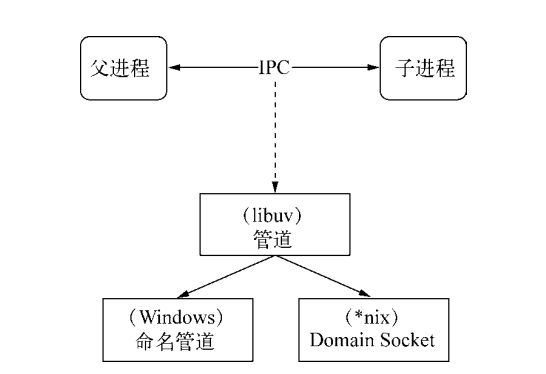
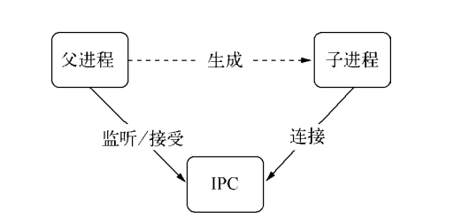
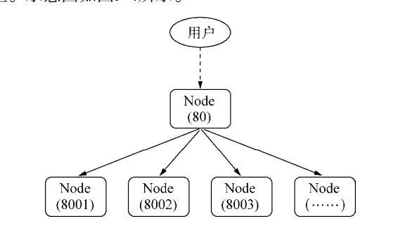
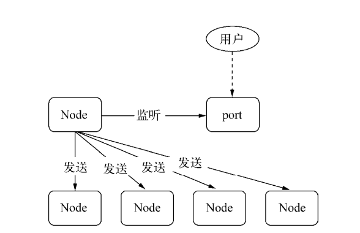
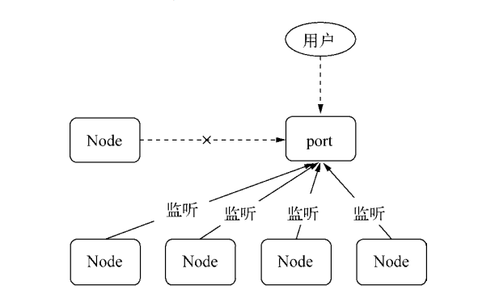

# 07-Node 的多进程 -2-进程间通信

## 一 Node 进程间通信演示

在 Master-Worker 模式中，如果要实现主进程管理和调度，就需要主进程与工作进程之间通信。HTML5 规范中，WebWorker 雷公了工作线程与主进程通信的方法，Node 与该方式相似。

创建 master.js：

```js
let cp = require('child_process')

let childP = cp.fork('./worker.js')

childP.on('message', function (msg) {
  console.log('master get：', msg)
})

childP.send({
  name: 'father',
})
```

创建 worker.js：

```js
process.on('message', function (msg) {
  console.log('worker get: ', msg)
})

process.send({
  name: 'child',
})
```

启动：

```txt
node master.js
```

## 二 进程间通信原理

进程间通信 Inter-Process Communication 简称 IPC。其目的是为了让不同的进程能够互相访问资源并进行协调工作。进程间通信的实现方式很多，如：命名管道、匿名管道、socket、信号量、共享内存、消息队列等。

Node 中进程间通信的实现依靠的是底层的 libuv 提供的一层类似管道的抽象，该抽象在 Linux 上采用 Unix Domain Socket 实现，在 Win 上通过命名管道实现。



父进程在实际创建子进程之前，会创建 IPC 通道并监听它，然后才真正创建出子进程，并通过环境变量（NODE_CHANNEL_FD）告诉子进程这个 IPC 通道的文件描述符。子进程在启动的过程中，根据文件描述符去连接这个已经存在的 IPC 通道，从而完成父子进程之间的连接：



建立连接之后的父子进程可以进行自由通信，因为 Node 使用的是 Domain Socket，与网络 Socket 非常相似，属于双向通信，而且是在内核中直接完成了进程间通信，无需网络层，非常高效。在 Node 中，IPC 通道被抽象为了 Stream 对象，调用 send() 时会发送数据（类似 write()），接收到的消息会通过 message 事件触发给应用层。

注意：子进程为 Node 进程时，子进程才能根据环境变量去连接 IPC 通道，进行通信，除非其他进程按照约定去连接这个已经创建好的 IPC 通道。

## 三 句柄传递

### 3.1 句柄概念

在 fork Node 的 web 服务进程时，并没有指定端口，一旦指定端口，将会出现只有一个工作进程能够正常监听端口，其他工作进程会抛出端口已被占用的错误，无法复制出子进程。

上述为问题的解决方式一般是：主进程监听主端口，负责接收所有的请求，然后再将这些请求分别代理到不同的端口的工作进程上。



这里会暴露一个问题：主进程每接收到一个连接，就会创建一个新的文件描述符，并将请求负载（代理）到某个工作进程，文件描述符在操作系统中是有限的（双倍浪费！）。Node 为了解决该问题，在 send() 方法中额外提供了第二个可选参数：句柄。

```js
child.send(message, [sendHandle])
```

句柄就是一种用来标识资源的引用，它的内部包含了指向对象的文件描述符，所以句柄可以用来标识一个服务端 socket 对象、一个 UDP 套接字、一个管道等。

在代理方案中，主进程接收到 socket 请求后，不再重新与工作进程之间创建新的 socket 连接来转发数据，而是直接将这个 socket 传递给工作进程！

### 3.2 句柄示例

主进程：

```js
let cp = require('child_process')

let child = cp.fork('child.js')

let server = require('net').createServer()

server.on('connection', function (socket) {
  socket.end('handled by parent\n')
})

server.listen(1337, function () {
  child.send('server', server)
})
```

子进程：

```js
process.on('message', function (msg, server) {
  if (msg === 'server') {
    server.on('connection', function (socket) {
      socket.end('handled by child\n')
    })
  }
})
```

在该示例中，直接将一个 TCP 连接发送给了子进程，启动方式如下：

```txt
# 启动
node master.js

# 新建命令行，发送请求，会发现主进程与子进程进来来回切换处理请求
curl "http://127.0.0.1:1337/"
curl "http://127.0.0.1:1337/"
curl "http://127.0.0.1:1337/"
curl "http://127.0.0.1:1337/"
```

### 3.3 测试将服务发送给多个子进程

master.js 如下：

```js
let cp = require('child_process')

let child1 = cp.fork('child.js')
let child2 = cp.fork('child.js')

let server = require('net').createServer()

server.on('connection', function (socket) {
  socket.end('handled by parent\n')
})

server.listen(1337, function () {
  child1.send('server', server)
  child2.send('server', server)
})
```

子进程打印出 pid：

```js
process.on('message', function (msg, server) {
  if (msg === 'server') {
    server.on('connection', function (socket) {
      socket.end('handled by child, pid is ' + process.pid + '\n')
    })
  }
})
```

再次测试：

```txt
# 启动
node master.js

# 新建命令行，发送请求，会发现主进程与子进程进来来回切换处理请求
curl "http://127.0.0.1:1337/"
curl "http://127.0.0.1:1337/"
curl "http://127.0.0.1:1337/"
curl "http://127.0.0.1:1337/"
```

此时出现的结果中，父进程、两个子进程都有可能在处理业务

### 3.4 切换到 HTTP

现在可以测试父进程的 YCP 服务在发送完句柄后直接关闭，并且让子进程启动一个 HTTP 服务来处理实际业务。

master.js 在传递出句柄后，直接关闭：

```js
let cp = require('child_process')

let child1 = cp.fork('worker.js')
let child2 = cp.fork('worker.js')

let server = require('net').createServer()

server.listen(1337, function () {
  child1.send('server', server)
  child2.send('server', server)
  server.close() // 关闭服务
})
```

child.js 使用 http 模块处理业务：

```js
let http = require('http')

let server = http.createServer(function (req, res) {
  res.writeHead(200, { 'Content-Type': 'text/plain' })
  res.end('handled by child, pid is ' + process.pid + '\n')
})

process.on('message', function (msg, tcpSocket) {
  if (msg === 'server') {
    tcpSocket.on('connection', function (socket) {
      server.emit('connection', socket)
    })
  }
})
```

再次启动测试，此时所有的请求都是由子进程进行处理了。在整个服务中，发生了一次转变：

主进程将请求发送给工作进程：



主进程发送完句柄并关闭监听后：



此时多个子进程就可以同时监听相同的端口，没有端口重复监听的异常了。

## 四 句柄原理

目前子进程对象 send() 方法可以发送的句柄类型有：

- net.Socket:TCP 套接字
- net.Server:TCP 服务器，可以是任意建立在 TCP 服务商应用服务
- net.Native:C++层面的 TCP 套接字或者 IPC 管道
- dgram.Socket:UDP 套接字
- dgram.Native:C++层面的 UDP 套接字

send() 方法在讲消息发送到 IPC 管道前，将消息组装成 2 个对象，一个是参数 handle，另外一个 message，message 参数如下：

```json
{
  "cmd": "NODE_HANDLE",
  "type": "net.Server",
  "msg": message
}
```

发送到 IPC 管道中的实际上是我们要发送的句柄文件描述符，即一个整数值。以发送 TCP 服务器句柄为例，子进程收到消息后还原过程如下：

```js
function(message, handle, emit){
    let self = this;
    let server = new net.Server();
    server.listen(handle, function(){
        emit(server);
    });
}
```

在上述代码中，子进程根据 message.type 创建对饮的 TCP 服务器对象，然后监听到文件描述符上，由于底层细节不被应用层感知，所以在子进程中，开发者有一种服务器就是从父进程中直接传递过来的错觉。注意：Node 进程组回见只有消息传递，不会真正传递对象，错觉是封装的结果，消息在发送时候序列化为字符串，接收到后再反序列化为对象。
