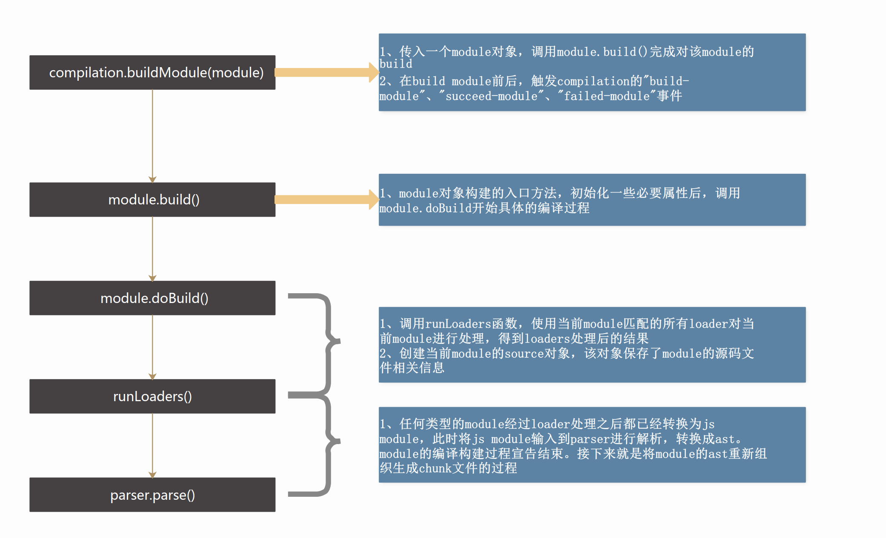

# 03-Webpack-1-打包介绍

## 一 webpack 简介

### 1.1 webpack 概念

在开发环境中，现代前端开发技术提倡模块化开发，以降低代码耦合度，便于后期扩展、维护。在生产环境中，前端代码也需要压缩、合并等以提升网页性能。

这些操作手动操作自然是相当繁琐，Webpack 就是这样一款模块打包工具，他会分析项目的结构，找到 JS 模块，将其转换和打包为合适的格式提供给浏览器直接使用。

webpack 的优点：

- 1. 对 CommonJS、AMD、ES6 的语法规范都做了兼容
- 2. 对 js、css、图片等资源文件都支持打包
- 3. 串联式模块加载器以及插件机制，使用更加灵活，扩展性更强
- 4. 有独立的配置文件 webpack.config.js
- 5. 可以将代码切割成不同的 chunk，实现按需加载，降低了初始化时间
- 6. 支持 SourceUrls 和 SourceMaps，易于调试

打包细节：


### 1.2 webpack 与 gulp 区别

Gulp 的定位是 Task Runner, 用来跑一个一个任务，但是没有解决 js module 的问题。其工作方式是：指明对某些文件进行类似编译、组合、压缩等任务的具体步骤，之后 gulp 工具可以自动替你完成这些任务。


Webpack 工作方式：把项目当做一个整体，通过一个给定的主文件（如 index.js），Webpack 将从这个文件开始找到项目的所有依赖文件，使用 loaders 处理它们，最后打包为一个（或多个）浏览器可识别的 JavaScript 文件。


### 1.3 正确认识 webpack

webpack 并不能实现 js 的编译，只能识别到 JS 中的 `import`语法，把 js 中引入的其他 js 文件打包到一起。

如果要打包 html、css、编译 ES6 等，则需要 webpack 大量的 loader、plugin 来实现，其本身只是一个模块打包工具。

## 二 webpack 的安装与运行

### 2.1 webpack 安装

目前，webpack 主要有 4 与 5 两个在使用的版本。

下面是 webpack4 的安装方式：

```txt
# 确保 node 版本在 8 以上，在项目根目录安装以下 2 个包（版本 4 后这 2 个包被分开）：
npm i -D webpack@4 webpack-cli@3

# 查看安装的 webpack 版本
npx webpack -v        # 本笔记基于 webpack4，可以避免各种插件的版本错误
```

贴士：在本地安装的 webpack 需要使用 `npx webpack` 命令启动，或者使用 `.\node_modules\.bin\webpack`。也可以全局安装 webpack，就可以直接使用 webpack 命令了，但是笔者不推荐，因为不同的项目可能使用的 webpack 版本不同，全局安装后会影响对不同版本项目的支持。

### 2.2 使用 webpack 打包

webpack4 之后，无需配置文件即可实现打包，会自动在 src 目录下寻找 index.js 文件，开始执行打包。

在根目录执行打包：

```txt
# 也可以手动指定：npx webpack main.js
npx webpack
```

打包完毕后，会在根目录生成 `dist` 目录，打包后的文件都放在此处。

webpack 常用命令参数：

```txt
--open          打包后自动打开浏览器
--port          设置端口
--contentBase   打开目的文件目录
--hot           浏览器异步更新  主要针对样式的更改
--config a.js   手动指定配置文件，默认为根目录下的 webpack.config.js
```

### 2.3 npm 脚本运行

反复输入上述命令很麻烦，可以配置一个 npm 脚本来替代：

```txt
# 在 package.json 中添加一行脚本
"dev": "webpack --mode development"

# 配置完成后使用 npm 来启动 webpack
npm run dev
```

## 三 webpack 的配置

### 3.1 webpack.config.js

在实际开发中，webpack 的打包命令需要配置大量的命令参数，这些参数如果都写在 npm 脚本中也会引起 npm 脚本的臃肿，我们可以指定一个 webpack 的配置文件，让 npm 脚本运行的 webpack 命令去该配置文件查找 webapck 的命令行参数：

在项目根目录下创建 webpack.config.js 配置文件：

```js
const path = require('path')

module.exports = {
  mode: 'development',
  entry: path.resolve(__dirname, 'src/index.js'), //入口
  output: {
    path: path.resolve(__dirname, 'dist'), //输出目录
    filename: 'bundle.js', //输出文件名
  },
  module: { rules: [] }, // 加载器配置
  plugins: [], // 插件配置
}
```

mode：

- development：默认值，为开发环境。其本质是将 `process.env.NODE_ENV` 的值设置为 development，启用 NamedCunksPlugin 和 NamedModulesPlugin。
- production：生产环境，该环境下会压缩 html 与 js 代码。其本质是将 `process.env.NODE_ENV` 的值设置为 development，启用 FlagDependencyUsagePlugin 和 UglifyJsPlugin 等插件

### 3.2 loader

webpack 只能打包 JS 文件，如果要实现对 CSS、图片等文件的打包，就需要大量的加载器 loader。每个加载器都为 webpack 提供了一个功能，多个加载器组合后，才能实现完整的项目打包功能。

loader 在 webpack 配置文件的 module 字段中配置，位于 rules 字段中，其值可以是字符串、数组、json 等五花八门，比如打包 CSS 的加载器为：style-loader，css-loader，实现方式如下：

```js
// npm i -D style-loader css-loader
module.exports = {
  module: {
    rules: [
      {
        test: /\.css$/,
        use: ['style-loader', 'css-loader'],
      },
    ],
  },
}
```

贴士：**多个 loader 的处理顺序是：从下到上，从右到左！**。

### 3.3 plugin

webpack 的各种 loader 提供了对对应类型文件的打包方式，plugins 则是 webpack 打包过程的便利性、增强型工具。

常用插件有：

```txt
html-webpack-plugin
  每次 webpack 打包，该插件可以将源码中的 html 页面从 src 拷贝到 dist 下，
  且会自动将入口文件打包的 js 文件插入 html 页面的 script 标签中。

clean-webpack-plugin
  每次 webpack 打包，该插件会删除 dist 打包目录中原有文件

copy-webpack-plugin
  每次 webpack 打包，该插件会拷贝源码中的文件进入 dist 打包目录

webpack-merge
  该插件合并不同 webpack 配置文件

uglifyjs-webpack-plugin
  去除注释插件为，webpack4 不再需要该插件，因为在打包时候如果使用了`mode`为`production`，则自动去除注释。

webpack.ProgressPlugin()
  进度监控插件
```

html-webpack-plugin 插件使用示例：

```js
// npm i -D html-webpack-plugin

const path = require('path')
const htmlWebpackPlugin = require('html-webpack-plugin')

module.exports = {
  plugins: [
    new htmlWebpackPlugin({
      template: path.resolve(__dirname, 'src/index.html'),
      filename: 'index.html',
    }),
  ],
}
```
