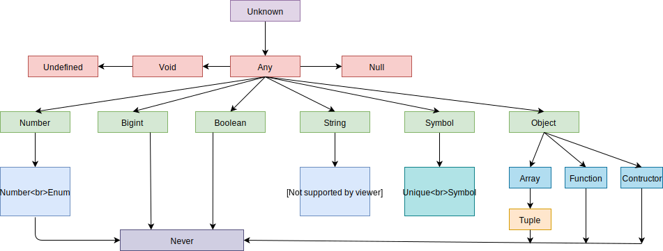

# 02.1-TypeScript 数据类型

## 一 TypeScript 支持的数据类型

TypeScript 沿用了 ECMAScript 标准，类型有：

基础类型：number、boolean、string、undefined、null、symbol
引用类型：object（包括 function、array）

此外 TS 还额外支持一些自己独有的类型：

- tuple：元组。
- enum：枚举。
- any/unknown：any 表示任意类型，支持所有类型；unknown 表示未知类型，可以理解为一种类型安全的 any。
- void/never：表示函数没有返回值，void 可以返回 undefined 等值，never 用于函数抛出异常或者进入了无限循环永远没有返回值

如图所示：



贴士：bigint 是 JavaScript 新引入的类型，能表示的数很大，而且在处理较大整数时，不会丢失精度，声明如：

```js
let a = 1234n //bigint
let b = 100 + a

let c = 88.5n // Error：必须是整数

// 在TS中使用bigint类型
let d:bigint = 100n
```

## 二 TypeScript 常见的独有数据类型

### 2.1 any

any 是一切类型的祖先，如果无法确认数据的类型在，则默认为 any，是兜底的行为，需要尽量避免使用。因为 any 会让该变量的类型检查器无法发挥作用。

贴士：any 的滥用导致的编译器无法报错示例：

```ts
let a: any = 3
let b: any = ['err']

// 该语句不会报错了，因为是开发者主动告知了TS自己的行为是正常的
let c = a + b
```

如果想让 TS 避免上述错误，可以在 tsconfig 中启用 `noImplicitAny`，该属性隶属于 `strict`，如果启用了严格模式，则无需启用该属性。

在前端开发中通过 getElementById() 获取到的元素是个 object 类型，而 ts 没有该类型，直接赋值就会报错，可以使用 any 类型。

```ts
let num: any = 123
console.log(typeof num)
num = false
console.log(typeof num)
num = 'str'
console.log(typeof num)
```

注意：声明但未赋值的变量也是 any，如下所示：

```ts
let age // any 类型
age = 30 // 此时仍然是 any
```

### 2.2 数组 array 与 元组 tuple

在 typescript 中可以直接使用 es5 的定义语法声明数组：

```ts
let arr1 = [1, 2, 'str'] //ES5 原生数组
```

一般情况下，数组应该保持元素类型相同，TS 也支持对数组类元素类型进行限定，一般在 TS 中使用数组采用下列方式：

```ts
let arr2: number[] = [1, 2, 3] //数组元素只能是数字
let arr3: Array<number> = [1, 2, 3] //数组元素只能是数字
```

TS 由于是 JS 的超集，所以也支持在数组中存储不同的数据类型，这种数据类型在大多编程语言中都称呼为元组（Tuple）。TS 中的元组类型表示一个**已知元素数量和类型**的数组，各元素的类型不必相同：

```ts
let tuple1: [number, string] = [1, 'aaa']

//报错 第二个元素应该是字符串且长度不对
let tuple2: [number, string] = [1, 2, 'aaa']
```

贴士：相较于数组，元组的性能更高，声明出来的元组推导的类型会是数组。

TS 也支持创建只读数组，只读数组无法执行 push、slice 等操作：

```ts
let arr1: readonly number[] = [1, 2, 3]
let arr2: ReadonlyArray<string> = ['a', 'b', 'c']
```

### 2.3 枚举 enum

枚举用于列举类型中包含的各个值，是一种无序的数据结构，把键映射到值上，即可以理解为编译时键固定的对象，访问键时，TS 将检查指定的键是否存在。

枚举的值可以使用点语法或者方括号访问，示例：

```ts
enum Flag {
  success = '成功',
  error = '失败',
}

let f: Flag = Flag.success
console.log(f) //成功

let d: Flag = Flag['success']
console.log(d) //成功
```

如果枚举的内部成员没有赋值，它的值就是下标：

```ts
enum Color {
  blue,
  red,
  green = 3,
  '红色',
}
let a: Color = Color.blue
let b: Color = Color.red
let c: Color = Color.green
let d: Color = Color.红色
console.log(a) //输出 0
console.log(b) //输出 1
console.log(c) //输出 3
console.log(d) //输出 4
```

### 2.4 unknown

unknown 与 any 类似也表示任意值，但是 TS 会要求 unknow 的数据进行类型检查：

```ts
let data: unknown = [1, 2, 3]

// 必须判明类型后才能联想length属性
for (let i = 0; i < (data as Array<Number>).length; i++) {}
```

unknown 类型支持比较操作，如 `===`、`||`、`&&`、`?` 等，可以否定 `!`，也支持使用 `typeof`、`instanceof` 进行类型判定，如下所示：

```ts
let a: unknown = 30 // unknow

// 支持比较运算符
let b = a === 123 // boolean

// 不支持 + 类型运算符
// let c = a + 10  // Error: Object is of type 'unknown'

if (typeof a === 'number') {
  let d = a + 10
}
```

所以，当无法预知一个数据的类型时，才会考虑 unknow。TS 不会把任何值推导为 unknown 类型，必须显式声明。

注意：与 any 相关的数据都会被污染为 any 类型，而关键字 unknown 不会，如下所示：

```ts
// any 类型的 age 将 count 沾染为了 any
let age
age = 30
let count = age + 1 // count 也是 any

// unknown 只影响自己，不会污染其他人
let num: unknown
num = 30 // 此时仍然是 unknown
let result = num + 1 // 这里报错：运算符“+”不能应用于类型“unknown”和“1”
```

综上可以看出，unknown 类型不能直接使用，其本质是**类型安全的 any**，需要先进行类型判断、类型断言才能使用：

```js
let num: unknown
num = 30 // 此时仍然是 unknown

// 类型判断
if (typeof num === 'number') {
    let result = num + 1 // 这里报错
}

// 类型断言：直接告知编译器 num 类型是 number
let result1 :number = num as number + 1 // 断言方式一
let result2 :number = <number>num + 1   // 断言方式二
```

### 2.5 void 类型与 never 类型

在 JS 中 undefined 和 null 是比较特殊的类型，用于数据的缺失，在语义上有细微差别，如 undefined 表示未定义，null 表示没有值（例如在计算过程中出错了）。同时，undefined 类型只有 undefined 一个值，null 类型只有 null 一个值。

TS 为了表示数据缺失，又额外定义了 void、never 类型用来表示函数没有返回值：

- void 声明的函数中仍然可以返回 undefined 等数据
- never 则表示该函数绝对不会有返回值

```ts
// 一个返回null的函数
const fn1 = (num: number) => {
  if (num < 10) {
    return num
  }
  return null
}

// 一个返回void的函数: void 可以不写
const fn2 = (): void => {
  let a = 2 + 2
  console.log(a)
}

// 一个返回never的函数
const fn3 = () => {
  throw new Error('错误')
}
```

如果说 unknown 是每个类型的父类型，那么 never 类型是任何类型的子类型，可以赋值给任何类型，然而除了 never 本身之外，没有类型可以赋值给 never 类型（包括 any）。所以当变量被永不为真的类型保护所约束时使用时，该变量也可以是 never 类型。

### 2.6 boolean string number symbbol

boolean string number 这些类型在 TS 用法与 JS 一致，但是这里推荐声明该类型数据时让 TS 自动推导：

```ts
let b = '666' //ts推导为字符串
```

symbbol 类型也可以被推导，也可以显式声明 unique symbol：

```ts
let a: unique symbol = Symbol('hello')
let b: unique symbol = Symbol('hello')
console.log(a === b) // false
```

## 三 TS 中的对象类型

### 3.1 TS 对象类型的定义

在 TS 中我们无法通过对象类型，知道一个对象是通过字面量 `{}` 创建还是复杂对象的 `new` 创建的，这是 JS 的设计思路，采用了结构化类型，TS 直接沿用了这种设计，没有采用名义化类型。

贴士：结构化类型也可以称为鸭子类型（不以貌取人），只关心对象有哪些属性，而不管属性使用什么名称。

定义 TS 对象类型有三种方法：

```ts
// 方式一：使用 object 类型，或者使用 new Object() 方式等，都很鸡肋
let obj1: object = {
  name: 'zs',
}
// Error:不存在name属性，因为object类型只表示该值是一个JS对象，而不是null！
// console.log(obj1.name)

// 方式二：不显示注解，让TS推导
let obj2 = {
  name: 'ls',
}
console.log(obj2.name)

// 方式三：明确类型
let obj3: { name: string } = {
  name: 'ls',
}
console.log(obj3.name)

// 方式三也可以使用常规对象定义方式定义，只要表明其结构即可
let p = {
  name: 'ls',
  country: 'UK',
}

class Person {
  public name: string
  public country: string
  constructor(name: string) {
    this.name = name
    this.country = 'China'
  }
}

p = new Person('ww')
```

### 3.2 属性缺失

情况一：创建的对象实例上缺失了一些属性，这时候的错误如下：

```ts
let a: {
  name: string
  age: number
}

// 类型 "{ name: string; }" 中缺少属性 "age"，但类型 "{ name: string; age: number; }" 中需要该属性。
// a = {
//   name: 'ls',
// }
```

情况二：创建的对象实例上访问不存在的属性：

```ts
let a: {
  name: string
  age: number
}

a = {
  name: 'ls',
  age: 30,
}

// 类型“{ name: string; age: number; }”上不存在属性“sex”
// console.log(a.sex)
```

### 3.3 对象属性可选

为了解决对象中属性存在一定变数问题，可以在声明对象结构时使用 `?`、`[]`：

```ts
// ? 解决
let obj1: { name: string; age?: number }

obj1 = {
  name: 'zs',
  age: 40,
}

obj1 = {
  name: 'ls',
}

// 如果可选属性过多，可以使用 []
// propName 是笔者自己定义的名称，表示 key，string 代表 key 的类型，any 代表 value 类型
let obj2: { name: string; [propName: string]: any }

obj2 = {
  name: 'zs',
  work: 'teacher',
  age: 10,
}
```

## 四 并集与交集

### 4.1 并集符合

并集或符号：

```ts
let obj: { name: string } | { age: number }

obj = { name: 'lisi' }
```

### 4.2 交集符号

交集与符号：

```ts
let obj: { name: string } & { age: number }

obj = { name: 'lisi', age: 30 }
```

这 2 个符号经常作用于多个类组成的类型，如：

```js
class A {}
class B {}
let obj: A & B // obj 中需要有 A 与 B 的成员
```

### 4.3 联合类型

联合类型(Union Types)是可以通过管道(|)将变量设置多种类型，赋值时可以根据设置的类型来赋值。

问题：假定一个函数的参数类型不是很确定，如何定义该函数？

解决：在不使用泛型的情况下，联合类型是很好的解决方案。

示例：创建一个将数字转换为字符串的函数，接收类型为数字或者字符串

```ts
function getString(num: number | string): string {
  return String(num)
}

console.log(getString(1))
console.log(getString('2'))
```

## 五 类型别名

使用 type 关键字可以给类型起个别名，可以让业务信息更清晰，减少一些重复代码：

```ts
type Age = number
let a: Age = 3
```

type 支持或、与操作：

```ts
class A {}
class B {}

type Cus = A & B

let cusInstance: Cus
```

贴士：使用类型别名的地方都可以替换为源类型，程序不会受到影响。

不过要注意的是：同一个别名不能声明两次，且类型别名的定义和普通变量存在一样的作用域限制。

## 六 类型推断

TS 在识别未指定类型的数据时，会进行推断：

```ts
// 推断一：推断 num 为数值类型
let num = 100
num = 'hello' // 报错

// 推断二：推断 str 为 any 类型
let str
str = 100
str = 'hello' // 不会报错
```
