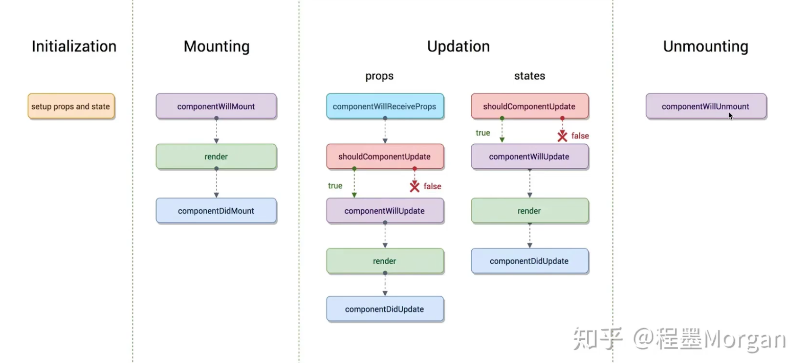

# 07-React 生命周期

## 一 生命周期概念

组件的创建、加载、销毁等过程，总是伴随着各种各样的事件，这些特定的时期，以及触发的事件，被称为生命周期。

组件的生命周期分为三部分：

- 挂载：即创建阶段，其相应生命周期函数只会执行一次；
- 运行：运行阶段会根据组件的 state 和 props 的改变，有选择的触发一些函数；
- 销毁：销毁阶段的生命周期函数只会执行一次。

## 二 旧版生命周期

### 2.0 旧版生命周期钩子函数

不同的生命周期内都对应了一些钩子函数，如图所示：



### 2.1 旧版生命周期-组件创建阶段

创建阶段是组件的第一次渲染，由 `ReactDOM.render()` 触发，包含四步：

```js
class Comp extends React.Component {
    // 设置原始的私有数据
    constructor() {
        super()
        console.log('0-初始化')
        this.state = {}
        static defaultProps = {}
    }

    // 组件即将被挂载,虚拟DOM元素尚未创建完毕，该生命周期未来会废弃
    componentWillMount() {
        console.log('1-将要挂载')
    }

    // render()方法运行完毕后，虚拟DOM也创建完毕，但是并未真正挂载到真实的页面上
    render() {
        console.log('2-渲染函数')
        return <div>comp</div>
    }

    // state 上的数据、内存中的虚拟 DOM、浏览器的页面都已经保持了一致，组件进入到了运行阶段。
    componentDidMount() {
        console.log('3-已经挂载')
    }
}
```

componentWillMount() 较为常用，由于此阶段组件已经真实渲染，可以在钩子内开启定时器、发送网络请求、订阅消息等。

### 2.2 旧版生命周期-组件运行阶段

运行阶段，属性 props 的改变，状态 state 的改变都可以触发组件的更新。

由 `setState()` 、`父组件.render()` 触发更新：

```js
class Comp extends React.Component {
  // 组件接收到新的props时执行，该生命周期未来会废弃
  componentWillReceiveProps(nextProps) {
    console.log('0-接收新参数')
  }

  // 该钩子函数是能否能改状态的阀门，该函数返回 true 才能执行更新
  shouldComponentUpdate(nextProps, nextState) {
    console.log('1-是否可以执行更新')
    return true
  }

  // 组件将要更新此时内存中的虚拟DOM树还是旧的，该生命周期未来会废弃
  componentWillUpdate() {
    console.log('2-即将更新')
  }

  // 渲染
  render() {
    console.log('3-渲染函数')
    return <div>comp</div>
  }

  // 重新渲染：新的state、虚拟DOM与页面都保持了同步
  componentDidUpdate() {
    console.log('3-已经更新')
  }
}
```

注意：父组件在再次渲染（第二次 render）的时候，会额外触发钩子：`componentWillReceiveProps()`用来证明父组件给当前子组件传递了新的属性值。

贴士：通过强制更新（forceUpdate）绕过阀门控制，不更改状态也更新组件。

贴士：`React.Component` 是最基础的 React 组件类，而 `React.PueComponent` 则内部默认为开发者定义好了 `shouldComponentUpdate` 生命周期，开发者无需考虑该函数。

### 2.3 旧版生命周期-组件销毁阶段

组件销毁即组件卸载。

由 `ReactDOM.unmountComponentAtNode()` 触发：

```js
class Comp extends React.Component {
  // 其他生命周期

  // 此时组件还能正常使用，一般用于做收尾的事情，如：关闭定时器、取消订阅
  componentWillUnmount() {
    console.log('1-将要卸载')
  }
}
```

## 三 新版生命周期

### 3.0 新版生命周期钩子函数

新版生命周期钩子函数如图所示：



在新版生命周期中，有三个旧钩子不再被推荐使用，即`componentWillMount`、`componentWillUpdate`、`componentWillReceiveProps`。React 为这三个函数分别额外提供了一个在新函数，即原函数名上添加了`UNSAFE_`前缀的函数，而且在 React18 中，只有带该前缀的钩子函数可以使用。因为 React 官方认为这三个函数经常被滥用，且在异步渲染中更容易出现错误。

在新版生命周期中，提出了 2 个不常用的新钩子：`static getDeriveStateFromProps(nextProps, prevState)`、`getSnapshotBeforeUpdate()`

`static getDeriveStateFromProps(nextProps, prevState)`：**可以用来更新状态**，若组件的状态依赖于 props 可以使用该钩子，即该方法能够通过 props 派生并返回状态对象。但该钩子函数会造成代码冗余。

`static getDeriveStateFromProps(nextProps, prevState)`使用场景：

- 根据 props 更新内部 state（只要有传入 props 值，就更新 state）

- props 值和 state 值不同时需要更新 state

`getSnapshotBeforeUpdate()`：可以在更新发生前捕获一些信息（快照），其返回值将作为参数传递给下游钩子 `componentDidUpdate()`。

`getSnapshotBeforeUpdate()`使用场景：

- 获取滚动位置

### 3.1 新版本生命周期使用变化汇总

- 16.3+：可以使用带 `UNSAFE_`开头的钩子，也可以使用旧版钩子
- 16.4： getDeriveStateFromProps() 可以在 setState()、forceUpdate() 时触发。
- 17：只能使用 `UNSAFE_`开头的钩子，或者新版钩子

### 3.2 新生命周期个阶段对应钩子总结

创建阶段：

```txt
第一步：  constructor()
第二步：  getDerivedStateFromProps
第三步：  render()
第四步：  componentDidMount()
```

更新阶段：

```txt
第一步：  getDerivedStateFromProps()
第二步：  shouldComponentUpdate()
第三步：  render()
第四步：  getSnapshotBeforeUpdate()
第五步：  componentDidMount()
```

销毁阶段：

```txt
第一步：  componentWillUnmount()
```

## 四 错误处理

当子组件报错，会导致整个页面的崩溃，这是不允许的，可以在父组件内利用下列钩子：

```js
export default Father extends Component {

  state = {
    err: null
  }

  static getDerivedStateFromError(error){
    console.log(error)
    return {err: error}
  }

  componentDidCatch(error, info){
    // 统计页面错误，发送错误信息给后台
  }

  render(){
    return (
      <div>
        {this.state.err ? <h3>当前网络不稳定</h3> : <Son/>}
      </div>
    )
  }
}
```

贴士：上述错误边界处理在生产环境中才能正常显示。

## 五 useEffect()

函数组件没有生命周期函数，hoos 提供了 useEffect() 可以在函数式组件中执行副作用操作（即监控组件状态的变更，模拟生命周期）。

贴士：副作用操作有在 React 中发送 ajax、手动更改真实 DOM、启动定时器等。

添加 useEffect Hook，示例将会在初次加载、任意状态改变时执行：

```js
let [count, setCount] = React.useState('Jack')
let [name, setName] = React.useState('Jack')

React.useEffect(() => {
  console.log('useEffect...')
}, [count, name])
```

第二个数组参数是可选的，意思是：监控该函数式组件内哪些状态。

- 空数组，则不会监控，只会在组件初次加载时执行 useEffect()。
- 数组参数不写，则监控所有状态。

useEffect 的第一个函数参数内部也可以返回一个函数，这个返回的函数会在组件卸载时触发，推荐在 return 中书写清理定时器等方法：

```js
React.useEffect(() => {
  console.log('useEffect...')
  return () => {
    console.log('component will unmount...')
  }
})
```
