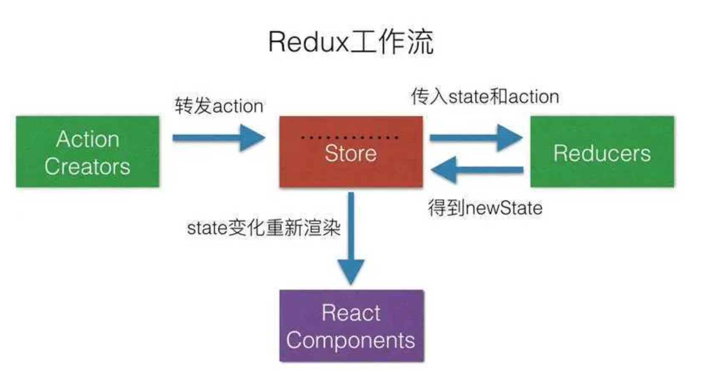
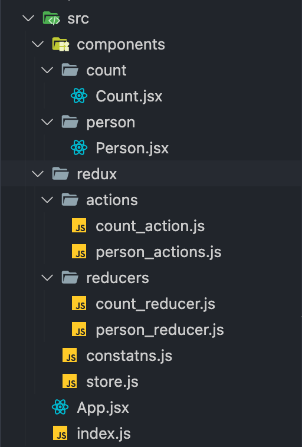
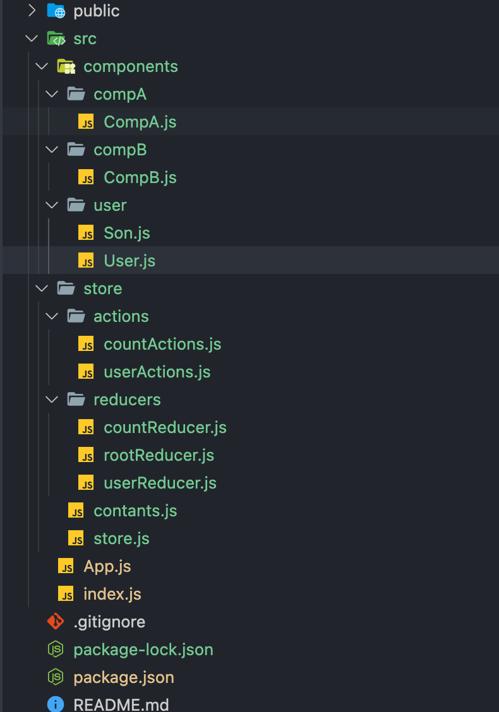

# 09-状态管理 Redux

## 一 Redux 概念

Redux 是一款集中状态管理库，适用于 React、Angular、Vue 等库，但经常与 React 配合使用。

redux 使用场景：

- 多个组件的状态需要其他组件随时使用（共享）

- 存在很多组件之间更改对方状态（通信）场景

redux 工作如图：



**store**：store 用于维护 state，可以将 action 与 reducer 联系到一起，是整个 redux 的核心部分。

**action**：是负责将数据从应用传递到 store 的对象。触发 action 是唯一可以改变 state 的方法。给 store 发送 aciton 方式：`store.dispatch()`。

**reducer**：reducer 只是一些纯函数，接收到数据更改要求（action），返回新的 state 给 store。reducer 可以实现复用、顺序控制等。

应用中所有的 state 都以一个对象树的形式储存在一个单一的 store 中。state 中的数据是只读的，惟一改变 state 的办法是使用 dispatch 派发 action，具体的更新方式位于对应的 reducer（返回一个新的 state）。

Redux 的设计原则：

- 单一数据源：与 MVC 不同（Model 之间互相监听、触发），Redux 认为一个应用只需要一个唯一数据源，这会导致产生一个极大的 JS 对象，Redux 通过 combineReducers()解决
- 状态只读：redux 没有真正意义上的 store，即无法用代码定义，reducer 也只是返回一个全新的状态
- 状态修改由纯函数完成：每个 reducer 都是纯函数，没有副作用，使得 redux 变得容易测试。

## 二 redux 简单示例

### 2.1 Redux 基础使用

安装 redux 相关库：

```txt
npm i -S redux
```

代码示例：

```js
import { createStore } from 'redux'

// reducer
const initCount = {
  count: 0,
}
function counterReducer(state = initCount, action) {
  switch (action.type) {
    case 'INCREMENT':
      return {
        ...state,
        count: state.count + action.payload.num,
      }
    case 'DECREMENT':
      return {
        ...state,
        count: state.count - action.payload.num,
      }
    default:
      console.log('未执行操作')
      return state
  }
}

// 创建Store
const store = createStore(
  counterReducer,
  // 支持redux-devtools谷歌插件
  window.__REDUX_DEVTOOLS_EXTENSION__ && window.__REDUX_DEVTOOLS_EXTENSION__()
)

// 创建第一个Action：对count+1
function countAddAction() {
  return {
    type: 'INCREMENT',
    payload: {
      num: 1,
    },
  }
}

// 创建第二个Action：对count-2
function countMinusAction() {
  return {
    type: 'DECREMENT',
    payload: {
      num: 2,
    },
  }
}

// 执行action，改变数据
store.dispatch(countAddAction())
store.dispatch(countMinusAction())

// 获取数据
console.log(store.getState()) // {count: -1}
```

### 2.2 combine 合并多个 reducer

store 在创建时，可以支持多个 reducer，使用 combine 合并：

```js
import { createStore, combineReducers } from 'redux'

const rootReducers = combineReducers({
  counter: counterReducer,
  other: otherRerucer,
})

// 创建Store
const store = createStore(
  rootReducers,
  window.__REDUX_DEVTOOLS_EXTENSION__ && window.__REDUX_DEVTOOLS_EXTENSION__()
)
```

**注意：合并时 reducer 的名字会将状态数据分组，会决定 state 中的属性的获取方式，比如合并前在组件中获取属性为：state.count，合并的名字为 counter，则获取方式为：state.counter.count**。

### 2.3 中间件

在 redux 中可以使用一些中间件，多个中间件也可以组合使用，中间件会在发出 action，reducer 执行数据维护之前执行一些操作，如下所示：

```js
import { createStore, applyMiddleware } from 'redux'
import thunk from 'redux-thunk' // 异步请求中间件
import { createLogger } from 'redux-logger' // 日志中间件

// 环境
let isDev = true

// logger 中间件
const logger = createLogger({
  predicate: isDev,
  collapsed: true,
})

// 集成中间件:apply函数用于加载中间件
let appliedMiddlewares = applyMiddleware(...[thunk, logger])
if (isDev) {
  const { composeWithDevTools } = require('redux-devtools-extension')
  appliedMiddlewares = composeWithDevTools(appliedMiddlewares)
}

// 创建Store
const store = createStore(rootReducers, appliedMiddlewares)
```

贴士：这里 redux-devtool 使用了扩展，依赖于 react-redux，所以需要这样安装： `npm install -S redux react-redux`。

## 三 react-redux 综合示例

### 3.1 示例目录

react-redux 是 redux 针对 react 推出的库，提供了 connect、Provider 等配合 redux 能够更好的在组件中传递状态。

所有文件目录：



demmo 示例：


### 3.2 入口传递 store

入口通过 Provider 挂载传递 store，在根组件中使用后才能在其他组件中任意使用对应状态、函数：

```js
import { Provider } from 'react-redux'

import Store from './store'

import CompA from './components/CompA'
import CompB from './components/CompB'

function App() {
  return (
    <Provider store={Store}>
      <div className="App">
        <CompA />
        <CompB />
      </div>
    </Provider>
  )
}

export default App
```

### 3.2 store

store 文件专门用于暴露一个 store 对象，整个应用只有一个 store 对象，其内容与 2.3 中间件小节中所示无异：

```js
import { createStore, applyMiddleware } from 'redux'
import thunk from 'redux-thunk' // 异步请求中间件
import { createLogger } from 'redux-logger' // 日志中间件

import { reducer } from './reducers/countReducer'

// 环境
let isDev = true
const logger = createLogger({
  predicate: isDev,
  collapsed: true,
})

// 集成中间件
let appliedMiddlewares = applyMiddleware(...[thunk, logger])
if (isDev) {
  const { composeWithDevTools } = require('redux-devtools-extension')
  appliedMiddlewares = composeWithDevTools(appliedMiddlewares)
}

const store = createStore(reducer, appliedMiddlewares)

export default store
```

### 3.3 constants.js

该模块是用于定义 action 对象中 type 类型的常量值，目的只有一个：便于管理的同时防止程序员单词写错。

```js
const ActionTypes = {
  counter: {
    INCREMENT: 'INCREMENT',
    DECREMENT: 'DECREMENT',
  },
  user: {
    GET_USER: 'GET_USER',
    GET_USER_LOADING: 'GET_USER_LOADING', // 正在请求中
    GET_USER_SUCCESS: 'GET_USER_SUCCESS',
    GET_USER_FAIL: 'GET_USER_FAIL',
  },
}

export default ActionTypes
```

### 3.4 actions

actions 文件夹内全部是视图组件对应的各自 action 对象，以 count 组件对应的 acount_action.js 文件为例：

countActions：

```js
import ActionTypes from '../contants'

export function addAction() {
  return {
    type: ActionTypes.counter.INCREMENT,
    payload: {},
  }
}

export function subAction() {
  return {
    type: ActionTypes.counter.DECREMENT,
    payload: {
      num: 1,
    },
  }
}

export function addActionAsync() {
  return (dispatch) => {
    setTimeout(() => {
      dispatch({
        type: ActionTypes.counter.INCREMENT,
        payload: {},
      })
    }, 1500)
  }
}

export function subActionAsync() {
  return (dispatch) => {
    setTimeout(() => {
      dispatch({
        type: ActionTypes.counter.DECREMENT,
        payload: {
          num: 1,
        },
      })
    }, 1000)
  }
}
```

userAtions，包含异步请求：

```js
import ActionTypes from '../contants'

export const getUserLoadingAction = () => {
  return {
    type: ActionTypes.user.GET_USER_LOADING,
  }
}

export const getUserSuccessAction = (data) => {
  return {
    type: ActionTypes.user.GET_USER_SUCCESS,
    payload: {
      data: data,
    },
  }
}

export const getUserFailAction = (error) => {
  return {
    type: ActionTypes.user.GET_USER_FAIL,
    payload: {
      error: error,
    },
  }
}

export const fetchUser = (params) => {
  const { isUpdate } = params

  return (dispatch) => {
    // 状态一：加载中状态
    dispatch(getUserLoadingAction())

    // 开始请求
    fetch(`http://localhost:3100/user?isUpdate=${isUpdate}`)
      .then((res) => {
        return res.json()
      })
      .then((data) => {
        console.log('fetch data:', data)
        // 状态二：请求成功状态
        dispatch(getUserSuccessAction(data))
      })
      .catch((err) => {
        // 状态三：请求失败状态
        dispatch(getUserFailAction(err))
      })
  }
}
```

### 3.5 reducers

reducers 文件夹内全部是 actions 对应的 reducer，以 count 组件为例，acount_reducer.js 是 count_actions 对应的所有 reducer：

```js
import ActionTypes from '../contants'

const initialState = {
  count: 0,
}

const countReducer = (state = initialState, action) => {
  const cur = state.count
  switch (action.type) {
    case ActionTypes.counter.INCREMENT:
      return {
        ...state,
        count: cur + 1,
      }
    case ActionTypes.counter.DECREMENT:
      return {
        ...state,
        count: cur - action.payload.num,
      }
    default:
      return state
  }
}

export default countReducer
```

userReducers:

```js
const initialState = {
  data: [{ name: '', age: 0 }], // 请求的数据结果
  loading: false, // 正在请求中
  error: null, // 请求发生错误
}

const userReducer = (state = initialState, action) => {
  switch (action.type) {
    case 'GET_USER_LOADING':
      return { data: [{ name: '', age: 0 }], loading: true, error: null }
    case 'GET_USER_SUCCESS':
      return { data: action.payload.data, loading: false, error: null }
    case 'GET_USER_FAIL':
      return {
        data: [{ name: '', age: 0 }],
        loading: false,
        error: action.payload.error,
      }
    default:
      return state
  }
}

export default userReducer
```

rootReducer:

```js
import { combineReducers } from 'redux'

import countReducer from './countReducer'
import userReducer from './userReducer'

const rootReducer = combineReducers({
  counter: countReducer,
  user: userReducer,
})

export default rootReducer
```

### 3.6 组件中使用

CompA：mapDispatch

```js
import React from 'react'
import { connect } from 'react-redux'
// import { addAction, subAction, addActionAsync, subActionAsync } from '../../store/actions/countActions'

import * as countActions from '../../store/actions/countActions'
import { bindActionCreators } from 'redux'

class CompA extends React.Component {
  handleAdd = () => {
    // this.props.addAction()
    this.props.countActions.addAction()
  }
  handleSub = () => {
    // this.props.subAction()
    this.props.countActions.subAction()
  }
  handleAddAsync = () => {
    // this.props.addActionAsync()
    this.props.countActions.addActionAsync()
  }
  handleSubAsync = () => {
    // this.props.subActionAsync()
    this.props.countActions.subActionAsync()
  }
  render() {
    return (
      <div>
        <button onClick={this.handleAdd}> count + </button>
        <button onClick={this.handleSub}> count - </button>
        <button onClick={this.handleAddAsync}> 异步count + </button>
        <button onClick={this.handleSubAsync}> 异步count - </button>
      </div>
    )
  }
}

const mapDispatchToProps = (dispatch) => {
  // return {
  //     addAction: ()=>{ dispatch(addAction()) },
  //     subAction: ()=>{ dispatch(subAction()) },
  //     addActionAsync: ()=>{ dispatch(addActionAsync())},
  //     subActionAsync: ()=>{ dispatch(subActionAsync())}
  // }
  return {
    countActions: bindActionCreators(countActions, dispatch),
  }
}

export default connect(null, mapDispatchToProps)(CompA)
```

CompB：mapState

```js
import React from 'react'
import { connect } from 'react-redux'

class CompB extends React.Component {
  render() {
    return <div>count:{this.props.counter.count}</div>
  }
}

const mapStateToProps = (state) => {
  return {
    counter: state.counter, // state内部counter的产生是因为 combineReducers 包裹reducer操作
  }
}

export default connect(mapStateToProps)(CompB)
```

User：异步请求

```js
import React from 'react'
import { connect } from 'react-redux'

import * as userActions from '../../store/actions/userActions'
import { bindActionCreators } from 'redux'

class User extends React.Component {
  componentDidMount() {
    this.props.userActions.fetchUser({ isUpdate: 0 })
  }

  handlUpdateUser = () => {
    this.props.userActions.fetchUser({ isUpdate: 1 })
  }

  render() {
    console.log('CompUser props:', this.props.user.data[0].name)
    return (
      <div>
        <button onClick={this.handlUpdateUser}>点击更新用户信息</button>
        <div>用户信息：{this.props.user.data[0].name}</div>
      </div>
    )
  }
}

const mapStateToProps = (state) => {
  console.log('map User:', state)
  return {
    user: state.user,
  }
}

const mapDispatchToProps = (dispatch) => {
  return {
    userActions: bindActionCreators(userActions, dispatch),
  }
}

export default connect(mapStateToProps, mapDispatchToProps)(User)
```
