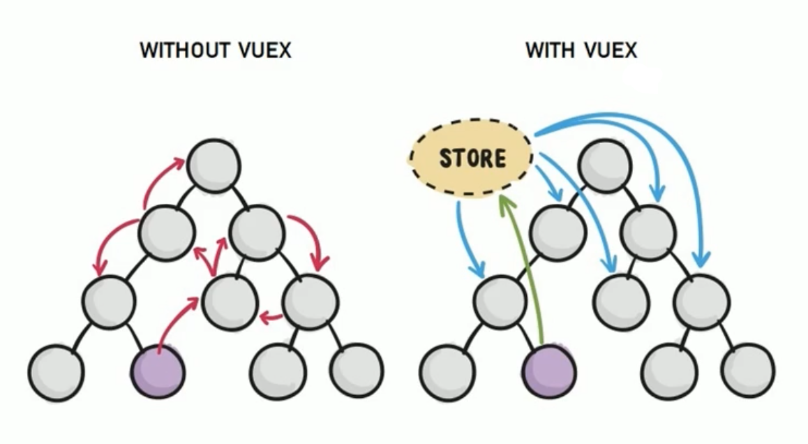
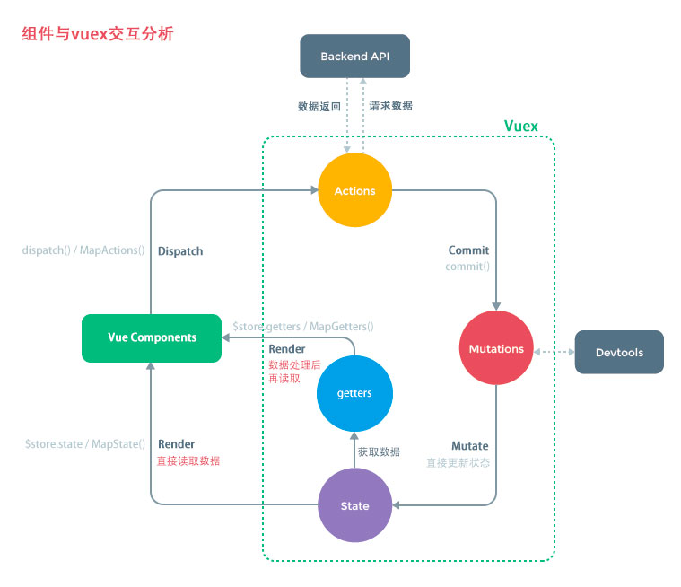

# 11-Vuex

## 一 vuex 概念

在 Vue 中，有三种基础的数据共享或者传递方式：

- 父传子：通过 v-bind 属性绑定方式传递
- 子传父：通过 v-on 事件绑定方式传递
- 兄弟传递：通过 EventBus 事件总线方式传递（`$on` 接收，`$emit` 发送）

上述三种方式适合在小型项目中使用，且事件总线管理这些数据相当复杂，且耦合度很高。复杂度较高的项目推荐使用一个全新的插件：vuex。

vuex 可以对 vue 应用中多个组件的共享状态进行集中式管理（读/写），其主要作用是状态管理，而非通信，但是由于状态管理即是数据的管理，vuex 也可以用来进行数据通信。

项目使用 vuex 与否的对比：



vuex 优点：

- vuex 对数据进行了集中管理，易于开发、维护
- vuex 中的数据是响应式的，能够实时保持数据与页面的同步

state 保存的数据推荐使用 单一状态树 的形式，即大量的不同的数据都统一使用一个 store，而不是多个 store 对象。在这唯一的 store 中，进行数据的树形划分。

其实我们手动书写一个全局对象来保存数据也是可行的，类似后端的 redis，但是 vuex 还具备响应式驱动 DOM 更新的能力。

一般情况下，vuex 用来存储：登录、购物车信息、地理位置等多个界面共享的数据。

## 二 vuex 简单使用

状态自管理应用包含以下三个部分：

- `state`：应用的数据，即状态
- `view`：以声明方式将 state 映射到视图；
- `actions`：响应在 view 上的用户输入导致的状态变化(包含 n 个更新状态方法)。

```txt
# 安装(vue-cli在安装时若勾选了vuex，则无需安装)
npm i vuex -D
```

在项目根目录新建状态管理文件`store/index.js`：

```js
import Vue from 'vue'
import Vuex from 'vuex'

Vue.use(Vuex)

const store = new Vuex.Store({
  state: {
    // 自定义的共享状态,它应该是唯一的
    uid: 10001,
  },
  mutations: {},
  actions: {},
  getters: {},
  modules: {},
})

export default store
```

## 三 vuex 的核心 API

### 3.1 state

state 属性是 vuex 管理的状态对象，里面会包含一些具体的状态，也即通用的数据，如登录信息、购物车信息、地理位置信息。

示例：

```js
const store = new Vuex.Store({
  // 全局共享数据
  state: {
    count: 10, // 定义一个全局数据名 count，值为10
  },
  mutations: {},
  actions: {},
  modules: {},
})
```

使用 state 中的数据有两种方式。

方式一：在组件模板中直接使用（无需 this）

```html
<div>
  <div>count：{{ $store.state.count }}</div>
</div>
```

方式二：使用 vuex 提供的 mapState 方法，将全局数据映射为当前组件的计算属性。

```html
<template>
  <div>
    <div>count：{{ count }}</div>
  </div>
</template>

<script>
  import { mapState } from 'vuex'
  export default {
    name: 'Sub',
    computed: {
      ...mapState(['count']),
    },
  }
</script>
```

### 3.2 mutations

vuex 并不推荐直接修改 state 数据，而是铜鼓 mutations 内的函数来修改数据。

首先在 store 中提供 state 数据修改的方法：

```js
const store = new Vuex.Store({
  state: {
    count: 10,
  },
  mutations: {
    addCount(state, num) {
      state.count += num
    },
  },
  actions: {},
  modules: {},
})
```

在组件中利用 commit 使用：

```html
<template>
  <div>
    <div>count：{{ $store.state.count }}</div>
    <button @click="handleAdd">+1</button>
  </div>
</template>

<script>
  export default {
    name: 'Add',
    data() {
      return {}
    },
    methods: {
      handleAdd() {
        this.$store.commit('addCount', 5) //在组件中调用该方法时使用该方法名字符串
      },
    },
  }
</script>
```

mutations 也拥有映射机制，可以将状态更新函数映射到 vue 组件的 methods 中：

```html
<template>
  <div>
    <div>count：{{ count }}</div>
    <button @click="handleAdd2">+1</button>
  </div>
</template>

<script>
  import { mapMutations, mapState } from 'vuex'
  export default {
    name: 'Sub',
    computed: {
      ...mapState(['count']),
    },
    methods: {
      ...mapMutations(['addCount']),
      handleAdd2() {
        this.addCount(6)
      },
    },
  }
</script>
```

### 3.3 actions

mutations 中推荐保存 同步 操作，而 actions 中推荐保存 异步 操作。如果不按照这个规范，Devtools 工具会出现跟踪问题。actions 仍然是通过触发 mutations 的方式间接变更数据的。

actions 示例：

```js
const store = new Vuex.Store({
  state: {
    count: 10,
  },
  mutations: {
    addCount(state, num) {
      state.count += num
    },
  },
  actions: {
    // 默认参数为context上下问对象，这里是 store对象
    addCountAsync(context, num) {
      setTimeout(() => {
        context.commit('addCount', num) // 只能触发mutations
      }, 2000)
    },
  },
})
```

组件中使用：

```html
<template>
  <div id="app">
    <p>原始数据：{{this.$store.state.count}}</p>
    <button @click="handleAdd(10)">同步改变count</button><br />
    <button @click="handleAddAsync(10)">异步改变count</button>
  </div>
</template>

<script>
  export default {
    data() {
      return {}
    },
    methods: {
      handleAdd(count) {
        this.$store.commit('addCount', count)
      },
      handleAddAsync(count) {
        this.$store.dispatch('addCountAsync', count)
      },
    },
  }
</script>
```

同理，actions 也可以通过映射方式，映射到 vue 组件的 methods 中：

```js
methods: {
  ...mapActions(['addAsync','subAsync'])
}
```

### 3.4 getters

类似 vue 中的计算属性，在这里可以对获取到 state 数据进行修饰。

```js
  getters: {
    getNum(state){
      return state.num + 5
    }
  },
```

组件中使用：

```html
<p>{{$store.getters.getNum}}</p>
```

### 3.5 modules

由于 vuex 推荐使用单个状态树，状态过多也很容易造成混乱，modules 可以将这些状态进行划分。每个 modules 就是一个 store 的配置对象，一般与一个组件对应：

```js
  modules: {
    moduleA: {
      state:{},
      mutations:{}
    },
    moduleB: {
      state:{},
      mutations:{}
    }
  }
```

在组件中使用：

```html
<p>{{$store.state.moduleA.num}}</p>
```

## 四 vuex 的响应规则

Vuex 的 store 中的 state 是响应的，当 state 数据发生改变时，组件中的数据也会发生改变，不过 store 中必须 初始化好所需要的属性 ！

给 state 对象添加新属性时，此时 state 中新增了数据，但是界面是不会发生变化的，使用下面的方式可以进行响应

- 方式一：给 state 的 person 对象新增 age 属性：
  - `Vue.set(state.person, 'age', 26)`
  - 删除也可以做到响应：`Vue.delete(state.person, 'age')`
- 方式二：用新对象给旧对象重新赋值

组件要更新数据时，依次经过： actions -> mutations -> state，这样的路径进行修改。能够修改 state 的操作就是：mutations。如图所示：



为什么要绕一大圈？

在当前一个页面中，状态发生了变化，并不知道其来自于哪个地方触发了状态改变，调试很困难。 vue 的开发工具 Devtools 可以在浏览器中清晰的展示是哪个组件的更新导致了状态的变化，该工具依赖于 mutations ，所以我们使用 mutations 中状态更新的方法来改变状态。

## 五 状态相关文件的组织格式

由于状态文件极大，可以对其分模块使用，store 文件夹中使用下列文件：

- index.js：store 的导出信息
- mutations.js：数据更新方法文件
- acitions.js：数据异步更新方法文件
- ....依次类推，每个 vuex 的属性单独一个文件保存

示例：

```js
// actions.js
export default {
  updNumAsync(context, count) {
    // 默认参数为context上下问对象，这里是 store对象
    setTimeout(() => {
      context.commit('updNumAsync', count)
    }, 2000)
  },
}

// index.js
import actions from './actions'

const store = new Vuex.Store({
  actions: actions,
})
```
