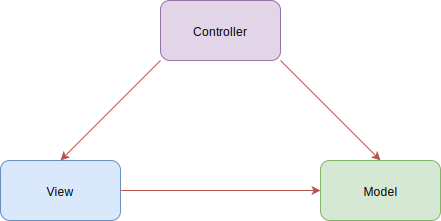

# 01.1-React 简介

## 一 开发思想

### 1.1 MVC

在大型项目开发中，往往需要用业务逻辑、数据、界面显示分离的方法组织代码，以便在代码需要改进时能够做到最小化变更，便于扩展维护。

最经典的软件设计规范即 MVC（Model View Controller）：



- 模型 model：对业务数据的抽象，如用户数据包括：uid、name、age 等，在模型层，将其抽象为 User 对象，包含上述字段，并附带基础的增删改查实例操作
- 视图 view：数据的可视化界面。更加面向普通用户，提供给了用户操作界面，即前端开发中最常见的网页
- 控制器 controller：数据流向的控制者，在数据发生变化时更新视图。控制层位于视图层与模型层中间，负责视图层数据的流转，即根据用户在视图层提交的数据，去模型层执行增删改查等操作

### 1.2 MVVM

MVC 思想在传统后端领域实现较多，但是在前端，开发者更多关注的是界面与数据。前端在行为交互上存在大量的相同代码，比如 tab 切换需要反复对几个 tab 元素进行循环遍历从而实现数据到界面，界面到数据的双向交互，MVC 思想在前端领域适应性较低。

MVVM 是前端视图层的分层开发思想，将前端视图的结构划分为 M（model）、V（view）、VM（view-model）三层：

- M：数据模型层，这里是接口请求到的数据结果集，封装于 data 对象中，专门用来保存每个页面里单独的数据。
- V：视图层，vue 实例所控制的元素区域，即每个页面的 html 结构。
- VM：VM 调度者，即 new 出来的 vue 实例对象，用来解耦视图层与数据模型层。视图层想要获取或保存数据的都需要由 vm 做中间处理。

MVC 里的 C 是控制器，由不同的控制函数/对象，手动实现调度数据与视图转换。MVVM 的 VM 内部往往也存在一个虚拟 DOM，有了该调度者，开发者不再需要反复关注 DOM，只用与后台进行数据交互即可，数据模型的变更能够自动驱动视图的变更。

在前端中常见的具有 MVVM 思想的框架有：React、Vue。

在 MVVM 中：

- 模型层数据发生变动，通过数据绑定形式驱动界面发生改变；
- 界面上的数据发生改变时，通过对 DOM 的监听驱动模型层数据发生改变！

负责数据绑定、DOM 监听的就是 MVVM 编程的核心 VM 层，Vue/React 框架便是在其内部实现了这些机制。

### 1.3 Vue 与 React

Vue 与 React 均是当前流行的框架，也都受到了 MVVM 编程思想的影响。二者的本质区别是：数据响应方式不同。React 侧重于用户手动 setState() 更新，Vue 中数据改动则界面自动更新。

二者没有绝对优劣，只是开发思维的不同。React 可以使用 mobx 实现类似 Vue 的响应编程，Vue 也可以把数据 freeze，不再具备响应式。

### 1.4 单页面案弊端

使用 MVVM 思想可以让一个单页面就能实现一个完整的应用，虽然有一定的优点，但是在一个超大项目中，需要集成很多模块，造成其首次加载速度变慢，且一个局部异常容易造成整个 APP 无法使用。而多页面应用就不会有这两个缺点，笔者推荐使用的方式是：

**多页导航 + 单模块单页应用**。

## 二 React 框架

### 2.1 框架简介

React 是 Facebook 2013 年开源的一款用于构建前端界面的 JS 库，其构想是将界面中的 UI 元素抽象为不同的组件，开发页面就像搭积木一样进行拼装。

React 与原生 JS 的对比：

- DOM 操作：原生 JS 如果要操作 UI，需要频繁操作 DOM，效率较低。（注意：jQuery 只是优化了 DOM 操作的代码写法而已，本质与原生 JS 一致）。React 框架内部实现了虚拟 DOM，在界面需要更新时，React 会在虚拟 DOM 中比较渲染前后的差异，决定最优更新哪些 DOM，由于虚拟 DOM 是内存数据，对实际 DOM 操作的仅仅是 Diff 部分，因而提高了性能。
- 组件化：原生 JS 组件化方案支持度不足，React 有完善的组件化支持（声明式）

贴士：虚拟 DOM 上绑定的属性极少，更加轻量（因为只有框架自己使用）

### 2.2 React 与 Vue 对比

React 与 Vue 共同点：

```txt
都具备 MVVM 思想
内部都采用虚拟 DOM 方式进行视图更新
具备组件化开发理念
```

他们在组件化开发方式上：React 采用 JSX 来编写组件，而 Vue 使用单文件组件方式开发组件。

## 二 React HelloWorld

### 2.1 网页中直接使用 React

页面中可以直接使用 react，实现 helloworld：

```html
<div id="app"></div>
<!--React 核心库-->
<script
  src="https://unpkg.com/react@16/umd/react.development.js"
  crossorigin
></script>
<!--React 支持 DOM 库-->
<script
  src="https://unpkg.com/react-dom@16/umd/react-dom.development.js"
  crossorigin
></script>
<!--支持 JSX 语法-->
<script src="https://unpkg.com/babel-standalone@6/babel.min.js"></script>

<script type="text/babel">
  const app = document.querySelector('#app')
  const vdom = <h1>Hello World</h1> // 这里是 JSX 语法，不需要引号
  ReactDOM.render(vdom, app)
</script>
```

`ReactDOM.render` 用于将模板转为 HTML 语言，并插入指定的 DOM 节点。这个方法，必须而且只能返回一个有效的 React 元素对象。这意味着，如果你的组件是由多个元素构成的，那么你必须在外边包一个顶层 元素，然后返回这个顶层元素。

### 2.2 react 脚手架

实际开发中，我们不可能直接在网页中引入 react 后进行开发，那样无法体现 react 在现代前端工程化体系下开发的便利，且上述案例在网页中运行 Babel，性能消耗极大。

企业中一般使用 react 脚手架（模板）来初始化项目，脚手架能够提供规范的模板，也能更友好的使用各种 npm 包，并能直接提供的打包、编译后的源码给浏览器使用，是企业级 React 开发规范。

facebook 官方的 react 脚手架为 create-react-app，安装方式：

```txt
# 确保已经安装 Node 环境
npm i -g create-react-app

# 查看脚手架版本
create-react-app --version
```

使用脚手架创建项目：

```txt
create-react-app  项目名
cd 项目名
npm start
```

项目源码中：

- index.js：全局入口文件
- App.js：根组件

注意：使用新版脚手架创建的 react 项目默认是不暴露 webpack 配置的，一旦使用其创建时提供的脚本 `yarn eject` 暴露了 webpack 就彻底无法返回。

这里不建议暴露，开发者可以通过其他方式自定义配置，如：

```js
// 开发服务器代理可以在 package.json 中直接配置
proxy: 'http://192.168.1.1:5000'
```

复杂的代理配置可以直接在 src 目录的根目录中创建 `setupProxy.js` 文件，React 脚手架会自动编译。如下所示：

```js
const proxy = require('http-proxy-middleware')

module.exports = function (app) {
  app.use(
    proxy('/api/v1', {
      target: 'http://192.168.1.1:5001', // 请求转发给谁
      changeOrigin: true, // 默认为 false，为 true 时服务器的 host 的端口值为 5001，而不是客户端 React 服务的端口
      pathRewrite: { '^/api/v1': '/api' }, // 将地址重写
    }),
    proxy('/api/v2', {
      target: 'http://192.168.1.1:5002',
      changeOrigin: true,
      pathRewrite: { '^/api/v2': '/api' },
    })
  )
}
```
