# 07.1-React 生命周期-钩子方法

## 一 生命周期概念

组件的创建、更新、销毁等过程，总是伴随着各种各样的事件，这些特定的时期，以及触发的事件，被称为生命周期。

组件的生命周期分为三部分：

- 挂载：当组件实例被创建并插入 DOM 中时，生命周期方法按顺序有（只会执行一次）：
  - `constructor()`
  - `static getDerivedStateFromProps()`：这是新增的 2 个钩子之一
  - `render()`
  - `componentDidMount()`
- 更新：当组件的 state 和 props 的改变时，有选择的触发一些函数，运行的生命周期方法按顺序有：
  - `static getDerivedStateFromProps()`
  - `shouldComponentUpdate()`
  - `render()`
  - `getSnapshotBeforeUpdate()`：：这是新增的 2 个钩子之一
  - `componentDidUpdate()`
- 销毁：当组件从 DOM 中移除时，生命周期方法按顺序有（只会执行一次）：
  - `componentWillUnmount()`

React 16.4 及以上生命周期钩子函数如图所示：


## 二 React 16.4 生命周期

### 2.1 挂载阶段

> **static getDeriveStateFromProps(nextProps, prevState)**：

作用：可以用来更新状态，若组件的状态依赖于 props 可以使用该钩子，即该方法能够通过 props 派生并返回状态对象。但该钩子函数会造成代码冗余。

场景：

- 根据 props 更新内部 state（只要有传入 props 值，就更新 state）
- props 值和 state 值不同时需要更新 state

getDerivedStateFromProps 会在调用 render 方法之前调用，并且在初始挂载及后续更新时都会被调用。它应返回一个对象来更新 state，如果返回 null 则不更新任何内容。

此方法适用于罕见的用例，即 state 的值在任何时候都取决于 props。例如，实现 `<Transition>` 组件可能很方便，该组件会比较当前组件与下一组件，以决定针对哪些组件进行转场动画。

派生状态会导致代码冗余，并使组件难以维护。 确保你已熟悉这些简单的替代方案：

- 如果你需要执行副作用（例如，数据提取或动画）以响应 props 中的更改，请改用 componentDidUpdate。
- 如果只想在 prop 更改时重新计算某些数据，请使用 memoization helper 代替。
- 如果你想在 prop 更改时“重置”某些 state，请考虑使组件完全受控或使用 key 使组件完全不受控 代替。
- 此方法无权访问组件实例。如果你需要，可以通过提取组件 props 的纯函数及 class 之外的状态，在 getDerivedStateFromProps()和其他 class 方法之间重用代码。

请注意，不管原因是什么，都会在每次渲染前触发此方法。这与 UNSAFE_componentWillReceiveProps 形成对比，后者仅在父组件重新渲染时触发，而不是在内部调用 setState 时。

在 16.4 版本之前，`getDeriveStateFromProps()` 是不可以在 `setState()`、`forceUpdate()` 时触发的，如下所示：



> **componentDidMount()**：

作用：组件挂载后（插入 DOM 树中）立即调用。

场景：

- 依赖于 DOM 节点的初始化应该放在这里
- 通过网络请求应该在此处执行
- 可以在此添加订阅，不过还需要在 componentWillUnmount() 里取消订阅

你可以在 componentDidMount() 里直接调用 setState()。它将触发额外渲染，但此渲染会发生在浏览器更新屏幕之前。如此保证了即使在 render() 两次调用的情况下，用户也不会看到中间状态。请谨慎使用该模式，因为它会导致性能问题。通常，你应该在 constructor() 中初始化 state。如果你的渲染依赖于 DOM 节点的大小或位置，比如实现 modals 和 tooltips 等情况下，你可以使用此方式处理。

### 2.3 更新阶段

> **static getDeriveStateFromProps(nextProps, prevState)**

在挂载阶段介绍过了。

> **shouldComponentUpdate()**

作用：根据其返回值判断 React 组件的输出是否受当前 state 或 props 更改的影响。

shouldComponentUpdate()的默认行为是 state 每次发生变化组件都会重新渲染。大部分情况下，你应该遵循默认行为。

当 props 或 state 发生变化时，shouldComponentUpdate() 会在渲染执行之前被调用。返回值默认为 true。首次渲染或使用 forceUpdate() 时不会调用该方法。

此方法仅作为性能优化的方式而存在。不要企图依靠此方法来“阻止”渲染，因为这可能会产生 bug。你应该考虑使用内置的 PureComponent 组件，而不是手动编写 shouldComponentUpdate()。PureComponent 会对 props 和 state 进行浅层比较，并减少了跳过必要更新的可能性。

如果你一定要手动编写此函数，可以将 this.props 与 nextProps 以及 this.state 与 nextState 进行比较，并返回 false 以告知 React 可以跳过更新。请注意，返回 false 并不会阻止子组件在 state 更改时重新渲染。

我们不建议在 shouldComponentUpdate() 中进行深层比较或使用 JSON.stringify()。这样非常影响效率，且会损害性能。

目前，如果 shouldComponentUpdate() 返回 false，则不会调用 UNSAFE_componentWillUpdate()，render() 和 componentDidUpdate()。后续版本，React 可能会将 shouldComponentUpdate 视为提示而不是严格的指令，并且，当返回 false 时，仍可能导致组件重新渲染。

> **getSnapshotBeforeUpdate()**

作用：可以在更新发生前捕获一些信息（快照），其返回值将作为参数传递给下游钩子 `componentDidUpdate()`。

场景：

- 获取滚动位置

该方法应返回 snapshot 的值（或 null）：

```js
class ScrollingList extends React.Component {
  constructor(props) {
    super(props)
    this.listRef = React.createRef()
  }

  getSnapshotBeforeUpdate(prevProps, prevState) {
    // 我们是否在 list 中添加新的 items ？
    // 捕获滚动​​位置以便我们稍后调整滚动位置。
    if (prevProps.list.length < this.props.list.length) {
      const list = this.listRef.current
      return list.scrollHeight - list.scrollTop
    }
    return null
  }

  componentDidUpdate(prevProps, prevState, snapshot) {
    // 如果我们 snapshot 有值，说明我们刚刚添加了新的 items，
    // 调整滚动位置使得这些新 items 不会将旧的 items 推出视图。
    //（这里的 snapshot 是 getSnapshotBeforeUpdate 的返回值）
    if (snapshot !== null) {
      const list = this.listRef.current
      list.scrollTop = list.scrollHeight - snapshot
    }
  }
  render() {
    return <div ref={this.listRef}>{/* ...contents... */}</div>
  }
}
```

在上述示例中，重点是从 getSnapshotBeforeUpdate 读取 scrollHeight 属性，因为 “render” 阶段生命周期（如 render）和 “commit” 阶段生命周期（如 getSnapshotBeforeUpdate 和 componentDidUpdate）之间可能存在延迟。

> **componentDidUpdate()**

作用：会在更新后会被立即调用。首次渲染不会执行此方法。

当组件更新后，可以在此处对 DOM 进行操作。如果你对更新前后的 props 进行了比较，也可以选择在此处进行网络请求。（例如，当 props 未发生变化时，则不会执行网络请求）。

```js
componentDidUpdate(prevProps) {
  // 典型用法（不要忘记比较 props）：
  if (this.props.userID !== prevProps.userID) {
    this.fetchData(this.props.userID);
  }
}
```

你也可以在 componentDidUpdate() 中直接调用 setState()，但请注意它必须被包裹在一个条件语句里，正如上述的例子那样进行处理，否则会导致死循环。它还会导致额外的重新渲染，虽然用户不可见，但会影响组件性能。不要将 props “镜像”给 state，请考虑直接使用 props。

### 2.4 销毁阶段

> **componentWillUnmount()**

作用： 会在组件卸载及销毁之前直接调用。在此方法中执行必要的清理操作，例如，清除 timer，取消网络请求或清除在 componentDidMount() 中创建的订阅等。

componentWillUnmount() 中不应调用 setState()，因为该组件将永远不会重新渲染。组件实例卸载后，将永远不会再挂载它。

### 2.3 过时的生命周期钩子

从 16.3+开始，有三个旧钩子不再被推荐使用，在这三个钩子函数原名基础上添加 `UNSAFE_` 前缀：

- 挂载阶段：`UNSAFE_componentWillMount()`
- 更新阶段：`UNSAFE_componentWillUpdate()`、`UNSAFE_componentWillReceiveProps()`

到了 17 版本开始，只能使用 `UNSAFE_`开头的钩子，或者新版钩子，因为 React 官方认为这三个函数经常被滥用，且在异步渲染中更容易出现错误，到了 18 则不再允许使用该废弃 API。

> **componentWillMount()**

在挂载之前被调用。它在 render() 之前调用，因此在此方法中同步调用 setState() 不会触发额外渲染。通常，我们建议使用 constructor() 来初始化 state。

避免在此方法中引入任何副作用或订阅。如遇此种情况，请改用 componentDidMount()。

此方法是服务端渲染唯一会调用的生命周期函数。

> **componentWillReceiveProps()**

componentWillReceiveProps()通常会出现 bug 和不一致性：

- 如果你需要执行副作用（例如，数据提取或动画）以响应 props 中的更改，请改用 componentDidUpdate 生命周期。
- 如果你使用 componentWillReceiveProps 仅在 prop 更改时重新计算某些数据，请使用 memoization helper 代替。
- 如果你使用 componentWillReceiveProps 是为了在 prop 更改时“重置”某些 state，请考虑使组件完全受控或使用 key 使组件完全不受控 代替。

UNSAFE_componentWillReceiveProps() 会在已挂载的组件接收新的 props 之前被调用。如果你需要更新状态以响应 prop 更改（例如，重置它），你可以比较 this.props 和 nextProps 并在此方法中使用 this.setState() 执行 state 转换。

请注意，如果父组件导致组件重新渲染，即使 props 没有更改，也会调用此方法。如果只想处理更改，请确保进行当前值与变更值的比较。

在挂载过程中，React 不会针对初始 props 调用 UNSAFE_componentWillReceiveProps()。组件只会在组件的 props 更新时调用此方法。调用 this.setState() 通常不会触发 UNSAFE_componentWillReceiveProps()。

> **componentWillUpdate()**

当组件收到新的 props 或 state 时，会在渲染之前调用 UNSAFE_componentWillUpdate()。使用此作为在更新发生之前执行准备更新的机会。初始渲染不会调用此方法。

注意，你不能此方法中调用 this.setState()；在 UNSAFE_componentWillUpdate() 返回之前，你也不应该执行任何其他操作（例如，dispatch Redux 的 action）触发对 React 组件的更新

通常，此方法可以替换为 componentDidUpdate()。如果你在此方法中读取 DOM 信息（例如，为了保存滚动位置），则可以将此逻辑移至 getSnapshotBeforeUpdate() 中。

注意：如果 shouldComponentUpdate() 返回 false，则不会调用 UNSAFE_componentWillUpdate()。

## 三 useEffect()

函数组件没有生命周期函数，hoos 提供了 useEffect() 可以在函数式组件中执行副作用操作（即监控组件状态的变更，模拟生命周期）。

贴士：副作用操作有在 React 中发送 ajax、手动更改真实 DOM、启动定时器等。

添加 useEffect Hook，示例将会在初次加载、任意状态改变时执行：

```js
let [count, setCount] = React.useState('Jack')
let [name, setName] = React.useState('Jack')

React.useEffect(() => {
  console.log('useEffect...')
}, [count, name])
```

第二个数组参数是可选的，意思是：监控该函数式组件内哪些状态。

- 空数组，则不会监控，只会在组件初次加载时执行 useEffect()。
- 数组参数不写，则监控所有状态。

useEffect 的第一个函数参数内部也可以返回一个函数，这个返回的函数会在组件卸载时触发，推荐在 return 中书写清理定时器等方法：

```js
React.useEffect(() => {
  console.log('useEffect...')
  return () => {
    console.log('component will unmount...')
  }
})
```

## 四 旧版生命周期

### 4.1 旧版生命周期钩子函数

不同的生命周期内都对应了一些钩子函数，如图所示：


### 4.2 旧版生命周期 - 组件创建阶段

创建阶段是组件的第一次渲染，由 `ReactDOM.render()` 触发，包含四步：

```js
class Comp extends React.Component {
    // 设置原始的私有数据
    constructor() {
        super()
        console.log('0-初始化')
        this.state = {}
        static defaultProps = {}
    }

    // 组件即将被挂载，虚拟 DOM 元素尚未创建完毕，该生命周期未来会废弃
    componentWillMount() {
        console.log('1-将要挂载')
    }

    // render() 方法运行完毕后，虚拟 DOM 也创建完毕，但是并未真正挂载到真实的页面上
    render() {
        console.log('2-渲染函数')
        return <div>comp</div>
    }

    // state 上的数据、内存中的虚拟 DOM、浏览器的页面都已经保持了一致，组件进入到了运行阶段。
    componentDidMount() {
        console.log('3-已经挂载')
    }
}
```

componentWillMount() 较为常用，由于此阶段组件已经真实渲染，可以在钩子内开启定时器、发送网络请求、订阅消息等。

### 4.3 旧版生命周期 - 组件运行阶段

运行阶段，属性 props 的改变，状态 state 的改变都可以触发组件的更新。

由 `setState()` 、`父组件.render()` 触发更新：

```js
class Comp extends React.Component {
  // 组件接收到新的 props 时执行，该生命周期未来会废弃
  componentWillReceiveProps(nextProps) {
    console.log('0-接收新参数')
  }

  // 该钩子函数是能否能改状态的阀门，该函数返回 true 才能执行更新
  shouldComponentUpdate(nextProps, nextState) {
    console.log('1-是否可以执行更新')
    return true
  }

  // 组件将要更新此时内存中的虚拟 DOM 树还是旧的，该生命周期未来会废弃
  componentWillUpdate() {
    console.log('2-即将更新')
  }

  // 渲染
  render() {
    console.log('3-渲染函数')
    return <div>comp</div>
  }

  // 重新渲染：新的 state、虚拟 DOM 与页面都保持了同步
  componentDidUpdate() {
    console.log('3-已经更新')
  }
}
```

注意：父组件在再次渲染（第二次 render）的时候，会额外触发钩子：`componentWillReceiveProps()`用来证明父组件给当前子组件传递了新的属性值。

贴士：通过强制更新（forceUpdate）绕过阀门控制，不更改状态也更新组件。

贴士：`React.Component` 是最基础的 React 组件类，而 `React.PueComponent` 则内部默认为开发者定义好了 `shouldComponentUpdate` 生命周期，开发者无需考虑该函数。

### 4.4 旧版生命周期 - 组件销毁阶段

组件销毁即组件卸载。

由 `ReactDOM.unmountComponentAtNode()` 触发：

```js
class Comp extends React.Component {
  // 其他生命周期

  // 此时组件还能正常使用，一般用于做收尾的事情，如：关闭定时器、取消订阅
  componentWillUnmount() {
    console.log('1-将要卸载')
  }
}
```
