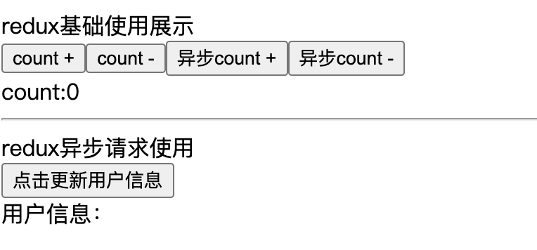

# 09-状态管理 Redux

## 一 Redux 概念

Redux 是一款集中状态管理库，适用于 React、Angular、Vue 等库，但经常与 React 配合使用。

redux 使用场景：

- 多个组件的状态需要其他组件随时使用（共享）

- 存在很多组件之间更改对方状态（通信）场景

redux 工作如图：


**store**：store 用于维护 state，可以将 action 与 reducer 联系到一起，是整个 redux 的核心部分。

**action**：是负责将数据从应用传递到 store 的对象。触发 action 是唯一可以改变 state 的方法。给 store 发送 aciton 方式：`store.dispatch()`。

**reducer**：reducer 只是一些纯函数，接收到数据更改要求（action），返回新的 state 给 store。reducer 可以实现复用、顺序控制等。

应用中所有的 state 都以一个对象树的形式储存在一个单一的 store 中。state 中的数据是只读的，惟一改变 state 的办法是使用 dispatch 派发 action，具体的更新方式位于对应的 reducer（返回一个新的 state）。

Redux 的设计原则：

- 单一数据源：与 MVC 不同（Model 之间互相监听、触发），Redux 认为一个应用只需要一个唯一数据源，这会导致产生一个极大的 JS 对象，Redux 通过 combineReducers() 解决
- 状态只读：redux 没有真正意义上的 store，即无法用代码定义，reducer 也只是返回一个全新的状态
- 状态修改由纯函数完成：每个 reducer 都是纯函数，没有副作用，使得 redux 变得容易测试。

## 二 redux 简单示例

### 2.1 Redux 基础使用

安装 redux 相关库：

```txt
npm i -S redux
```

代码示例：

```js
import { createStore } from 'redux'

// reducer
const initCount = {
  count: 0,
}
function counterReducer(state = initCount, action) {
  switch (action.type) {
    case 'INCREMENT':
      return {
        ...state,
        count: state.count + action.payload.num,
      }
    case 'DECREMENT':
      return {
        ...state,
        count: state.count - action.payload.num,
      }
    default:
      console.log('未执行操作')
      return state
  }
}

// 创建 Store
const store = createStore(
  counterReducer,
  // 支持 redux-devtools 谷歌插件
  window.__REDUX_DEVTOOLS_EXTENSION__ && window.__REDUX_DEVTOOLS_EXTENSION__()
)

// 创建第一个 Action：对 count+1
function countAddAction() {
  return {
    type: 'INCREMENT',
    payload: {
      num: 1,
    },
  }
}

// 创建第二个 Action：对 count-2
function countMinusAction() {
  return {
    type: 'DECREMENT',
    payload: {
      num: 2,
    },
  }
}

// 执行 action，改变数据
store.dispatch(countAddAction())
store.dispatch(countMinusAction())

// 获取数据
console.log(store.getState()) // {count: -1}
```

### 2.2 combine 合并多个 reducer

store 在创建时，可以支持多个 reducer，使用 combine 合并：

```js
import { createStore, combineReducers } from 'redux'

const rootReducers = combineReducers({
  counter: counterReducer,
  other: otherRerucer,
})

// 创建 Store
const store = createStore(
  rootReducers,
  window.__REDUX_DEVTOOLS_EXTENSION__ && window.__REDUX_DEVTOOLS_EXTENSION__()
)
```

**注意：合并时 reducer 的名字会将状态数据分组，会决定 state 中的属性的获取方式，比如合并前在组件中获取属性为：state.count，合并的名字为 counter，则获取方式为：state.counter.count**。

## 三 Redux 中间件

### 3.1 redux 中间件基础示例

在 redux 中可以使用一些中间件，多个中间件也可以组合使用，中间件会在发出 action，reducer 执行数据维护之前执行一些操作，如下所示：

```js
import { createStore, applyMiddleware } from 'redux'
import thunk from 'redux-thunk' // 异步请求中间件
import { createLogger } from 'redux-logger' // 日志中间件

// 环境
let isDev = true

// logger 中间件
const logger = createLogger({
  predicate: isDev,
  collapsed: true,
})

// 集成中间件:apply 函数用于加载中间件
let appliedMiddlewares = applyMiddleware(...[thunk, logger])
if (isDev) {
  const { composeWithDevTools } = require('redux-devtools-extension')
  appliedMiddlewares = composeWithDevTools(appliedMiddlewares)
}

// 创建 Store
const store = createStore(rootReducers, appliedMiddlewares)
```

贴士：这里 redux-devtool 使用了扩展，依赖于 react-redux，所以需要这样安装： `npm install -S redux react-redux`。

### 3.2 Redux 中间件原理

redux 中间件工作图：


点击 button1 触发一个同步数据流场景，在回调中分发一个 action，reducer 收到该 action 后更新 state，触发 view 重新渲染。如果此时我们需要一个日志功能：打印每个 action 信息进行调试，就需要修改 dispatch/reducer 的实现。如果还需要在点击 button 后，先异步获取数据，数据返回后才能重新渲染 view，即希望 dispatch/reducer 具备异步请求功能等等。一旦业务场景多样化后，单纯修改 dispatch 或 reducer 的代码显然不具有普适性。这时候就需要一个可以组合的、自由插拔的插件机制。

middleware 原理：

```js
// 柯里化思想
export default function applyMiddleware(...middlewares) {
  return (next) => (reducer, initialState) => {
    let store = next(reducer, initialState)
    let dispatch = store.dispatch
    let chain = []
    var middlewareAPI = {
      getState: store.getState,
      dispatch: (action) => dispatch(action),
    }
    chain = middlewares.map((middleware) => middleware(middlewareAPI))
    dispatch = compose(...chain)(store.dispatch)
    return {
      ...store,
      dispatch,
    }
  }
}
```

用户开发的 logger 中间件示例：

```js
export default (store) => (next) => (action) => {
  console.log('dispatch:', action)
  next(action)
  console.log('finish:', action)
}
```

### 3.3 redux 异步流

请求发送的最好的地方是：action creator。redux 中可以使用 redux-thunk 中间件实现异步流。

thunk 函数是针对多参数函数的柯里化，以实现函数的惰性求值。任何函数，只要参数有回调函数，都可以写成 thunk 函数形式：

```js
// 将 node 的  fs.readFile(filename, callback) thunk 化
const Thunk = function (filename) {
  return function (callback) {
    return fs.readFile(filename, callback)
  }
}

// 使用该 thunk
const readFileChunk = Thunk(filename)
readFieChunk(callback)
```

redux-thunk 源码：

```js
function createThunkMiddleware(extraArgument) {
  return ({ dispatch, getState }) =>
    (next) =>
    (action) => {
      if (typeof action === 'function') {
        return action(dispatch, getState, extraArgument)
      }
      return next(action)
    }
}
```

当 action 为函数的时候，我们并没有调用 next 或 dispatch 方法，而是返回 action 的调用。这里的 action 即为一个 Thunk 函数，以达到将 dispatch 和 getState 参数传递到函数内的作用。

异步请求示例 (把同步 action 变成了异步 action)：

```js
function getProducts(url, params) {
  return (dispatch, getState) => {
    fetch(url, params)
      .then((result) => {
        dispatch({
          type: 'GET_PRODUCTS_SUCCESS',
          payload: result,
        })
      })
      .catch((err) => {
        dispatch({
          type: 'GET_PRODUCTS_ERROR',
          error: err,
        })
      })
  }
}
```

使用 async/await 语法简化：

```js
const fetchData = (url, params) => fetch(url, params)
async function getProducts(url, params) {
  const result = await fetchData(url, params)
  if (result.error) {
    return {
      type: 'GET_PRODUCTS_ERROR',
      error: result.error,
    }
  }
  return {
    type: 'GET_PRODUCTS_SUCCESS',
    payload: result,
  }
}
```

多异步串联可以通过 promise 传递，将同步、异步都进行统一封装：

```js
const sequenceMiddleware =
  ({ dispatch, getState }) =>
  (next) =>
  (action) => {
    if (!Array.isArray(action)) {
      return next(action)
    }
    return action.reduce((result, currAction) => {
      return result.then(() => {
        return Array.isArray(currAction)
          ? Promise.all(currAction.map((item) => dispatch(item)))
          : dispatch(currAction)
      })
    }, Promise.resolve())
  }
```

上述示例中使用 Promise.resolve() 来初始化 action.reduce 方法，然后始终使用 Promise.then() 方法串联起数组，达到了串联步骤的目的。

实践示例，先获取商品分类再获取商品：

```js
function getCurrentCategory() {
  return {
    url: '',
    params: {},
    types: [null, 'GET_Category_SUCCESS', null],
  }
}
function getProducts(cid) {
  return {
    url: '',
    params: { cityId },
    types: [null, 'GET_Products_SUCCESS', null],
  }
}
function loadInitData(ip) {
  return [
    getCurrentCategory(ip),
    (dispatch, state) => {
      dispatch(getProducts(state))
    },
  ]
}
```

## 四 react-redux 综合示例

### 4.1 示例目录

react-redux 是 redux 针对 react 推出的库，提供了 connect、Provider 等配合 redux 能够更好的在组件中传递状态。

所有文件目录：


demmo 示例：


### 4.2 入口传递 store

入口通过 Provider 挂载传递 store，在根组件中使用后才能在其他组件中任意使用对应状态、函数：

```js
import { Provider } from 'react-redux'

import Store from './store'

import CompA from './components/CompA'
import CompB from './components/CompB'

function App() {
  return (
    <Provider store={Store}>
      <div className="App">
        <CompA />
        <CompB />
      </div>
    </Provider>
  )
}

export default App
```

### 4.3 store

store 文件专门用于暴露一个 store 对象，整个应用只有一个 store 对象，其内容与 2.3 中间件小节中所示无异：

```js
import { createStore, applyMiddleware } from 'redux'
import thunk from 'redux-thunk' // 异步请求中间件
import { createLogger } from 'redux-logger' // 日志中间件

import { reducer } from './reducers/countReducer'

// 环境
let isDev = true
const logger = createLogger({
  predicate: isDev,
  collapsed: true,
})

// 集成中间件
let appliedMiddlewares = applyMiddleware(...[thunk, logger])
if (isDev) {
  const { composeWithDevTools } = require('redux-devtools-extension')
  appliedMiddlewares = composeWithDevTools(appliedMiddlewares)
}

const store = createStore(reducer, appliedMiddlewares)

export default store
```

### 4.4 constants.js

该模块是用于定义 action 对象中 type 类型的常量值，目的只有一个：便于管理的同时防止程序员单词写错。

```js
const ActionTypes = {
  counter: {
    INCREMENT: 'INCREMENT',
    DECREMENT: 'DECREMENT',
  },
  user: {
    GET_USER: 'GET_USER',
    GET_USER_LOADING: 'GET_USER_LOADING', // 正在请求中
    GET_USER_SUCCESS: 'GET_USER_SUCCESS',
    GET_USER_FAIL: 'GET_USER_FAIL',
  },
}

export default ActionTypes
```

### 4.5 actions

actions 文件夹内全部是视图组件对应的各自 action 对象，以 count 组件对应的 acount_action.js 文件为例：

countActions：

```js
import ActionTypes from '../contants'

export function addAction() {
  return {
    type: ActionTypes.counter.INCREMENT,
    payload: {},
  }
}

export function subAction() {
  return {
    type: ActionTypes.counter.DECREMENT,
    payload: {
      num: 1,
    },
  }
}

export function addActionAsync() {
  return (dispatch) => {
    setTimeout(() => {
      dispatch({
        type: ActionTypes.counter.INCREMENT,
        payload: {},
      })
    }, 1500)
  }
}

export function subActionAsync() {
  return (dispatch) => {
    setTimeout(() => {
      dispatch({
        type: ActionTypes.counter.DECREMENT,
        payload: {
          num: 1,
        },
      })
    }, 1000)
  }
}
```

userAtions，包含异步请求：

```js
import ActionTypes from '../contants'

export const getUserLoadingAction = () => {
  return {
    type: ActionTypes.user.GET_USER_LOADING,
  }
}

export const getUserSuccessAction = (data) => {
  return {
    type: ActionTypes.user.GET_USER_SUCCESS,
    payload: {
      data: data,
    },
  }
}

export const getUserFailAction = (error) => {
  return {
    type: ActionTypes.user.GET_USER_FAIL,
    payload: {
      error: error,
    },
  }
}

export const fetchUser = (params) => {
  const { isUpdate } = params

  return (dispatch) => {
    // 状态一：加载中状态
    dispatch(getUserLoadingAction())

    // 开始请求
    fetch(`http://localhost:3100/user?isUpdate=${isUpdate}`)
      .then((res) => {
        return res.json()
      })
      .then((data) => {
        console.log('fetch data:', data)
        // 状态二：请求成功状态
        dispatch(getUserSuccessAction(data))
      })
      .catch((err) => {
        // 状态三：请求失败状态
        dispatch(getUserFailAction(err))
      })
  }
}
```

### 4.6 reducers

reducers 文件夹内全部是 actions 对应的 reducer，以 count 组件为例，acount_reducer.js 是 count_actions 对应的所有 reducer：

```js
import ActionTypes from '../contants'

const initialState = {
  count: 0,
}

const countReducer = (state = initialState, action) => {
  const cur = state.count
  switch (action.type) {
    case ActionTypes.counter.INCREMENT:
      return {
        ...state,
        count: cur + 1,
      }
    case ActionTypes.counter.DECREMENT:
      return {
        ...state,
        count: cur - action.payload.num,
      }
    default:
      return state
  }
}

export default countReducer
```

userReducers:

```js
const initialState = {
  data: [{ name: '', age: 0 }], // 请求的数据结果
  loading: false, // 正在请求中
  error: null, // 请求发生错误
}

const userReducer = (state = initialState, action) => {
  switch (action.type) {
    case 'GET_USER_LOADING':
      return { data: [{ name: '', age: 0 }], loading: true, error: null }
    case 'GET_USER_SUCCESS':
      return { data: action.payload.data, loading: false, error: null }
    case 'GET_USER_FAIL':
      return {
        data: [{ name: '', age: 0 }],
        loading: false,
        error: action.payload.error,
      }
    default:
      return state
  }
}

export default userReducer
```

rootReducer:

```js
import { combineReducers } from 'redux'

import countReducer from './countReducer'
import userReducer from './userReducer'

const rootReducer = combineReducers({
  counter: countReducer,
  user: userReducer,
})

export default rootReducer
```

### 4.7 组件中使用

CompA：mapDispatch

```js
import React from 'react'
import { connect } from 'react-redux'
// import { addAction, subAction, addActionAsync, subActionAsync } from '../../store/actions/countActions'

import * as countActions from '../../store/actions/countActions'
import { bindActionCreators } from 'redux'

class CompA extends React.Component {
  handleAdd = () => {
    // this.props.addAction()
    this.props.countActions.addAction()
  }
  handleSub = () => {
    // this.props.subAction()
    this.props.countActions.subAction()
  }
  handleAddAsync = () => {
    // this.props.addActionAsync()
    this.props.countActions.addActionAsync()
  }
  handleSubAsync = () => {
    // this.props.subActionAsync()
    this.props.countActions.subActionAsync()
  }
  render() {
    return (
      <div>
        <button onClick={this.handleAdd}> count + </button>
        <button onClick={this.handleSub}> count - </button>
        <button onClick={this.handleAddAsync}> 异步 count + </button>
        <button onClick={this.handleSubAsync}> 异步 count - </button>
      </div>
    )
  }
}

const mapDispatchToProps = (dispatch) => {
  // return {
  //     addAction: ()=>{ dispatch(addAction()) },
  //     subAction: ()=>{ dispatch(subAction()) },
  //     addActionAsync: ()=>{ dispatch(addActionAsync())},
  //     subActionAsync: ()=>{ dispatch(subActionAsync())}
  // }
  return {
    countActions: bindActionCreators(countActions, dispatch),
  }
}

export default connect(null, mapDispatchToProps)(CompA)
```

CompB：mapState

```js
import React from 'react'
import { connect } from 'react-redux'

class CompB extends React.Component {
  render() {
    return <div>count:{this.props.counter.count}</div>
  }
}

const mapStateToProps = (state) => {
  return {
    counter: state.counter, // state 内部 counter 的产生是因为 combineReducers 包裹 reducer 操作
  }
}

export default connect(mapStateToProps)(CompB)
```

User：异步请求

```js
import React from 'react'
import { connect } from 'react-redux'

import * as userActions from '../../store/actions/userActions'
import { bindActionCreators } from 'redux'

class User extends React.Component {
  componentDidMount() {
    this.props.userActions.fetchUser({ isUpdate: 0 })
  }

  handlUpdateUser = () => {
    this.props.userActions.fetchUser({ isUpdate: 1 })
  }

  render() {
    console.log('CompUser props:', this.props.user.data[0].name)
    return (
      <div>
        <button onClick={this.handlUpdateUser}>点击更新用户信息</button>
        <div>用户信息：{this.props.user.data[0].name}</div>
      </div>
    )
  }
}

const mapStateToProps = (state) => {
  console.log('map User:', state)
  return {
    user: state.user,
  }
}

const mapDispatchToProps = (dispatch) => {
  return {
    userActions: bindActionCreators(userActions, dispatch),
  }
}

export default connect(mapStateToProps, mapDispatchToProps)(User)
```

## 五 高阶 reducer

### 5.1 reduce 复用

在 Redux 架构中，reducer 是一个纯函数，它的职责是根据 previousState 和 action 计算出新的 state。在复杂应用中，Redux 提供的 combineReducers 让我们可以把顶层的 reducer 拆分成多个小的 reducer，分别独立地操作 state 树的不同部分。而在一个应用中，很多小粒度的 reducer 往
往有很多重复的逻辑，使用高阶 reducer 可以抽取公用逻辑，减少代码冗余。

高阶 reducer 就是指将 reducer 作为参数或者返回值的函数。combineReducers 其实就是一个高阶 reducer，combineReducers 将一个 reducer 对象作为参数，最后返回顶层的 reducer。

我们将顶层的 reducer 拆分成多个小的 reducer，肯定会碰到 reducer 的复用问题。例如有 A 和 B 两个模块，它们的 UI 部分相似，此时可以通过配置不同的 props 来区别它们。那么这种情况下，A 和 B 模块能不能共用一个 reducer 呢？答案是否定的。我们先来看一个简单的 reducer：

```js
const LOAD_DATA = 'LOAD_DATA'
const initialState = {}

function loadData() {
  return {
    type: LOAD_DATA,
  }
}

function reducer(state = initialState, action) {
  switch (action.type) {
    case LOAD_DATA:
      return {
        ...state,
        data: action.payload,
      }
    default:
      return state
  }
}
```

loadData 来分发相应的 action 时，A 和 B 的 reducer 都会处理这个 action，然后 A 和 B 的内容就完全一致了。这里我们需要意识到，在一个应用中，不同模块间的 actionType 必须是全局唯一的。因此，要解决 actionType 唯一的问题，有一个方法就是通过添加前缀的方式来做到：

```js
function generateReducer(prefix, state) {
  const LOAD_DATA = prefix + 'LOAD_DATA'
  const initialState = { ...state }

  return function reducer(state = initialState, action) {
    switch (action.type) {
      case LOAD_DATA:
        return {
          ...state,
          data: action.payload,
        }
      default:
        return state
    }
  }
}
```

这样只要 A 模块和 B 模块分别调用 generateReducer 来生成相应的 reducer，就能解决 reducer 复用的问题了。而对于 prefix，我们可以根据自己的项目结构来决定，例如 `${页面名称}_${模块名称}`。只要能够保证全局唯一性，就可以写成一种前缀。

### 5.2 reducer 增强

高阶 reducer 的另一个重要作用就是对原始的 reducer 进行增强。
redux-undo 就是典型的利用高阶 reducer 来增强 reducer 的例子，它的主要作用是使任意 reducer 变
成可以执行撤销和重做的全新 reducer。我们来看看它的核心代码实现：

```js
function undoable(reducer) {
  const initialState = {
    // 记录过去的 state
    past: [],
    // 以一个空的 action 调用 reducer 来产生当前值的初始值
    present: reducer(undefined, {}),
    // 记录后续的 state
    future: [],
  }
  return function (state = initialState, action) {
    const { past, present, future } = state
    switch (action.type) {
      case '@@redux-undo/UNDO':
        const previous = past[past.length - 1]
        const newPast = past.slice(0, past.length - 1)
        return {
          past: newPast,
          present: previous,
          future: [present, ...future],
        }
      case '@@redux-undo/REDO':
        const next = future[0]
        const newFuture = future.slice(1)
        return {
          past: [...past, present],
          present: next,
          future: newFuture,
        }
      default:
        // 将其他 action 委托给原始的 reducer 处理
        const newPresent = reducer(present, action)
        if (present === newPresent) {
          return state
        }
        return {
          past: [...past, present],
          present: newPresent,
          future: [],
        }
    }
  }
}
```

有了这个高阶 reducer，就可以对任意一个 reducer 进行封装：

```js
import { createStore } from 'redux'
function todos(state = [], action) {
  switch (action.type) {
    case 'ADD_TODO':
    // ...
  }
}
const undoableTodos = undoable(todos)
const store = createStore(undoableTodos)
store.dispatch({
  type: 'ADD_TODO',
  text: 'Use Redux',
})
store.dispatch({
  type: 'ADD_TODO',
  text: 'Implement Undo',
})
store.dispatch({
  type: '@@redux-undo/UNDO',
})
```

高阶 reducer 主要通过下面 3 点来增强 reducer：

- 能够处理额外的 action；
- 能够维护更多的 state；
- 将不能处理的 action 委托给原始 reducer 处理。
