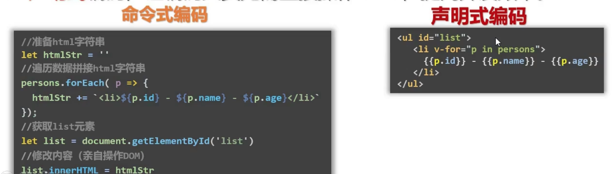
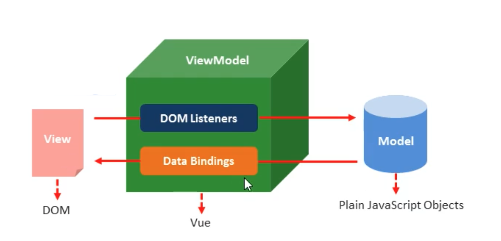

# 01.1-Vue 简介

## 一 开发思想 概念

### 1.1 MVC

在大型项目开发中，往往需要用业务逻辑、数据、界面显示分离的方法组织代码，以便在代码需要改进时能够做到最小化变更，便于扩展维护。

最经典的软件设计规范即 MVC（Model View Controller）：


- 模型 model：对业务数据的抽象，如用户数据包括：uid、name、age 等，在模型层，将其抽象为 User 对象，包含上述字段，并附带基础的增删改查实例操作
- 视图 view：数据的可视化界面。更加面向普通用户，提供给了用户操作界面，即前端开发中最常见的网页
- 控制器 controller：数据流向的控制者，在数据发生变化时更新视图。控制层位于视图层与模型层中间，负责视图层数据的流转，即根据用户在视图层提交的数据，去模型层执行增删改查等操作

### 1.2 MVVM

MVC 思想在传统后端领域实现较多，但是在前端，开发者更多关注的是界面与数据。前端在行为交互上存在大量的相同代码，比如 tab 切换需要反复对几个 tab 元素进行循环遍历从而实现数据到界面，界面到数据的双向交互，MVC 思想在前端领域适应性较低。

MVVM 是前端视图层的分层开发思想，将前端视图的结构划分为 M（model）、V（view）、VM（view-model）三层：

- M：数据模型层，这里是接口请求到的数据结果集，封装于 data 对象中，专门用来保存每个页面里单独的数据。
- V：视图层，vue 实例所控制的元素区域，即每个页面的 html 结构。
- VM：VM 调度者，即 new 出来的 vue 实例对象，用来解耦视图层与数据模型层。视图层想要获取或保存数据的都需要由 vm 做中间处理。

MVC 里的 C 是控制器，由不同的控制函数/对象，手动实现调度数据与视图转换。MVVM 的 VM 内部往往也存在一个虚拟 DOM，有了该调度者，开发者不再需要反复关注 DOM，只用与后台进行数据交互即可，数据模型的变更能够自动驱动视图的变更。

在前端中常见的具有 MVVM 思想的框架有：React、Vue。

在 MVVM 中：

- 模型层数据发生变动，通过数据绑定形式驱动界面发生改变；
- 界面上的数据发生改变时，通过对 DOM 的监听驱动模型层数据发生改变！

负责数据绑定、DOM 监听的就是 MVVM 编程的核心 VM 层，Vue/React 框架便是在其内部实现了这些机制。

### 1.3 Vue 与 React

Vue 与 React 均是当前流行的框架，也都受到了 MVVM 编程思想的影响。二者的本质区别是：数据响应方式不同。React 侧重于用户手动 setState() 更新，Vue 中数据改动则界面自动更新。

二者没有绝对优劣，只是开发思维的不同。React 可以使用 mobx 实现类似 Vue 的响应编程，Vue 也可以把数据 freeze，不再具备响应式。

### 1.4 单页面应用弊端

使用 MVVM 思想可以让一个单页面就能实现一个完整的应用，虽然有一定的优点，但是在一个超大项目中，需要集成很多模块，造成其首次加载速度变慢，且一个局部异常容易造成整个 APP 无法使用。而多页面应用就不会有这两个缺点，笔者推荐使用的方式是：

**多页导航 + 单模块单页应用**。

## 二 Vue 框架

### 2.1 Vue 简介

Vue 是一个渐进式 MVVM 框架，只关注视图层（view），用来构建 Web 应用界面。所谓渐进式，即我们需要哪些功能就使用框架的哪些模块即可，vue 这样处理使其减少侵入性。

Vue 提供的主要功能：

- 声明式渲染：Vue 的核心库提供了数据渲染功能（vue 模板引擎），实现视图与数据解耦。
- 组件系统：对界面进行组件化
- 前端路由：可以用来制作移动端单页面应用
- 状态管理：对共享数据进行管理

Vue 与 原生 JS 对比：

- DOM 操作：原生 JS 如果要操作 UI，需要频繁操作 DOM，效率较低。（注意：jQuery 只是优化了 DOM 操作的代码写法而已，本质与原生 JS 一致）。React 框架内部实现了虚拟 DOM，在界面需要更新时，React 会在虚拟 DOM 中比较渲染前后的差异，决定最优更新哪些 DOM，由于虚拟 DOM 是内存数据，对实际 DOM 操作的仅仅是 Diff 部分，因而提高了性能。
- 组件化：原生 JS 组件化方案支持度不足，React 有完善的组件化支持（声明式）

贴士：在操作大量 DOM 时，js 的运行速度会被严重拖累。时常在更新数据后需要重新渲染页面，这样会造成一个困扰：数据未发生改变的地方也要被重新渲染一遍，资源严重浪费，虚拟 DOM 很好的解决了该问题。

贴士：虚拟 DOM 上绑定的属性极少，更加轻量（因为只有框架自己使用）

### 2.2 React 与 Vue 对比

React 与 Vue 共同点：

```txt
都具备 MVVM 思想
内部都采用虚拟 DOM 方式进行视图更新
具备组件化开发理念，且采用声明式编码，可以让编码人员无需直接操作 DOM，提高开发效率。
```

声明式编码：


他们在组件化开发方式上：React 采用 JSX 来编写组件，而 Vue 使用单文件组件方式开发组件。

### 2.3 Vue 的 MVVM 原理

Vue 的 MVVM 的原理图：


## 三 HelloWorld

```html
<div id="app">
  <div>{{msg}}</div>
  <!-- 获取数据 -->
  <button v-on:click="change">点击弹出数据</button>
  <!-- 绑定事件 -->
</div>

<!-- 当导入 vue 之后，在浏览器的内存中就多了一个 vue 构造函数 -->
<script src="https://cdn.jsdelivr.net/npm/vue/dist/vue.js"></script>
<script>
  // Vue 实例
  new Vue({
    el: '#app', // 挂载元素
    // 数据源
    data: {
      msg: 'hello world',
    },
    methods: {
      change() {
        alert(this.msg)
      },
    },
  })
</script>
```

上面的示例展示了 Vue 的两个核心功能：

- **声明式渲染**：Vue 基于标准 HTML 拓展了一套模板语法，使得我们可以声明式地描述最终输出的 HTML 和 JavaScript 状态之间的关系。
- **响应性**：Vue 会自动跟踪 JavaScript 状态并在其发生变化时响应式地更新 DOM。

## 四 脚手架 vue-cli

### 4.1 脚手架创建项目

Vue 官方也提供了完整的脚手架 vue-cli，利用该脚手架可以简单实现构建项目、打包编译上述文件：

```txt
# 安装脚手架
npm install -g @vue/cli

# 查看是否安装成功
vue

# 生成基础项目 根据项目需求选择模板，这里推荐使用 3.x 版本
vue create myapp

# 运行项目
cd myapp
npm run serve
```

项目生成后，vue-cli 默认提供了三个运行脚本：

- `npm run serve`：开发环境构建
- `npm run build`：生产环境构建
- `npm run lint`：格式化编码格式

贴士：vue-cli 也提供了可视化的操作，在命令行中输入`vue ui`，则会启动一个本地服务，打开<http://localhost:8000>即可。

### 4.2 初始化项目文件分析

使用 vue-cli 创建的是单页面应用，也就是说拥有一个 html 页面，在该页面中从根元素开始进行页面渲染。该文件位于 `public/index.html`：

```html
<body>
  <noscript>
    <strong>
      We're sorry but <%= htmlWebpackPlugin.options.title %> doesn't work
      properly without JavaScript enabled. Please enable it to continue.
    </strong>
  </noscript>
  <div id="app"></div>
  <!-- built files will be auto injected -->
</body>
```

这里只有根组件 `id="app"`，并没有引入其他文件、代码，是因为 vue-cli 默认使用了打包工具，在 build 阶段，会自动将项目代码生成到该根组件中！

### 4.3 反向代理解决跨域问题

单页面应用在开发时往往面临着跨域问题，而服务端与服务端进行通信时，是没有跨域问题的。在开发时，vue 已经提供了一个 Node 服务器，并实现了静态文件管理等功能，此时只需要该服务器代理 vue 的请求即可。

在项目根目录创建 `vue.config.js` 文件：

```js
module.exports = {
  devServer: {
    proxy: {
      '/api': {
        target: '<url>',
        ws: true,
        changeOrigin: true,
      },
      '/about': {
        target: '<url>',
        ws: true,
        changeOrigin: true,
      },
    },
  },
}
```
