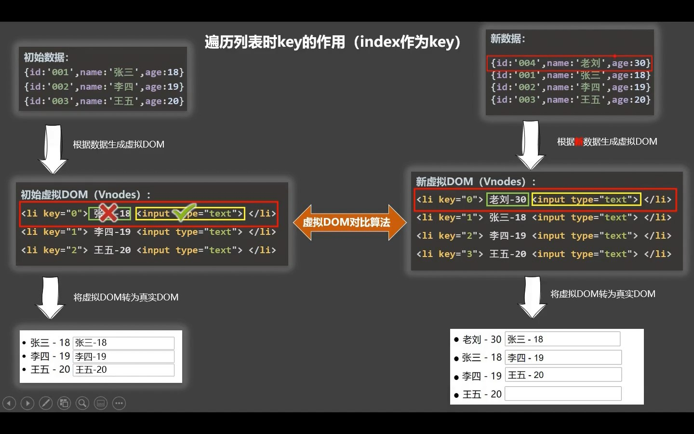

# 04.3-常见操作-列表渲染

## 一 v-for 渲染示例

v-for 指令可以基于一个数组渲染一个列表，其语法是： `item in items`：

```html
<div id="app">
  <!--推荐写法-->
  <h2 v-for="item in arr" :key="item.id">{{item}}</h2>
  <h5 v-for="(item, index) of arr" :key="item.id">{{item}}</h5>

  <!--不推荐该写法-->
  <h5 v-for="(item, index) in arr" :key="index">{{item}}</h5>
</div>
```

v-for 遍历对象时，会基于 `Object.keys()` 遍历该对象的所有属性，第二个参数为属性名，第三个参数为位置索引：

```html
<li v-for="(value, key, index) in myObject">
  {{ index }}. {{ key }}: {{ value }}
</li>
```

此外 v-for 也可以直接接受一个数值：

```js
// n 从 1 开始
<span v-for="n in 10">{{ n }}</span>
```

## 二 v-if 与 v-for

同时使用 v-if 和 v-for 是不推荐的，因为这样二者的优先级不明显。

当它们同时存在于一个节点上时，v-if 比 v-for 的优先级更高。这意味着 v-if 的条件将无法访问到 v-for 作用域内定义的变量别名：

```js
// 这会抛出一个错误，因为属性 todo 此时没有在该实例上定义
<li v-for="todo in todos" v-if="!todo.isComplete">
  {{ todo.name }}
</li>
```

在外新包装一层 `<template>` 再在其上使用 v-for 可以解决这个问题 (这也更加明显易读)：

```js
<template v-for="todo in todos">
  <li v-if="!todo.isComplete">
    {{ todo.name }}
  </li>
</template>
```

## 三 通过 key 管理状态

如果没有写 key，vue 默认会使用循环索引 index 作为 key。默认模式是高效的，但只适用于列表渲染输出的结果不依赖子组件状态或者临时 DOM 状态 (例如表单输入值) 的情况。

但是默认循环的 key 在一些特殊场景下会产生 BUG，且存在性能问题，如图所示：



如图所示，左侧的数据在虚拟 DOM 中准备好后渲染在了真实 DOM 上，且用户在真实 DOM 上输入了对应数据。当我们为添加一行数据，且该数据添加在第一行后，新的虚拟 DOM 与旧的虚拟 DOM 对比时就会发现第一行的数据发生了变化，但是 input 输入框没有变化，在渲染时，第一行的用户名被正确渲染，但是输入框部分仍然使用了旧虚拟 DOM 中的输入框。且这种插入顺序也会导致所有的数据被重新渲染了一遍，性能较低。

## 四 数组数据的变更

Vue 能够侦听响应式数组的变更方法，并在它们被调用时触发相关的更新。这些变更方法包括：

- push()
- pop()
- shift()
- unshift()
- splice()
- sort()
- reverse()

相对地，也有一些不可变 (immutable) 方法，例如 filter()，concat() 和 slice()，这些都不会更改原数组，而总是返回一个新数组。当遇到的是非变更方法时，我们需要将旧的数组替换为新的：

```js
this.items = this.items.filter((item) => item.message.match(/Foo/))
```

你可能认为这将导致 Vue 丢弃现有的 DOM 并重新渲染整个列表——幸运的是，情况并非如此。Vue 实现了一些巧妙的方法来最大化对 DOM 元素的重用，因此用另一个包含部分重叠对象的数组来做替换，仍会是一种非常高效的操作。

## 五 展示过滤或排序后的结果

有时，我们希望显示数组经过过滤或排序后的内容，而不实际变更或重置原始数据。在这种情况下，你可以创建返回已过滤或已排序数组的计算属性。

举例来说：

```js
// template
<li v-for="n in evenNumbers">{{ n }}</li>

// script
data() {
  return {
    numbers: [1, 2, 3, 4, 5]
  }
},
computed: {
  evenNumbers() {
    return this.numbers.filter(n => n % 2 === 0)
  }
}
```

在计算属性不可行的情况下 (例如在多层嵌套的 v-for 循环中)，你可以使用以下方法：

```js
// template
<ul v-for="numbers in sets">
  <li v-for="n in even(numbers)">{{ n }}</li>
</ul>

// script
data() {
  return {
    sets: [[ 1, 2, 3, 4, 5 ], [6, 7, 8, 9, 10]]
  }
},
methods: {
  even(numbers) {
    return numbers.filter(number => number % 2 === 0)
  }
}
```

在计算属性中使用 reverse() 和 sort() 的时候务必小心！这两个方法将变更原始数组，计算函数中不应该这么做。请在调用这些方法之前创建一个原数组的副本：

```js
// diff
- return numbers.reverse()
* return [...numbers].reverse()
```
