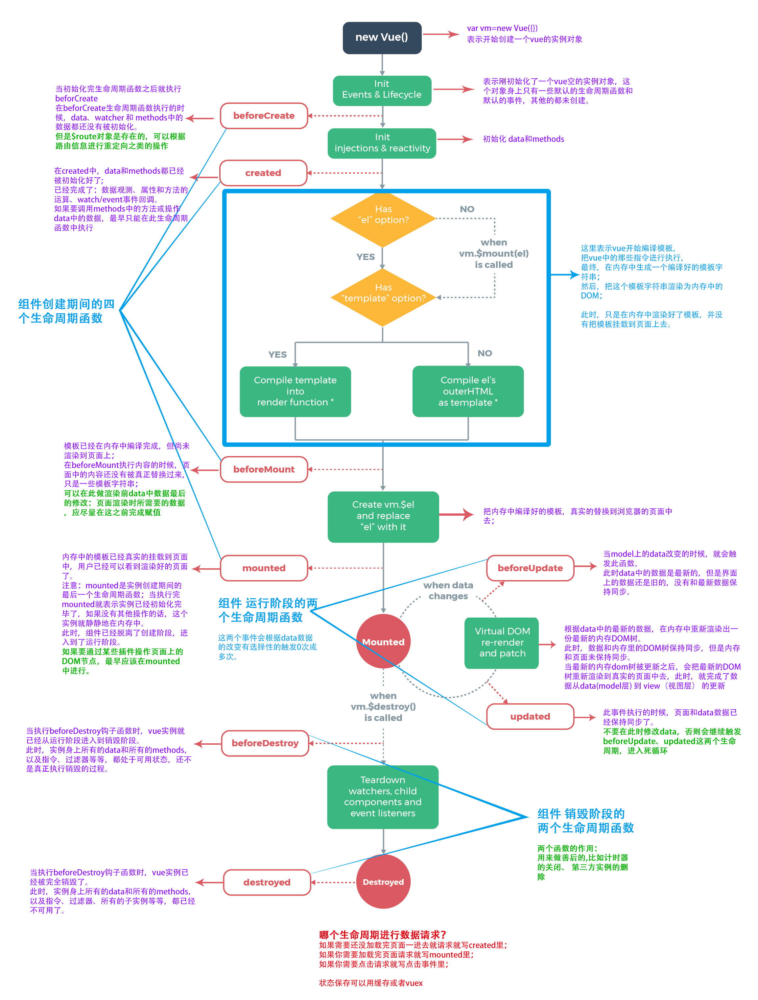

# 07-Vue 生命周期

## 一 Vue 生命周期

Vue 生命周期：Vue 的实例从创建、运行到销毁期间的过程即其生命周期，在此期间伴随着的各种状态改变事件，这些事件也称之为生命周期钩子函数。

如图所示：

Vue 的生命周期一般经过：创建-->挂载-->更新-->销毁几个步骤。

创建期间的初始化、挂载函数：

- beforeCreate：实例刚在内存中被创建出来，此时，还没有初始化好 data 和 methods 属性
- created：实例已经在内存中创建 OK，此时 data 和 methods 已经创建 OK，此时还没有开始 编译模板
- beforeMount：此时已经完成了模板的编译，但是还没有挂载到页面中
- mounted：此时，已经将编译好的模板，挂载到了页面指定的容器中显示

运行期间的更新函数：

- beforeUpdate：状态更新之前执行此函数，此时 data 中的状态值是最新的，但是界面上显示的 数据还是旧的，因为此时还没有开始重新渲染 DOM 节点
- updated：实例更新完毕之后调用此函数，此时 data 中的状态值 和 界面上显示的数据，都已经完成了更新，界面已经被重新渲染好了！

被 keep-alive 缓存的组件激活时或停用时调用：
这两个生命周期函数都是组件在 `<keep-alive></keep-alive>` 中包裹时才生效。

- activated: 被 keep-alive 缓存的组件激活时调用。可以用来在列表页面进入详情页，然后返回列表页面依然停留在上次访问的地方。
- deactivated: 被 keep-alive 缓存的组件停用时调用。
  > 使用场景：用 keep-alive 包裹两个组件：A 和 B，从 A 组件切换到 B 组件时（如 A 组件是列表界面，从当前位置点击进到 B 组件详情界面），会执行 A 组件的 deactivated 生命周期，从 B 组件切换到 A 组件时会执行 A 组件的 activated 生命周期，此时还是停留在 A 组件的上次点击的那条列表信息处。

销毁期间的摧毁函数：

- beforeDestroy：实例销毁之前调用。在这一步，实例仍然完全可用。
- destroyed：Vue 实例销毁后调用。调用后，Vue 实例指示的所有东西都会解绑定，所有的事件监听器会被移除，所有的子实例也会被销毁。

注意：keep-alive 包裹的组件停用时是不会被销毁的，也就是说 `beforeDestroy`，如果销毁钩子中需要设置定时器销毁就会出现定时器不会被销毁的问题，需要利用 deactivated 钩子实现。
