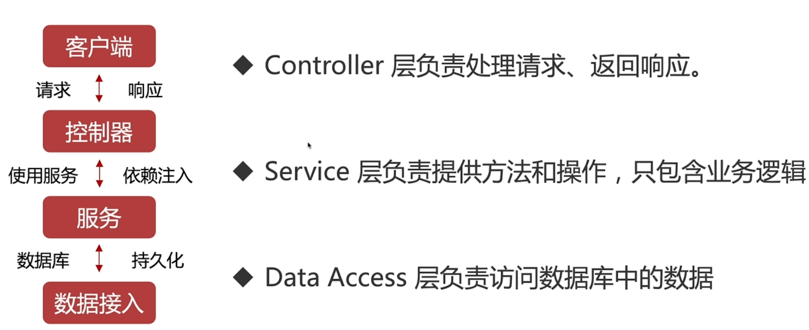
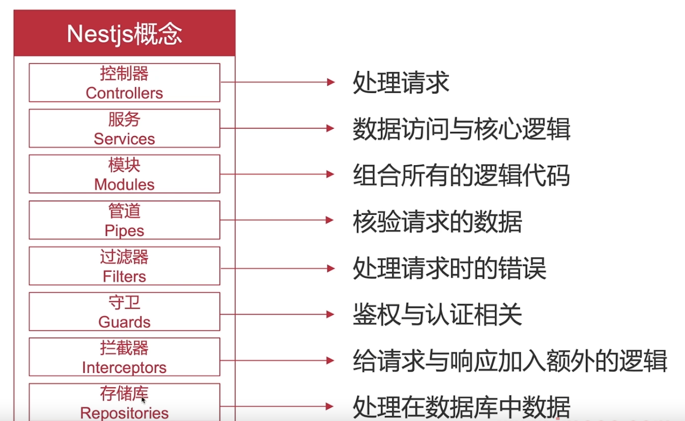

# 02.2-Nestjs 设计思想-核心概念

## 一 Nestj 模块

### 1.1 模块的基本使用

模块化可以更加清晰地组织代码，Nest 通过 Module 装饰器把同一个分层下的代码组织成单独的模块，并能互相聚合称为一个功能完备的功能块。如图所示：


实例代码：

```ts
import { Module } from '@nestjs/common'
import { CatsController } from './cats.controller'
import { CatsService } from './cats.service'
import { CoreModule } from './core/core.module'

@Module({
  imports: [CoreModule],
  controllers: [CatsController],
  providers: [CatsService],
  exports: [CatsService],
})
export class CatsModule {}
```

每个应用都至少有一个根模块，根模块就是 Nest 应用的入口。Nest 会从这里查找出整个应用的依赖/调用图。@Module() 装饰器的四个参数是：

- imports：该模块需要使用其他模块时，在此处将需要使用的模块导入
- controllers：该模块需要用到的控制器集合
- providers：该模块中共享的 provider 集合，provider 可以是 service 等
- exports：让该模块可以被其他模块使用。如果要在不同模块之间共享 provider 可以在 exports 参数中指定。

### 1.2 全局模块

Nest 默认会将 provider 注册到模块作用域上，如果没有显式的导出 provider，那么其他地方就无法使用。如果需要让一个模块随处可见，那么就可以使用 `@Global()` 装饰器来装饰这个模块：

```ts
@Global()
@Module({
  controllers: [CatsController],
  providers: [CatsService],
  exports: [CatsService],
})
export class CatsModule {}
```

### 1.3 共享模块

Nest 中的模块是单例的，可以在不同的模块之间共享任意 Provider 实例，且可以重复导出：

```ts
@Module({
  imports: [CommonModule],
  exports: [CommonModule],
})
export class CoreModule {}
```

模块的构造函数中也可以注入指定的 provider，通常用于配置参数：

```ts
@Module({
  controllers: [CatsController],
  providers: [CatsService],
})
export class CatsModule {
  constructor(private readonly catsService: CatsService) {}
}
```

注意：模块类本身并不可以装饰成 provider，因为这会造成循环依赖。

### 1.4 动态模块

模块的静态方法 forRoot 返回一个动态模块，可以是同步或者异步模块，用于自定义模块：

```ts
import { Module, DynamicModule } from '@nestjs/common'
import { createDatabaseProviders } from './database.providers'
import { Connection } from './connection.provider'

@Module({
  providers: [Connection],
})
export class DatabaseModule {
  static forRoot(entities = [], options?): DynamicModule {
    const providers = createDatabaseProviders(options, entities)
    return {
      module: DatabaseModule,
      providers: providers,
      exports: providers,
    }
  }
}
```

## 二 生命周期



贴士：这些环节的本质只是切面，在这个切面中执行图中对应的钩子方法而已。

## 三 nest 核心设计

nest 的核心设计有：

- 控制器 Controllers：处理请求
- 服务 Services：数据访问与核心逻辑
- 模块 Modules：组织代码
- 管道 Pipes：校验请求数据
- 过滤器 Filters：处理请求时的错误
- 守卫 Guards：鉴权、认证
- 拦截器 Interceptors：给请求、响应加入额外逻辑
- 存储库 Repositories：处理数据库中数据



各个部分作用：

