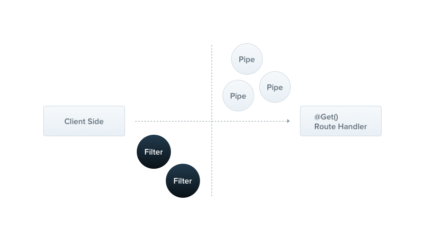

# 03.3-Nestjs 主要功能-管道

## 一 管道作用

管道是实现了 PipeTransform 接口的类，通常 pipe 用来将输入数据转换为所需的输出或者处理验证。与过滤器不同的是，管道偏向于服务端逻辑控制，过滤器偏向于客户端逻辑。



一般情况下，管道用于：

- 转换/变形：转换输入数据为目标格式
- 验证：对输入数据时行验证，如果合法让数据通过管道，否则抛出异常。

如果控制器的方法内写入了管道，则 Nest 会在控制器方法调用前插入管道。不过如果管道会在异常范围内执行，这表示异常处理层可以处理管道异常。如果管道发生了异常，控制器的执行将会停止。

## 二 管道的基础使用

Nest 内置了两种管道：ValidationPipe 和 ParseIntPipe。

管道最常用的地方是参数的转换，如：

```ts
// 这里如果 uid 不是数字，则自动报 404 错误
@Get('demo5/:uid')
demoD(@Param('uid', ParseIntPipe) uid: number) {
  console.log('uid:', uid)
  return uid
}
```

实现 PipeTransform 后，可以自己实现上述管道：

```ts
// nest g pi users/create-user --no-spec
import {
  PipeTransform,
  Injectable,
  ArgumentMetadata,
  BadRequestException,
} from '@nestjs/common'

@Injectable()
export class CreateUserPipe implements PipeTransform<string, number> {
  transform(value: string, metadata: ArgumentMetadata): number {
    const val = parseInt(value, 10)
    if (isNaN(val)) {
      throw new BadRequestException('Validation failed')
    }
    return val // pipe 的return可以返回转换、处理后的数据
  }
}
```

使用自定义管道：

```ts
@Post
addUser(@Body(CreateUserPipe)  dto:any){

}
```

## 二 ValidationPipe 管道的使用

### 3.1 创建管道

```ts
import { PipeTransform, Injectable, ArgumentMetadata } from '@nestjs/common'

@Injectable()
export class ValidationPipe implements PipeTransform {
  transform(value: any, metadata: ArgumentMetadata) {
    return value
  }
}
```

dto 用于定义数据模型类型，但是 TypeScript 类型是静态的、编译时类型，当编译成 JavaScript 后在运行时并没有任何类型校验。这时我们就需要自己去验证，或者借助第三方工具、库来验证。

Nest 官方文档使用的 joi 验证库，需要传入一个 schema，实际上对应着我们的在 Nest 中写的 dto 类型，所以我们只需要给 joi 传入一个 CreateCatDto 类的实例即可。

首页在 ValidationPipe 管道中添加 joi 的验证功能。验证通过就返回，不通过直接抛出异常：

```ts
@Injectable()
export class JoiValidationPipe implements PipeTransform {
  constructor(private readonly schema: Object) {}

  transform(value: any, metadata: ArgumentMetadata) {
    const { error } = Joi.validate(value, this.schema)
    if (error) {
      throw new BadRequestException(SON.stringify(error.details))
    }
    return value
  }
}
```

### 3.2 使用管道

在控制器方法上绑定管道：

```ts
@Post()
@UsePipes(new JoiValidationPipe(createCatSchema))
async create(@Body() createCatDto: CreateCatDto) {
  this.catsService.create(createCatDto);
}
```

使用 @UsePipes 修饰器即可，传入管道的实例，并构造 schema。此时我们的应用就可以在运行时通过 schema 去校验参数对象的开头了。
JOI 文档地址：<https://github.com/sideway/joi/blob/v15.1.0/API.md>：

```ts
const createCatSchema = {
  name: Joi.string().required(),
  age: Joi.number().required(),
  breed: Joi.string().required(),
}
```

例如上面的 schema，如果客户端发送的 POST 请求中如果缺少任意参数 Nest 都会捕获到这个异常并返回信息：

```ts
{
    "statusCode": 400,
    "error": "Bad Request",
    "message": "[{\"message\":\"\\\"name\\\" is required\",\"path\":[\"name\"],\"type\":\"any.required\",\"context\":{\"key\":\"name\",\"label\":\"name\"}}]"
}
```

### 3.3 类验证器

3.2 的方式中 CreateCatDto 和 createCatSchema 过于重复，Nest 在第三方库支持下，也能支持类验证器：

```txt
npm i -S class-validator class-transformer
```

class-validator 可以利用装饰器给类添加额外的验证功能：

```ts
import { IsString, IsInt } from 'class-validator'

export class CreateCatDto {
  @IsString()
  readonly name: string

  @IsInt()
  readonly age: number

  @IsString()
  readonly breed: string
}
```

管道验证器中的代码也需要适配一下：

```ts
import { validate } from 'class-validator'
import { plainToClass } from 'class-transformer'

@Injectable()
export class ValidationPipe implements PipeTransform<any> {
  async transform(value: any, { metatype }: ArgumentMetadata) {
    if (!metatype || !this.toValidate(metatype)) {
      return value
    }
    const object = plainToClass(metatype, value)
    const errors = await validate(object)
    if (errors.length > 0) {
      throw new BadRequestException('Validation failed')
    }
    return value
  }

  private toValidate(metatype: Function): boolean {
    const types: Function[] = [String, Boolean, Number, Array, Object]
    return !types.includes(metatype)
  }
}
```

贴士： 上述示例中的 transform 是 async 异步的，因为内部需要用到异步验证方法。Nest 的管道可以是异步的。

上述管道可以方法、参数内使用：

```ts
// 参数内使用
@Post()
async create(
  @Body(new ValidationPipe()) createCatDto: CreateCatDto,
) {
  this.catsService.create(createCatDto);
}

// 方法内使用
@Post()
@UsePipes(new ValidationPipe())
async create(@Body() createCatDto: CreateCatDto) {
  this.catsService.create(createCatDto);
}
```

管道修饰器入参可以是类而不必是管道实例：

```ts
@Post()
@UsePipes(ValidationPipe)
async create(@Body() createCatDto: CreateCatDto) {
  this.catsService.create(createCatDto);
}
```

由于 ValidationPipe 被尽可能的泛化，所以它可以直接使用在全局作用域上：

```ts
async function bootstrap() {
  const app = await NestFactory.create(ApplicationModule)
  app.useGlobalPipes(new ValidationPipe())
  await app.listen(3000)
}
bootstrap()
```

## 四 数据转模型 DTO

数据访问对象简称 DTO（Data Transfer Object），是一组需要跨进程或网络边界传输的聚合数据的简单容器。它不应该包含业务逻辑，并将其行为限制为诸如内部一致性检查和基本验证之类的活动。

在 Nestjs 中，可以使用 TypeScript 接口或简单的类来完成。配合 class-validator 和 class-transformer 可以很方便地验证前端传过来的参数：

```ts
import { IsString, IsInt, MinLength, MaxLength } from 'class-validator'
import { ApiModelProperty } from '@nestjs/swagger'

export class CreateCatDto {
  @ApiModelProperty()
  @IsString()
  @MinLength(10, {
    message: 'Name is too short',
  })
  @MaxLength(50, {
    message: 'Name is too long',
  })
  readonly name: string

  @ApiModelProperty()
  @IsInt()
  readonly age: number
  @ApiModelProperty()
  @IsString()
  readonly breed: string
}

import { Controller, Post, Body } from '@nestjs/common'
import { CreateCatDto } from './dto'

@Controller('cats')
export class CatsController {
  @Post()
  create(@Body() createCatDto: CreateCatDto) {
    return 'This action adds a new cat'
  }
}
```

在 Nestjs 中，DTO 主要定义如何通过网络发送数据的对象，通常会配合 class-validator 和 class-transformer 做校验。

```ts
import { IsString, IsInt } from 'class-validator'

export class CreateCatDto {
  @IsString()
  readonly name: string

  @IsInt()
  readonly age: number

  @IsString()
  readonly breed: string
}
import {
  Controller,
  Get,
  Query,
  Post,
  Body,
  Put,
  Param,
  Delete,
} from '@nestjs/common'
import { CreateCatDto } from './dto'

@Controller('cats')
export class CatsController {
  @Post()
  create(@Body() createCatDto: CreateCatDto) {
    return 'This action adds a new cat'
  }
}
```

上面对请求 body 定义了一个 DTO，并且在 DTO 中对参数类型进行了限制，如果 body 中传过来的类型不符合要求，会直接报错。

DTO 中的 class-validator 还需要配合 pipe 才能完成校验功能：

```ts
import {
  PipeTransform,
  ArgumentMetadata,
  BadRequestException,
  Injectable,
} from '@nestjs/common'
import { validate } from 'class-validator'
import { plainToClass } from 'class-transformer'
import * as _ from 'lodash'

@Injectable()
export class ValidationPipe implements PipeTransform<any> {
  async transform(value, metadata: ArgumentMetadata) {
    const { metatype } = metadata
    if (!metatype || !this.toValidate(metatype)) {
      return value
    }
    const object = plainToClass(metatype, value)
    const errors = await validate(object)
    if (errors.length > 0) {
      const errorMessage = _.values(errors[0].constraints)[0]
      throw new BadRequestException(errorMessage)
    }
    return value
  }
  private toValidate(metatype): boolean {
    const types = [String, Boolean, Number, Array, Object]
    return !types.find((type) => metatype === type)
  }
}
```

这个 pipe 会根据元数据和对象实例，去构建原有类型，然后通过 validate 去校验。

这个 pipe 一般会作为全局的 pipe 去使用：

```ts
async function bootstrap() {
  const app = await NestFactory.create(ApplicationModule)
  app.setGlobalPrefix('api/v1')

  app.useGlobalPipes(new ValidationPipe())

  await app.listen(3000)
}
bootstrap()
```

假设我们没有这层 pipe，那在 controller 中就会进行参数校验，这样就会打破单一职责的原则。有了这一层 pipe 帮助我们校验参数，有效地降低了类的复杂度，提高了可读性和可维护性。
