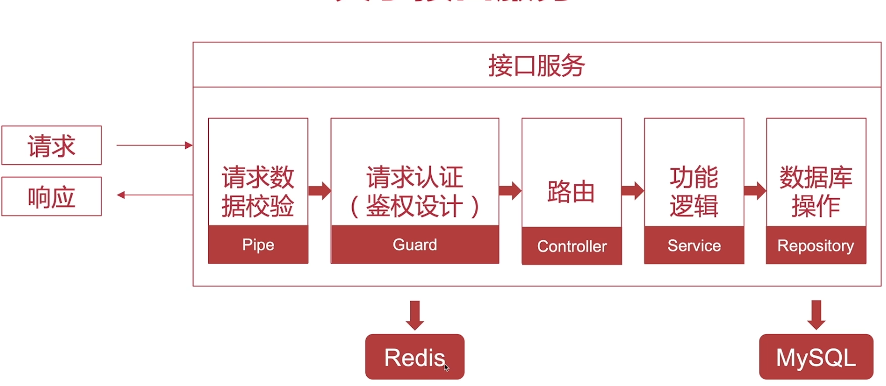

# 03.4-Nestjs 主要功能-守卫

## 一 守卫的功能

守卫是实现了 CanActivate 接口的类，其功能是：决定请求是否需要被控制器处理。一般用在权限、角色的场景中。守卫会在中间件逻辑之后、拦截器/管道之前执行。

守卫和中间件的区别在于：中间件很简单，next 方法调用后中间的任务就完成了。但是守卫还需要鉴别请求与控制器之间的关系。


守卫在鉴权中的使用


## 二 守卫的使用

### 2.1 创建守卫

实现一个守卫：

```ts
import { Injectable, CanActivate, ExecutionContext } from '@nestjs/common'
import { Observable } from 'rxjs'

@Injectable()
export class AuthGuard implements CanActivate {
  // canActivate 返回 true，控制器才正常执行
  canActivate(
    context: ExecutionContext
  ): boolean | Promise<boolean> | Observable<boolean> {
    const request = context.switchToHttp().getRequest()
    return validateRequest(request) // 函数实现 Request 的验证
  }
}
```

这里 ExecutionContext 拥有 2 个方法：

- getHandler() 方法会返回一个将被调用的方法处理器
- getClass() 返回处理器对应的控制器类。

### 2.2 使用守卫

守卫可以是控制器作用域的，也可以是方法作用域或者全局作用域：

```ts
// 控制器作用域
@Controller('cats')
@UseGuards(RolesGuard)
export class CatsController {}

// 全局作用域
const app = await NestFactory.create(ApplicationModule)
app.useGlobalGuards(new RolesGuard())
```

由于在根模块外层引用了全局守卫，这时守卫无法注入依赖，所以这里还需要在要模块上引入：

```ts
import { Module } from '@nestjs/common'
import { APP_GUARD } from '@nestjs/core'

@Module({
  providers: [
    {
      provide: APP_GUARD,
      useClass: RolesGuard,
    },
  ],
})
export class ApplicationModule {}
```

### 2.3 获取执行上下文

虽然现在已经有了守卫，但是它还没有执行上下文。CatsController 应该有一些需要访问到的权限类型。比如：管理员（admin）角色可以访问、其它角色不可以。这时我们需要对控制器（或方法）添加一些元数据，用来标记这个控制器的权限类型。在 Nest 中我们通常使用 @SetMetadata() 装饰器来完成这个工作。

```ts
@Post()
@SetMetadata('roles', ['admin'])
async create(@Body() createCatDto: CreateCatDto) {
  this.catsService.create(createCatDto);
}
```

贴士： SetMetadata 可以自定义：

```ts
import { SetMetadata } from '@nestjs/common'

export const Roles = (...roles: string[]) => SetMetadata('roles', roles)
```

最终使用：

```ts
@Post()
@Roles('admin')
async create(@Body() createCatDto: CreateCatDto) {
  this.catsService.create(createCatDto);
}
```

利用反射机制获取控制器上的数据：

```ts
import { Injectable, CanActivate, ExecutionContext } from '@nestjs/common'
import { Observable } from 'rxjs'
import { Reflector } from '@nestjs/core'

@Injectable()
export class RolesGuard implements CanActivate {
  constructor(private readonly reflector: Reflector) {}

  canActivate(context: ExecutionContext): boolean {
    const roles = this.reflector.get<string[]>('roles', context.getHandler())
    if (!roles) {
      return true
    }
    const request = context.switchToHttp().getRequest()
    const user = request.user
    const hasRole = () => user.roles.some((role) => roles.includes(role))
    return user && user.roles && hasRole()
  }
}
```

### 2.4 多个守卫的使用

多个 gurd 可以合并写在一起，从前往后执行，一旦前面的守卫没有通过，则后续 guard 不会执行：

```ts
@Get()
@UseGuards(AuthGuard('jwt'), AdminGuard)
```

如果装饰器没有合并书写，则方法装饰器的执行顺序是从下往上执行：

```ts
@UseGuards(AdminGuard)
@UseGuards(AuthGuard('jwt'))
```
