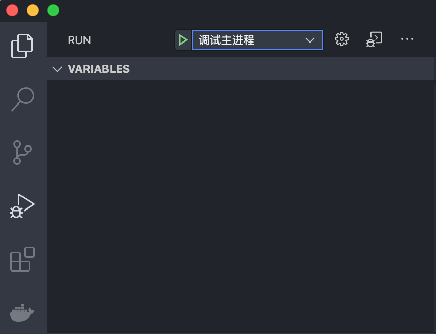
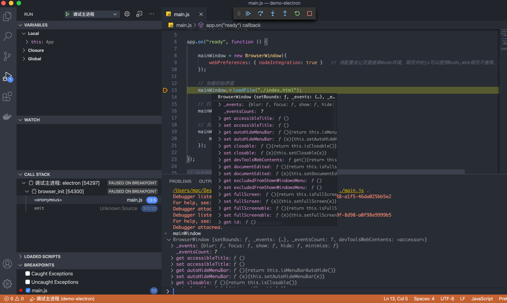
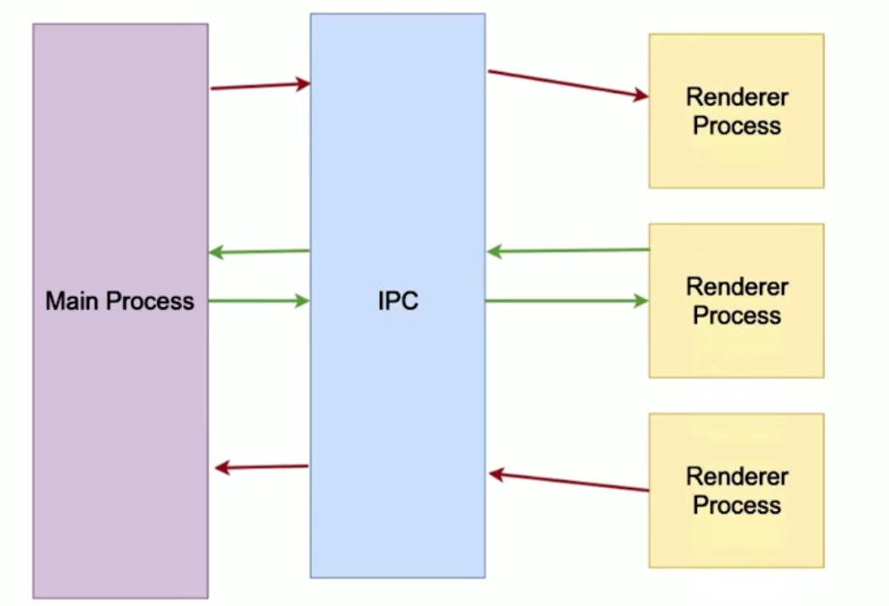

# 04-Electron 桌面 -2-Electron 进程

## 一 Electron 中的主进程与渲染进程

一个 Electron 应用只有一个主进程，但可以有多个渲染进程：

- 主进程：由 Electron 创建，并从口文件开始执行代码的进程。主进程用来监听程序的生命周期事件、管理窗口（渲染进程）、加载页面、程序关闭后回收资源等。
- 渲染进程：一个 BrowserWindow 实例代表一个渲染进程，若该实例被销毁，则渲染进程也会终结。渲染界面负责完成界面渲染、接收用户输入、响应用户交互。



在 HelloWorld 示例中，`electron .` 的入口文件是 `main.js` 文件中的代码，即启动了一个进程，并且执行该代码，创建了窗口、加载了`index.html`，而`index.html`中的代码则会运行在 Electron 的渲染进程中。

贴士：

- 主进程负责管理所有窗口及其对应的渲染进程，开启 `nodeIntegration` 后，渲染进程也有能力访问 Node 的 API。
- GUI 的操作，如：创建窗口、创建菜单只能在主进程中完成，如果需要渲染进程来执行创建，必须让渲染进程发送消息给主进程，主进程接收到消息后执行创建，也可以使用 remote 模块来完成。

Electron 中模块的归属：

```txt
主进程模块：app、BrowserView、autoUpdater、contentTracing、dialog、gloablShortcut、ipcMainMenu、
            MenuItem、net、netLog、Notification、powerMonitor、powerSaveBlocker、protocol、screen、session、systemPreferences、TouchBar、Tray、webContents

渲染进程模块：desktopCapturer。ipcRenderer、remote、webFrame

公用模块：clipboard、crashReporter、nativeImage、shell
```

## 二 进程调试

### 2.1 调试主进程

点击 vscode 的左侧 debug 图标，接着点击 `create a launch.json file`，选择弹出的 `Node` 选项，此时会在根目录创建文件：`.vscode/launch.json`，内容可以修改为如下所示：

```json
{
  // Use IntelliSense to learn about possible attributes.
  // Hover to view descriptions of existing attributes.
  // For more information, visit: https://go.microsoft.com/fwlink/?linkid=830387
  "version": "0.2.0",
  "configurations": [
    {
      "type": "node",
      "request": "launch",
      "name": "调试主进程",
      "skipFiles": ["<node_internals>/**"],
      "program": "${workspaceFolder}/main.js",
      "cwd": "${workspaceFolder}",
      "runtimeExecutable": "${workspaceRoot}/node_modules/.bin/electron",
      "windows": {
        "runtimeExecutable": "${workspaceRoot}/node_modules/.bin/electron.cmd"
      },
      "args": ["."],
      "outputCapture": "std"
    }
  ]
}
```

配置解释：

```txt
name：用于识别启动项目 type：调试环境，这里是 Node
runtimeExecutable：指向批处理文件，用于启动 Electron
${workspaceRoot}：正在进行调试的程序的工作目录的绝对路径
args：启动参数，这里简写为 . ，其实是 index.js
```

配置完毕后，设置一个端点，在 debug 界面，即可点击绿色三角开始调试，如图所示：  


调试结果如图所示，鼠标移入对象时，可以显示其属性，也可以在底部的调试栏中输入对象（示例中是 mainWindow）：



### 2.2 调试渲染进程

渲染进程的调试工机具其实就是 Chrome 开发者工具，使用命令：`Ctrl+Shift+I`可以打开，Mac 下为：`Command+Option+I`。

也可以在`main.js`的代码中手动添加打开代码：

```js
// 打开开发者工具，书写在 loadFile 函数之后
mainWindow.webContents.openDevTools()
```

### 2.3 浏览器 debug 主进程

浏览器也可以用来调试主进程。在启动脚本中添加如下参数：

```txt
"dev": "electron --inspect=5858 ."
```

Electron 项目启动后，打开 Chrome 浏览器，输入 `chrome://inspect`，点击 `Configure` 后，输入配置的端口 `localhost:5858` 即可，此时浏览器会连接该程序。

## 三 进程间的消息传递

### 3.0 Electron 进程通信机制

Electron 使用 IPC（interprocess communication）在进程之间进行通信。



### 3.1 渲染进程向主进程发送消息

`index.html`中发送数据：

```html
<button id="btn">操作</button>
<script>
  const { ipcRenderer } = require('electron')
  document.querySelector('#btn').addEventListener('click', function () {
    ipcRenderer.send('msg_renderUsers', { name: 'lisi' }, { age: 30 }) // 参数可以是多个
  })
</script>
```

注意：**如果出现类似 fs. 错误，则使用 window.require() 即可**

主进程 `main.js`中接收数据：

```js
// 主进程添加的消息处理代码
let { ipcMain } = require('electron')
ipcMain.on('msg_renderUsers', (event, param1, param2) => {
  // event.sender 是渲染进程的 webContents 实例
  console.log('param1：', param1)
  console.log('param2：', param2)
})
```

上述示例在 vscode 的调试模式下，即可在控制台看到打印。这里第一个参数即消息管道的名称，渲染进程的发送管道与主进程的接收管道必须一致，才能进行通信。当然也可以多处监听同一管道的代码，此时若该管道消息发来，则会触发多处监听事件。

无论是渲染进程和主进程谁主动发送，其背后的原理都是进程间通信：**发送的 json 对象被序列化，然后反序列化！所以发送对象原型链上的数据不会被发送**。

上述传递消息的方式是异步的，使用`ipcRenderer.sendSyc`可以同步发送，但是会阻塞渲染进程。

### 3.2 主进程向渲染进程发送消息

主进程 `main.js` 代码：

```js
let { ipcMain } = require('electron')
ipcMain.on('msg_renderUsers', (event, param1, param2) => {
  console.log('param1：', param1)
  console.log('param2：', param2)
  param2.age += 100
  mainWindow.webContents.send('msg_main2View', param1, param2)
})
```

渲染进程中接收：

```html
<button id="btn">操作</button>
<script>
  const { ipcRenderer } = require('electron')
  document.querySelector('#btn').addEventListener('click', function () {
    ipcRenderer.send('msg_renderUsers', { name: 'lisi' }, { age: 30 })
  })
  ipcRenderer.on('msg_main2View', (event, param1, param2) => {
    console.log('param1：', param1)
    console.log('param2：', param2)
  })
</script>
```

上述代码完成了主进程向渲染进程发送消息，渲染进程监听的效果。

### 3.3 多个渲染窗口响应主进程消息

如果打开了新的窗口，新窗口加载同样的页面，设置同样的监听函数，如果主进程再次发送消息，这个新窗口是不会触发监听事件的，因为主进程中使用的是`mainWindow.webContents.send`。

主进程接收消息事件的`event.sender`代表发送消息的渲染进程的`webContents`，可以通过该对象来给对应窗口发送消息：

```js
ipcMain.on('msg_renderUsers', (event, param1, param2) => {
  console.log('param1：', param1)
  console.log('param2：', param2)
  param2.age += 100
  event.sender.send('msg_main2View', param1, param2) // 也可以同理使用：event.reply("msg_main2View", param1, param2)
})
```

贴士：对于同步消息来说，其发送的返回值即是主进程响应的消息，如：`let res = ipcRenderer.sendSync('msg', {name: "lisi"})`

### 3.4 渲染进程之间消息传递

多个窗口之间进行消息传递，最常见的方式是：通过主进程进行中转。因为往往需要传递的时候，正式窗口新建立的时候。

如果已经得知要接收消息的窗口的`webContents`的 id，也可以直接传递：

```js
ipcRenderer.sendTo(win.webContents.id, 'msg', { name: 'lisi' }) // win 即目标窗口
```

## 四 remote 模块

### 4.1 remote 模块访问主进程

remote 模块可以帮助开发者在渲染进程中访问主进程对象。

在`index.html`中增加如下代码：

```html
<button id="openView">打开百度</button>
<script>
  const { remote } = require('electron')
  const BrowserWindow = remote.BrowserWindow
  document.querySelector('#openView').addEventListener('click', function () {
    let win = new BrowserWindow({ width: 800, height: 600 })
    win.loadURL('https://www.baidu.com')
  })
</script>
```

重启或者重新调试，即可看到界面。但是这里要注意的是**由于安全原因，Electron10 默认关闭了 remote，需要开启**，开启方式是在`main.js`中添加：

```js
mainWindow = new BrowserWindow({
  webPreferences: {
    nodeIntegration: true, // 允许界面使用 node
    enableRemoteModule: true, // 开启 remote 模块，Electron10 这里默认是 false
  },
})
```

remote 对象的属性和方法都是主进程的属性和方法的映射，使用 remote 访问主进程时，Electron 内部会构造一个消息，这个消息从渲染进程传送给主进程，主进程完成操作后，再以远程对象的形式传递给渲染进程。

上述代码中，新的 `BrowserWindow` 并不是渲染进程创建的，remote 模块通知主进程，主进程完成窗口实例的创建后，以实例以远程对象的形式返回给渲染进程。这些工作是 Electron 内部完成的！

### 4.2 remote 模块局限性

remote 模块可以降低主进程与渲染进程之间访问的难度，但是也带来了相当多的问题，在 Electron10 中，该模块已经被默认关闭：

- 性能损耗很大：跨进程操作的性能损耗是计算机中最严重的性能消耗点之一。
- 容易产生错误：
- 如：remote 模块使用了主进程某个对象，该对象在某一时刻会触发事件，但是事件处理程序位于渲染进程，这时候消息传递造成的延时很容易让渲染进程中一些代码失效，如：`event.preventDefault()`
- 如：remote 模块的对象其实是代理对象，并不是真实的原始对象。代理对象原型链上的属性不会映射到渲染进程的代理对象上。其次，类似 NaN、Infinity 这些值不能被正确的映射到渲染进程，如果一个主进程方法返回 NaN，则渲染进程 remote 模块获取的是 undefined。
- 安全问题：IPC 管道通信时，如果要加载第三方网页，恶意代码能够通过原型污染攻击来模拟 remote 模块的远程消息，以获取访问主进程模块的权利，从而逃离沙箱。
