# 02-页面渲染流程

## 一 渲染流程

### 1.1 DOM 解析

从网络传给渲染引擎的 HTML 文件字节流是无法直接被渲染引擎理解的，所以要将其转化为渲染引擎能够理解的内部结构，这个结构就是 DOM。DOM 提供了对 HTML 文档结构化的表述。在渲染引擎中，DOM 有三个层面的作用。

从页面的视角来看，DOM 是生成页面的基础数据结构。
从 JavaScript 脚本视角来看，DOM 提供给 JavaScript 脚本操作的接口，通过这套接口，JavaScript 可以对 DOM 结构进行访问，从而改变文档的结构、样式和内容。
从安全视角来看，DOM 是一道安全防护线，一些不安全的内容在 DOM 解析阶段就被拒之门外了。
简言之，DOM 是表述 HTML 的内部数据结构，它会将 Web 页面和 JavaScript 脚本连接起来，并过滤一些不安全的内容。

在渲染引擎内部，有一个叫 HTML 解析器（HTMLParser）的模块，它的职责就是负责将 HTML 字节流转换为 DOM 结构。网络进程加载了多少数据，HTML 解析器便解析多少数据：

网络进程接收到响应头之后，会根据响应头中的 content-type 字段来判断文件的类型，比如 content-type 的值是“text/html”，那么浏览器就会判断这是一个 HTML 类型的文件，然后为该请求选择或者创建一个渲染进程。渲染进程准备好之后，网络进程和渲染进程之间会建立一个共享数据的管道，网络进程接收到数据后就往这个管道里面放，而渲染进程则从管道的另外一端不断地读取数据，并同时将读取的数据“喂”给 HTML 解析器。你可以把这个管道想象成一个“水管”，网络进程接收到的字节流像水一样倒进这个“水管”，而“水管”的另外一端是渲染进程的 HTML 解析器，它会动态接收字节流，并将其解析为 DOM。

HTML 文档在被浏览器接收到时只是一个网络传输过来的字节流，该字节流转换为 DOM 的过称如下所示：

字节流-->分词器（Tokens）-->生成节点（Node）-->DOM。

字节流在解析时利用到了栈结构，首先创建一个为 document 的空 DOM 结构，同时将 document 的开始标签压入栈底，接着依次解析压入其他节点的开始标签、结束标签。

在解析 DOM 时，如果遇到 script 标签，则 HTML 解析器会暂停 DOM 解析，，因为接下来的 JavaScript 可能要修改当前已经生成的 DOM 结构，此时 JS 引擎解析脚本内容并执行，执行完毕后，HTML 解析器恢复解析过程，继续解析后续的内容，直至生成最终的 DOM。

。这里需要重点关注下载环境，因为 JavaScript 文件的下载过程会阻塞 DOM 解析，而通常下载又是非常耗时的，会受到网络环境、JavaScript 文件大小等因素的影响。

不过 Chrome 浏览器做了很多优化，其中一个主要的优化是预解析操作。当渲染引擎收到字节流之后，会开启一个预解析线程，用来分析 HTML 文件中包含的 JavaScript、CSS 等相关文件，解析到相关文件之后，预解析线程会提前下载这些文件。

贴士：async 和 defer 会让 js 脚本变为异步，使用 async 标志的脚本文件一旦加载完成，会立即执行；而使用了 defer 标记的脚本文件，需要在 DOMContentLoaded 事件之前执行。

### 1.2 CSSOM 解析

CSSOM 具有两个作用：

-   提供给 JavaScript 操作样式表的能力
-   为布局树的合成提供基础的样式信息，在 DOM 中就是 document.styleSheets。

等 DOM 和 CSSOM 都构建好之后，渲染引擎就会构造布局树。布局树的结构基本上就是复制 DOM 树的结构，不同之处在于 DOM 树中那些不需要显示的元素会被过滤掉，如 display:none 属性的元素、head 标签、script 标签等。复制好基本的布局树结构之后，渲染引擎会为对应的 DOM 元素选择对应的样式信息，这个过程就是样式计算。样式计算完成之后，渲染引擎还需要计算布局树中每个元素对应的几何位置，这个过程就是计算布局。通过样式计算和计算布局就完成了最终布局树的构建。再之后，就该进行后续的绘制操作了。

### 1.3 整体渲染流程

## 二 重排重绘

重排（reflow）：浏览器第一次渲染页面布局后，后续引起页面各个元素节点在页面所处位置的重新计算、重新布局。

重绘（repaint）：布局完成后，页面重新绘制，这时浏览器会遍历渲染树，绘制每个节点

重排一定会引起重绘。

涉及页面布局、位置改变，都会触发重排，如：offset 系列、scroll 系列、client 系列、resize。此外设置元素的 display 也会引起。

只改变颜色、背景、显示/隐藏（位置不变）只会引起重绘，如：visibility、outline、color、background。

不断的改变位置等触发重排、重绘，会造成性能损失，优化方案：先映射一个虚拟 DOM，对其进行操作，所有操作完毕后，才显示 DOM，可以极大限度减少重排、重绘次数。

## 三 并发请求数

浏览器同一时间内最多并发 6 个请求。

虽然 JS 是单线程+异步队列的工作模式，但是浏览器的渲染任务存储在 UI Queue 队列，JS 的加载解析并不会影响 UIQueue 任务队列，但在运行时会将任务添加到 UIQueue 中，从而阻塞浏览器的渲染，特别是涉及一些密集运算影响更大，如：地图三维模型点位置运算。此时可以采用 worker 机制。
