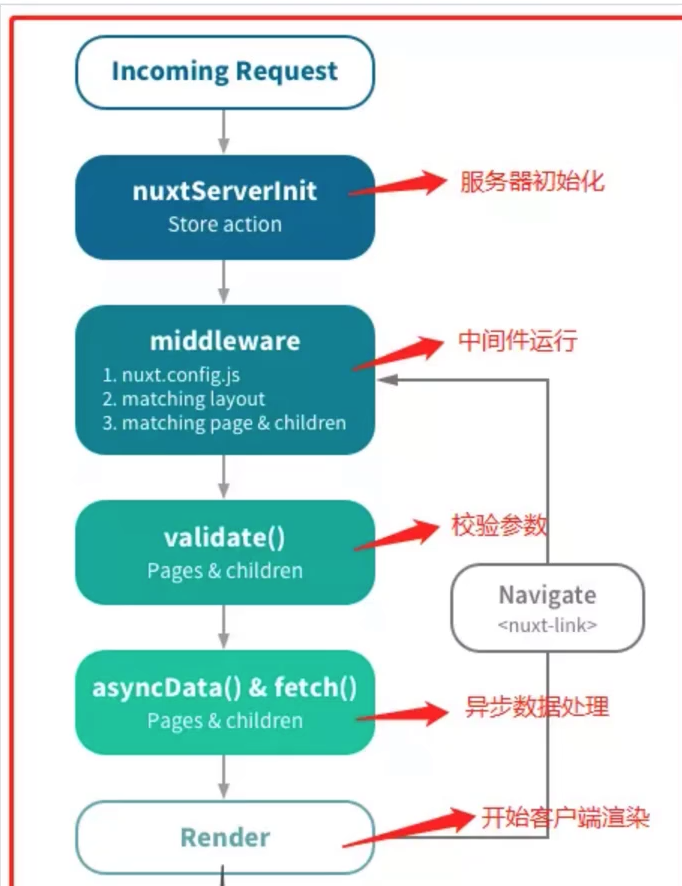

# 04-前后分离-2-CSR 与 SSR

## 一 界面的渲染方式

呈现给用户的界面中的元素数据，有两重呈现方式

-   CSR：即客户端渲染，客户端接收到服务端返回的原始数据，由客户端自己拼接数据生成页面
-   SSR：即服务端渲染，服务端返回的是一个完整的已经拼接好的文本文件，客户端无需更改，直接显示即可

CSR 将渲染方放在了客户端，降低了服务端的压力。现代前端一般使用 Vue、React、Angular 开发方式，是一个单页面应用，不同的页面相对搜索引擎来说其实都是同一个网页，那么就会造成 Seo 问题（如：多个新闻页面被当做一个页面被搜索引擎收录）。

SSR 是动态网页诞生时就出现的技术，相对古老，优点是 SEO 支持较好。

## 二 CSR 实践

### 2.1 什么是前后端分离?

早期的 web 开发中，大量使用模板引擎技术，如果 Java 中的 jsp，Node 中的 ejs。在具体开发中，前端只负责 html 与 css，以及简单的 js 特效，后端不但要开发 API，还要负责对页面中的数据进行渲染：

-   1 浏览器打开一个网址
-   2 发送请求给后台
-   3 后台根据请求产生数据后，利用 ejs、jsp 等技术，生成 一个 html 文本
-   4 后台将生成的 html 文本发送给前台
-   5 浏览器获取 html 文本直接渲染

这种动态文本技术，如 jsp、ejs 都属于 SSR 的范畴。

所谓前后端分离即摆脱之前的耦合开发方式，让属于前端的范畴交给前端（数据渲染交给前端），在这种情况下的工作方式：

-   1 浏览器打开一个网址
-   2 发送请求给后台
-   3 后台根据请求产生数据后，直接将数据发送给前台
-   4 前台拿到数据后，进行 dom 操作，修改当前页面中的数据为后台提供的动态数据

我们发现，少了一步后台拼接 html 文本的过程，这个过程交给了前端进行自己处理。前端实现该过程最常见的办法就是 SPA(Single-page application)，所有用到的展现数据都是后端通过异步接口(AJAX/JSONP)的方式提供的，前端只管展现。

### 2.2 前后端分离实践

1、一般来说，要实现前后端分离，前端就需要开启一个本地的服务器来运行自己的前端代码，以此来模拟真实的线上环境，并且能更好的开发。利用 nodejs 的 express 框架来开启一个本地的服务器，然后利用 nodejs 的一个 http-proxy-middleware 插件将客户端发往 nodejs 的请求转发给真正的服务器，让 nodejs 作为一个中间层。

2、由于前后端分离后，前端和后台同时开发时，就可能遇到前端已经开发好一个页面了，可是却等待后台 API 接口的情况。比如说 A 是负责前端，B 是负责后台，A 可能用了一周做好了基本的结构，并且需要 API 接口联调后，才能继续开发，而此时 B 却还没有实现好所需要的接口，这种情况，怎么办呢？在我们这个项目里，我们是通过了 mock 来提供一些假数据，我们先规定好了 API 接口，设计出了一套 API 文档，然后我们就可以通过 API 文档，利用 mock(<http://mockjs.com)来返回一些假数据，这样就可以模拟发送API>到接受响应的整一个过程，因此前端也不需要依赖于后端开发了，可以独立开发。Node 在前后端分离中主要扮演了创建本地开发环境的角色，和生产环境无关。

3、在第二步中已经完成了前后分离。在很多场景中，一个页面会请求很多接口，多次请求自然也造成了很多网络 I/O。为了解决这些问题，一些公司额外引入了 Node 聚合层。在前端与后端之间，再部署 Node 服务器，由 Node 服务器去请求多个接口，聚合数据后为前端提供一个统一接口。

## 三 SSR

### 3.1 SSR 优缺点汇总

优点：

-   更好的 SEO，因为传统的搜索引擎只会从 HTML 中抓取数据，这会导致前端渲染的页面无法被抓取。
-   更快的内容到达时间(time-to-content)，特别是对于缓慢的网络情况或运行缓慢的设备 。页面首屏时间大概有 80%消耗在网络上，剩下的时间在后端读取数据以及浏览器渲染，显然要优化后面的 20%是比较困难的，优化网络时间是效果最明显的手段。传统的 Ajax 请求是先请求 js 再由 js 发起数据请求，两项时间再加上浏览器渲染时间才是首屏时间。而 SSR 能将两个请求合并为一个。

缺点：

-   更多的服务器端负载。
-   服务器端和浏览器环境差异带来的问题，例如 document 等对象找不到的问题。

建议：如果注重 SEO 的新闻站点，非强交互的页面，建议用 SSR；像后台管理页面这类强交互的应用，建议使用前端渲染。

### 3.2 SSR 实践

要兼顾 SEO，就需要使用服务端渲染的方式。但是 Vue、React 这些前端框架能够给前端开发者带来很大的便利，到了后端却无用武之地，前端就会回到当年刀耕火种的时代，或者说：仅仅写写简单的 HTML、CSS。

为了提升生产力，可以将 Vue、React 的思想引入 SSR 中。其原理以 Vue 为例：

```txt
在后端服务器也创造出Vue的实例，使用Vue的开发方式开发出一个组件界面
组件界面经过服务端解析还原为纯正的HTML字符串文本
服务端将该文本返还给前端，前端渲染
```

这里的问题是：由于页面组件由服务端创建，那么就不可能执行一些 DOM 的 API，且与原生 Vue 也会有一些生命周期差异。

### 3.3 Vue 使用 vue-server-renderer 进行 SSR

```js
const express = require('express')
const Vue = require('vue')
const VueSSR = require('vue-server-renderer')

const server = express()

server.get('/demo', (req, res) => {
    const app = new Vue({
        template: `<div>hello world!</div>`,
    })

    const renderer = VueSSR.createRenderer()

    renderer
        .renderToString(app)
        .then(html => {
            console.log(html)
            res.send(html)
        })
        .catch(err => {
            console.log(err)
        })
})

server.listen(3000)
```

### 3.4 Vue 使用 Nuxt 进行 SSR

Nuxt 是 Vue 的综合服务端渲染框架，可以直接用于生产环境。

在当前目录安装 Nuxt，在选项中，必须萱蕚 Universal(SSR/SSG)才能创建真正的 Nuxt 服务端渲染项目：

```txt
npx create-nuxt-app .
```

Nuxt 生命周期：



贴士：项目运行时，Nuxt 只会初始化依次，在经历了 Nuxt 的生命周期后，会开始执行 Vue 的生命周期。
