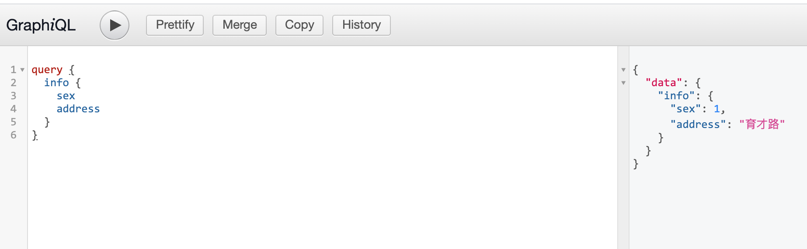

# 05-接口规范-2-GraphQL

## 一 GraphQL 概念

### 1.1 GraphQL 简介

GraphQL 是 Facebook 开发的数据查询语言，于 2015 年发布。GraphQL 对 API 中的数据提供了一套完整描述，能够让客户端准确的获取需要的数据，没有冗余，也让 API 的演进更加顺利。

GraphQL 的特点：

- 请求需要的数据更精准，只取得需要的字段，无冗余。
- 多个资源的获取，只需要一个请求即可实现。
- 对资源实现了更加详细的描述，能够方便的增加、删除字段，便于平滑演进。

### 1.2 GraphQL 与 Restful 对比

- Restful 一次只能返回一个资源，GraphQL 一次可以获取多个资源的合集
- Restful 用不同的 url 区分资源，GraphQL 用类型区分资源

## 二 使用 GraphQL

## 2.1 基础示例

```js
const express = require('express')
const graphql = require('graphql')
const { graphqlHTTP } = require('express-graphql')

// 构建 schema，定义查询的语句、类型
let demoSchema = graphql.buildSchema(`

  type Info {
    sex: Int
    address: String
  }

  type Query {
    name: String
    age: Int
    info: Info
  }
`)

// 定义查询对应的处理器（resolver）
let demoRoot = {
  name: () => {
    return 'zs'
  },
  age: () => {
    return 30
  },
  info: () => {
    return {
      sex: 1,
      address: '育才路',
    }
  },
}

const app = express()

app.use(
  '/demo',
  graphqlHTTP({
    schema: demoSchema,
    rootValue: demoRoot,
    graphiql: true,
  })
)

app.listen(3000)
```

在浏览器中访问地址即可根据自定义字段访问结果：



### 2.2 GraphQL 数据类型

GraphQL 有四种基本类型，可以在 schema 声明时直接使用：

```txt
Int
Float
Boolean
String
ID        # 不能重复
```

使用 `[类型]` 代表数组，如： `[int]`

也可以自定义类型：

```txt
  type Info {
    sex: Int
    address: String
  }
```

### 2.3 参数传递

参数传递示例：

```txt
type Query {
  demo(num: Int!, name: String): [Int]
}
```

`Int!` 的感叹号代表必传，`:` 之后是返回值类型。

## 三 前端中使用 GraphQL

```js
const query = `
  query Info($sex: Int) {
    info(sex: $sex)
  }
`

const variables = {
  sex: 1,
}

fetch('/demo', {
  method: 'POST',
  headers: {
    'Content-Type': 'application/json',
    Accept: 'application/json',
  },
  body: JSON.stringify({
    query,
    variables,
  }),
})
  .then((res) => res.json)
  .then((json) => {
    console.log(json)
  })
```
