# 06-编程思想-2-依赖注入与控制反转

## 一 控制反转和依赖注入思想

### 1.1 控制反转（IoC）概念

控制反转（Inversion of control） 是一种解耦的思想，其意义即字面意思：控制权转移。

以实际生活中的例子介绍：

```txt
1、项目经理要求开发者开发新功能：控制权位于项目经理
2、开发者开始开发需求：控制权位于开发者手中
3、交付成品：控制权回到项目经理
```

在代码中，可以这样表现：假设我们获取数据都是通过一个类 A，但是类 A 内部 依赖于 B（B 是 A 的依赖），如下所示：

```ts
// b.ts
class B {
  constructor() {}
}

// a.ts
class A {
  b: B
  constructor() {
    this.b = new B()
  }
}

// main.ts
const a = new A()
```

如果有一天 B 的构造函数发生了变化，可以传参：

```ts
class B {
  p: number
  constructor(p: number) {
    this.p = p
  }
}
```

此时修改类 B 导致了依赖于 B 的类 A 失效，也需要对 A 进行额外修改，即我们的一个修改操作引发了另外依赖项于修改处的其他功能失效、发生错误，这是软件的耦合造成的。

更麻烦的是，当我们改完了 A 后，发现 B 所需要的 p 不能是一个 number，需要变更为 string，于是我们又不得不重新修改 A 中对参数 p 的类型修饰。这时我们想想，假设还有上层类依赖 A，用的也是同样的方式，那是否上层类也要经历同样的修改。这就是耦合所带来的问题，明明是修改底层类的一项参数，却需要修改其依赖链路上的所有文件，当应用程序的依赖关系复杂到一定程度时，很容易形成牵一发而动全身的现象，为应用程序的维护带来极大的困难。

有没有办法不去修改引发错误的地方，让 A 与 B 的耦合不再严重？

事实上，我们可以发现，在上述例子中，真正需要参数 p 的仅仅只有 B，而 A 完全只是因为内部依赖的对象在实例化时需要 p，才不得不定义这个参数，实际上它对 p 是什么根本不关心。于是，我们可以考虑将类所依赖对象的实例化从类本身剥离出来，比如上面的例子我们可以这样改写：

```java
// b.ts
class B {
    p: number;
    constructor(p: number) {
        this.p = p;
    }
}

// a.ts
class A {
    private b:B;
    constructor(b: B) {
        this.b = b;
    }
}

// main.ts
const b = new B(10);
const a = new A(b);
console.log(a); // A => { b: B { p: 10 } }
```

以上就是一种权限的传递，最开始控制权在 A，A 内部需要 B 的实例，控制权被传递到了 B。

实际开发中，A 可能还会依赖于 C、D、E、F 等，那么权限都传递给 A 就会造成 A 类的工作量剧增、复杂度剧增，这时候可以引入工厂函数，将问题的解决方式交给工厂：

```java
class TempFactory{
    public A createA(){
        return new A(this.createB(),this.createC(),this.createD(),this.createE());
    }
    public B createB(){
        return new B();
    }
    public C createC(){
        return new C();
    }
    public D createD(){
        return new D();
    }
    public E createE(){
        return new E();
    }
}
```

### 1.2 依赖注入概念

无论是最初对 A 的改造，还是工厂函数，构建实例的本质仍然是开发这自己手动 new，如下所示：


如果依赖进一步复杂，工厂模式也会变得复杂，如果有一个中间者可以给我们自动 new 出这些实例即可，这便是 依赖注入的思想，如下所示：



所有依赖的类在注入器（Injector）中注册后，当类 A 需要它们的时候，注入器就会帮忙将依赖的类注入进来！

在这个全局容器中，预先注册好了我们所需对象的类定义以及初始化参数，每个对象有一个唯一的 key。那么当我们需要用到某个对象时，我们只需要告诉容器它对应的 key，就可以直接从容器中取出实例化好的对象，开发者就不用再关心对象的实例化过程，也不需要将依赖对象作为构造函数的参数在依赖链路上传递。

在注入器示例中，发生的控制反转是：类 A 需要 B，A 中就需要创建实例 B，控制权在 A 上，如果是通过注入器注入，A 需要 B 的时候，注入器注入进来，控制权移交给了注入器。不过要注意的是：注入器直接注入的，而不是 A 主动去创建的，这里 A 是被动，而注入器是主动的，注入完毕后，控制权又回到了 A 的手上。

现实生活中有个很鲜活的例子就是：找女朋友的事情委托给了婚介所，当婚介所有合适委托者的对象就会找到委托者，将女方资料交给委托者。

### 1.3 容器 Injector 的实现

我们的容器必须具体两个功能：实例的注册和获取，与 Map 相似：

```js
// container.ts
export class Container {
  bindMap = new Map()

  // 实例的注册
  bind(identifier: string, clazz: any, constructorArgs: Array<any>) {
    this.bindMap.set(identifier, {
      clazz,
      constructorArgs,
    })
  }

  // 实例的获取
  get<T>(identifier: string): T {
    const target = this.bindMap.get(identifier)
    const { clazz, constructorArgs } = target
    // Reflect.construct() 类似 new
    const inst = Reflect.construct(clazz, constructorArgs)
  }
}
```

使用容器后，可以抛弃之前的传参解耦：

```js
// b.ts
class B {
  constructor(p: number) {
    this.p = p
  }
}

// a.ts
class A {
  b: B
  constructor() {
    this.b = container.get('b')
  }
}

// main.ts
const container = new Container()
container.bind('a', A)
container.bind('b', B, [10])

// 从容器中取出a
const a = container.get('a')
console.log(a) // A => { b: B { p: 10 } }
```

从代码量上看似乎并没有简洁多少，关键问题在于容器的初始化以及类的注册仍然让我们觉得繁琐，如果这部分代码能被封装到框架里面，所有类的注册都能够自动进行，同时，所有类在实例化的时候可以直接拿到依赖对象的实例，而不用在构造函数中手动指定，这样就可以彻底解放开发者的双手，专注编写类内部的逻辑，而这也就是所谓的 DI（Dependency Injection）依赖注入。

### 1.4 总结

**IoC 是一种设计原则，注重解耦，DI 则是实现 IoC 的一种技术**，即将依赖注入给调用方，而不需要调用方来主动获取依赖。

依赖注入与控制反转，是一种低耦合设计理念，让开发者能够专注业务，而不是来来回回在依赖中 new。

除了解耦外，IoC 还可以给我们带来很多好处，比如基于容器快速进行单元测试，分析类与类之间的依赖关系等等。

## 二 基于 TypeScript 的装饰器实现 DI

### 2.0 DI 的功能解决方案

为了实现 DI，主要要解决以下两个问题：

- 需要注册到 IoC 容器中的类能够在程序启动时自动进行注册
- 在 IoC 容器中的类实例化时可以直接拿到依赖对象的实例，而不用在构造函数中手动指定

针对这两个问题其实也有不同的解决思路，Java Spring 需要开发者针对容器中的依赖关系定义一份 XML 文件，框架基于这份 XML 文件实例的注册和依赖的注入。阿里的 Midway 的 Injection 提供的思路是利用 TypeScript 具备的装饰器特性，通过对元数据的修饰来识别出需要进行注册以及注入的依赖，从而完成依赖的注入。

### 2.1 元数据支持

TS 在 1.5 支持了 ES7 的提案：Relfect Metadata，用来在声明的时候添加和读取元数据。元数据可以理解为针对类或类里面某个属性的描述信息，它本身不影响类的行为，但你可以在随时拿到某个类上定义的元数据，并根据这些元数据进行对类进行特定的操作。

使用 Relfect Metadata：

```js
// 安装 Relfect Metadata:npm i reflect-metadata -S
// 在 tsconfig.json 中配置:"emitDecoratorMetadata": true,

// 根据 Reflect.defineMetadata 和 Reflect.getMetadata 进行元数据的定义和获取
import 'reflect-metadata'

const CLASS_KEY = 'ioc:key'

function ClassDecorator() {
  return function (target: any) {
    Reflect.defineMetadata(
      CLASS_KEY,
      {
        metaData: 'metaData',
      },
      target
    )
    return target
  }
}

@ClassDecorator()
class D {
  constructor() {}
}

console.log(Reflect.getMetadata(CLASS_KEY, D)) // => { metaData: 'metaData' }
```

这时候可以对任意类进行标记，并对标记的类进行特殊的处理。

### 2.2 Provider

依赖注入的思想中，在应用全动时，自动对所有类进行定义、参数注册。但并不是所有类都需要注册到容器中，需要清楚哪些类需要注册，初始化参数是什么样子。这时候就需要源数据的帮助，只要在定义的时候为这个类的元数据添加特殊的标记，就可以在扫描的时候识别出来。按照这个思路，我们先来实现一个装饰器标记需要注册的类，这个装饰器可以命名 Provider，代表它将会作为提供者给其他类进行消费。

```ts
// provider.ts
import 'reflect-metadata'

export const CLASS_KEY = 'ioc:tagged_class'

export function Provider(identifier: string, args?: Array<any>) {
  return function (target: any) {
    Reflect.defineMetadata(
      CLASS_KEY,
      {
        id: identifier,
        args: args || [],
      },
      target
    )
    return target
  }
}
```

可以看到，这里的标记包含了 id 和 args，其中 id 是我们准备用来注册 IoC 容器的 key，而 args 则是实例初始化时需要的参数。Provider 可以以装饰器的形式直接进行使用，使用方式如下：

```ts
// b.ts
import { Provider } from 'provider'

@Provider('b', [10])
export class B {
  constructor(p: number) {
    this.p = p
  }
}
```

### 2.3 解决问题一：类注册

标记完成后，问题又来了，如果在应用启动的时候拿到这些类的定义呢？

比较容易想到的思路是在启动的时候对所有文件进行扫描，获取每个文件导出的类，然后根据元数据进行绑定。简单起见，我们假设项目目录只有一级文件，实现如下：

```ts
// load.ts
import * as fs from 'fs'
import { CLASS_KEY } from './provider'

export function load(container) {
  // container 为全局的 IoC 容器
  const list = fs.readdirSync('./')

  for (const file of list) {
    if (/\.ts$/.test(file)) {
      // 扫描 ts 文件
      const exports = require(`./${file}`)
      for (const m in exports) {
        const module = exports[m]
        if (typeof module === 'function') {
          const metadata = Reflect.getMetadata(CLASS_KEY, module)
          // 注册实例
          if (metadata) {
            container.bind(metadata.id, module, metadata.args)
          }
        }
      }
    }
  }
}
```

那么现在，我们只要在 main 中运行 load 即可完成项目目录下所有被修饰的类的绑定工作，值得注意的是，load 和 Container 的逻辑是完全通用的，它们完全可以被封装成包，一个简化的 IoC 框架就成型了。

```ts
import { Container } from './container'
import { load } from './load'

// 初始化 IOC 容器，扫描文件
const container = new Container()
load(container)

console.log(container.get('a')) // A => { b: B { p: 10 } }
```

### 2.4 解决问题二：实例获取

解决注册的问题后，我们来看上文中提到的第二个问题：如何在类初始化的时候能直接拿到它所依赖的对象的实例，而不需要手动通过构造函数进行传参。其实思路也很简单，我们已经将所有需要注册的类都放入了 IoC 容器，那么，当我们需要用到某个类时，在获取这个类的实例时可以递归遍历类上的属性，并从 IoC 容器中取出相应的对象并进行赋值，即可完成依赖的注入。

那么，又是类似的问题，如何区分哪些属性需要注入？同样，我们可以使用元数据来解决。只要定义一个装饰器，以此来标记哪些属性需要注入即可，这个装饰器命名为 Inject，代表该属性需要注入依赖。

```ts
// inject.ts
import 'reflect-metadata'

export const PROPS_KEY = 'ioc:inject_props'

export function Inject() {
  return function (target: any, targetKey: string) {
    const annotationTarget = target.constructor
    let props = {}
    if (Reflect.hasOwnMetadata(PROPS_KEY, annotationTarget)) {
      props = Reflect.getMetadata(PROPS_KEY, annotationTarget)
    }

    props[targetKey] = {
      value: targetKey,
    }

    Reflect.defineMetadata(PROPS_KEY, props, annotationTarget)
  }
}
```

需要注意的是，这里我们虽然是对属性进行修饰，但实际元数据是要定义在类上，以维护该类需要注入的属性列表，因此我们必须取 target.constructor 作为要操作的 target。另外，为了方便起见，这里直接用了属性名（targetKey）作为从 IoC 容器中实例对应的 key。

然后，我们需要修改 IoC 容器的 get 方法，递归注入所有属性：

```ts
// container.ts
import { PROPS_KEY } from './inject'

export class Container {
  bindMap = new Map()

  bind(identifier: string, clazz: any, constructorArgs?: Array<any>) {
    this.bindMap.set(identifier, {
      clazz,
      constructorArgs: constructorArgs || [],
    })
  }

  get<T>(identifier: string): T {
    const target = this.bindMap.get(identifier)

    const { clazz, constructorArgs } = target

    const props = Reflect.getMetadata(PROPS_KEY, clazz)
    const inst = Reflect.construct(clazz, constructorArgs)

    for (let prop in props) {
      const identifier = props[prop].value
      // 递归获取注入的对象
      inst[prop] = this.get(identifier)
    }
    return inst
  }
}
```

使用的时候，用 Inject 对需要的属性进行修饰即可：

```ts
// a.ts
import { Provider } from 'provider'

@Provider('a')
export class A {
  @Inject()
  b: B
}
```

### 2.5 最终代码

```ts
// b.ts
@Proivder('b', [10])
class B {
  constructor(p: number) {
    this.p = p
  }
}

// a.ts
@Proivder('a')
class A {
  @Inject()
  private b: B
}

// main.ts
const container = new Container()
load(container)

console.log(container.get('a')) // => A { b: B { p: 10 } }
```

代码中不会再有手动进行实例化的情况，无论要注册多少个类，框架层都可以自动处理好一切，并在这些类实例化的时候注入需要的属性。所有类可提供的实例都由类自身来维护，即使存在修改也不需要改动其他文件。

## 三 常见的依赖注入框架

市面上常用的依赖注入框架是：

- [InversifyJS](https://github.com/inversify/InversifyJS)
- [typedi](https://github.com/typestack/typedi)
