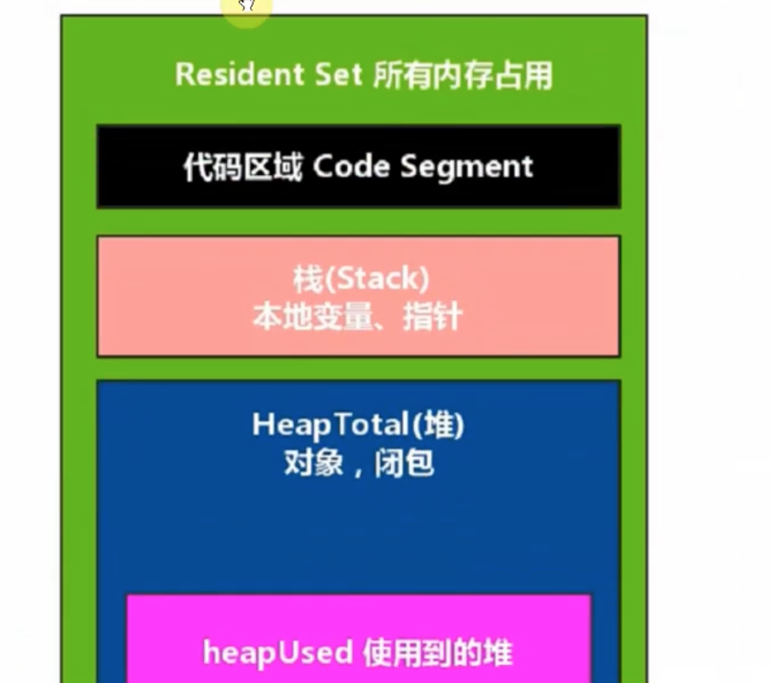
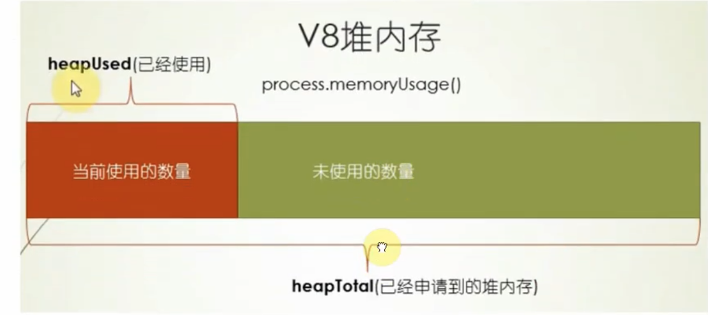

# 01-内存管理-1-GC 算法

## 一 V8 简介

V8 引擎是由 Google 开源的著名 JavaScript 引擎，使用该引擎的运行时平台，其 JS 的内存管理也是由 V8 负责的，如：Chrome、NodeJS。

V8 对内存做了一部分限制：

-   64 位系统下约为 1.4G
-   32 位系统下约为 0.7G

在 V8 中，1.4G 内存进行一次完全的垃圾回收，需要 1 秒以上，这个暂停时间称为 **Stop the world**，在暂停期间，应用的性能和响应能力都会大幅下降。

V8 的这套内存管理机制是针对浏览器而设计的，这样的内存需求在前端页面中使用起来绰绰有余（因为每个网页选项卡都是一个 v8 实例），而在服务端开发，则在一些场合捉襟见肘。V8 的这个限制使得 Node 无法直接操作大内存对象，在单个 Node 进程中，计算机的内存资源无法得到充足的使用。

## 二 V8 的内存分配

查看内存使用信息：

```js
let mem = process.memoryUsage()
console.log(mem)
```

输出样例：

```js
// 示例中 rss 大约占据 20M。heapUsed大约为 4M
{
  rss: 20824064,                // resident set size：所有内存占用，包括指令区、堆栈
  heapTotal: 7159808,           // 堆内存已申请到空间，包括已使用和未使用的
  heapUsed: 4270176,            // 堆内存当前使用量，可以用来判断内存泄露
  external: 8224                // v8 内部的 C++ 对象占用的内存
}
```

如图所示：




堆的大小会随着存储的对象变多，而逐步申请新空间，增大容量，直到堆的大小超过 V8 的限制为止。表面上看，V8 对内存的限制是因为浏览器不需要使用大内存，深层原因是其实 V8 的垃圾回收机制限制。

1.5GB 堆内存的回收，V8 需要耗时 50ms 以上，而做一次非增量的垃圾回收需要 1s 以上，这是垃圾回收中引起 JS 线程暂停执行的时间，这样的时间暂停会严重影响服务器响应能力。所以 v8 直接选择限制大内存使用，就可以快速避免 GC 导致的 JS 线程暂停时间过长问题。

当然 V8 也提供了打开内存限制的配置，Node 在启动时可以传递 `--max-old-space-size` 或 `--max-new-space-size` 来调整内存限制大小：

```txt
# 一旦生效，无法修改
node --max-old-space-size=1700 app.js       // 单位为MB
node --max-new-space-size=1024 app.js       // 单位为KB
```

## 三 V8 的垃圾回收机制

### 3.1 v8 的垃圾回收算法

v8 的垃圾回收策略基于**分代式垃圾回收机制**。因为不同的对象，其生存周期长短不一，一种垃圾回收算法不能完全应对所有情况，所以现在垃圾回收算法会按对象的存货时间将内存的垃圾回收进行不同的分代，然后分别对不同非带的内存使用更高效的算法。

V8 将内存设置为了 2 个分代，V8 堆的整体大小就是这 2 个分代所用的内存之和：

-   新生代：`--max-new-space-size` 参数就是设置新生代空间的最大值，单位为 KB
-   老生代：`--max-old-space-size` 参数就是设置老生代空间的最大值，单位为 MB

贴士：上述参数需要在 Node 启动时添加，即无法在启动后根据使用情况自动扩充，当内存分配中超过极限值，就会引起进程错误。

贴士：64 位系统中，新生代内存是 32M，From 和 To 各占 16M。（32 位系统中除以 2 即可）。老生代在 64 位占据 1400M，32 位系统为 700M。

### 3.2 新生代回收

新生代垃圾回收算法是 Scavenge，而该算法的真正实现是 Cheney 算法，Cheney 采用复制的方式实现垃圾回收。

新生代堆内存被一分为二，都称呼为 semispace：

-   From 空间：处于使用中
-   To 空间：处于闲置状态


在分配对象说会，先在 From 空间进行分配，开始 GC 时，会检查 From 空间的存活对象，这些存活对象将被复制到 To 空间中，而非存活对象占用的空间将会被释放。完成复制后，From 空间和 To 空间的角色发生互换。简单来说，GC 就是通过将存活对象在两个 semispace 空间进行复制。

从上看出，Scavenge 算法的理论中，只能使用堆内存中的一半，但由于只会复制存活的对象，而且生命周期短的场景中存活对象往往是少部分，所以该算法仍然有很大的效率。这也是典型的牺牲空间换取时间的算法，所以无法大规模应用到所有垃圾回收过程中，只适合新生代，因为新生代对象的生命周期很短。

如图所示：


### 3.3 新生代晋升到老生代

当一个对象经过多次复制依然存活时，它会被认为是生命周期较长的对象，随后会被迁移到老生代中，这就是晋升。

晋升的条件是下列条件之一：

-   对象是否经过 Scavenge 回收
-   To 空间的内存占用比超过限制（25%）。因为 Scavenge 回收完成后，To 空间转变为 From 空间，接下来内存分配在该空间进行，占比过高会影响后续内存分配




### 3.4 老生代回收

老生代中存活对象占比大，使用 Scavenge 会有 2 个问题：复制存活对象效率降低，也会出现一半空间浪费。所以 V8 在老生代使用的是 Mark-Sweep 和 Mark-Compact 相结合的方式进行垃圾回收。

Mark-Sweep：即标记清除，分为标记、清除 2 个阶段，该算法与 Scavenge 的区别是：

-   不会将内存划分为两半，所以不会造成内存空间浪费
-   Scavenge 只复制活着的对象，Mark-Sweep 只清理死亡的对象。该算法标记时会遍历堆中所有对象，并标记活着的对象，在随后的清除阶段，只清除没有被标记的对象。

活对象在新生代占据较小部分，死对象在老生代只占据较小部分，这就是两个算法不同的缘由。

Mark-Sweep 的问题：在进行一次标记清除后，内存会出现不连续的情况，在后续如果要分配一个较大的对象内存时，这些碎片空间都无法完成此次分配，就需要提前触发垃圾回收，而这次回收其实是不必要的，如图所示，灰色部分为死对象：


Mark-Compact：是由 Mark-Sweep 演变而来的，用于解决上述碎片问题。他们的差别是在对象被标记位死亡后，在整理过程中，将活着的对象往一端移动，移动完成后，直接清理掉边界外的内存，如图所示完成标记并移动存活对象后的示意图，蓝色格子为存活对象，深色格子为死亡对象，浅色格子为存活对象移动后扣下的空洞。


上图中，完成移动后直接清除最右边的存活对象后面的内存区域完成回收。

### 3.5 三个算法对比

| 回收算法     | 速度 | 空间开销         | 是否移动对象 |
| ------------ | ---- | ---------------- | ------------ |
| Mark-Sweep   | 中等 | 少，有碎片       | 否           |
| Mark-Compact | 最慢 | 少，无碎片       | 是           |
| Scavenge     | 最快 | 双倍空间，无碎片 | 是           |

V8 主要使用 Mark-Sweep，在空间不足以对从新生代中晋升过来的对象进行分配时，才使用 Mark-Compact。

### 3.6 增量标记与延迟清理

在执行垃圾回收时，必须让应用程序和垃圾回收期看到的情况一致！所以，一旦执行垃圾回收，就需要将应用程序暂停，等待 GC 完成后再恢复执行应用逻辑。一般称这个过程为 Stop-the-world（全停顿）。

V8 的新生代全停顿影响很小，因为新生代配置较小，且存活对象少。

但是 V8 的老声带中，配置较大，存活对象多，全堆垃圾回收（full 垃圾回收）的标记、清理造成的停顿对用户影响较大。

为了降低停顿带来的影响，V8 在标记阶段，将原本要一次性完成的动作改为增量标记（incremental marking），即拆分为许多小步骤，每做完一个小步骤，就让 JS 应用逻辑执行一会，垃圾回收应用逻辑交替执行直到标记阶段完成。

使用增量标记后，V8 的最大停顿时间减少了原本的 1/6 左右。

V8 还存在延迟清理（lazy sweeping），增量式整理（incremental compaction），让清理、整理动作也变成了增量式。

V8 也会在未来引进并行标记、并行清理等进一步利用多核，降低停顿时间。

### 3.7 总结

V8 的堆分为：新生代（年轻分代）、老生代（年老分代）。

年轻分代的堆空间一分为二，只有一半处于使用中，另外一半用于清理垃圾。

年轻分代主要用来保存声明周期短暂的对象，例如函数中的局部变量，当函数返回，调用栈中的局部变量就会被析构掉。当 V8 发现内存空间不够时，才会进行回收。

回收步骤是：

-   将还被引用的对象复制到另一半区域；
-   释放当前一半空间，
-   把当前被释放的空间留作备用，两者角色互换。

年轻分代类似线程的栈空间，本身不太大，占用它空间的对象类似 C++中的局部对象，生命周期非常短，因此大部分都是需要被清理掉的，需要赋值对象极少，虽然牺牲了部分内存，但是速度极快。

年老分代类似 C++中使用 new 操作符在堆中分配的对象。因为这类对象一般不会因为函数退出而销毁，因此生命周期较长。年老分代的大小远大于年轻分代（32 位为 700M，64 位为 1.4GB），包含：

-   从年轻分代中移动过来的对象；
-   JIT 后产生的代码；
-   全局对象。

如果年老分代采用年轻分代一样的清理算法，浪费一般空间不说，复制大块对象在时间上让人无法忍受，因此必须采用新的方式。V8 采用标记清除和标记整理的算法即将垃圾回收分为 2 个过程：

-   标记清除阶段遍历堆中的所有对象，把有效的对象标记出来，之后清除垃圾对象。因为年老分代中需要回收的对象比例极小，所以效率极高。
-   当执行完一次标记清除后，堆内存变得不连续，内存碎片的存在使得不能有效使用内存。在后续的执行中，当遇到没有一块碎片内存能够满足申请对象需要的内存空间时，将处罚 V8 执行标记整理算法：标记整理移动对象，紧缩 V8 堆空间，将碎片的内存整理为大块内存。

由于垃圾回收会阻塞 JS 代码的运行，上述两种算法是在 JS 运行时，会采取交替运行的方式，有效的减少了垃圾回收给程序造成的最大停顿时间。

## 四 查看垃圾回收日志

在 Node 启动时：

-   添加`--trace_gc`参数，即可查看垃圾回收的日志信息。
-   添加`--prof`参数，即可得到 V8 执行时的性能分析数据

但是得到的 v8.log 日志文件可读性很差，但是 v8 提供了日志统计工具，位于 Node 源码的 `deps/v8/tools`目录：

-   Linux 中：linux-tick-processor v8.log
-   Win 中：windows-tick-processor.bat v8.log

# TEMP

旧版笔记

## 垃圾回收

在 C 语言中，开发者申请的内存，需要自己手动进行回收，而 JS 不需要，JS 引擎如 v8，拥有垃圾回收机制，通过自动内存管理实现了内存分配、闲置资源回收，能够极大降低开发者心智负担。

垃圾回收的基本思路：确定哪个变量不再使用，就释放它所占用的内存。

垃圾回收的过程是周期性的，即每隔一段时间就会自动执行，执行期间会`stop the world`，既会影响程序正常运行，回收耗时也会影响性能，所以这是一个不太完美的方案。

示例：函数中的局部变量会在函数执行时存在，此时，栈内存会分配空间以保存相应的值。函数在内部使用了变量，然后退出。此时，就不再需要那个局部变量了，它占用的内存可以释放。但并不是所有时候都会这么明显，垃圾回收程序必须跟踪记录哪个变量还会使用，以及哪个变量不会再使用，以便回收内存。

如何标记未使用的变量也许有不同的实现方式。不过，在浏览器的发展史上，用到过两种主要的标记策略：标记清理和引用计数。

## 引用计数

引用计数常用于新生代的垃圾回收。引用计数可以最大限度的减少程序的暂停。

引用计数（ reference counting）是并不常用的垃圾回收策略。其思路是对每个值都记录它被引用的次数。声明变量并给它赋一个引用值时，这个值的引用数为 1。如果同一个值又被赋给另一个变量，那么引用数加 1。类似地，如果保存对该值引用的变量被其他值给覆盖了，那么引用数减 1。当一个值的引用数为 0 时，就说明没办法再访问到这个值了，因此可以安全地收回其内存了。垃圾回收程序下次运行的时候就会释放引用数为 0 的值的内存。

```js
let s = new Set()
let p = new Person()
s.add(p)

p = null // 此时p未被清除，因为 s内部还引用者p

s = null // 被清除
```

可以在 Chrome 浏览器的开发之控制台 memory 选项卡中生成快照查看数量。

缺点是：

-   无法回收循环引用对象
-   时间开销大（维护数值变化，需要随时监控数值的变化）

引用计数低版本浏览器中存在循环引用无法清除的问题：

```js
let element = document.getElementById('some_element')
let myObject = new Object()
myObject.element = element
element.someObject = myObject
```

这个例子在一个 DOM 对象（ element）和一个原生 JavaScript 对象（ myObject）之间制造了循环引用。 myObject 变量有一个名为 element 的属性指向 DOM 对象 element，而 element 对象有一个 someObject 属性指回 myObject 对象。由于存在循环引用，因此 DOM 元素的内存永远不会被回收，即使它已经被从页面上删除了也是如此。

为避免类似的循环引用问题，应该在确保不使用的情况下切断原生 JavaScript 对象与 DOM 元素之间的连接。比如，通过以下代码可以清除前面的例子中建立的循环引用：

```js
myObject.element = null
element.someObject = null
```

为了补救这一点， IE9 把 BOM 和 DOM 对象都改成了 JavaScript 对象，这同时也避免了由于存在两套垃圾回收算法而导致的问题，还消除了常见的内存泄漏现象。

## 标记清理

标记清理（mark-and-sweep）是最常见的垃圾回收策略。

变量进入上下文，比如在函数内部声明一个变量时，这个变量会被加上存在于上下文中的标记。而在上下文中的变量，逻辑上讲，永远不应该释放它们的内存，因为只要上下文中的代码在运行，就有可能用到它们。当变量离开上下文时，也会被加上离开上下文的标记。

垃圾回收程序运行的时候，会标记内存中存储的所有变量（记住，标记方法有很多种）。然后，它会将所有在上下文中的变量，以及被在上下文中的变量引用的变量的标记去掉。在此之后再被加上标记的变量就是待删除的了，原因是任何在上下文中的变量都访问不到它们了。随后垃圾回收程序做一次内存清理，销毁带标记的所有值并收回它们的内存。

标记清理一般用于处理老生代的回收，相比引用计数来说，无需移动数据，但是由于扫描后会清除无引用区域，会造成堆区出现内存碎片。为了解决该问题，引入了标记整理（Mark Compact），在扫描时，将要清理的内存移动在一侧，无需清理的移动在另一侧，扫描完毕后只需要清除其中一侧，这种做法付出了移动的时间代价，但是内存碎片更少。

老生代空间大，大部分对象都是活跃的,GC 时间较长，V8 的优化方案是：增量处理，把一个大的暂停时间段切割为多个小的暂停时间段。

V8 主要采取的是 Mark-Sweep，空间不足以应对从新生代升级过来的对象时，采用 Mark-Compact。

## 内存管理

将内存占用量保持在一个较小的值可以让页面性能更好。优化内存占用的最佳手段就是保证在执行代码时只保存必要的数据。如果数据不再必要，那么把它设置为 null，从而释放其引用。这也可以叫作解除引用。这个建议最适合全局变量和全局对象的属性。局部变量在超出作用域后会被自动解除引用：

```js
function createPerson(name) {
    let localPerson = new Object()
    localPerson.name = name
    return localPerson
}
let globalPerson = createPerson('Nicholas')
// 解除 globalPerson 对值的引用
globalPerson = null
```

不过要注意，解除对一个值的引用并不会自动导致相关内存被回收。解除引用的关键在于确保相关的值已经不在上下文里了，因此它在下次垃圾回收时会被回收。

V8 优化：

```js
function Article() {
    this.title = 'Inauguration Ceremony Features Kazoo Band'
}
let a1 = new Article()
let a2 = new Article()
```

V8 会创建一个隐藏类，a1 和 a2 共享隐藏类的对象，以保证性能，但是如果这里在 new 完之后，再新增一个属性，就无法共享了，所以可以提前将类的所有属性列出，以让更多的实例共享隐藏类：

```js
function Article(opt_author) {
    this.title = 'Inauguration Ceremony Features Kazoo Band'
    this.author = opt_author
}
let a1 = new Article()
let a2 = new Article('Jake')
```

贴士：delete 删除属性也会造成隐藏类得不一致，推荐使用类似`a1.author=null`。

## 内存泄露

滥用全局变量是最常见的引发内存泄露问题的方式：

```js
function setName() {
    // 该变量挂载到了window下，除非关闭浏览器，否贼不会清理
    name = 'Jake'
}
```

定时器也会造成内存泄露：

```js
// let声明的全局变量不会挂载到window上，但是这里由于定时器原因 name 无法被回收
let name = 'Jake'
setInterval(() => {
    console.log(name)
}, 100)
```

闭包造成内存泄露：

```js
// 只要 返回的函数存在就不能清理name
let outer = function () {
    let name = 'Jake'
    return function () {
        return name
    }
}
```

## 静态分配对象池

开发者无法直接控制什么时候开始收集垃圾，但可以间接控制触发垃圾回收的条件。如果能够合理使用分配的内存，同时避免多余的垃圾回收，那就可以保住因释放内存而损失的性能。

示例：

```js
function addVector(a, b) {
    let resultant = new Vector()
    resultant.x = a.x + b.x
    resultant.y = a.y + b.y
    return resultant
}
```

调用这个函数时，会在堆上创建一个新对象，然后修改它，最后再把它返回给调用者。如果这个矢量对象的生命周期很短，那么它会很快失去所有对它的引用，成为可以被回收的值。假如这个矢量加法函数频繁被调用，那么垃圾回收调度程序会发现这里对象更替的速度很快，从而会更频繁地安排垃圾回收。该问题的解决方案是不要动态创建矢量对象，比如可以修改上面的函数，让它使用一个已有的矢量对象：

```js
function addVector(a, b, resultant) {
    resultant.x = a.x + b.x
    resultant.y = a.y + b.y
    return resultant
}
```

这需要在其他地方实例化矢量参数 resultant，但这个函数的行为没有变。那么在哪里创
建矢量可以不让垃圾回收调度程序盯上呢？

一个策略是使用对象池。在初始化的某一时刻，可以创建一个对象池，用来管理一组可回收的对象。由于没发生对象初始化，垃圾回收探测就不会发现有对象更替，因此垃圾回收程序就不会那么频繁地运行。下面是一个对象池的伪实现：

```js
// vectorPool 是已有的对象池
let v1 = vectorPool.allocate()
let v2 = vectorPool.allocate()
let v3 = vectorPool.allocate()
v1.x = 10
v1.y = 5
v2.x = -3
v2.y = -6
addVector(v1, v2, v3)
console.log([v3.x, v3.y]) // [7, -1]
vectorPool.free(v1)
vectorPool.free(v2)
vectorPool.free(v3)
// 如果对象有属性引用了其他对象
// 则这里也需要把这些属性设置为 null
v1 = null
v2 = null
v3 = null
```

如果对象池只按需分配矢量（在对象不存在时创建新的，在对象存在时则复用存在的），那么这个实现本质上是一种贪婪算法，有单调增长但为静态的内存。这个对象池必须使用某种结构维护所有对象，数组是比较好的选择。不过，使用数组来实现，必须留意不要招致额外的垃圾回收。比如下面这个例子：

```js
let vectorList = new Array(100)
let vector = new Vector()
vectorList.push(vector)
```

由于 JavaScript 数组的大小是动态可变的，引擎会删除大小为 100 的数组，再创建一个新的大小为 200 的数组。垃圾回收程序会看到这个删除操作，说不定因此很快就会跑来收一次垃圾。要避免这种动态分配操作，可以在初始化时就创建一个大小够用的数组，从而避免上述先删除再创建的操作。不过，必须事先想好这个数组有多大。
