# 09-OAuth2 授权服务

## 一 OAuth2 概念

案例：假如现在要访问百度文库内的文章信息，但是该文章信息需要登录后才能访问，用户在弹出的登录界面中使用 QQ 快速登录，即采用了 Auth2。

这里的登录中，通过授权，百度获取了 QQ 用户的账户信息、头像信息等，从而使用该信息进行百度系统的登录。

不过要注意的是，百度获的 QQ 账户只是临时令牌，而不是真实的用户账号密码。Auth2 最大的好处是：用户授权了多个应用后，可以防止因为某一个应用被破解导致所有应用信息都被窃取的状况。

弹出的授权地址类似：

```txt
https://graph.qq.com/oauth2.0/show?which=Login&display=pc
&client_id=100312028
&response_type=code
&redirect_uri=https%3A%2F%2Fpassport.baidu.com%2Fphoenix%2Faccount%2Fafterauth%3Fmkey%3D62bfd19b1fafe
&display=page
&scope=get_user_info%2Cadd_share%2Cget_other_info%2Cget_fanslist%2Cget_idollist%2Cadd_idol%2Cget_simple_userinfo
```

## 二 OAuth2 实现思路

OAuth 在客户端与服务提供商之间，设置一个授权层（authorization layer），客户端不能直接登录服务提供商，只能登录该授权层，以此将用户与客户端区分开。

客户端登录授权层获取令牌后，服务提供商根据令牌的权限、有效期，向客户端开放用户在此存储的资料。

具体步骤：

```txt
1、用户打开客户端后，客户端要求用户给予授权
2、用户同意给客户端授权
3、客户端使用上一步获得授权，向认证服务器申请令牌
4、客户端使用令牌，向资源服务器申请获取资源
5、资源服务器校验令牌，同意开放资源
```

示例名词：

```txt
client：客户端，即第一节中所述的百度，百度使用QQ信息登录，百度作为了客户端
Resource Owner：资源持有者，即第一节所述的QQ用户user
User Agent：用户代理，即第一节所述的浏览器
http service：服务提供商，即第一节所述的QQ服务器
Authorization server：认证服务器，即QQ提供的专门处理认证的服务器
Resource Server：资源服务器，即服务提供商存放用户资源的服务器

贴士：http service、Authorization server、Resource Server 可以是同一台服务器。
```

如图所示：



## 三 代码示例

```js
let state = Date.now()

router.get('/login', function (req, res, next) {
  let grantUrl = 'https://graph.qq.com/oauth2.0/authorize?'
  let options = {
    response_type: 'code', //响应类型 固定为code
    client_id: AppId, //客户端的ID，这个ID是由QQ授权服务器分配的
    redirect_uri, // 'http://www.demo.com/user/callback'
    state,
    scope: 'get_user_info,list_album',
  }
  let query = querystring.stringify(options)
  grantUrl += query
  res.render('login', { title: '登录', grantUrl })
})

//http://www.demo.com/user/callback?code=9A5F06AF&state=test
router.get('/callback', function (req, res) {
  let { code, state } = req.query
  res.send(code)
})
```
