# 10-微前端架构

## 一 大型项目迭代问题

对公共逻辑的抽象是软件工程不可绕开的话题，前端也不例外。在前端开发中，组件抽取、公共模块抽取是最常见的业务解耦方式。随着企业业务的发展，这些抽象的模块可能需要运用到许多不同的工程中，这就需要考虑如何组织、使用这些技术积累。

我们通常采取的技术方案是：将公共模块打包为 npm 包，在各个项目、模块中导入使用，但这很容易带来以下缺点：

- （1）发布效率不高：如果公共模块的逻辑出现变化，需要重新打包、发版，使用该模块的项目都要进行更新。若 npm 包内涉及的业务较多，就会让维护该包的精力不断放大。
- （2）多团队协作不规范：不同团队的 npm 包容易出现不同包规范不同现象。

## 二 微前端架构的引入

### 2.1 微前端解决迭代问题思路

我们现在面临的问题是：工程相当庞大，引入模块很多；不同工程使用的技术栈也千差万别。这样的项目、工程在迭代上需要支出的额外成本相当庞大。

微前端的主要目的就是让不同工程在迭代阶段解耦，所有的工程都能独立迭代，互不干涉，即使这些工程在一个页面中都被使用到，也能够独立交付。

微前端的实现思路：将前端应用分解成一些更小、更简单的能够独立开发、测试、部署的小块，而在用户看来仍然是内聚的单个产品。



### 2.2 微前端架构的特点

微前端架构只是一种由独立交付的多个前端应用组成整体的架构风格，并非具体实践，在理论上，该风格可以将庞大的整体拆成可控的小块，并明确它们之间的依赖关系，关键优势在于：

- 代码的应用级解耦：微前端架构下的代码库倾向于更小/简单、更容易开发，避免模块间不合理的隐式耦合造成的复杂度上升。通过界定清晰的应用边界来降低意外耦合的可能性，增加子应用间逻辑耦合的成本，促使开发者明确数据和事件在应用程序中的流向。
- 增量升级：微前端架构可以让新旧代码和谐共存，再逐步转化旧代码，直到整个重构完成
- 独立部署：每个微前端都应具备有自己的持续交付流水线（包括构建、测试并部署到生产环境），并且要能独立部署，不必过多考虑其它代码库和交付流水线的当前状态。
- 团队自治：由不同团队各自负责一块产品功能从构思到发布的整个过程，团队能够完全拥有为客户提供价值所需的一切，从而快速高效地运转



### 2.3 微前端架构应用场景

这里需要区分微前端与微服务的理解方式：微前端主要目的是聚合,即将不同子系统聚合成一个大系统,而微服务架构目前更多是解耦,即解耦不同服务间的依赖。
所以当一个工程采用了多种技术栈，内部引入了多个项目，需要将其聚合时，且依然能实现增量开发时，微前端架构是最好的选择。

## 三 微前端架构中面临的技术问题

### 3.0 微前端需要解决的关键问题

微前端需要解决的关键问题：

- 子应用集成问题
- 子应用隔离方案
- 子应用间通信问题

微前端常见技术问题如图所示：



### 3.1 子应用集成问题

集成方式分为 3 类：

- 服务端集成：如 SSR 拼装模板
- 构建时集成：如 Code Splitting
- 运行时集成：如通过 iframe、JS、Web Components 等方式

在实践中我们看到，基座模式的子应用通过容器进行集成、加载，模块联邦模式采用 webpack 工具进行注入。他们互有利弊，整体而言，笔者偏向后者。

### 3.2 子应用隔离方案

子应用之间，以及子应用与主应用间的样式、作用域隔离是必须要考虑的问题，常见解决方案如下：

- 样式隔离：开发规范（如 BEM）、CSS 预处理（如 SASS）、模块定义（如 CSS Module）、用 JS 来写（CSS-in-JS）、以及 shadow DOM 特性
- 作用域隔离：各种模块定义（如 ES Module、AMD、Common Module、UMD）

### 3.3 子应用间通信问题

通过自定义事件间接通信是一种避免直接耦合的常用方式，此外，React 的单向数据流模型也能让依赖关系更加明确，对应到微前端中，从容器应用向子应用传递数据与回调函数

另外，路由参数除了能用于分享、书签等场景外，也可以作为一种通信手段，并且具有诸多优势：

- 其结构遵从定义明确的开放标准
- 页面级共享，能够全局访问
- 长度限制促使只传递必要的少量数据
- 面向用户的，有助于依照领域建模
- 声明式的，语义上更通用（"this is where we are", rather than "please do this thing"）
- 迫使子应用之间间接通信，而不直接依赖对方

原则上，无论采用哪种方式，都应该尽可能减少子应用间的通信，以避免大量弱依赖造成的强耦合。

## 四 微前端架构实践

### 4.1 自由组织模式

> 自由组织模式： 使用过基础模块框架构架符合业务需求的自建微前端模式。

常见的基础模块框架是 SystemJS，该库用于实现一个不同于 CMD/ESModule 的模块化规范，不过通过 webpack 可以将 ES 模块转化为支持 SystemJS 的模块。

webpack 中使用方式如下所示：

```js
module.exports = {
  // 其他配置

  // 打包格式
  output: {
    libraryTarget: 'system',
  },

  // 引入的库需要忽略，采用systemjs方式引入
  externals: ['react', 'react-dom', 'react-router-dom'],
}
```

react 中使用 SystemJS 示例：

```html
<html>
  <head>
    <script type="systemjs-importmap">
      {
        "imports": {
          "react": "./libs/react.min.js",
          "react-dom": "./libs/react-dom.min.js",
          "react-router-dom": "./libs/react-router-dom.min.js"
        }
      }
    </script>
    <script src="./libs/system.min.js"></script>
  </head>
  <body>
    <div id="root"></div>
    <script>
      System.import('./index.js')
    </script>
  </body>
</html>
```

由于该模式缺乏通信、隔离、加载方案，架构较为原始，一般不采用，而是在该框架基础上进行衍生，如：基座模式。

### 4.2 基座模式（应用容器模式）

> 基座模式：微前端的顶级父应用作为容器，子应用由容器来根据业务进行加载。

基座模式由于父容器的存在，很好的实现了应用的通讯问题，但是也随之带来了新问题：由于需要中心化的容器，项目接入成本高。

目前常见的基座模式实践有：single-spa、qiankun 等，其中大部分框架均基于 single-spa，包括 qiankun。

single-spa 支持三种微前端应用：

- parcel：常见的多子应用架构，可以使用 vue、react、angular 等多种框架进行开发
- root-config：用于创建微前端容器应用
- utility modules：公共模块应用，用于跨应用共享 js 逻辑的微应用。

singel-spa 的整个基座：

```html
<html>
  <head> </head>
  <body>
    <div id="root"></div>
    <script>
      System.import('@demo/root-config')
    </script>
    <import-map-overrides-full
      show-when-local-storage="devtolls"
      dev-libs
    ></import-map-overrides-full>
  </body>
</html>
```

在基座中配置子应用：

```js
// demo-root-config.js
import { registerApplication, start } from 'single-spa'

registerApplication({
  name: '@demo/demo1',
  app: () => {
    System.import('./dist/demo1.js')
  },
  activeWhen: ['/'],
})
```

### 4.3 去中心化模式（模块联邦）

> 模块联邦：为了解决基座模式中引入容器造成的中心化耦合问题，webpack5 中引入了模块联邦的功能，一个应用可以导出、导入任意的模块。

模块联邦原理图：



使用模块联邦导出模块：

```js
const MFP = require('webpack').container.ModuleFederationPlugin

modules.exports = {
    plugins: {
        new MFP({
            filename: 'user.js',            // 对外提供的打包文件
            name: 'demo1',                  // 微应用名字，类似single-spa的组织名
            exposes: {
                './user': './src/user.js'   // 指向哪一个组件
            }
        })
    }
}
```

在其他项目使用模块联邦引入模块：

```js
modules.exports = {
    plugins: {
        new MFP({
            name: 'roots',
            remotes: {
                test1: '@demo/http://localhost:3001/user.js'
            }
        })
    }
}
```

在项目中具体使用该模块（注意是异步的）：

```js
const User = React.lazy(() => import('test1/user'))

const App = > () => {
    return (
        <div>
            <User />
        </div>
    )
}
```
