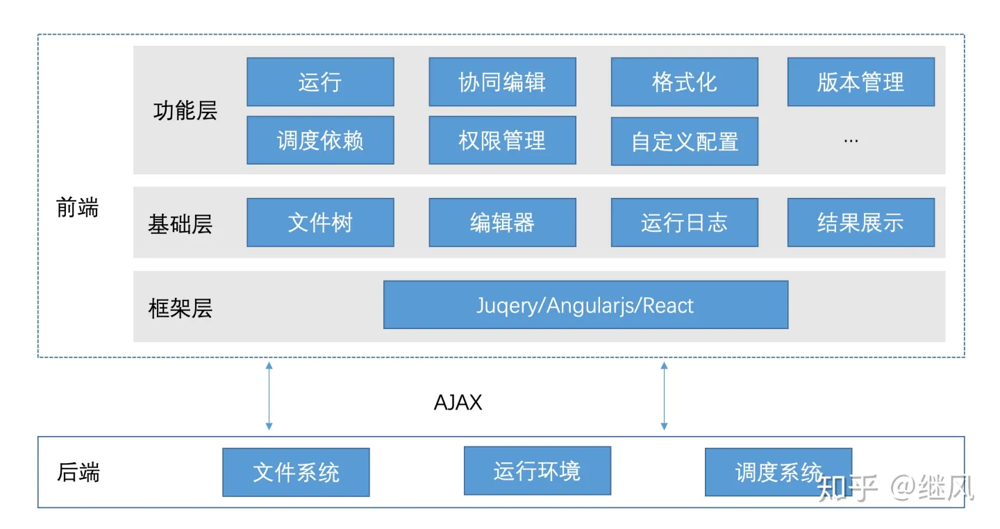
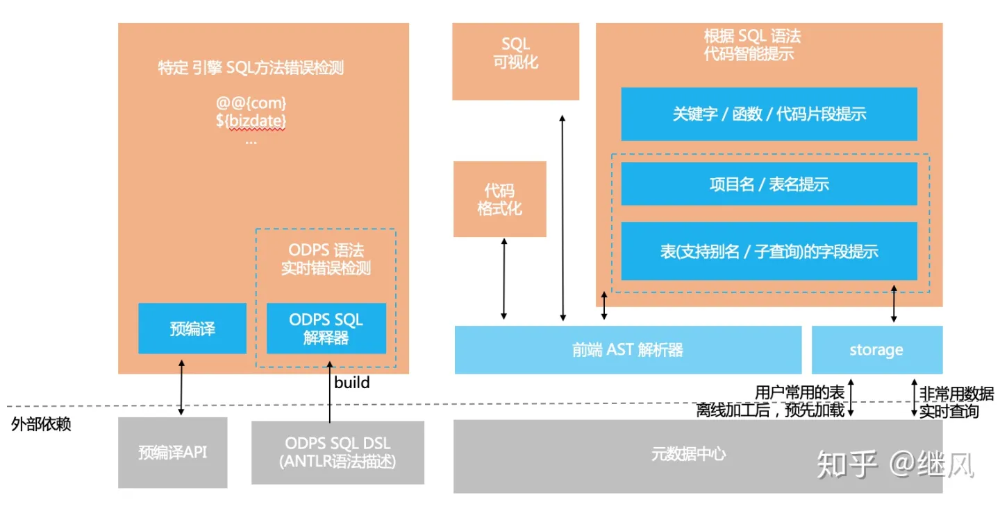
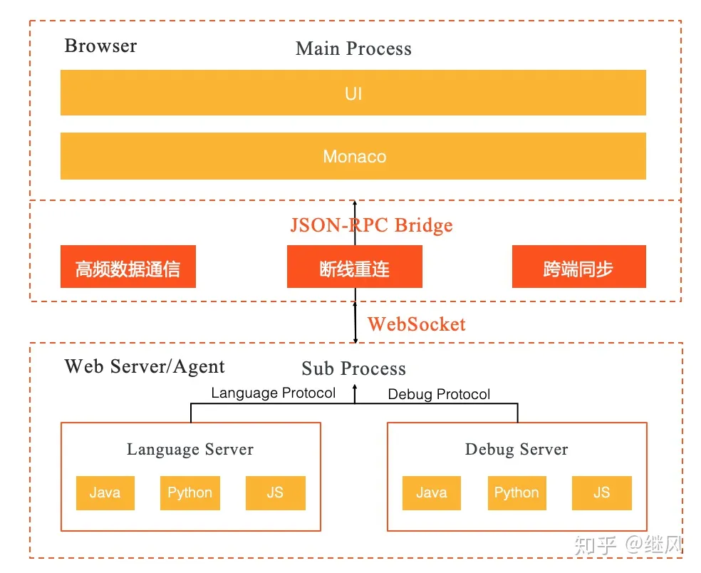

# 11-1-WebIDE 定制开发-WebIDE 一览

## 一 WebIDE 的意义

在小程序、FaaS，云服务等工具中，一部分业务依靠 WebIDE 实现，WebIDE 在这些方面带来了业务价值。

这里以阿里云的飞天大数据平台为例，以 WebIDE 为核心，开发了很多在线数据开发工具，其 IDE 的发展历程：

不过 WebIDE 本身也具备一定的技术价值：

- 1、切换项目更方便。对于前端团队来说，经常会在 3-4 个项目间切换，项目启动关闭比较麻烦，对电脑的电量，内存都是不小的负荷，而 webide 将这一部分负荷转移到远程容器，省去了本地的负荷和每次启动打开的不便(finder -> terminal -> run dev -> open vscode)，毕竟启动项目就是打开一个网页，而关闭项目也无需担心进度未保存。
- 2、团队配置化的统一。统一化插件、ide 配置，代码移交更顺畅
- 3、代码更加安全。稍加限制，即可防止代码被拷贝，同时从公司层面，衡量程序员的工作时间会更加方便（ps：我是不会把这个功能做进去的，程序员使用 IDE 的时长对衡量程序员的价值没有多少参考意义）
- 4、demo 编写方便。开源的公开的工具很多，但是往往需要私有包，这一点外部开源项目基本无能为力
- 5、研发平台的整合，闭合研发链路。团队大了，各个平台层出不穷，开发过程中往往会伴随多个平台的切换，将 IDE 嵌入网页，同时整合各个研发平台，避免反复切换平台带来的繁琐与不便
- 6、私有插件。当然避免团队插件发布共有域的方案也有，但是直接搭建私有插件市场，更加方便直观

## 二 业内主流产品、技术方案

业内主流方案有：

- vscode：代表有 coder，code-server，vsonline。基于 vscode 开发， 对 web 端的进行一些修改，同时实现 git、授权等团队接入
- theia：代表有 gitpod、华为云 ide、google 云 ide。一部分功能复用 vscode，私有化部署，定制化功能较为方便

## 三 WebIDE 落地

### 3.0 落地方案

WebIDE 基础架构：


WebIDE 落地时，需要开发的定制功能：

- 团队成员管理系统 or oa 接入
- 团队 gitlab 接入
- 私有包安装的能力
- IDE 管理，新建，关闭，删除等基本功能
- 支持前端项目运行

可以将项目划分为多个工程，分别负责：

- docker 镜像：该工程用于 docker 镜像的制作、构建
- IDE 管理工具：负责 IDE 的新建，关闭，以及插件市场等功能
- IDE 管理工具后台：一方面负责管理后台的接口，另一方面接入团队成员管理系统，后期可用来拓展私有插件以及共有插件等功能，同时处理和容器化部署平台的协作。
- 插件系统：用于开发 webIDE 扩展，定制团队特有功能，比如接入团队成员管理系统，记录活跃时间，集成团队内部研发平台等

### 3.1 docker 容器构建

以 theia 为例，dockerfile 如下：

```txt
# 选择容器底层node依赖
ARG NODE_VERSION=12.18.3
FROM node:${NODE_VERSION}-alpine
# 增加theia install时需要的必要系统依赖
RUN apk add --no-cache make pkgconfig gcc g++ python libx11-dev libxkbfile-dev libsecret-dev
ARG version=latest
WORKDIR /home/theia
ADD $version.package.json ./package.json
# 这个GITHUB_TOKEN，需要在容器构建时指定(由于部分npm包安装需要从github拉取，使用github_token才可以顺利安装)
ARG GITHUB_TOKEN
# 安装，同时清理掉全局缓存
RUN yarn --pure-lockfile && \
    NODE_OPTIONS="--max_old_space_size=4096" yarn theia build && \
    yarn theia download:plugins && \
    yarn --production && \
    yarn autoclean --init && \
    echo *.ts >> .yarnclean && \
    echo *.ts.map >> .yarnclean && \
    echo *.spec.* >> .yarnclean && \
    yarn autoclean --force && \
    yarn cache clean

# 重新选择底层系统依赖，目的是保留容器系统极简，去掉了theia安装过程中需要的系统依赖，从而减小镜像提及
FROM node:${NODE_VERSION}-alpine
# See : https://github.com/theia-ide/theia-apps/issues/34
RUN addgroup theia && \
    adduser -G theia -s /bin/sh -D theia;
RUN chmod g+rw /home && \
    mkdir -p /home/project && \
    chown -R theia:theia /home/theia && \
    chown -R theia:theia /home/project;
# 增加git bash等基础系统依赖
RUN apk add --no-cache git openssh bash libsecret
ENV HOME /home/theia
WORKDIR /home/theia
COPY --from=0 --chown=theia:theia /home/theia /home/theia
EXPOSE 3000
ENV SHELL=/bin/bash \
    THEIA_DEFAULT_PLUGINS=local-dir:/home/theia/plugins
ENV USE_LOCAL_GIT true
USER theia
# run theia服务，默认运行在3000端口
ENTRYPOINT [ "node", "/home/theia/src-gen/backend/main.js", "/home/project", "--hostname=0.0.0.0" ]
```

这里会有秘钥、权限等问题，可以修改添加：

```txt
# 增加系统依赖，以便npm安装可以顺利进行
RUN apk add --no-cache make pkgconfig gcc g++ python curl

# 安装zsh，美化命令行
RUN apk add --no-cache git openssh bash zsh libsecret-dev

# 增加root身份，以便用户可以自行增加全局系统依赖
RUN chmod 4755 /bin/busybox
RUN echo 'root:danger' | chpasswd

# 修改最终的启动命令
ENTRYPOINT ["/bin/sh", "/home/cloud-theia/start.sh"]

# 在start.sh中，执行git,npm全局配置的脚本，并且启动theia自身的服务
```

### 3.2 IDE 管理工具

使用常规的中台模版页面即可，主要具备的功能有：

- IDE 的管理：增删查改
- 插件的管理：私有/公有插件，插件的上传及管理
- 基本的团队成员登陆/注销

### 3.3 IDE 管理工具后台

使用常规的后端框架即可，如：Golang 的 Gin 框架等，主要实现功能：

- 常用后台接口
- 插件管理，私有插件的自存储，公有插件进行转发
- 处理 IDE 容器内，插件安装/搜索时需要的一些服务处理
- 基本的成员登陆/注销

### 3.4 WebIDE 的优化

WebIDE 中编辑体验不佳的最典型例子就是代码开发过程中没有智能提示和实时错误提示等功能；

以 SQL 为例，如何在合适位置提示合适的信息，如何做到实时的错误提示，这一点功能看似简单但其实还是有一定的技术难度，因为它不能简单地做关键词无脑提示，而是要对文本内容做一次语法解析，针对解析结果做合适的提示；

前端需要做 SQL AST 解析和大量的性能优化，并以此为基础完成代码的智能提示和实时错误提示的等辅助编辑功能，并开始探索用可视化等方案来进一步降低使用门槛。

大致的架构图如下：



### 3.5 新增多语言功能

出发点如下：

- 优化 1 解决 SQL 编辑的场景，如果要支持 Java，Python 等多语言时，我们的架构是否能快速支持实时协同，Debug 等高阶功能
- 如何更好地去复用开源的插件化生态，以自己所用

架构如下：


核心思想：

- 1.把纯 HTTP 通信改成 通过 WebSocket ，一次来实现实时协同和对多个语言服务（Lanuage Server）的对接 ；
- 2.后端侧重实现 Lanuage Server 和 Dubug Server 语言解析和运行调试环境的功能
- 3.前端重点解决交互体验和编辑体验优化
- 4.改造完成的系统，整体的核心功能将会是稳定的，更多的外围功能通过插件化的形态来扩展新的功能；

## 四 使用 vscode 进行定制开发

目前 vscode 相关的开发主要有两种方式：

- 插件拓展
- "魔改"源码

插件开发相对比较简单，可以在不修改 vscode 源码对基础上对先有 IDE 进行功能增强，但是受限于 vscode 的安全架构模型，功能相对比较局限，特别是 UI 类型的功能拓展改造。

对于一些自定义工程管理的需求，很多时候需要改造界面，这个时候从源码角度入手才方便实现相关的功能，典型的例子：

- 白鹭 Egret Wing：<https://docs.egret.com/engine/>
- 快应用 IDE: <https://www.quickapp.cn/docCenter/IDEPublicity>

## 感谢

感谢 <https://zhuanlan.zhihu.com/p/106325562>
