# 01-内存管理 -2-V8 引擎与分代回收

## 一 V8 简介

V8 引擎是由 Google 开源的著名 JavaScript 引擎，使用该引擎的运行时平台，其 JS 的内存管理也是由 V8 负责的，如：Chrome、NodeJS。

V8 与其他 JS 引擎最大的区别是：V8 实现了即时编译，无需先解析再运行。

V8 对内存做了一部分限制：

- 64 位系统下约为 1.4G
- 32 位系统下约为 0.7G

在 V8 中，1.4G 内存进行一次完全的垃圾回收，需要 1 秒以上，这个暂停时间称为 **Stop the world**，在暂停期间，应用的性能和响应能力都会大幅下降。

V8 的这套内存管理机制是针对浏览器而设计的，这样的内存需求在前端页面中使用起来绰绰有余（因为每个网页选项卡都是一个 v8 实例），而在服务端开发，则在一些场合捉襟见肘。V8 的这个限制使得 Node 无法直接操作大内存对象，在单个 Node 进程中，计算机的内存资源无法得到充足的使用。

## 二 V8 的内存限制

### 2.1 内存占用

内存占用图：



Node 中输出数据样例：

```js
// console.log(process.memoryUsage())
// 示例中 rss 大约占据 20M。heapUsed 大约为 4M
{
  rss: 20824064,                // resident set size：所有内存占用，包括指令区、堆栈
  heapTotal: 7159808,           // 堆内存已申请到空间，包括已使用和未使用的
  heapUsed: 4270176,            // 堆内存当前使用量，可以用来判断内存泄露
  external: 8224                // v8 内部的 C++ 对象占用的内存
}
```

堆内存中使用量占比图：



堆的大小会随着存储的对象变多，而逐步申请新空间，增大容量，直到堆的大小超过 V8 的限制为止。表面上看，V8 对内存的限制是因为浏览器不需要使用大内存，深层原因其实是 V8 的垃圾回收机制限制。1.5GB 堆内存的回收，V8 需要耗时 50ms 以上，而做一次非增量的垃圾回收需要 1s 以上，这是垃圾回收中引起 JS 线程暂停执行的时间，这样的时间暂停会严重影响服务器响应能力。所以 v8 直接选择限制大内存使用，就可以快速避免 GC 导致的 JS 线程暂停时间过长问题。

### 2.2 查看垃圾回收日志

在 Node 启动时：

- 添加`--trace_gc`参数，即可查看垃圾回收的日志信息。
- 添加`--prof`参数，即可得到 V8 执行时的性能分析数据

但是得到的 v8.log 日志文件可读性很差，但是 v8 提供了日志统计工具，位于 Node 源码的 `deps/v8/tools`目录：

- Linux 中：linux-tick-processor v8.log
- Win 中：windows-tick-processor.bat v8.log

## 三 V8 的垃圾回收机制

### 3.0 v8 的垃圾回收算法

由于不同的对象，其生存周期长短不一，一种垃圾回收算法不能完全应对所有情况，所以 v8 的垃圾回收策略采用了更高效的**分代式垃圾回收机制**。即：按对象的存储时间将内存的垃圾回收进行不同的分代，然后分别对不同分代的内存使用更适合其特征的 GC 算法。

V8 将内存设置为了 2 个分代，V8 堆的整体大小就是这 2 个分代所用的内存之和，在启动时候可以通过下面的参数设置其大小：

- 新生代：`--max-new-space-size` 参数就是设置新生代空间的最大值，单位为 KB，在 64 位中占据 32M，32 位占据 16M。
- 老生代：`--max-old-space-size` 参数就是设置老生代空间的最大值，单位为 MB，在 64 位中占据 1400M，32 位占据 700M。

新生代存储的是存活时间较短的对象，老生代用于存储长期活动的对象。

V8 中主要使用的策略与算法有：分代回收、空间复制、标记清除、标记整理、标记增量。

### 3.1 新生代回收 - 复制算法

新生代垃圾回收算法是基于 Cheney 的算法 Scavenge，Cheney 采用复制的方式实现垃圾回收。

新生代堆内存也被分为 2 个相等的空间，都称呼为 semispace：

- From 空间：处于使用中
- To 空间：处于闲置状态

贴士：64 位系统中，新生代内存是 32M，From 和 To 各占 16M。（32 位系统中除以 2 即可）。


复制算法过程：

```txt
对象会优先从 From 区域进行分配，开始 GC 时，会检查 From 空间的存活对象；
存活对象将被复制到 To 空间中，而非存活对象占用的空间将会被释放；
完成复制后，From 空间和 To 空间的角色发生互换。
```

简单来说，Cheney 复制算法就是通过将存活对象在两个 semispace 空间进行复制。

从上述理论看出，复制算法只有一半空间被程序使用了，另外一半始终作为了备用的存活对象存储区域，是典型的牺牲空间换取时间的算法。所以无法大规模应用到所有垃圾回收过程中，只适合新生代，因为新生代对象的生命周期很短，这样也能更大效率利用这两块区域。

### 3.2 新生代晋升到老生代

当一个对象经过多次复制依然存活时，它会被认为是生命周期较长的对象，拷贝时会直接被迁移到老生代中，这就是晋升。

晋升的条件是下列条件之一：

- 对象是否已经经过 Scavenge 回收
- To 空间的内存占用比超过限制（25%）。因为 Scavenge 回收完成后，To 空间转变为 From 空间，接下来内存分配在该空间进行，占比过高会影响后续内存分配

### 3.3 老生代回收 - 标记清除

老生代中存活对象占比大，使用 Scavenge 会有 2 个问题：复制存活对象效率降低，也会出现一半空间浪费。所以 V8 在老生代使用的是 Mark-Sweep 和 Mark-Compact 相结合的方式进行垃圾回收。

Mark-Sweep：即标记清除，分为标记、清除 2 个阶段：

- 标记时会遍历堆中所有对象，并标记活着的对象
- 清除阶段，只清除没有被标记的对象

该算法与 Scavenge 的区别是：

- 不会将内存划分为两半，所以不会造成内存空间浪费
- Scavenge 只复制活着的对象，Mark-Sweep 只清理死亡的对象。

新生代中活对象占据较小部分，而老生代中是死对象占据小部分，这就是采用两个算法不同的缘由。

### 3.4 老生代回收 - 标记整理

标记清除一般用于处理老生代的回收，相比引用计数来说，无需移动数据，但是由于扫描后会清除无引用区域，会造成堆区出现内存碎片，即：在进行一次标记清除后，内存会出现不连续的情况，会产生碎片。

在后续如果要分配一个较大的对象内存时，这些碎片空间都无法完成此次分配，就需要提前触发垃圾回收，而这次回收其实是不必要的，如图所示，灰色部分为死对象：


Mark-Compact：是由 Mark-Sweep 演变而来的，用于解决上述碎片问题。他们的差别是在对象被标记为死亡后，在整理过程中，将活着的对象往一端移动，移动完成后，直接清理掉边界外的内存。即：在扫描时，将要清理的内存移动在一侧，无需清理的移动在另一侧，扫描完毕后只需要清除其中一侧，这种做法付出了移动的时间代价，但是内存碎片更少。

如图所示完成标记并移动存活对象后的示意图，蓝色格子为存活对象，深色格子为死亡对象，浅色格子为存活对象移动后扣下的空洞。



上图中，完成移动后直接清除最右边的存活对象后面的内存区域完成回收。

### 3.5 老生代回收 - 增量标记与延迟清理

在执行垃圾回收时，必须让应用程序和垃圾回收期看到的情况一致！所以，一旦执行垃圾回收，就需要将应用程序暂停，等待 GC 完成后再恢复执行应用逻辑。一般称这个过程为 Stop-the-world（全停顿）。

V8 的新生代全停顿影响很小，因为新生代配置较小，且存活对象少。

但是 V8 的老生代中，存活对象多，全堆垃圾回收（full 垃圾回收）的标记、清理造成的停顿对用户影响较大。为了降低停顿带来的影响，V8 在标记阶段，将原本要一次性完成的动作改为增量标记（incremental marking），即拆分为许多小步骤，每做完一个小步骤，就让 JS 应用逻辑执行一会，垃圾回收应用逻辑交替执行直到标记阶段完成。

使用增量标记后，V8 的最大停顿时间减少了原本的 1/6 左右。

V8 还存在延迟清理（lazy sweeping），增量式整理（incremental compaction），让清理、整理动作也变成了增量式。

V8 也会在未来引进并行标记、并行清理等进一步利用多核，降低停顿时间。

## 四 总结

| 回收算法     | 速度 | 空间开销         | 是否移动对象 |
| ------------ | ---- | ---------------- | ------------ |
| Mark-Sweep   | 中等 | 少，有碎片       | 否           |
| Mark-Compact | 最慢 | 少，无碎片       | 是           |
| Scavenge     | 最快 | 双倍空间，无碎片 | 是           |

V8 主要使用 Mark-Sweep，在空间不足以对从新生代中晋升过来的对象进行分配时，才使用 Mark-Compact。

V8 的堆分为：新生代（年轻分代）、老生代（年老分代）。

年轻分代的堆空间一分为二，

年轻分代主要用来保存声明周期短暂的对象，例如函数中的局部变量，当函数返回，调用栈中的局部变量就会被析构掉。当 V8 发现内存空间不够时，才会进行回收。

回收步骤是：

- 将还被引用的对象复制到另一半区域；
- 释放当前一半空间，
- 把当前被释放的空间留作备用，两者角色互换。

年轻分代类似线程的栈空间，本身不太大，占用它空间的对象类似 C++中的局部对象，生命周期非常短，因此大部分都是需要被清理掉的，需要赋值对象极少，虽然牺牲了部分内存，但是速度极快。

年老分代类似 C++中使用 new 操作符在堆中分配的对象。因为这类对象一般不会因为函数退出而销毁，因此生命周期较长。年老分代的大小远大于年轻分代（32 位为 700M，64 位为 1.4GB），包含：

- 从年轻分代中移动过来的对象；
- JIT 后产生的代码；
- 全局对象。

如果年老分代采用年轻分代一样的清理算法，浪费一般空间不说，复制大块对象在时间上让人无法忍受，因此必须采用新的方式。V8 采用标记清除和标记整理的算法即将垃圾回收分为 2 个过程：

- 标记清除阶段遍历堆中的所有对象，把有效的对象标记出来，之后清除垃圾对象。因为年老分代中需要回收的对象比例极小，所以效率极高。
- 当执行完一次标记清除后，堆内存变得不连续，内存碎片的存在使得不能有效使用内存。在后续的执行中，当遇到没有一块碎片内存能够满足申请对象需要的内存空间时，将处罚 V8 执行标记整理算法：标记整理移动对象，紧缩 V8 堆空间，将碎片的内存整理为大块内存。

由于垃圾回收会阻塞 JS 代码的运行，上述两种算法是在 JS 运行时，会采取交替运行的方式，有效的减少了垃圾回收给程序造成的最大停顿时间。
