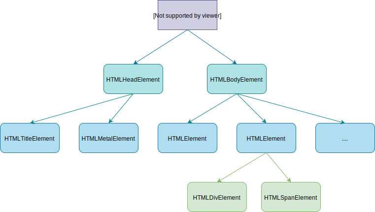

# 02-页面渲染流程

## 一 渲染流程

### 1.0 渲染基本流程

浏览器中的渲染引擎主要用于解析 HTML 文档、CSS 文档，并将 CSS 规则应用到 HTML 标签上，最终在浏览器内器窗口中展示出能够让用户理解的 DOM 内容。

Webkit 的渲染流程基本示例图：


### 1.1 HTML 文档解析

HTML 文档的解析是指将 HTML 文本字符串逐行解析生成具有父子关系的 DOM 节点数，如下所示：



浏览器从网络上下载的文件字节流是无法被渲染引擎直接理解的，需要转换为渲染引擎能够理解的 DOM（HTML 文档的结构化表述），网络进程加载了多少数据，HTML 解析器便解析多少数据。渲染引擎中的 **HTML 解析器（HTMLParser）** 即负责上述功能：将字节流转换为 DOM 结构。其转换过程是：

```txt
字节流 --> 分词器（Tokens）--> 生成节点（Node）--> DOM
```

网络进程接收到响应头之后，会根据响应头中的 content-type 字段来判断文件的类型，比如 content-type 的值是“text/html”，那么浏览器就会判断这是一个 HTML 类型的文件，然后为该请求选择或者创建一个渲染进程。渲染进程准备好之后，网络进程和渲染进程之间会建立一个共享数据的管道，网络进程接收到数据后就往这个管道里面放，而渲染进程则从管道的另外一端不断地读取数据，并同时将读取的数据“喂”给 HTML 解析器。你可以把这个管道想象成一个“水管”，网络进程接收到的字节流像水一样倒进这个“水管”，而“水管”的另外一端是渲染进程的 HTML 解析器，它会动态接收字节流，并将其解析为 DOM。

字节流在解析时利用到了栈结构，首先创建一个为 document 的空 DOM 结构，同时将 document 的开始标签压入栈底，接着依次解析压入其他节点的开始标签、结束标签。

在解析 DOM 时，如果遇到 script 标签，则 HTML 解析器会暂停 DOM 解析，因为接下来的 JavaScript 可能要修改当前已经生成的 DOM 结构，此时 JS 引擎解析脚本内容并执行，执行完毕后，HTML 解析器恢复解析过程，继续解析后续的内容，直至生成最终的 DOM。

Chrome 对解析过程进行了优化，即预解析操作：当渲染引擎收到字节流之后，会开启一个预解析线程，用来分析 HTML 文件中包含的 JavaScript、CSS 等相关文件，解析到相关文件之后，预解析线程会提前下载这些文件。

贴士：async 和 defer 会让 js 脚本变为异步，使用 async 标志的脚本文件一旦加载完成，会立即执行；而使用了 defer 标记的脚本文件，需要在 DOMContentLoaded 事件之前执行。

### 1.2 CSS 解析

CSS 解析与 HTML 解析类似，首先也是通过词法分析生成 CSS 规则树状图，CSSRule 会保持每个不同的元素和对应样式的映射关系。

在渲染树的生成阶段，DOM 树中的节点会在 CSS 分析树中根据 CSS 选择器提取与之对应元素的 CSSRule，并且会进行层叠、权重运算，生成最终的 CSSRule 添加到 DOM 渲染树上。

当所有的 DOM 节点都提取完 CSS 时，渲染树就形成了。这时候可以开始进行布局、绘制。

### 1.3 布局树

在 DOM 和 CSSOM 都构建好之后，渲染引擎就会构造布局树，其本质：复制了 DOM 树的结构，并且过滤了不需要显式的元素，如： display:none 属性的元素、head 标签、script 标签等。

复制好基本的布局树结构之后，渲染引擎会为对应的 DOM 元素选择对应的样式信息，这个过程就是样式计算。

样式计算完成之后，渲染引擎还需要计算布局树中每个元素对应的几何位置，这个过程就是计算布局。通过样式计算和计算布局就完成了最终布局树的构建。

## 二 重排重绘

重排（reflow）：浏览器第一次渲染页面布局后，后续引起页面各个元素节点在页面所处位置的重新计算、重新布局。

重绘（repaint）：布局完成后，页面重新绘制，这时浏览器会遍历渲染树，绘制每个节点

重排一定会引起重绘。

涉及页面布局、位置改变，都会触发重排，如：offset 系列、scroll 系列、client 系列、resize。此外设置元素的 display 也会引起。

只改变颜色、背景、显示/隐藏（位置不变）只会引起重绘，如：visibility、outline、color、background。

不断的改变位置等触发重排、重绘，会造成性能损失，优化方案：先映射一个虚拟 DOM，对其进行操作，所有操作完毕后，才显示 DOM，可以极大限度减少重排、重绘次数。
