# 02.2-浏览器-缓存机制

## 一 浏览器缓存机制

浏览器的缓存机制其实是浏览器基于 HTTP 协议进行的文件缓存机制。当文件发生重复请求书会，浏览器可以根据 HTTP 响应头的协议信息判断是否从服务器请求文件还是从本地读取文件，其缓存判断机制如图：



第一步：浏览器查询 Cache-Control 是否过期。浏览器的 Expires 也会用来判断，只不过 Expires 用来设置的是绝对过期时间，而 Cache-Control 是相对过期时间。Cache-Control 中的 max-age 的单位是秒，如果和 Expires 同时存在，则采用 Cache-Control。

第二步：浏览器判断上次该资源的响应头中是否有 Etag 信息，有则连同 If-None-Match 一起向服务端发送请求，服务端判断 Etag 未修改则返回 304，修改则返回 200

第三步：浏览器判断上次该资源的响应头中是否有 Last-Modified 信息，有则连同 If-Modified-Since 一起向服务器发送请求，服务端判断 If-Modified-Since 是否失效，失效则返回 200，未失效则返回 304

第四步：如果 Etag 和 Last-Modified 都不存在，直接请求服务器资源。

客户端设置缓存：

```html
<meta http-equiv="Cache-Control" content="max-age=3600" />
```

服务端设置缓存：

```js
app.use(static('./index', maxage:3600))
```
