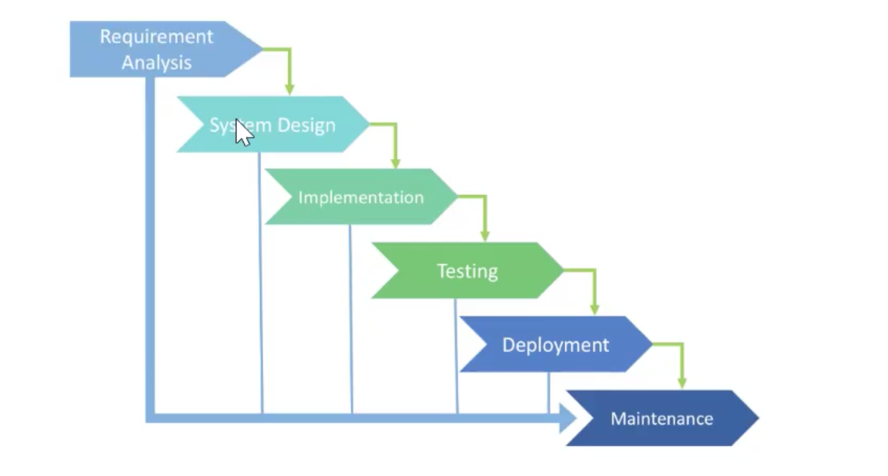
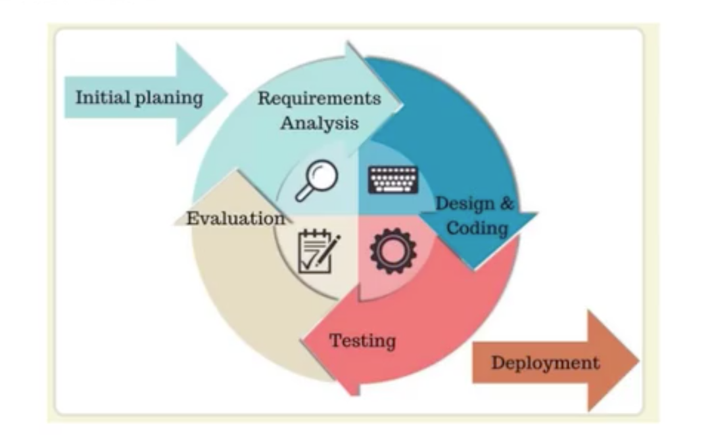

# 11-项目集成 - 持续集成与持续部署

## 一 软件开发模型

### 1.1 瀑布模型

瀑布模型是软件开发的常用模型，类似生产线的案例，按照结构流程在一个方向上流动。



瀑布模型简单易用，完成当前阶段后只需要关注后续阶段即可，项目也根据阶段的划分提供了检查点。

瀑布模型也有着极大缺点：

- 由于是线性开发模型，只有开发末期才能见到开发结果，增加了项目风险
- 不能适应快速的用户需求变化，这也是瀑布模型最大缺点

### 1.2 敏捷开发

敏捷开发的核心是：

- 迭代式：传统开发采用一个大周期进行开发，如一年，迭代式开发将开发周期划分为多个小周期，即一次大开发变成多次小开发，每次小开发都是同样的流程，所以看上去就像重复在做同样的步骤
- 增量式：软件的每个版本，都会新增一个用户可以感知的可用版本，其实也是按照新增功能进行迭代式开发

敏捷开发虽然将软件开发划分成多个周期进行迭代，但是每个迭代周期都必须是完整的软件开发周期，必须按照软件工程的方法论，进行正规的流程管理。

如图所示：



敏捷开发好处：

- 早期交付
- 降低风险

## 二 持续集成与持续交付

### 2.1 CI/CD 概念

所谓集成，其实就是一些孤立的事务经过某种方式集中在了一起，产生了联系，从而构成一个整体的过程。

持续集成和持续交付的概念：

- 持续集成（CI：Continuous intergration）：将所有开发者的工作副本合并到主干的过程。一般在合并前，需要经过集成系统进行自动构建、自动测试等流程进行验证。
- 持续交付（CD：Continuous delivery）：完成 CI 中的构建、测试等自动化流程后，将已经验证的代码发布。CD 的目标是建立一个可随时部署到生产环境的代码库。
- 持续部署（Continuous deployment）：是 CD 的延伸，用于自动将应用发布到生产环境。由于其与生产强关联，持续部署在很大程度上依赖于精心设计的测试自动化。

### 2.2 持续集成流程

持续集成强调开发人员在提交新代码后，立刻进行构建、测试，以确定新代码与旧代码是否能够正确的集成在一起，这样才能让产品实现快速迭代的同时保持高质量。所以，持续集成也是敏捷开发的具体实现方案之一。

持续集成的步骤：

- 提交：向代码仓库提交代码，后续所有步骤都开始于本次的提交
- 测试：代码仓库对 commit 操作配置钩子（hook），只要提交代码就会跑自动化测试
- 交付：测试没有问题，可以合并到主干，同时也会触发主干的测试钩子
- 构建：源码转换为可运行的实际代码，如配置各种资源、依赖等
- 二测：如果在上一次测试中没有涵盖全部测试，则构建的结果要进行第二轮测试。如果在第一伦测试中已经完成全部测试，则需要将构建移在第一轮测试前
- 部署：当前代码已经是可部署的版本，进行存档打包发送到生产服务器
- 回滚：如果当前版本在生产环境发生问题，则需要回滚，回滚最简单的做法就是修改符号链接，指向上一个版本的目录

持续集成的优点：

- 降低风险：不断的构建可以在早起发现问题，减少修复代价
- 减少重复性工作
- 持续部署，持续交付了可供使用的版本

注意：持续集成中交付的结果必须是个可用的产品！

### 2.2 持续继承系统的组成要素

一个最小化的持续集成系统需要以下要素：

- 版本管理系统：源码的版本管理平台，如：基于 git 的 github、gitlab 等。
- 构建工具：使用脚本或者工具实现项目的自动构建，如：java 的 gradle。构建中实现：编译、静态扫描、运行测试、样式检查、打包、发布等。
- CI 服务器：CI 服务器用于检测项目中代码的变动，依据变动通过构建工具及时进行构建，并将集成结果反馈给开发团队。

## 三 常见的持续集成工具

常见的构建工具：

- Jenkins：老牌构建工具，源自于 Sun 公司的 Hudson。Jenkins 开源，功能完善，也有丰富的插件系统，但是需要专用服务器，有一定的运维成本。
- Travis CI：基于云的系统，无需专用服务器，基于 YAML 进行配置，开源且开箱即用，也无需专用服务器，但是没有免费版本。
- Circle CI：通过 github 或者 bitbucket 库进行授权，添加到 circleci.com 之后，每个代码更改都会在干净的容器中触发自动测试，当然也有本地、私有云解决方案，拥有免费计划。
- GithubAction：Github 出版的基于 github 系统的持续集成工具。

## 四 Jekins

### 4.0 Jekins 相关概念

- 流水线（pipeline）：是一套插件，将持续交付的实现、实施集成到 Jekins 中，其定义被写入到文件 Jekinsfile 中
- 节点：即机器，用于执行 jekins 任务
- 阶段：定义不同的执行任务，比如：构建、测试、部署
- 步骤：相当于告诉 jekins 做什么，如 shell 命令

### 4.1 Jekins 安装

安装地址：<https://www.jenkins.io/doc/book/installing/docker/#setup-wizard/>，推荐使用 docker 方式安装：

```txt
# 下载镜像
docker pull jenkinsci/blueocean

# 创建网络
docker network create jenkins

# 运行容器
docker run --name jenkins-docker --rm --detach \
  --privileged --network jenkins --network-alias docker \
  --env DOCKER_TLS_CERTDIR=/certs \
  --volume jenkins-docker-certs:/certs/client \
  --volume jenkins-data:/var/jenkins_home \
  --publish 2376:2376 docker:dind --storage-driver overlay2

# 获取管理员密码
docker exec -u 0 -it 容器名 /bin/bash
cat /var/jenkins_home/secrets/initialAdminPassword
```

### 4.2 Jenkins 常见插件

Jenkins 加速：

```txt
# 在 系统管理 - 插件管理 - 高级 - 升级站点中，修改 URL 为：
https://mirrors.tuna.tsinghua.edu.cn/jenkins/updates/update-center.json
```

在 系统管理-插件管理 - 可选插件中，搜索安装以下常用插件：

```txt
GitHub Integration
GitLab
SSH
SSH Agent
SSH Pipeline Steps
Publish Over SSH
```

### 4.3 docker 安装 gitlab

第一步：创建基础环境：

```txt
# 需要提前确保关闭 SELinux
export GITLAB_HOME=/srv/gitlab
mkdir -p $GITLAB_HOME/config
mkdir -p $GITLAB_HOME/logs
mkdir -p $GITLAB_HOME/data
```

第二步：启动容器，这里使用非标准的端口，因为 80 端口往往是被占用的。

```txt
# 这里原本是 8880:80，若不采用非标准的 8880，则 gitlab 的 nginx 代理为 80 端口，仓库提供的 clone 地址不带 8880，而是默认的 80
sudo docker run --detach \
  --hostname 192.168.*.* \
  --publish 8443:443 --publish 8880:8880 --publish 8222:22 \
  --privileged=true \
  --name gitlab \
  --restart no \
  --volume $GITLAB_HOME/config:/etc/gitlab\
  --volume $GITLAB_HOME/logs:/var/log/gitlab\
  --volume $GITLAB_HOME/data:/var/opt/gitlab \
  gitlab/gitlab-ce:latest

# 查询安装进度
sudo docker logs -f gitlab
```

第三步：配置非标准端口

```txt
sudo vim $GITLAB_HOME/config/gitlab.rb

# 添加内容为
external_url 'http://192.168.*.*'
nginx['redirect_http_to_https_port'] = 8880
nginx['listen_port'] = 8880
```

第四步：加载配置

```txt
# 进入容器，刷新配置并重启 gitlab
docker exec -ti gitlab /bin/bash

# 更换 ip 需要重启加载容器
gitlab-ctl reconfigure

# 重启
gitlab-ctl restart
gitlab-ctl status
```

第五步：访问网页 8880 端口，并使用 root 以下命令中打印的用户名和密码登录：

```txt
sudo docker exec -it gitlab grep 'Password:' /etc/gitlab/initial_root_password
```

注意：docker 的 gitlab 镜像与容器直接删除，容易导致缓存数据错误，建议进入容器卸载后再删除容器，如下所示：

```txt
gitlab-ctl uninstall # 删除服务
gitlab-ctl cleanse # 清楚生成数据
gitlab-ctl remove-accounts # 删除配置账户
```
