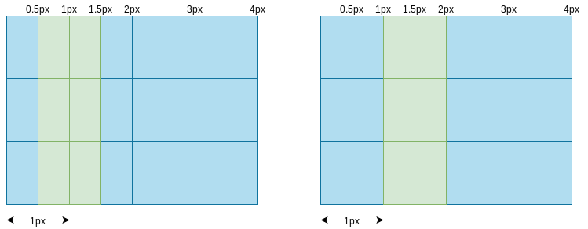

# 03.1-图形绘制 - 线段绘制

## 一 绘制基础线段

在 canvas 中绘制 2 条线段代码示例：

```js
// 将线段宽度设置为 1 像素
ctx.lineWidth = 1

// 绘制第一条线段
ctx.beginPath()
ctx.moveTo(50, 10) // 起点
ctx.lineTo(450, 10) // 绘制到终点
ctx.stroke() // 创建路径之后必须调用 stroke() 方法

// 绘制第二条线段
ctx.beginPath()
ctx.moveTo(50.5, 50.5)
ctx.lineTo(450.5, 50.5)
ctx.stroke()
```

贴士：moveTo() 方法不会清除子路径，而 lineTo() 则会将指定的点加入子路径中。若当前路径没有子路径，则 lineTo() 与 moveTo() 一致。

## 二 线段像素边界

在 1.1 的案例开始处，已经设置了线段的像素宽为 1，但是第一条线宽度却占据了 2 个像素，这是因为如果在像素边界绘制一条 1 像素宽的垂直线段，则 canvas 的绘图环境对象会试着将半个像素画在边界中线的右边，将另外半个像素花在边界中线的左边。

如果线段绘制在某 2 个像素之间的像素中，则不会出现延伸现象。



## 三 绘制网格

基于 canvas 的边界原理，现在可以实现一个线宽为 0.5 像素的网格：

```js
const drawGrid = (ctx, color, lineWidth, stepX, stepY) => {
  ctx.strokeStyle = color
  ctx.lineWidth = lineWidth

  for (let i = stepX + 0.5; i < ctx.canvas.width; i += stepX) {
    ctx.beginPath()
    ctx.moveTo(i, 0)
    ctx.lineTo(i, ctx.canvas.height)
    ctx.stroke()
  }

  for (let i = stepY + 0.5; i < ctx.canvas.height; i += stepY) {
    ctx.beginPath()
    ctx.moveTo(0, i)
    ctx.lineTo(ctx.canvas.width, i)
    ctx.stroke()
  }
}

drawGrid(ctx, 'yellowgreen', 0.5, 10, 10)
```

## 四 绘制坐标系

```js
const AXIS_MARGIN = 40,
  AXIS_ORIGIN = { x: AXIS_MARGIN, y: canvas.height - AXIS_MARGIN },
  AXIS_TOP = AXIS_MARGIN,
  AXIS_RIGHT = canvas.width - AXIS_MARGIN,
  HORIZONTAL_TICK_SPACING = 10,
  VERTICAL_TICK_SPACING = 10,
  AXIS_WIDTH = AXIS_RIGHT - AXIS_ORIGIN.x,
  AXIS_HEIGHT = AXIS_ORIGIN.y - AXIS_TOP,
  NUM_VERTICAL_TICKS = AXIS_HEIGHT / VERTICAL_TICK_SPACING,
  NUM_HORIZONTAL_TICKS = AXIS_WIDTH / HORIZONTAL_TICK_SPACING,
  TICK_WIDTH = 10,
  TICKS_LINEWIDTH = 0.5,
  TICKS_COLOR = 'navy',
  AXIS_LINEWIDTH = 1.0,
  AXIS_COLOR = 'blue'

const drawGrid = (ctx, lineWidth, color, stepx, stepy) => {
  ctx.save()

  ctx.fillStyle = 'white'
  ctx.fillRect(0, 0, ctx.canvas.width, ctx.canvas.height)

  ctx.lineWidth = lineWidth
  ctx.strokeStyle = color

  for (let i = stepx + 0.5; i < ctx.canvas.width; i += stepx) {
    ctx.beginPath()
    ctx.moveTo(i, 0)
    ctx.lineTo(i, ctx.canvas.height)
    ctx.stroke()
  }

  for (let i = stepy + 0.5; i < ctx.canvas.height; i += stepy) {
    ctx.beginPath()
    ctx.moveTo(0, i)
    ctx.lineTo(ctx.canvas.width, i)
    ctx.stroke()
  }

  ctx.restore()
}

const drawAxes = (ctx) => {
  ctx.save()
  ctx.strokeStyle = AXIS_COLOR
  ctx.lineWidth = AXIS_LINEWIDTH

  drawHorizontalAxis(ctx)
  drawVerticalAxis(ctx)

  ctx.lineWidth = 0.5
  ctx.lineWidth = TICKS_LINEWIDTH
  ctx.strokeStyle = TICKS_COLOR

  drawVerticalAxisTicks(ctx)
  drawHorizontalAxisTicks(ctx)

  ctx.restore()
}

const drawHorizontalAxis = (ctx) => {
  ctx.beginPath()
  ctx.moveTo(AXIS_ORIGIN.x, AXIS_ORIGIN.y)
  ctx.lineTo(AXIS_RIGHT, AXIS_ORIGIN.y)
  ctx.stroke()
}

const drawVerticalAxis = (ctx) => {
  ctx.beginPath()
  ctx.moveTo(AXIS_ORIGIN.x, AXIS_ORIGIN.y)
  ctx.lineTo(AXIS_ORIGIN.x, AXIS_TOP)
  ctx.stroke()
}

const drawVerticalAxisTicks = (ctx) => {
  let deltaY

  for (let i = 1; i < NUM_VERTICAL_TICKS; ++i) {
    ctx.beginPath()

    if (i % 5 === 0) deltaX = TICK_WIDTH
    else deltaX = TICK_WIDTH / 2

    ctx.moveTo(
      AXIS_ORIGIN.x - deltaX,
      AXIS_ORIGIN.y - i * VERTICAL_TICK_SPACING
    )

    ctx.lineTo(
      AXIS_ORIGIN.x + deltaX,
      AXIS_ORIGIN.y - i * VERTICAL_TICK_SPACING
    )

    ctx.stroke()
  }
}

const drawHorizontalAxisTicks = (ctx) => {
  let deltaY

  for (let i = 1; i < NUM_HORIZONTAL_TICKS; ++i) {
    ctx.beginPath()

    if (i % 5 === 0) deltaY = TICK_WIDTH
    else deltaY = TICK_WIDTH / 2

    ctx.moveTo(
      AXIS_ORIGIN.x + i * HORIZONTAL_TICK_SPACING,
      AXIS_ORIGIN.y - deltaY
    )

    ctx.lineTo(
      AXIS_ORIGIN.x + i * HORIZONTAL_TICK_SPACING,
      AXIS_ORIGIN.y + deltaY
    )

    ctx.stroke()
  }
}

drawGrid(ctx, 0.5, 'lightgray', 10, 10)
drawAxes(ctx)
```

## 五 动态绘制

利用鼠标按下事件、鼠标移动坐标，可以实现动态绘制一个图形：

```js
let surfaceImageData
const pos = { x: 0, y: 0 }
const rubberbandRect = {}
let isDragging = false

// 绘图监听
canvas.onmousedown = function (e) {
  isDragging = true
  e.preventDefault() // prevent cursor change

  let loc = fitCanvas(e.clientX, e.clientY)
  pos.x = loc.x
  pos.y = loc.y

  // 保存当前数据
  saveSurfaceData()
}

canvas.onmousemove = function (e) {
  if (!isDragging) {
    return
  }
  e.preventDefault() // prevent selections

  // 回放初始数据，用于清除鼠标移动中绘制的重复线条
  restoreSurfaceData()

  // 执行绘制
  let loc = fitCanvas(e.clientX, e.clientY)
  drawLine(loc)
  drawGuidewires(loc.x, loc.y)
}

canvas.onmouseup = function (e) {
  isDragging = false

  // 回放初始数据
  restoreSurfaceData()

  // 执行绘制
  let loc = fitCanvas(e.clientX, e.clientY)
  drawLine(loc)
}

// 位置算法
const fitCanvas = (x, y) => {
  const bbox = canvas.getBoundingClientRect()
  return {
    x: x - bbox.left * (canvas.width / bbox.width),
    y: y - bbox.top * (canvas.height / bbox.height),
  }
}

// 保存画布数据
const saveSurfaceData = () => {
  surfaceImageData = ctx.getImageData(0, 0, canvas.width, canvas.height)
}
// 回放画布数据
const restoreSurfaceData = () => {
  ctx.putImageData(surfaceImageData, 0, 0)
}

// 绘图工具：线条工具
const drawLine = (loc) => {
  ctx.beginPath()
  ctx.moveTo(pos.x, pos.y)
  ctx.lineTo(loc.x, loc.y)
  ctx.stroke()
}

// 绘图工具：十字工具
const drawGuidewires = (x, y) => {
  ctx.save()
  ctx.strokeStyle = 'rgba(0,0,230,0.4)'
  ctx.lineWidth = 0.5

  // drawVerticalLine
  ctx.beginPath()
  ctx.moveTo(x + 0.5, 0)
  ctx.lineTo(x + 0.5, ctx.canvas.height)
  ctx.stroke()

  // drawHorizontalLine
  ctx.beginPath()
  ctx.moveTo(0, y + 0.5)
  ctx.lineTo(ctx.canvas.width, y + 0.5)
  ctx.stroke()

  ctx.restore()
}

// 绘图工具：擦除
const drawEraser = () => {
  ctx.clearRect(0, 0, canvas.width, canvas.height)
  saveSurfaceData()
}
```

## 六 线段端点

线段端点样式使用属性 lineCap 控制，默认值为 butt，即原模原样绘制，round、square 则是线段的端点添加帽子：

- round：端点多画一个半圆
- suare：端点多画一个矩形

两条线段连接处的拐弯称为连接点，使用 lineJoin 属性控制。miter 为默认值，接合处为一个矩形，bevel 值表示接合处为一个三角形，round 则表示接合处为圆弧。
