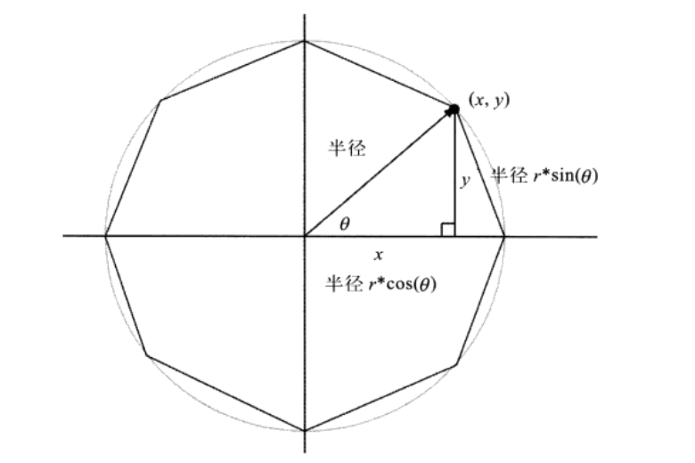

# 03.4-图形绘制 - 多边形绘制

## 一 实现多边形绘制

使用 moveTo() 与 lineTo() 方法，结合三角函数，可以绘制出任意边数的多变形：



实现代码：

```js
/**
 * 绘制必要对象
 */
// 定义一个点对象
class Point {
  constructor(x, y) {
    this.x = x
    this.y = y
  }
}
// 绘制起始点
const startPoint = new Point(0, 0),
  rubberbandRect = {}

// 绘制参数
let drawingSurfaceImageData = null,
  isDragging = false,
  sides = 6,
  startAngle = 0, // 起始绘制时的角度
  currentAngle = 45 // 绘制某个点时新方向角度

// 获取鼠标位置
const fitCanvas = (e) => {
  const x = e.x || e.clientX
  const y = e.y || e.clientY
  const bbox = canvas.getBoundingClientRect()

  return new Point(
    x - bbox.left * (canvas.width / bbox.width),
    y - bbox.top * (canvas.height / bbox.height)
  )
}

/**
 * 画布事件
 */
// 鼠标按下
canvas.onmousedown = function (e) {
  // 保存初始数据
  saveDrawingSurface()

  // 准备执行绘制
  isDragging = true
  e.preventDefault() // prevent cursor change

  let loc = fitCanvas(e)

  startPoint.x = loc.x
  startPoint.y = loc.y
}
// 鼠标移动
canvas.onmousemove = function (e) {
  if (!isDragging) {
    return
  }

  e.preventDefault() // prevent selections

  let loc = fitCanvas(e)
  restoreDrawingSurface()
  updateRubberband(loc, sides)
  drawGuidewires(startPoint.x, startPoint.y)
}
// 鼠标抬起
canvas.onmouseup = function (e) {
  isDragging = false
  let loc = fitCanvas(e)
  restoreDrawingSurface()
  updateRubberband(loc, sides)
}

/**
 *   绘图数据设置
 */
// 保存绘制数据
const saveDrawingSurface = () => {
  drawingSurfaceImageData = ctx.getImageData(0, 0, canvas.width, canvas.height)
}
// 重置绘图数据
const restoreDrawingSurface = () => {
  ctx.putImageData(drawingSurfaceImageData, 0, 0)
}

/**
 * 绘制方法
 */
const updateRubberbandRectangle = (loc) => {
  rubberbandRect.width = Math.abs(loc.x - startPoint.x)
  rubberbandRect.height = Math.abs(loc.y - startPoint.y)

  if (loc.x > startPoint.x) rubberbandRect.left = startPoint.x
  else rubberbandRect.left = loc.x

  if (loc.y > startPoint.y) rubberbandRect.top = startPoint.y
  else rubberbandRect.top = loc.y
}

const drawRubberbandShape = (sides) => {
  // 获取点数据
  const points = []
  for (let i = 0; i < sides; ++i) {
    points.push(
      new Point(
        startPoint.x + rubberbandRect.width * Math.sin(currentAngle),
        startPoint.y - rubberbandRect.width * Math.cos(currentAngle)
      )
    )
    currentAngle += (2 * Math.PI) / sides
  }

  // 执行绘制多边形
  ctx.beginPath()
  ctx.moveTo(points[0].x, points[0].y)
  for (let i = 1; i < sides; ++i) {
    ctx.lineTo(points[i].x, points[i].y)
  }
  ctx.closePath()
  ctx.stroke()
}

const updateRubberband = (loc, sides) => {
  updateRubberbandRectangle(loc)
  drawRubberbandShape(sides)
}

/**
 * 绘制十字
 */
// 绘制竖线
const drawHorizontalLine = (y) => {
  ctx.beginPath()
  ctx.moveTo(0, y + 0.5)
  ctx.lineTo(ctx.canvas.width, y + 0.5)
  ctx.stroke()
}
// 绘制横线
const drawVerticalLine = (x) => {
  ctx.beginPath()
  ctx.moveTo(x + 0.5, 0)
  ctx.lineTo(x + 0.5, ctx.canvas.height)
  ctx.stroke()
}
// 绘制横线
const drawGuidewires = (x, y) => {
  ctx.save()
  ctx.strokeStyle = 'rgba(0,0,230,0.4)'
  ctx.lineWidth = 0.5
  drawVerticalLine(x)
  drawHorizontalLine(y)
  ctx.restore()
}
```
